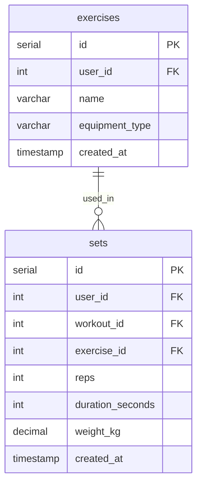

# Delete Workout Set Action

## Requirements

### Domain Entities

**Set (Подход)**
- ID
- User ID
- Workout ID
- Exercise ID
- Reps
- Duration seconds
- Weight kg
- Created at timestamp

**Exercise (Упражнение)**
- ID
- Name

### MCP Tool

**delete_workout_set** — delete a single erroneously logged set by its ID

### User Story

User logged a set with wrong data (e.g. "8 kg" instead of "8 reps"). They provide the set_id and the tool deletes it, returning confirmation with the deleted set's details (exercise name, weight, reps) so the user can verify the correct set was removed.

## E2E Tests

### Test: Delete workout set successfully
```go
// Create exercise via create_exercise action
// Create workout via Repo.CreateWorkout
// Create set via Repo.CreateSet with known weight/reps
// Call MCP tool delete_workout_set with set_id
// Verify response contains exercise_name, weight_kg, reps, set_id
// Call Repo.GetLastSet to verify set no longer exists (or verify via GetSetByID returning not found)
```

### Test: Delete workout set not found
```go
// Call MCP tool delete_workout_set with non-existent set_id
// Verify error returned
```

### Test: Delete workout set belonging to another user
```go
// Create set for user A
// Call delete_workout_set with user B context and set_id of user A
// Verify error returned (not found / unauthorized)
```

## Implementation

### Domain structure

```go
// domain/set.go — ALREADY EXISTS
type Set struct {
    ID              int64     `json:"id"`
    UserID          int64     `json:"user_id"`
    WorkoutID       int64     `json:"workout_id"`
    ExerciseID      int64     `json:"exercise_id"`
    Reps            int64     `json:"reps,omitempty"`
    DurationSeconds int64     `json:"duration_seconds,omitempty"`
    WeightKg        float64   `json:"weight_kg,omitempty"`
    CreatedAt       time.Time `json:"created_at"`
}

// domain/set.go — NEW: set with joined exercise name
type SetWithExercise struct {
    Set
    ExerciseName string `json:"exercise_name"`
}
```

### Database

```go
// gateways/interfaces.go — add to DB interface
GetSetByID(ctx context.Context, setID int64, userID int64) (*domain.SetWithExercise, error)
DeleteSet(ctx context.Context, setID int64, userID int64) error
```



### MCP Tool

#### delete_workout_set

**Input:**
```go
{
    "set_id": int64  // required
}
```

**Output:**
```go
{
    "set_id": int64,
    "exercise_name": string,
    "weight_kg": float | null,
    "reps": int | null,
    "duration_seconds": int | null
}
```

**Logic:**
- Use default user_id from context
- Call DB.GetSetByID(set_id, user_id) — returns set + exercise name, error if not found
- Call DB.DeleteSet(set_id, user_id)
- Return confirmation with deleted set details
