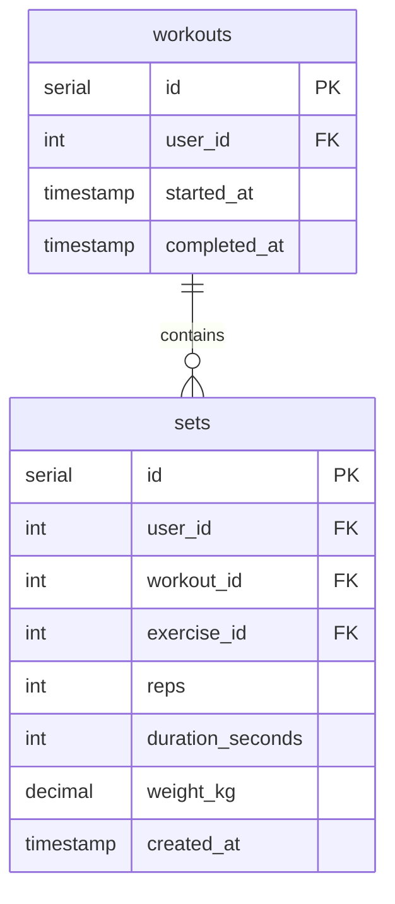

# Get Exercise History Action

## Requirements

Return the full history of a specific exercise across all workouts, paginated.

### MCP Tool

**get_exercise_history** — return all workout sessions containing a given exercise, newest first.

### User Story

Before every exercise the user asks "how much was last time on X?". The tool returns sessions for that exercise with all sets in order, so the AI can immediately show previous weights/reps without scanning all workouts.

## E2E Tests

### Test: Returns history across multiple workouts
```go
// Create exercise
// Create workout 1 (older) with 3 sets for exercise
// Create workout 2 (newer) with 2 sets for exercise
// Call get_exercise_history with exercise_id, limit=10
// Verify 2 sessions returned, newest first
// Verify session 1 has 2 sets, session 2 has 3 sets
// Verify each set has correct weight/reps
```

### Test: Limit and offset pagination
```go
// Create exercise
// Create 3 workouts with sets
// Call get_exercise_history with limit=2, offset=0 → 2 sessions
// Call get_exercise_history with limit=2, offset=2 → 1 session
```

### Test: Exercise with no history returns empty array
```go
// Create exercise (no sets)
// Call get_exercise_history with exercise_id
// Verify empty array returned, no error
```

## Implementation

### Domain structure

No new domain structs needed. Response is assembled from existing `domain.Set` and `domain.Workout`.

### Database

```go
// gateways/interfaces.go — add to DB interface
GetExerciseHistory(ctx context.Context, userID int64, exerciseID int64, limit int, offset int) ([]domain.Workout, error)
ListSetsByExerciseAndWorkouts(ctx context.Context, userID int64, exerciseID int64, workoutIDs []int64) ([]domain.Set, error)
```



### MCP Tool

#### get_exercise_history

**Input:**
```go
{
    "exercise_id": int64,       // required
    "limit":       int,         // optional, default 20
    "offset":      int          // optional, default 0
}
```

**Output:**
```go
{
    "sessions": [
        {
            "workout_id": int64,
            "date":       string (ISO8601 date),
            "sets": [
                {
                    "set_id":           int64,
                    "weight_kg":        float,
                    "reps":             int,
                    "duration_seconds": int
                }
            ]
        }
    ]
}
```

**Logic:**
- Use default user_id from context
- Call DB.GetExerciseHistory(user_id, exercise_id, limit, offset) → distinct workouts containing exercise, sorted by started_at DESC
- Extract workout_ids
- Call DB.ListSetsByExerciseAndWorkouts(user_id, exercise_id, workout_ids) → sets for this exercise in those workouts
- Group sets by workout_id, preserve created_at order
- Return sessions array
