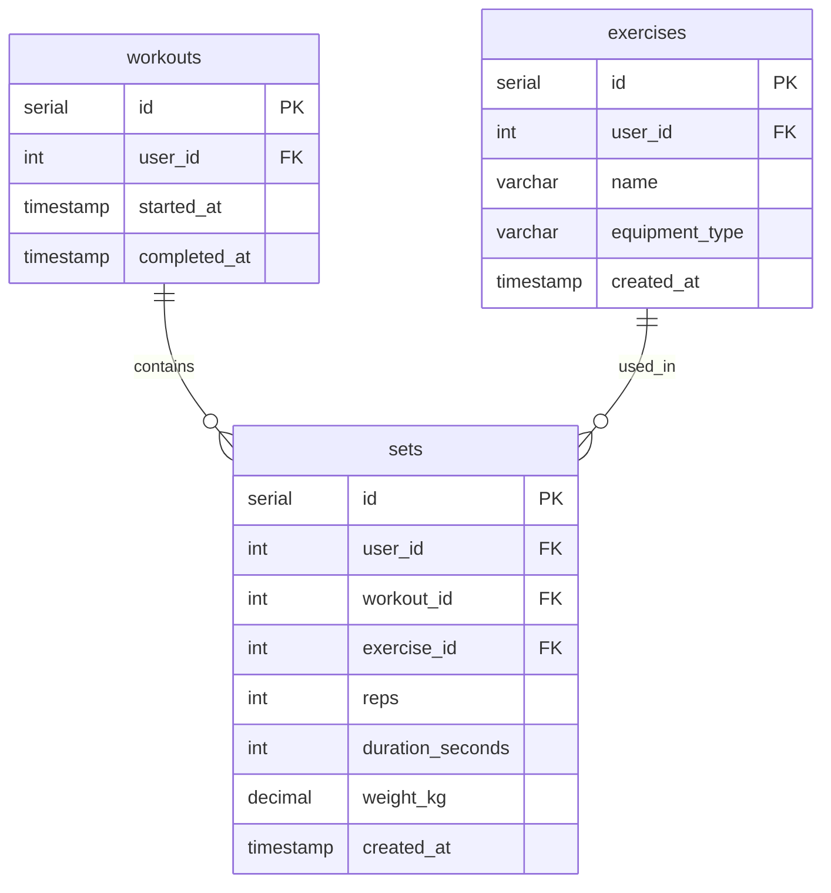

# Log Workout Set Action

## Requirements

### Domain Entities

**Workout (Тренировка)**
- ID
- User ID (владелец тренировки)
- Started at timestamp
- Completed at timestamp (NULL если тренировка активна)

**Set (Подход)**
- ID
- User ID (владелец подхода)
- Workout ID (связь с тренировкой)
- Exercise ID (связь с упражнением)
- Reps (количество повторений) - опционально для обычных упражнений
- Duration seconds (длительность в секундах) - опционально для статичных упражнений
- Weight kg (вес в кг) - опционально для упражнений с весом
- Created at timestamp (когда выполнен подход)

### MCP Tool

**log_workout_set** - запись подхода к упражнению

### User Story

Пользователь логирует подход указывая упражнение и параметры (повторения/время, вес). Если у пользователя нет активной тренировки (completed_at IS NULL), то автоматически создается новая. Подход добавляется в активную тренировку.

Если указана дата (`date`), подход добавляется к тренировке на эту дату. Если тренировка на эту дату уже существует — подход добавляется к ней. Если нет — создаётся новая тренировка с started_at = начало указанного дня. Тренировка на конкретную дату считается завершённой (completed_at = конец дня).

## E2E Tests

### Test: Log workout set with reps creates active workout
```go
// Create exercise via DB.CreateExercise
// Call MCP tool log_workout_set with exercise_id, reps, weight_kg
// Verify response with set_id, workout_id, is_new_workout=true
// Call DB.GetLastSet to verify set exists with correct data and active workout
```

### Test: Log workout set with duration
```go
// Create exercise via DB.CreateExercise
// Call MCP tool log_workout_set with exercise_id, duration_seconds
// Verify response contains set_id
// Call DB.GetLastSet to verify set has duration_seconds and reps=null
```

### Test: Log workout set reuses active workout if last set in active workout was created less than 2 hours ago
```go
// Create exercise via DB.CreateExercise
// Create active workout via DB.CreateWorkout
// Call MCP tool log_workout_set
// Verify response has is_new_workout=false and same workout_id
// Call DB.GetLastSet to verify set added to existing workout
```

### Test: Log workout set closes active workout and creates new if last set in active workout was created more than 2 hours ago
```go
// Create exercise via DB.CreateExercise
// Create active workout via DB.CreateWorkout with started_at=now-3h
// Create set via DB.CreateSet with created_at=now-3h
// Call MCP tool log_workout_set with exercise_id, reps
// Verify response has is_new_workout=true with new workout_id
// Call DB.GetLastSet to verify new set in new workout
// Call DB.ListWorkouts to verify old workout has completed_at set
```

### Test: Log workout set validation
```go
// Create exercise via DB.CreateExercise
// Call MCP tool log_workout_set without reps and duration_seconds
// Verify error returned (at least one required)
```

### Test: Log workout set with date creates backdated workout
```go
// Create exercise
// Call log_workout_set with exercise_id, reps, date="2026-01-15"
// Verify is_new_workout=true
// Verify set created_at is on 2026-01-15
// Verify workout started_at is on 2026-01-15
```

### Test: Log workout set with date reuses existing workout on that date
```go
// Create exercise
// Create workout with started_at=2026-01-15T10:00:00, completed_at=2026-01-15T23:59:59 via DB
// Call log_workout_set with exercise_id, reps, date="2026-01-15"
// Verify is_new_workout=false and same workout_id
```

## Implementation

### Domain structure

```go
// domain/workout.go
type Workout struct {
    ID          int64      `json:"id"`
    UserID      int64      `json:"user_id"`
    StartedAt   time.Time  `json:"started_at"`
    CompletedAt *time.Time `json:"completed_at"` // NULL means active
}

// domain/set.go
type Set struct {
    ID              int64      `json:"id"`
    UserID          int64      `json:"user_id"`
    WorkoutID       int64      `json:"workout_id"`
    ExerciseID      int64      `json:"exercise_id"`
    Reps            *int64     `json:"reps"`             // NULL for static exercises
    DurationSeconds *int64     `json:"duration_seconds"` // NULL for rep-based exercises
    WeightKg        *float64   `json:"weight_kg"`        // NULL for bodyweight
    CreatedAt       time.Time  `json:"created_at"`
}

type WorkoutSet struct {
    Workout Workout
    Set     Set
}
```

### Database

```go
// gateways/interfaces.go - add to DB interface
CreateWorkout(ctx context.Context, workout *domain.Workout) (int64, error)
CloseWorkout(ctx context.Context, workoutID int64) error
CreateSet(ctx context.Context, set *domain.Set) error
GetLastSet(ctx context.Context, userID int64) (*domain.WorkoutSet, error)
ListWorkouts(ctx context.Context, userID int64) ([]domain.Workout, error)
GetWorkoutByDate(ctx context.Context, userID int64, date time.Time) (*domain.Workout, error)  // NEW
```



### MCP Tool

#### log_workout_set

**Input:**
```go
{
    "exercise_id":      int64,
    "reps":             int | null,    // optional
    "duration_seconds": int | null,    // optional
    "weight_kg":        float | null,  // optional
    "date":             string | null  // optional, ISO 8601 date e.g. "2026-02-19"
}
```

**Output:**
```go
{
    "set_id":        int64,
    "workout_id":    int64,
    "is_new_workout": bool
}
```

**Logic (date provided):**
- Parse date string as local date (YYYY-MM-DD)
- Call DB.GetWorkoutByDate(user_id, date) — finds any workout whose started_at falls on that calendar day
- If found: use existing workout_id, is_new_workout=false
- If not found: create new Workout with started_at=date 00:00:00, completed_at=date 23:59:59, is_new_workout=true
- Create Set with created_at = date 12:00:00 (noon, stable ordering for backdated sets)

**Logic (no date — existing behavior):**
- Use default user_id (single-user mode)
- Validate at least one of reps or duration_seconds provided
- Call DB.GetLastSet(user_id) to get last set with workout info
- If no active workout (completed_at != NULL) or error or last set created_at > 2 hours ago:
  - If active workout exists and last set > 2 hours ago:
    - Call DB.CloseWorkout(workout_id) to set completed_at=last_set.created_at
  - Create new Workout with user_id, started_at=NOW(), completed_at=NULL
  - Call DB.CreateWorkout(workout) - returns workout_id
  - Set is_new_workout=true
- Else use existing workout_id, set is_new_workout=false
- Create Set with user_id, workout_id, exercise_id, and provided parameters
- Call DB.CreateSet(set)
- Return set_id, workout_id, is_new_workout as JSON
