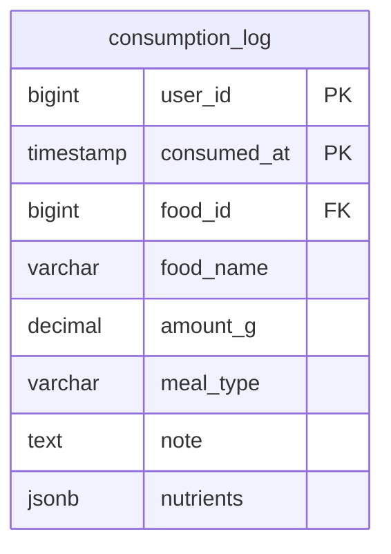

# Nutrition Stats Action

## Requirements

1. **Interface**: MCP tool для получения статистики по питанию
2. **Input data**: Нет параметров (используется DEFAULT_USER_ID = 1)
3. **External API**: Только PostgreSQL база данных
4. **Data format**: JSON для выходных данных
5. **Timezone**: UTC (универсальный часовой пояс, не зависит от локации пользователя)
6. **Relations**: Работает с существующей таблицей consumption_log

**Core functionality:**
- Возвращает две группы статистики:
  1. **last_meal** - статистика за последний час ДО последней записи, включая последнюю запись
  2. **last_4_days** - статистика за последние 4 дня (поза-позавчера, позавчера, вчера, сегодня), только те дни, где есть данные
- Каждая статистика содержит: калории, БЖУ, общий вес в граммах
- Использует GROUP BY для агрегации дневной статистики в SQL
- Временные расчеты в UTC timezone
- last_4_days содержит только дни с данными (от 0 до 4 элементов)
- Repository работает только с UTC, не имеет знаний о часовых поясах

## Implementation

### Domain structure

```go
type NutritionStats struct {
    PeriodStart   time.Time `json:"period_start" jsonschema:"Start of the statistics period in RFC3339 format"`
    PeriodEnd     time.Time `json:"period_end" jsonschema:"End of the statistics period in RFC3339 format"`
    TotalCalories float64   `json:"total_calories" jsonschema:"Total calories consumed in this period"`
    TotalProtein  float64   `json:"total_protein" jsonschema:"Total protein in grams consumed in this period"`
    TotalFat      float64   `json:"total_fat" jsonschema:"Total fat in grams consumed in this period"`
    TotalCarbs    float64   `json:"total_carbs" jsonschema:"Total carbohydrates in grams consumed in this period"`
    TotalWeight   float64   `json:"total_weight" jsonschema:"Total weight of food in grams consumed in this period"`
}

type GetNutritionStatsOutput struct {
    LastMeal  NutritionStats   `json:"last_meal" jsonschema:"Statistics for the last meal (1 hour before and including the last consumption record). Zero values if no data"`
    Last4Days []NutritionStats `json:"last_4_days" jsonschema:"Statistics for last 4 days with data: day before yesterday's yesterday, day before yesterday, yesterday, today. Only includes days that have consumption records, sorted chronologically from oldest to newest"`
}
```

### Database

Repository interface methods:

```go
type AggregationType string

const (
    AggregationTypeTotal  AggregationType = "total"   // Сумма всех записей в одном объекте
    AggregationTypeByDay  AggregationType = "by_day"  // GROUP BY date, массив объектов по дням
)

type NutritionStatsFilter struct {
    UserID      int64                `db:"user_id"`
    From        time.Time            `db:"from"`          // Начало временного окна (в UTC)
    To          time.Time            `db:"to"`            // Конец временного окна (в UTC)
    Aggregation AggregationType      `db:"-"`             // Тип агрегации
}

type DB interface {
    // Existing method
    GetLastConsumptionTime(ctx context.Context, userID int64) (*time.Time, error)

    // New universal method for nutrition stats
    GetNutritionStats(ctx context.Context, filter domain.NutritionStatsFilter) ([]domain.NutritionStats, error)
}
```

**SQL Implementation Details:**

`GetNutritionStats`:
- Базовый SELECT с агрегацией:
  - SUM((nutrients->>'calories')::numeric) as total_calories
  - SUM((nutrients->>'protein')::numeric) as total_protein
  - SUM((nutrients->>'fat')::numeric) as total_fat
  - SUM((nutrients->>'carbs')::numeric) as total_carbs
  - SUM(amount_g) as total_weight
- WHERE user_id = $1 AND consumed_at >= $2 AND consumed_at <= $3
- Если filter.Aggregation == "total":
  - Возвращает массив с одним агрегированным объектом (или пустой массив)
  - period_start = filter.From, period_end = filter.To
- Если filter.Aggregation == "by_day":
  - GROUP BY date_trunc('day', consumed_at) - все расчеты в UTC
  - ORDER BY date ASC
  - Возвращает массив объектов (0-N элементов, только дни с данными)
  - period_start = начало дня UTC (00:00:00), period_end = конец дня UTC (23:59:59)



### External API

Только PostgreSQL база данных

### MCP Tool Handler

#### get_nutrition_stats

**Input:**
```go
// Нет параметров
```

**Output:**
```go
type GetNutritionStatsOutput struct {
    LastMeal  NutritionStats   `json:"last_meal" jsonschema:"Statistics for the last meal (1 hour before and including the last consumption record). Zero values if no data"`
    Last4Days []NutritionStats `json:"last_4_days" jsonschema:"Statistics for last 4 days with data: day before yesterday's yesterday, day before yesterday, yesterday, today. Only includes days that have consumption records, sorted chronologically from oldest to newest"`
}
```

**Internal logic:**

1. Загрузить timezone location для Asia/Nicosia (для отображения пользователю)
2. Получить текущее время в этой timezone
3. **Last meal calculation:**
   - Вызвать repository.GetLastConsumptionTime(ctx, DEFAULT_USER_ID)
   - Если последнее время == nil: last_meal с нулевыми значениями
   - Если есть:
     - Создать filter: NutritionStatsFilter{
         UserID: DEFAULT_USER_ID,
         From: lastTime.Add(-1 * time.Hour),
         To: lastTime,
         Aggregation: AggregationTypeTotal,
       }
     - Вызвать repository.GetNutritionStats(ctx, filter)
     - Если массив пустой: last_meal с нулевыми значениями
     - Если есть результат: взять первый элемент как last_meal
4. **Last 4 days calculation:**
   - Вычислить startDate = текущая дата - 3 дня (в timezone Asia/Nicosia)
   - Создать filter: NutritionStatsFilter{
       UserID: DEFAULT_USER_ID,
       From: startDate at 00:00:00,
       To: currentDate at 23:59:59,
       Aggregation: AggregationTypeByDay,
     }
   - Вызвать repository.GetNutritionStats(ctx, filter)
   - Вернуть массив как есть (от 0 до 4 элементов с данными)
5. Вернуть GetNutritionStatsOutput с last_meal и last_4_days

**Важно:** Action знает про timezone Asia/Nicosia и использует его для расчета границ дней для пользователя, но Repository работает только с UTC и не имеет знаний о часовых поясах.

## E2E Tests

**Test Structure:**
- Использовать существующий `IntegrationTestSuite` с PostgreSQL testcontainer
- Создать `nutrition_stats_test.go` в пакете tests

**Test Cases:**

### TestGetNutritionStats_Success
- **Test Data:**
    - Генератор создает random количество записей (5-15) за последние 3 дня (позавчера, вчера, сегодня) в UTC
    - Для каждой записи: random время внутри дня, random nutrients и amount_g
    - Для уникальности: timestamp'ы отслеживаются в map, при коллизии добавляется 1 микросекунда
    - Генератор параллельно вычисляет ожидаемые агрегации:
        - expected_last_meal: сумма записей за час ДО последней записи (включая последнюю)
        - expected_last_4_days: массив из 3 элементов с суммами по дням
- **Input:** MCP tool call без параметров
- **Actions:**
    - MCP tool call → Action → Repository.GetLastConsumptionTime()
    - Repository.GetNutritionStats(ctx, filter) с AggregationTypeTotal для last meal
    - Repository.GetNutritionStats(ctx, filter) с AggregationTypeByDay для last 4 days
- **Expected:**
    - last_meal.TotalCalories == expected_last_meal.TotalCalories (и все остальные поля)
    - last_4_days содержит ровно 3 элемента
    - Каждый элемент last_4_days совпадает с соответствующим expected_last_4_days элементом
    - Порядок элементов chronological (oldest to newest)
    - Все timestamp сравнения используют time.Equal() для корректного сравнения независимо от timezone

### TestGetNutritionStats_EmptyDatabase
- **Setup:** Пустая таблица consumption_log
- **Input:** MCP tool call
- **Expected:** last_meal с нулевыми значениями, last_4_days = пустой массив

### TestGetNutritionStats_TimezoneBoundaries
- **Setup:** Создать записи на границах дней (23:59, 00:01) в UTC timezone
- **Input:** MCP tool call
- **Expected:** Записи попадают в правильные дневные периоды согласно UTC timezone (repository работает только с UTC)

**Test Dependencies:**
```go
// TODO: Call MCP get_nutrition_stats tool handler
// TODO: Call repository.GetLastConsumptionTime(ctx, userID)
// TODO: Call repository.GetNutritionStats(ctx, filter) with AggregationTypeTotal for last meal
// TODO: Call repository.GetNutritionStats(ctx, filter) with AggregationTypeByDay for last 4 days
// TODO: Verify aggregated sums match expected values
// TODO: Verify timezone handling is correct
```