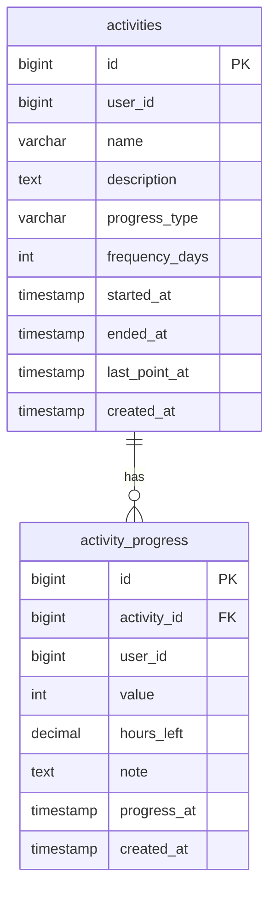

# search_progress_notes

## Requirements

MCP tool for searching across `activity_progress.note` field using multiple query variants (same pattern as `resolve_food_id_by_name` and `search_exercises`).

Use cases:
- Find all notes where user mentioned a specific topic (e.g. "gym", "работа", "stress")
- Search with synonym variants (e.g. ["gym", "тренировка", "workout"])
- Look back at past reflections ranked by how many variants matched

Input:
- `query_variants` (required) — 1–5 search terms; each does ILIKE on note field; results deduplicated by point ID with match count
- `activity_id` (optional) — filter to specific activity
- `from` (optional) — ISO8601 date, filter progress_at >= from
- `to` (optional) — ISO8601 date, filter progress_at <= to
- `value_min` (optional) — filter value >= value_min (-2 to +2)
- `value_max` (optional) — filter value <= value_max (-2 to +2)

Output: list of matching ActivityPoints with activity name and match_count, ordered by match_count DESC then progress_at DESC

Validation:
- `query_variants` must have 1–5 non-empty strings (return error field, not Go error)
- User can only see their own progress points (user_id scoping)

## E2E Tests

1. `TestSearchProgressNotes_ByVariants` — create 3 points: 2 notes contain "gym", 1 contains "работа"; search `["gym"]` returns 2 results with correct activity names and match_count=1
2. `TestSearchProgressNotes_MultiVariantRanking` — note A has "gym workout", note B has only "gym"; search `["gym", "workout"]`; note A gets match_count=2 and appears first
3. `TestSearchProgressNotes_CaseInsensitive` — note "Gym session", search `["gym"]` returns match
4. `TestSearchProgressNotes_FilterByActivity` — 2 activities both have notes matching "gym"; filter by activity_id returns only that activity's note
5. `TestSearchProgressNotes_FilterByDateRange` — 3 matching notes across different dates; filter from/to returns only notes in range
6. `TestSearchProgressNotes_FilterByValue` — notes with values -1, 0, +1 all containing "stress"; filter value_min=1 returns only +1 note
7. `TestSearchProgressNotes_NoResults` — search that matches nothing returns empty list and no error
8. `TestSearchProgressNotes_EmptyVariants` — empty `query_variants` returns error field (not Go error)
9. `TestSearchProgressNotes_TooManyVariants` — 6 variants returns validation error field
10. `TestSearchProgressNotes_UserIsolation` — two users each have a note matching "gym"; user A only sees their own note

## Implementation

### Domain structure

Add to `domain/progress.go`:

```go
// ActivityPointWithActivity is ActivityPoint enriched with activity name
type ActivityPointWithActivity struct {
    ActivityPoint
    ActivityName string `json:"activity_name" db:"activity_name"`
}

// ProgressNoteSearchFilter defines parameters for a single-variant note search
type ProgressNoteSearchFilter struct {
    UserID     int64     `json:"user_id"`
    Query      string    `json:"query"`                  // required, ILIKE substring
    ActivityID int64     `json:"activity_id,omitempty"`  // 0 = all activities
    From       time.Time `json:"from,omitempty"`
    To         time.Time `json:"to,omitempty"`
    ValueMin   *int      `json:"value_min,omitempty"`
    ValueMax   *int      `json:"value_max,omitempty"`
}
```

### Database

No migration needed. Uses existing `activity_progress` and `activities` tables.

Query: JOIN `activity_progress ap` with `activities a` on `a.id = ap.activity_id` WHERE `ap.note ILIKE '%query%'` AND `ap.user_id = $userID`



### Gateway

Add to `gateways/interfaces.go`:

```go
SearchProgressNotes(ctx context.Context, filter domain.ProgressNoteSearchFilter) ([]domain.ActivityPointWithActivity, error)
```

Implementation in `gateways/db/repository.go`:
- squirrel SELECT with JOIN on activities: `activity_progress ap JOIN activities a ON a.id = ap.activity_id`
- ILIKE condition on `ap.note`
- Optional filters: activity_id, from, to, value_min, value_max
- ORDER BY `ap.progress_at DESC`
- No limit applied here — handler deduplicates across variants before returning

### Handler

**File:** `action/progress/search_progress_notes_mcp.go`
**Package:** `progress`
**Tool name:** `search_progress_notes`

Same multi-variant pattern as `find_food` and `search_exercises`:
- For each variant, call `db.SearchProgressNotes` with that query
- Deduplicate results by `ActivityPoint.ID`, incrementing `MatchCount`
- Sort: match_count DESC, then progress_at DESC

Input struct:
```go
type SearchProgressNotesInput struct {
    QueryVariants []string `json:"query_variants" jsonschema:"required,1-5 search terms for note field"`
    ActivityID    int64    `json:"activity_id,omitempty"`
    From          string   `json:"from,omitempty"`   // ISO8601
    To            string   `json:"to,omitempty"`     // ISO8601
    ValueMin      *int     `json:"value_min,omitempty"`
    ValueMax      *int     `json:"value_max,omitempty"`
}
```

Output struct:
```go
type NoteSearchResult struct {
    ID           int64    `json:"id"`
    ActivityID   int64    `json:"activity_id"`
    ActivityName string   `json:"activity_name"`
    Value        int      `json:"value"`
    HoursLeft    *float64 `json:"hours_left,omitempty"`
    Note         string   `json:"note"`
    ProgressAt   string   `json:"progress_at"` // RFC3339
    MatchCount   int      `json:"match_count"`
}

type SearchProgressNotesOutput struct {
    Results []NoteSearchResult `json:"results"`
    Error   string             `json:"error,omitempty"`
}
```

Internal logic:
1. Validate: 1–5 non-empty variants (return error field, not Go error)
2. Parse from/to if provided (RFC3339); return error field on bad format
3. For each variant: call `db.SearchProgressNotes(filter with Query=variant)`
4. Deduplicate by point ID, track MatchCount
5. Sort: MatchCount DESC, ProgressAt DESC
6. Map to output

**Register in** `transport/mcp/mcp.go`:
```go
mcp.AddTool(server, &progress.SearchProgressNotesMCPDefinition, progress.SearchProgressNotes)
```
