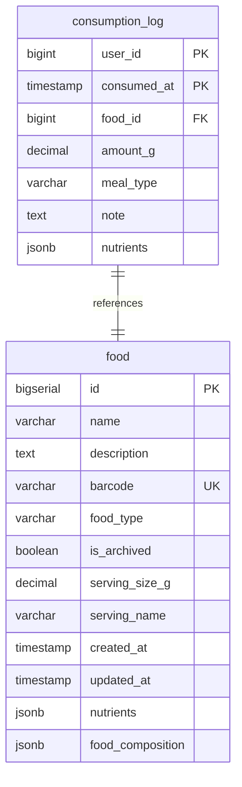

# Add Food

## Requirements

1. **Interface**: MCP tool для добавления продуктов в базу данных
2. **Input data**: JSON с основными макронутриентами и обязательными полями
3. **External API**: Только PostgreSQL база данных
4. **Data format**: JSON для входных и выходных данных
5. **Validation**: Проверка на дубликаты продуктов
6. **Relations**: Первые сущности в системе, связи пока не требуются

**Core data to capture:**
- Обязательные поля: name, food_type
- Основные макронутриенты: calories, protein_g, total_fat_g, carbohydrates_g
- Опциональные поля: description, barcode, serving_size_g, serving_name
- Детальный состав питательных веществ в JSONB nutrients

## Implementation

### Domain structure

```go
type Food struct {
    ID              int64            `json:"id" db:"id"`
    Name            string           `json:"name" db:"name"`
    UserID          int64            `json:"user_id" db:"user_id"`
    Description     *string          `json:"description,omitempty" db:"description"`
    Barcode         *string          `json:"barcode,omitempty" db:"barcode"`
    FoodType        string           `json:"food_type" db:"food_type"`
    IsArchived      bool             `json:"is_archived" db:"is_archived"`
    ServingSizeG    *float64         `json:"serving_size_g,omitempty" db:"serving_size_g"`
    ServingName     *string          `json:"serving_name,omitempty" db:"serving_name"`
    CreatedAt       time.Time        `json:"created_at" db:"created_at"`
    UpdatedAt       time.Time        `json:"updated_at" db:"updated_at"`
    Nutrients       *Nutrients       `json:"nutrients,omitempty" db:"nutrients"`
    FoodComposition FoodComponentList `json:"food_composition,omitempty" db:"food_composition"`
}

type Nutrients struct {
    // Макронутриенты (на 100г продукта)
    Calories         *float64 `json:"calories,omitempty"`
    ProteinG         *float64 `json:"protein_g,omitempty"`
    TotalFatG        *float64 `json:"total_fat_g,omitempty"`
    CarbohydratesG   *float64 `json:"carbohydrates_g,omitempty"`
    DietaryFiberG    *float64 `json:"dietary_fiber_g,omitempty"`
    TotalSugarsG     *float64 `json:"total_sugars_g,omitempty"`
    AddedSugarsG     *float64 `json:"added_sugars_g,omitempty"`
    WaterG           *float64 `json:"water_g,omitempty"`

    // Детализация жиров (в граммах)
    SaturatedFatsG       *float64 `json:"saturated_fats_g,omitempty"`
    MonounsaturatedFatsG *float64 `json:"monounsaturated_fats_g,omitempty"`
    PolyunsaturatedFatsG *float64 `json:"polyunsaturated_fats_g,omitempty"`
    TransFatsG           *float64 `json:"trans_fats_g,omitempty"`

    // Омега жирные кислоты (в миллиграммах)
    Omega3Mg                  *float64 `json:"omega_3_mg,omitempty"`
    Omega6Mg                  *float64 `json:"omega_6_mg,omitempty"`
    Omega9Mg                  *float64 `json:"omega_9_mg,omitempty"`
    AlphaLinolenicAcidMg      *float64 `json:"alpha_linolenic_acid_mg,omitempty"`
    LinoleicAcidMg            *float64 `json:"linoleic_acid_mg,omitempty"`
    EicosapentaenoicAcidMg    *float64 `json:"eicosapentaenoic_acid_mg,omitempty"`
    DocosahexaenoicAcidMg     *float64 `json:"docosahexaenoic_acid_mg,omitempty"`

    // Холестерин (в миллиграммах)
    CholesterolMg *float64 `json:"cholesterol_mg,omitempty"`

    // Витамины
    VitaminAMcg   *float64 `json:"vitamin_a_mcg,omitempty"`
    VitaminCMg    *float64 `json:"vitamin_c_mg,omitempty"`
    VitaminDMcg   *float64 `json:"vitamin_d_mcg,omitempty"`
    VitaminEMg    *float64 `json:"vitamin_e_mg,omitempty"`
    VitaminKMcg   *float64 `json:"vitamin_k_mcg,omitempty"`
    VitaminB1Mg   *float64 `json:"vitamin_b1_mg,omitempty"`
    VitaminB2Mg   *float64 `json:"vitamin_b2_mg,omitempty"`
    VitaminB3Mg   *float64 `json:"vitamin_b3_mg,omitempty"`
    VitaminB5Mg   *float64 `json:"vitamin_b5_mg,omitempty"`
    VitaminB6Mg   *float64 `json:"vitamin_b6_mg,omitempty"`
    VitaminB7Mcg  *float64 `json:"vitamin_b7_mcg,omitempty"`
    VitaminB9Mcg  *float64 `json:"vitamin_b9_mcg,omitempty"`
    VitaminB12Mcg *float64 `json:"vitamin_b12_mcg,omitempty"`
    FolateDfeMcg  *float64 `json:"folate_dfe_mcg,omitempty"`
    CholineMg     *float64 `json:"choline_mg,omitempty"`

    // Минералы (в миллиграммах)
    CalciumMg    *float64 `json:"calcium_mg,omitempty"`
    IronMg       *float64 `json:"iron_mg,omitempty"`
    MagnesiumMg  *float64 `json:"magnesium_mg,omitempty"`
    PhosphorusMg *float64 `json:"phosphorus_mg,omitempty"`
    PotassiumMg  *float64 `json:"potassium_mg,omitempty"`
    SodiumMg     *float64 `json:"sodium_mg,omitempty"`
    ZincMg       *float64 `json:"zinc_mg,omitempty"`
    CopperMg     *float64 `json:"copper_mg,omitempty"`
    ManganeseMg  *float64 `json:"manganese_mg,omitempty"`
    SeleniumMcg  *float64 `json:"selenium_mcg,omitempty"`
    IodineMcg    *float64 `json:"iodine_mcg,omitempty"`

    // Аминокислоты (в миллиграммах)
    LysineMg        *float64 `json:"lysine_mg,omitempty"`
    MethionineMg    *float64 `json:"methionine_mg,omitempty"`
    CysteineMg      *float64 `json:"cysteine_mg,omitempty"`
    PhenylalanineMg *float64 `json:"phenylalanine_mg,omitempty"`
    TyrosineMg      *float64 `json:"tyrosine_mg,omitempty"`
    ThreonineMg     *float64 `json:"threonine_mg,omitempty"`
    TryptophanMg    *float64 `json:"tryptophan_mg,omitempty"`
    ValineMg        *float64 `json:"valine_mg,omitempty"`
    HistidineMg     *float64 `json:"histidine_mg,omitempty"`
    LeucineMg       *float64 `json:"leucine_mg,omitempty"`
    IsoleucineMg    *float64 `json:"isoleucine_mg,omitempty"`

    // Специальные вещества
    CaffeineMg     *float64 `json:"caffeine_mg,omitempty"`
    EthylAlcoholG  *float64 `json:"ethyl_alcohol_g,omitempty"`

    // Дополнительные поля
    GlycemicIndex *int     `json:"glycemic_index,omitempty"`
    GlycemicLoad  *float64 `json:"glycemic_load,omitempty"`
}

type FoodComponent struct {
    FoodID   int64   `json:"food_id"`
    AmountG  float64 `json:"amount_g"`
}

// FoodComponentList implements driver.Valuer and sql.Scanner for JSONB scanning
type FoodComponentList []FoodComponent
```

### Database

```go
// Repository interface methods
type DB interface {
    AddFood(ctx context.Context, food *domain.Food) (int64, error)
    GetFood(ctx context.Context, id int64) (*domain.Food, error)
}
```



### External API

Только PostgreSQL база данных

### MCP tool handler

**Input:**
```go
type AddFoodInput struct {
    Name            string                   `json:"name" jsonschema:"required,food name"`
    Description     string                   `json:"description,omitempty" jsonschema:"food description"`
    Barcode         string                   `json:"barcode,omitempty" jsonschema:"product barcode"`
    FoodType        string                   `json:"food_type" jsonschema:"required,enum=component|product|dish"`
    ServingSizeG    float64                  `json:"serving_size_g,omitempty" jsonschema:"serving size in grams"`
    ServingName     string                   `json:"serving_name,omitempty" jsonschema:"serving name"`
    Nutrients       *domain.BasicNutrients   `json:"nutrients,omitempty" jsonschema:"nutrition data"`
    FoodComposition domain.FoodComponentList `json:"food_composition,omitempty" jsonschema:"recipe composition"`
}
```

**Output:**
```go
type AddFoodOutput struct {
    ID      int64  `json:"id" jsonschema:"created food ID"`
    Message string `json:"message" jsonschema:"success message"`
}
```

**Internal logic:**
1. Получение user_id из контекста через gateways.UserIDFromContext(ctx)
2. Валидация входных данных (name required, food_type enum, positive serving_size_g if provided)
3. Проверка дубликатов по name и barcode (пустые строки игнорируются)
4. Обработка нутриентов:
   - Если Nutrients указаны - использовать их
   - Если только FoodComposition - рассчитать нутриенты из компонентов
   - Получить нутриенты каждого компонента через repository.GetFood()
   - Суммировать нутриенты пропорционально amount_g
5. Создание domain.Food объекта с UserID из контекста (zero values конвертируются в nil для опциональных полей)
6. Сохранение через repository.AddFood()
7. Возврат ID и сообщения об успехе

**Обработка Zero Values:**
- Пустые строки (Description, Barcode, ServingName) → nil в domain.Food
- ServingSizeG = 0 → nil в domain.Food
- Пустые коллекции FoodComposition остаются пустыми

**JSONB Support:**
- Nutrients и FoodComponentList реализуют driver.Valuer и sql.Scanner интерфейсы
- Автоматическое преобразование Go structs ↔ PostgreSQL JSONB
- Поддержка nil значений и типобезопасность

## E2E Tests

**Test Structure:**
- Использовать существующий `IntegrationTestSuite` с PostgreSQL testcontainer
- Создать `add_food_test.go` в пакете tests

**Test Cases:**

### Test_AddFood_Success
- **Input:** корректный JSON с name, food_type, основными макронутриентами
- **Actions:**
  - MCP tool call → Action → Repository.AddFood()
  - **Обязательная проверка:** Repository.GetFood(ctx, returnedId) для верификации данных
- **Expected:** продукт корректно сохранен в БД, данные соответствуют входным

### Test_AddFood_ValidationErrors
- **Input:** некорректные данные (пустое name, неверный food_type)
- **Actions:** MCP tool call → Action validation
- **Expected:** ошибки валидации, продукт НЕ сохранен в БД

**Test Dependencies:**
```go
// TODO: Call MCP add_food tool handler
// TODO: Call repository.AddFood() to save food
// TODO: Call repository.GetFood(ctx, returnedId) to verify data
```