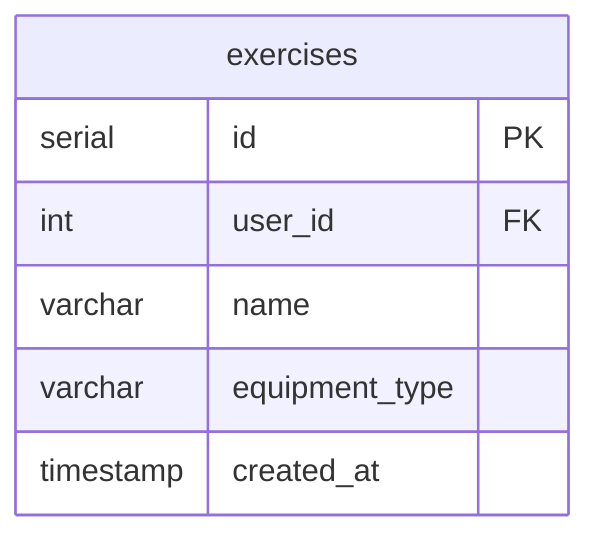

# Create Exercise Action

## Requirements

### Domain Entities

**Exercise (Упражнение)**
- ID
- User ID (владелец упражнения, из контекста аутентификации)
- Name (название)
- Equipment Type (тип оборудования): machine (тренажер), barbell (штанга), dumbbells (гантели), bodyweight (собственный вес)
- Created timestamp
- Last used timestamp (вычисляется через JOIN с sets, не хранится в БД)

### MCP Tool

**create_exercise** - создание нового упражнения

### User Story

Пользователь создает новое упражнение указывая название и тип.

## E2E Tests

### Test: Create exercise successfully
```go
// Call MCP tool create_exercise with name and equipment_type
// Verify response contains exercise with ID, name, equipment_type, created_at, last_used_at=null
// Call ExerciseRepository.ListWithLastUsed to verify exercise exists with correct data
```

### Test: Create exercise with invalid equipment type
```go
// Call MCP tool create_exercise with invalid equipment_type
// Verify error returned
```

## Implementation

### Domain structure

```go
// domain/exercise.go
type Exercise struct {
    ID            int64         `json:"id"`
    UserID        int64         `json:"user_id"`
    Name          string        `json:"name"`
    EquipmentType EquipmentType `json:"equipment_type"`
    CreatedAt     time.Time     `json:"created_at"`
    LastUsedAt    *time.Time    `json:"last_used_at,omitempty"` // Computed from sets
}

type EquipmentType string

const (
    EquipmentMachine    EquipmentType = "machine"
    EquipmentBarbell    EquipmentType = "barbell"
    EquipmentDumbbells  EquipmentType = "dumbbells"
    EquipmentBodyweight EquipmentType = "bodyweight"
)
```

### Database

```go
// gateways/workout_repository.go
type WorkoutRepository interface {
    CreateExercise(ctx context.Context, exercise Exercise) (int64, error)
}
```



### MCP Tool

#### create_exercise

**Input:**
```go
{
    "name": string,           // exercise name
    "equipment_type": string  // "machine" | "barbell" | "dumbbells" | "bodyweight"
}
```

**Output:**
```go
{
    "id": int64,
    "user_id": int64,
    "name": string,
    "equipment_type": string,
    "created_at": string (ISO8601),
    "last_used_at": null
}
```

**Logic:**
- Use default user_id (single-user mode)
- Validate equipment_type against allowed values
- Create Exercise struct with user_id, name, equipment_type
- Call WorkoutRepository.CreateExercise(exercise) - returns exercise_id
- Return created exercise as JSON
