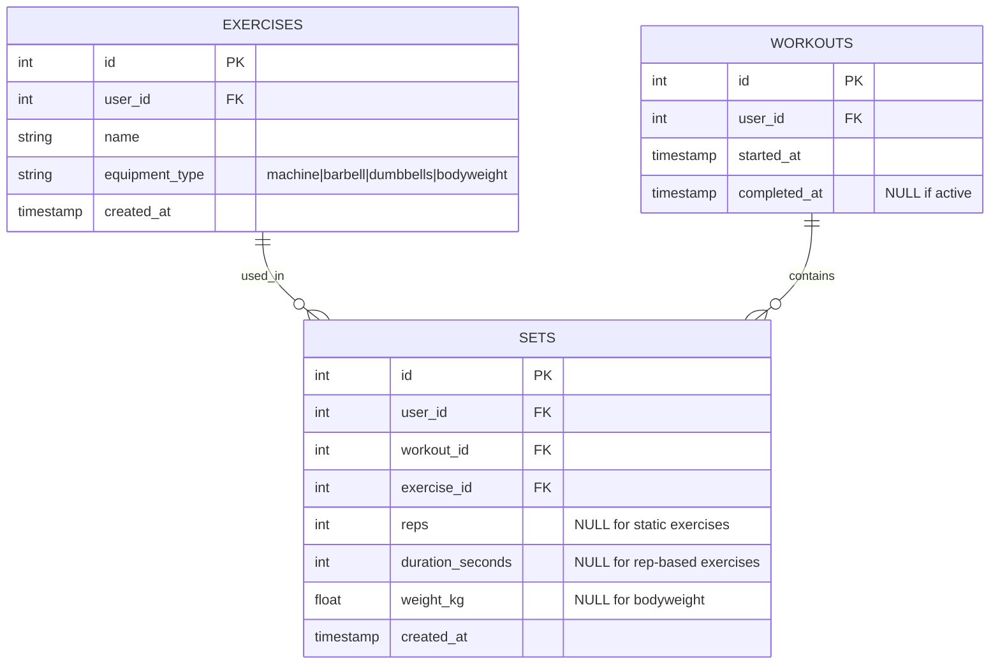
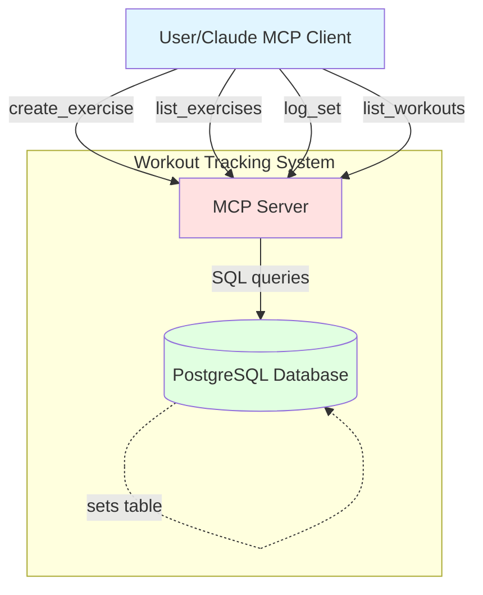
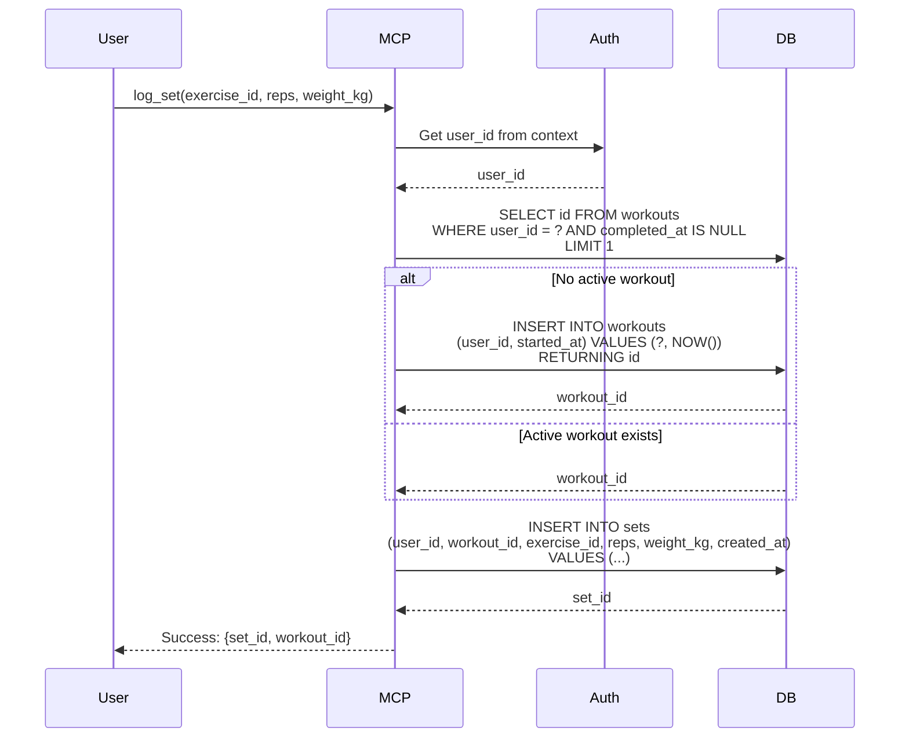
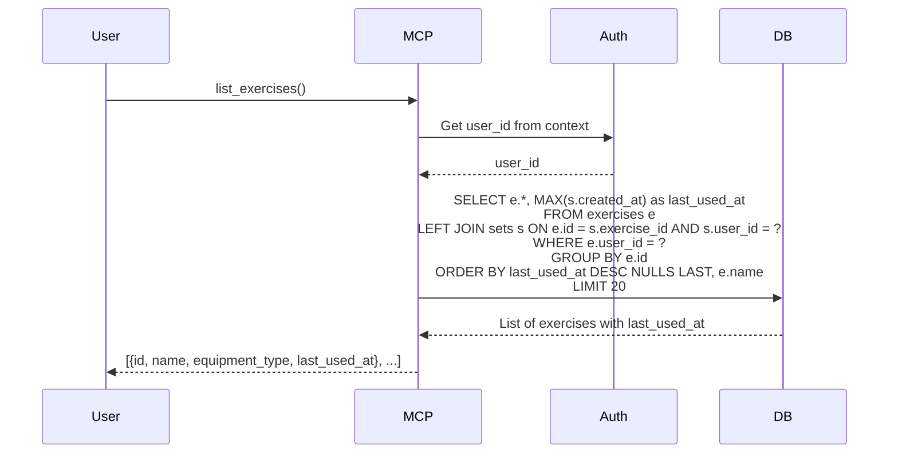
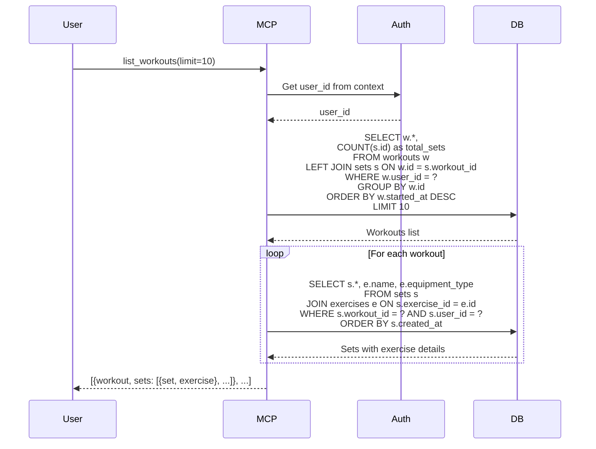

# Workout Tracking System - Complete Specification

## Overview

System for tracking workout exercises, sets, and training history with MCP (Model Context Protocol) interface. Supports different equipment types (machine, barbell, dumbbells, bodyweight) and tracks both rep-based and time-based exercises.

## Best Practices Applied

- **Multi-user Support**: All tables have user_id for data isolation
- **Single Active Workout Pattern**: Only one workout per user can be active at a time (completed_at IS NULL)
- **Auto-workout Creation**: First log_set call automatically creates active workout if none exists
- **Flexible Metrics**: Support both reps (dynamic) and duration (static/isometric exercises)
- **Denormalized Reads**: Calculate last_used_at via JOIN instead of storing redundantly
- **Progress Tracking**: Weight and time metrics for monitoring improvements
- **Nullable Fields**: reps, duration_seconds, weight_kg are nullable but at least one must be set
- **User Context**: user_id extracted from authentication context (JWT/session), not passed explicitly

## Architecture Diagrams

### Entity Relation Diagram



### C4 Context Diagram



### Sequence Diagram: Log Set



### Sequence Diagram: List Exercises



### Sequence Diagram: List Workouts



## Database Schema

### SQL DDL

```sql
-- Exercises table
CREATE TABLE exercises (
    id SERIAL PRIMARY KEY,
    name VARCHAR(255) NOT NULL,
    equipment_type VARCHAR(50) NOT NULL CHECK (equipment_type IN ('machine', 'barbell', 'dumbbells', 'bodyweight')),
    created_at TIMESTAMP NOT NULL DEFAULT NOW()
);

CREATE INDEX idx_exercises_name ON exercises(name);

-- Workouts table
CREATE TABLE workouts (
    id SERIAL PRIMARY KEY,
    started_at TIMESTAMP NOT NULL DEFAULT NOW(),
    completed_at TIMESTAMP NULL,  -- NULL means active workout
    created_at TIMESTAMP NOT NULL DEFAULT NOW()
);

CREATE INDEX idx_workouts_completed_at ON workouts(completed_at) WHERE completed_at IS NULL;
CREATE INDEX idx_workouts_started_at ON workouts(started_at DESC);

-- Sets table
CREATE TABLE sets (
    id SERIAL PRIMARY KEY,
    workout_id INTEGER NOT NULL REFERENCES workouts(id) ON DELETE CASCADE,
    exercise_id INTEGER NOT NULL REFERENCES exercises(id) ON DELETE RESTRICT,
    reps INTEGER NULL,  -- For dynamic exercises
    duration_seconds INTEGER NULL,  -- For static/isometric exercises
    weight_kg DECIMAL(6,2) NULL,  -- NULL for bodyweight exercises
    created_at TIMESTAMP NOT NULL DEFAULT NOW(),
    
    CONSTRAINT chk_set_metrics CHECK (
        reps IS NOT NULL OR duration_seconds IS NOT NULL
    )
);

CREATE INDEX idx_sets_workout_id ON sets(workout_id);
CREATE INDEX idx_sets_exercise_id ON sets(exercise_id);
CREATE INDEX idx_sets_created_at ON sets(created_at DESC);
```

## Go Code Structure

### Domain Models

```go
package workout

import (
	"time"
)

// EquipmentType represents the type of equipment used for an exercise
type EquipmentType string

const (
	EquipmentMachine    EquipmentType = "machine"
	EquipmentBarbell    EquipmentType = "barbell"
	EquipmentDumbbells  EquipmentType = "dumbbells"
	EquipmentBodyweight EquipmentType = "bodyweight"
)

// Exercise represents a workout exercise
type Exercise struct {
	ID            int64           `json:"id"`
	UserID        int64           `json:"user_id"`
	Name          string        `json:"name"`
	EquipmentType EquipmentType `json:"equipment_type"`
	CreatedAt     time.Time     `json:"created_at"`
	LastUsedAt    *time.Time    `json:"last_used_at,omitempty"` // Computed from sets
}

// Workout represents a training session
type Workout struct {
	ID          int64        `json:"id"`
	UserID      int64        `json:"user_id"`
	StartedAt   time.Time  `json:"started_at"`
	CompletedAt *time.Time `json:"completed_at"` // NULL means active
}

// Set represents a single set within a workout
type Set struct {
	ID              int64       `json:"id"`
	UserID          int64       `json:"user_id"`
	WorkoutID       int64       `json:"workout_id"`
	ExerciseID      int64       `json:"exercise_id"`
	Reps            *int64      `json:"reps"`             // NULL for static exercises
	DurationSeconds *int64      `json:"duration_seconds"` // NULL for rep-based exercises
	WeightKg        *float64  `json:"weight_kg"`        // NULL for bodyweight
	CreatedAt       time.Time `json:"created_at"`
}

type WorkoutSet struct {
	Workout
	Set
}

type ExerciseSearch struct {
	UserID  int
	Limit   int 
}


```

## DB Repository interface

```go
// gateways/workout_repository.go
type WorkoutRepository interface {
	// Exercise operations
	CreateExercise(ctx context.Context, exercise Exercise) (int64, error)
	ListExercises(ctx context.Context, params ExerciseSearch) ([]Exercise, error)

	// Workout operations
	CreateWorkout(ctx context.Context, workout Workout) (int64, error)
	CloseWorkout(ctx context.Context, workoutID int64) error
	ListWorkouts(ctx context.Context, params ExerciseSearch) ([]Workout, error)

	// Set operations
	CreateSet(ctx context.Context, set *Set) error
	ListSets(ctx context.Context, workoutID int64) ([]Set, error)
	GetLastSet(ctx context.Context, userID int64) (WorkoutSet, error)
}
```