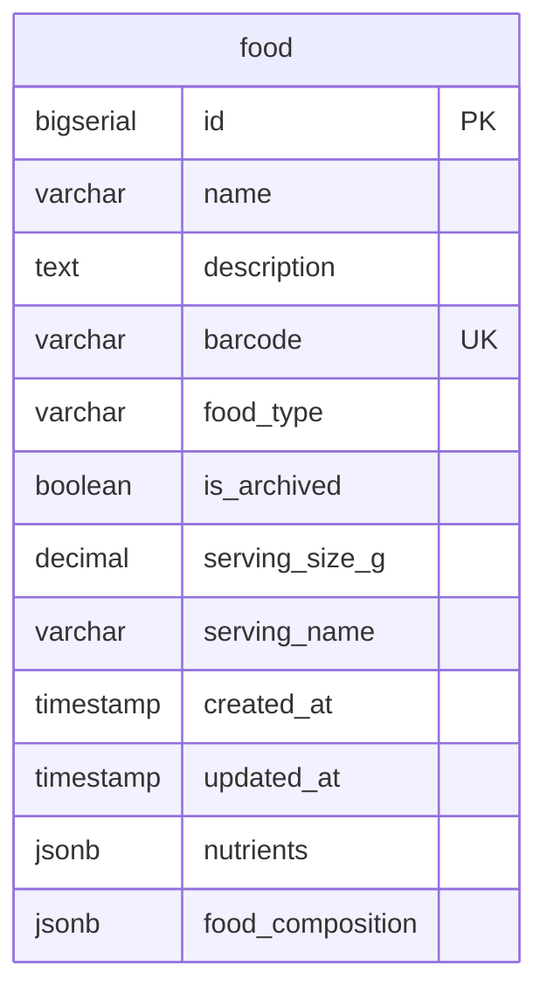

# Find Food Action

## Requirements

1. **Interface**: MCP tool для поиска продуктов по имени с возможностью ввода 1-5 вариантов названий
2. **Input data**: JSON с массивом name_variants (1-5 строк)
3. **External API**: Только PostgreSQL база данных
4. **Data format**: JSON для входных и выходных данных
5. **Search logic**: Поиск по каждому варианту названия с возвратом всех найденных результатов
6. **Relations**: Работает с существующей таблицей food

**Core functionality:**
- Принимает 1-5 вариантов названий продуктов
- Использует существующий метод db.SearchFood() для каждого варианта
- Возвращает список найденных продуктов с ID и названиями
- Интегрируется с completionHandler для автодополнения

## Implementation

### Domain structure

Используются существующие структуры:
```go
// Existing domain.Food struct (no changes needed)
// Existing domain.FoodFilter struct (no changes needed)
```

### Database

```go
// Repository interface methods (already exists)
type DB interface {
    SearchFood(ctx context.Context, filter domain.FoodFilter) ([]*domain.Food, error)
}
```



### External API

Только PostgreSQL база данных

### MCP tool handler

**Input:**
```go
type ResolveFoodIdByNameInput struct {
    NameVariants []string `json:"name_variants" jsonschema:"required,1-5 food name variants to search for"`
}
```

**Output:**
```go
type ResolveFoodIdByNameOutput struct {
    Foods []FoodMatch `json:"foods" jsonschema:"found food items with ID and name"`
    Error string      `json:"error,omitempty" jsonschema:"error message if any"`
}

type FoodMatch struct {
    ID          int64   `json:"id"`
    Name        string  `json:"name"`
    ServingName string `json:"serving_name,omitempty"`
    MatchCount  int    `json:"match_count,omitempty" jsonschema:"number of name variants that matched this food"`
}
```

**Internal logic:**
1. Валидация входных данных (1-5 name_variants, непустые строки)
2. Для каждого варианта названия:
   - Использовать логику поиска из log_food_by_name_mcp.go:35-68
   - Создать domain.FoodFilter{Name: &variant}
   - Вызвать db.SearchFood(ctx, filter)
   - Собрать результаты с подсчетом попаданий
3. Ранжирование результатов:
   - Подсчитать количество попаданий для каждого продукта (сколько name_variants нашли этот продукт)
   - Сортировать по убыванию количества попаданий
   - При равном количестве попаданий - сортировать по ID (для стабильности)
4. Дедупликация и формирование финального списка
5. Возврат отсортированного списка найденных продуктов
6. Если ничего не найдено - возврат пустого списка (не ошибка)

**Reuse Strategy:**
- Создать новый пакет `action/find_food` с публичными методами поиска
- Перенести логику поиска из log_food_by_name_mcp.go:35-68 в find_food пакет
- Создать публичные функции:
  - `SearchFoodsByName(ctx, db, name) ([]*domain.Food, error)`
  - `ResolveFoodIdByName(ctx, request, input)` - MCP tool handler
- Рефакторить log_food пакет для использования find_food.SearchFoodsByName()
- Обновить completionHandler для использования find_food.SearchFoodsByName()

## E2E Tests

**Test Structure:**
- Использовать существующий `IntegrationTestSuite` с PostgreSQL testcontainer
- Создать `find_food_test.go` в пакете tests

**Test Cases:**

### TestResolveFoodIdByName_Success
- **Test Data:** банан, яблоко красное, банановый йогурт
- **Input:** `{"банан", "банан", "яблоко", "красное"}` - 4 варианта с дубликатами
- **Actions:**
  - MCP tool call → Action → Repository.SearchFood() для каждого варианта
  - Подсчет match_count для каждого найденного продукта
  - Сортировка по убыванию match_count, затем по ID
- **Expected:**
  - 3 продукта отсортированных по match_count
  - "банан" - match_count=2 (найден дважды)
  - "яблоко красное" - match_count=2 (найден по "яблоко" и "красное")
  - "банановый йогурт" - match_count=1 (найден только по "банан")

### TestResolveFoodIdByName_ValidationErrors
- **Input:** некорректные данные (пустой массив, более 5 элементов, пустые строки)
- **Actions:** MCP tool call → Action validation
- **Expected:** ошибки валидации с соответствующими сообщениями

**Test Dependencies:**
```go
// TODO: Call MCP resolve_food_id_by_name tool handler
// TODO: Call repository.SearchFood() multiple times for different name variants
// TODO: Verify ranking by match_count and deduplication by ID
// TODO: Verify serving_name is included in results
```