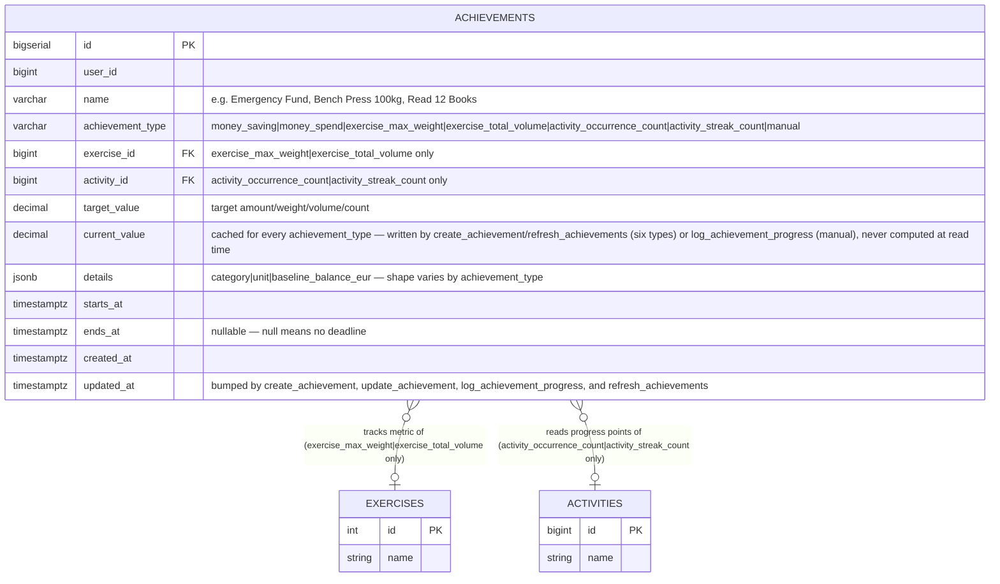
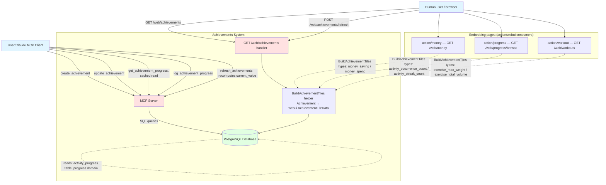

# Achievements - Complete Specification

## Overview

Cross-domain system for tracking personal achievements with MCP (Model Context Protocol) interface and a read-mostly web dashboard (one write route: a "Refresh" action, see HTTP Handlers). An achievement is exactly one of seven types, each with its own required fields and its own way of computing current progress — there is no shared "money"/"exercise"/"activity" grouping, every type sits at the same level:

- **`money_saving`** — reach X in accumulated balance ("save X, optionally by a date")
- **`money_spend`** — don't spend more than X on a category (the old `Budget`, renamed)
- **`exercise_max_weight`** — reach X kg all-time max on a specific `workout` exercise (see `workout-spec.md`) — e.g. "bench press 100kg"
- **`exercise_total_volume`** — lift X kg total (weight × reps, summed) on a specific exercise since the achievement was created — e.g. "lift 5000kg total this quarter"
- **`activity_occurrence_count`** — reach X occurrences of a `progress` activity since the achievement was created (see `progress-spec.md`) — e.g. "meditate 30 times"
- **`activity_streak_count`** — reach a streak of X consecutive check-ins on a `progress` activity, where consecutive means the gap between two check-ins is within the activity's own `frequency_days` — e.g. "30-day meditation streak"
- **`manual`** — reach X of a standalone running tally the achievement owns itself, for anything not already tracked elsewhere — e.g. "read 12 books this year"

All seven share the same shape (name, target value, optional deadline) and live in one `achievements` table, distinguished by a single `achievement_type` column, with a shared `current_value` column holding every achievement's most-recently-known progress. `manual` writes it directly (`log_achievement_progress`'s increment) — it owns no other data to derive from, so it's always exact. The other six (`money_saving`, `money_spend`, `exercise_max_weight`, `exercise_total_volume`, `activity_occurrence_count`, `activity_streak_count`) derive their value from data that already exists elsewhere, but that derivation is **cached, not live**: it runs once at `create_achievement` (an initial snapshot) and again only when explicitly asked for via the `refresh_achievements` MCP tool or the Achievements page's "Refresh" button — reads (`get_achievement_progress`, the web dashboard, embedded tile grids) always return whatever was last cached, never recompute on the spot. An achievement's progress can be stale between refreshes; that's the deliberate trade for reads that don't fan out into every other subdomain's tables on every page load.

On the web, an achievement always renders as the same **tile** (name, progress bar, label, optional deadline — see `webui-spec.md`'s `AchievementTileData`/`RenderAchievementTiles`), in one of two places: the dedicated `GET /web/achievements` page shows every achievement as a grid, and each of Money (`GET /web/money`), Progress browse (`GET /web/progress/browse`), and Workouts (`GET /web/workouts`) embeds the same tile grid filtered down to its own domain's achievement types — `money_saving`/`money_spend` on Money, `activity_occurrence_count`/`activity_streak_count` on Progress browse, `exercise_max_weight`/`exercise_total_volume` on Workouts. `manual` achievements have no domain page to embed into, so they only ever appear on the dedicated Achievements page.

## Rename Map (goals → achievements, 23-09-26)

Pure rename of the former `goals` subdomain — no behavior change. "Goal" read as a life goal; these are gamification bars (see `activity-rituals.md` §2.10), so the name now says so. Enum *values* (`money_saving`, `manual`, …) don't contain "goal" and stay as-is.

| Area | Old | New |
|---|---|---|
| Table / column | `goals`, `goal_type` | `achievements`, `achievement_type` |
| Constraints / indexes | `check_goal_type`, `check_goal_period`, `idx_goals_user_period`, `idx_goals_user_type` | `check_achievement_type`, `check_achievement_period`, `idx_achievements_user_period`, `idx_achievements_user_type` |
| Migration file | `gateways/db/migrations/z_goals.sql` | `gateways/db/migrations/z_achievements.sql` (see Database Schema) |
| Domain (`domain/goal.go` → `domain/achievement.go`) | `Goal`, `GoalType`, `GoalType*` consts, `AllGoalTypes`, `GoalUpdate`, `GoalFilter` | `Achievement`, `AchievementType`, `AchievementType*`, `AllAchievementTypes`, `AchievementUpdate`, `AchievementFilter` |
| Repository (`gateways/interfaces.go`, `db/repository.go`, `db/mock.go`) | `CreateGoal`, `UpdateGoal`, `GetGoal`, `ListGoals` (+ private `goalDetails`, `scanGoal`, `goalColumns`, …) | `CreateAchievement`, `UpdateAchievement`, `GetAchievement`, `ListAchievements` (+ `achievementDetails`, …) |
| Package | `action/goals` (`*_goal_*` / `refresh_goals_mcp.go` files) | `action/achievements` (`*_achievement_*` / `refresh_achievements_mcp.go`) |
| MCP tools | `create_goal`, `update_goal`, `get_goal_progress`, `log_goal_progress`, `refresh_goals` | `create_achievement`, `update_achievement`, `get_achievement_progress`, `log_achievement_progress`, `refresh_achievements` |
| MCP JSON fields | `goal_id`, `goal_type`, `goal`, `goals` | `achievement_id`, `achievement_type`, `achievement`, `achievements` |
| Web routes | `GET /web/goals`, `POST /web/goals/refresh`, `GET /web/goals/eink` | `GET /web/achievements`, `POST /web/achievements/refresh`, `GET /web/achievements/eink`; the old `GET /web/goals/eink` stays as a 301 redirect (a physical e-ink display points at it), no other old URLs or MCP tool aliases kept |
| Nav (`action/webui/nav.go`) | `NavGoals`, label "Goals" | `NavAchievements`, label "Achievements" |
| Embedded tiles (`action/webui`) | `GoalTileData`, `GoalTilesData`, `RenderGoalTiles`, `components/goal_tiles.html`, CSS `webui-goal-tile*`, `--webui-goal-over-*`; callers' `BuildGoalTiles`, `moneyGoalTypes`/`progressGoalTypes`/`workoutGoalTypes` | `AchievementTileData`, `AchievementTilesData`, `RenderAchievementTiles`, `components/achievement_tiles.html`, `webui-achievement-tile*`, `--webui-achievement-over-*`; `BuildAchievementTiles`, `money/progress/workoutAchievementTypes` |
| Errors / tool text | `delete_activity` "a goal still references it" | "an achievement still references it" |
| Agent-facing text | `transport/mcp/instructions.md`, `action/docs/content/activity-mechanics.md` (§5 "Goal", tool table), `activity-rituals.md` (§2.10 "Goal = achievement" and other "goal" mentions), `activity-riturals-sorces.md` (entity mentions only, not cited paper titles) | "Achievement"; the "Goal = achievement / name is historical" notes become just "Achievement" |
| Tests | `tests/goals_test.go`, `tests/goals_dashboard_web_test.go`, `Test*Goal*` names in other test files | `tests/achievements_test.go`, `tests/achievements_dashboard_web_test.go`, `Test*Achievement*` |
| Specs | `docs/functions/goals-spec.md`; references in `money-`, `progress-`, `workout-`, `webui-`, `docs-spec.md` | this file; references updated |

Not renamed: plain-English "goal" that isn't this entity (e.g. `progress-spec.md` Overview, `domain/progress.go` comments, `CLAUDE_*_INSTRUCTIONS.md`), and history in `docs/wontdo.md`.

## Architecture Diagrams

### Entity Relation Diagram



### C4 Context Diagram



## Database Schema

### SQL DDL

`gateways/db/migrations/z_achievements.sql` (replaces `z_goals.sql`). Rename preamble (table, column, check/PK/FK constraints, indexes, sequence) — each step is a no-op once done or on a fresh DB:

```sql
ALTER TABLE IF EXISTS goals RENAME TO achievements;

DO $$
DECLARE
    tbl regclass := to_regclass('achievements');
    old_name text;
    new_name text;
BEGIN
    IF tbl IS NULL THEN
        RETURN;
    END IF;

    IF EXISTS (SELECT 1 FROM pg_attribute
               WHERE attrelid = tbl AND attname = 'goal_type' AND NOT attisdropped) THEN
        ALTER TABLE achievements RENAME COLUMN goal_type TO achievement_type;
    END IF;

    FOREACH old_name IN ARRAY ARRAY[
        'check_goal_type', 'check_goal_period',
        'goals_pkey', 'goals_exercise_id_fkey', 'goals_activity_id_fkey'
    ] LOOP
        new_name := replace(replace(old_name, 'goals_', 'achievements_'), 'goal_', 'achievement_');
        IF EXISTS (SELECT 1 FROM pg_constraint WHERE conrelid = tbl AND conname = old_name) THEN
            EXECUTE format('ALTER TABLE achievements RENAME CONSTRAINT %I TO %I', old_name, new_name);
        END IF;
    END LOOP;
END $$;

ALTER INDEX IF EXISTS idx_goals_user_period RENAME TO idx_achievements_user_period;
ALTER INDEX IF EXISTS idx_goals_user_type RENAME TO idx_achievements_user_type;
ALTER SEQUENCE IF EXISTS goals_id_seq RENAME TO achievements_id_seq;
```

Then the table itself (fresh DBs):

```sql
CREATE TABLE IF NOT EXISTS achievements (
    id                    BIGSERIAL PRIMARY KEY,
    user_id               BIGINT NOT NULL,
    name                  VARCHAR(255) NOT NULL,
    achievement_type      VARCHAR(25) NOT NULL,            -- 'money_saving', 'money_spend', 'exercise_max_weight', 'exercise_total_volume', 'activity_occurrence_count', 'activity_streak_count', 'manual'
    exercise_id           BIGINT REFERENCES exercises(id), -- exercise_max_weight|exercise_total_volume only
    activity_id           BIGINT REFERENCES activities(id), -- activity_occurrence_count|activity_streak_count only
    target_value          DECIMAL(12,2) NOT NULL,
    current_value         DECIMAL(12,2) NOT NULL DEFAULT 0, -- cached for every achievement_type
    details               JSONB NOT NULL DEFAULT '{}',     -- remaining type-specific scalars, shape varies by achievement_type:
                                                            --   money_spend: {"category": "food/cafe"}
                                                            --   money_saving: {"baseline_balance_eur": 1234.56}
                                                            --   exercise_max_weight / exercise_total_volume: {"unit"?: "kg"}
                                                            --   activity_occurrence_count / activity_streak_count: {"unit"?: "sessions"}
                                                            --   manual: {"unit"?: "books"}
    starts_at             TIMESTAMPTZ NOT NULL,
    ends_at               TIMESTAMPTZ,                     -- nullable — null means no deadline
    created_at            TIMESTAMPTZ NOT NULL DEFAULT NOW(),
    updated_at            TIMESTAMPTZ NOT NULL DEFAULT NOW(), -- bumped by create_achievement (insert) and every UpdateAchievement call (update_achievement, log_achievement_progress, refresh_achievements)

    CONSTRAINT check_achievement_type CHECK (achievement_type IN (
        'money_saving', 'money_spend', 'exercise_max_weight', 'exercise_total_volume',
        'activity_occurrence_count', 'activity_streak_count', 'manual'
    )),
    CONSTRAINT check_spend_category CHECK (
        (achievement_type = 'money_spend' AND details ? 'category' AND details->>'category' <> '')
        OR (achievement_type <> 'money_spend' AND NOT (details ? 'category'))
    ),
    CONSTRAINT check_saving_baseline CHECK (
        (achievement_type = 'money_saving' AND details ? 'baseline_balance_eur')
        OR (achievement_type <> 'money_saving' AND NOT (details ? 'baseline_balance_eur'))
    ),
    CONSTRAINT check_exercise_link CHECK (
        (achievement_type IN ('exercise_max_weight', 'exercise_total_volume') AND exercise_id IS NOT NULL)
        OR (achievement_type NOT IN ('exercise_max_weight', 'exercise_total_volume') AND exercise_id IS NULL)
    ),
    CONSTRAINT check_activity_link CHECK (
        (achievement_type IN ('activity_occurrence_count', 'activity_streak_count') AND activity_id IS NOT NULL)
        OR (achievement_type NOT IN ('activity_occurrence_count', 'activity_streak_count') AND activity_id IS NULL)
    ),
    CONSTRAINT check_unit_scope CHECK (
        NOT (details ? 'unit') OR achievement_type IN (
            'exercise_max_weight', 'exercise_total_volume', 'activity_occurrence_count', 'activity_streak_count', 'manual'
        )
    ),
    CONSTRAINT check_target_value CHECK (target_value > 0),
    CONSTRAINT check_achievement_period CHECK (ends_at IS NULL OR ends_at > starts_at)
);

CREATE INDEX IF NOT EXISTS idx_achievements_user_period ON achievements(user_id, starts_at, ends_at);
CREATE INDEX IF NOT EXISTS idx_achievements_user_type   ON achievements(user_id, achievement_type);
```

`UpdateAchievement` is the only write path for an existing achievement, for every caller — the `update_achievement` MCP tool, `refresh_achievements`' recompute, and `log_achievement_progress`'s increment all build a `domain.AchievementUpdate` and go through it. It's a dynamic partial `UPDATE` over whichever `AchievementUpdate` fields are non-nil, always an absolute `SET`, never a `current_value = current_value + $delta` — `log_achievement_progress` computes the new absolute value in Go first (`GetAchievement` then add `delta`), the same as `refresh_achievements` computes its new absolute value from other subdomains' data first:

```sql
UPDATE achievements
SET name = COALESCE($name, name),
    target_value = COALESCE($target_value, target_value),
    current_value = COALESCE($current_value, current_value),
    category = ...,     -- only touched when Category is set on the AchievementUpdate
    unit = ...,
    ends_at = CASE WHEN $clear_ends_at THEN NULL WHEN $ends_at IS NOT NULL THEN $ends_at ELSE ends_at END,
    updated_at = NOW()
WHERE id = $achievement_id AND user_id = $user_id;
```

## Go Code Structure

### Domain Models

```go
package achievements

import "time"

// AchievementType is the kind of achievement being tracked — seven flat, sibling values,
// each with its own required fields and progress calculation. There is no shared "money"/"exercise"/"activity" grouping —
// an achievement type is never nested inside another via a second discriminator field.
type AchievementType string

const (
    AchievementTypeMoneySaving             AchievementType = "money_saving"             // reach TargetValue in accumulated balance
    AchievementTypeMoneySpend              AchievementType = "money_spend"              // don't exceed TargetValue spent on Category
    AchievementTypeExerciseMaxWeight       AchievementType = "exercise_max_weight"      // reach TargetValue kg all-time max for ExerciseID
    AchievementTypeExerciseTotalVolume     AchievementType = "exercise_total_volume"    // reach TargetValue kg total volume for ExerciseID since StartsAt
    AchievementTypeActivityOccurrenceCount AchievementType = "activity_occurrence_count" // reach TargetValue occurrences of ActivityID since StartsAt
    AchievementTypeActivityStreakCount     AchievementType = "activity_streak_count"    // reach TargetValue consecutive check-ins of ActivityID, evaluated as of now
    AchievementTypeManual                  AchievementType = "manual"                   // reach TargetValue; CurrentValue incremented directly via log_achievement_progress
)

// Achievement represents any of the seven achievement types. Category/Unit/BaselineBalanceEUR are
// stored packed into the achievements.details JSONB column, not their own columns —
// mapper_achievement.go marshals/unmarshals them, so this struct's shape is
// unaffected by that storage choice. CurrentValue is a real, always-populated
// column (not packed, not nullable) — cached, not computed live: written by
// create_achievement/refresh_achievements for six types and by
// log_achievement_progress for manual; reads never recompute it.
type Achievement struct {
    ID                 int64      `json:"id" db:"id"`
    UserID             int64      `json:"user_id" db:"user_id"`
    Name               string     `json:"name" db:"name"`
    AchievementType           AchievementType   `json:"achievement_type" db:"achievement_type"`
    ExerciseID         *int64     `json:"exercise_id,omitempty" db:"exercise_id"`   // exercise_max_weight|exercise_total_volume only
    ActivityID         *int64     `json:"activity_id,omitempty" db:"activity_id"`   // activity_occurrence_count|activity_streak_count only
    TargetValue        float64    `json:"target_value" db:"target_value"`
    CurrentValue       float64    `json:"current_value" db:"current_value"` // cached, not omitempty since every achievement_type populates it
    Category           *string    `json:"category,omitempty"`             // money_spend only — packed into details
    Unit               *string    `json:"unit,omitempty"`                 // exercise_max_weight|exercise_total_volume|activity_occurrence_count|activity_streak_count|manual only — packed into details
    BaselineBalanceEUR *float64   `json:"baseline_balance_eur,omitempty"` // money_saving only — packed into details
    StartsAt           time.Time  `json:"starts_at" db:"starts_at"`
    EndsAt             *time.Time `json:"ends_at,omitempty" db:"ends_at"` // nil means no deadline
    CreatedAt          time.Time  `json:"created_at" db:"created_at"`
    UpdatedAt          time.Time  `json:"updated_at" db:"updated_at"` // bumped by create_achievement, update_achievement, log_achievement_progress, refresh_achievements
}

// achievementDetails is the JSON shape stored in achievements.details — assembled from
// and unpacked back into Achievement's typed fields by mapper_achievement.go only.
// Never referenced outside that mapper; action/achievements works with Achievement directly.
// CurrentValue is deliberately not in here.
type achievementDetails struct {
    Category           *string  `json:"category,omitempty"`
    Unit               *string  `json:"unit,omitempty"`
    BaselineBalanceEUR *float64 `json:"baseline_balance_eur,omitempty"`
}

// AchievementUpdate is a partial edit of an existing achievement — every field but ID is
// optional; nil/false means "leave unchanged" (same convention as
// money-spec.md's TransactionUpdate). It's the payload for DB.UpdateAchievement,
// the repository's only write method besides CreateAchievement — three different
// callers build one: the update_achievement MCP tool (user-facing correction —
// Name/TargetValue/EndsAt/ClearEndsAt/Category/Unit, or CurrentValue but
// only for manual achievements), refresh_achievements (CurrentValue only, for the other
// six types' recomputed snapshot), and log_achievement_progress (CurrentValue
// only, set to current+delta computed in Go). Structural/one-time fields
// — AchievementType, ExerciseID, ActivityID, BaselineBalanceEUR — aren't on this
// struct at all; they're never editable.
type AchievementUpdate struct {
    ID           int64      `json:"id"`
    Name         *string    `json:"name,omitempty"`
    TargetValue  *float64   `json:"target_value,omitempty"`
    EndsAt       *time.Time `json:"ends_at,omitempty"`       // set a new deadline
    ClearEndsAt  bool       `json:"clear_ends_at,omitempty"` // explicitly remove the deadline; ignored if EndsAt is also set
    Category     *string    `json:"category,omitempty"`      // money_spend only — DB CHECK rejects it otherwise
    Unit         *string    `json:"unit,omitempty"`          // exercise_max_weight|exercise_total_volume|activity_occurrence_count|activity_streak_count|manual only — DB CHECK rejects it otherwise
    CurrentValue *float64   `json:"current_value,omitempty"` // no DB-level type restriction — which achievement_type may set it is a rule each caller enforces itself
}

// RemainingValue is a plain getter, not a stored/duplicated field — every
// caller that used to read an AchievementProgress.RemainingValue (an earlier draft
// had that as its own struct wrapping Achievement) now just calls this on the Achievement
// it already has. No repository round-trip, no separate type.
func (g Achievement) RemainingValue() float64 {
    return g.TargetValue - g.CurrentValue // negative means over/exceeded
}

// AchievementFilter defines query parameters for listing achievements — the one read path
// for more than one achievement at a time (there is no
// separate GetAchievementProgress, ListAchievements covers it with these two extra fields).
type AchievementFilter struct {
    UserID     int64
    ActiveOnly bool        // starts_at <= At AND (ends_at IS NULL OR ends_at >= At)
    At         time.Time   // moment ActiveOnly's window is evaluated against; zero value means now
    Types      []AchievementType  // nil/empty = every type; non-empty scopes to a subset (e.g. Money's embedded tile grid)
}
```

### Repository Interface

```go
type DB interface {
    // Write
    CreateAchievement(ctx context.Context, g *domain.Achievement) (int64, error)

    // UpdateAchievement is the only way to write to an existing achievement — the entire
    // repository has exactly two write methods, this and CreateAchievement. A dynamic partial update over whichever
    // domain.AchievementUpdate fields are non-nil/true (achievementID is AchievementUpdate.ID,
    // not a separate parameter), bumping updated_at. Always an absolute
    // SET, never a delta — a caller that needs "+delta" semantics (only
    // log_achievement_progress does) reads the current value first and computes
    // the new absolute value itself; atomicity of that read-then-set isn't
    // a concern for a single-user personal tool. This
    // method does no business validation of its own — every caller (the
    // update_achievement MCP tool, refresh_achievements, log_achievement_progress) validates
    // and builds a well-formed AchievementUpdate before calling it. The
    // table's own CHECK constraints (per-achievement_type field applicability,
    // target_value > 0, ends_at > starts_at) still apply underneath and
    // will reject a malformed write, but that is a backstop against a bug,
    // never the caller's expected/only source of a validation error.
    // CurrentValue has no per-type CHECK at all (every achievement_type populates
    // it now) — it's each caller's own job (the
    // update_achievement MCP tool for manual corrections, refresh_achievements for the
    // other six, log_achievement_progress for manual's increment) to only set it
    // when appropriate for that achievement's type.
    UpdateAchievement(ctx context.Context, userID int64, update domain.AchievementUpdate) error

    // Read
    GetAchievement(ctx context.Context, achievementID int64, userID int64) (*domain.Achievement, error)

    // ListAchievements is the one query method for more than one achievement — no
    // separate GetAchievementProgress. ActiveOnly+At covers
    // what a "progress as of a date" read needs (starts_at <= At AND
    // (ends_at IS NULL OR ends_at >= At)), Types scopes to a subset of
    // AchievementType. A plain read of already-cached current_value columns, no
    // per-achievement_type computation — that only happens in create_achievement/
    // refresh_achievements. Callers get remaining_value by
    // calling Achievement.RemainingValue() on each result, not from this method.
    ListAchievements(ctx context.Context, filter domain.AchievementFilter) ([]domain.Achievement, error)

    // GetCategorySpend sums transactions.amount_eur where category starts
    // with the given prefix, within [from, to] — powers money_spend achievements.
    // Same query the old Budget/BudgetProgress used, now achievement-scoped.
    GetCategorySpend(ctx context.Context, userID int64, category string, from, to time.Time) (float64, error)

    // GetExerciseVolume sums sets.weight_kg * sets.reps for an exercise
    // since a given time — powers exercise_total_volume achievements.
    GetExerciseVolume(ctx context.Context, userID int64, exerciseID int64, since time.Time) (float64, error)

    // Cross-domain reads used directly inside create_achievement's initial
    // snapshot and refresh_achievements' recompute, not redefined here — see
    // money-spec.md's GetBalance, workout-spec.md's GetPersonalRecords, and
    // progress-spec.md's CountProgress/GetActivity/ListProgress (the latter
    // two power activity_streak_count's walk, no new
    // progress-domain method needed). All live on the same shared
    // repository (docs/architecture.md), so action/achievements calls them the
    // same way their own actions do. Never called from ListAchievements.
}
```

## MCP Tools

### create_achievement
Creates a new achievement. Required: `name`, `achievement_type` (one of the seven values — errors with an unknown-type message if it isn't), `target_value` (errors "target_value must be greater than 0" if not). Type-specific requirements, each with its own clear error if missing/misapplied: `money_spend` requires non-empty `category` ("category is required for money_spend achievements") and rejects `unit`; `money_saving` auto-captures `baseline_balance_eur` via `GetBalance` as of `starts_at` (not caller-supplied) and also rejects `category`/`unit`; `exercise_max_weight`/`exercise_total_volume` require `exercise_id`, checked for existence/ownership via `GetExercise` ("exercise not found") and reject `category`; `activity_occurrence_count`/`activity_streak_count` require `activity_id`, checked via `GetActivity` ("activity not found") and reject `category`; `manual` initializes `current_value` to 0 and rejects `category`. `exercise_max_weight`/`exercise_total_volume`/`activity_occurrence_count`/`activity_streak_count`/`manual` accept an optional `unit` display label; the other two reject it ("unit is not applicable to money_saving/money_spend achievements"). `ends_at` is optional for every type (omit for no deadline); when provided, errors "ends_at must be after starts_at" if it isn't. All of this validates in Go before any DB write. For the six non-`manual` types, also computes and stores an initial `current_value` snapshot (same logic as `refresh_achievements`) so the achievement isn't stuck at zero until the first refresh — a backdated achievement can even start out already met.

### update_achievement
Edits mutable fields of an existing achievement by ID: `name`, `target_value`, `ends_at` (or `clear_ends_at` to remove the deadline), and, when they apply to the achievement's own `achievement_type`, `category` (money_spend only) and `unit`. `current_value` is only editable this way for `manual` achievements — a direct correction (e.g. "actually I've read 15 books not 12"), distinct from `log_achievement_progress`'s delta-based `+1`. For the other six types, `current_value` is cached/derived and not editable via `update_achievement` at all — use `refresh_achievements` to bring it up to date instead. All fields optional except `achievement_id`; only provided fields change. `achievement_type`, `exercise_id`, `activity_id`, and `baseline_balance_eur` are not editable at all. Validates the same rules as `create_achievement`, with the same specific error messages, for whichever fields are provided — "achievement not found" if `achievement_id` doesn't exist or isn't owned by the user, "target_value must be greater than 0", "ends_at must be after starts_at", "category can only be set on money_spend achievements" (and the reverse — required, not just settable, when the achievement is money_spend), "unit is not applicable to `<achievement_type>` achievements", "current_value can only be corrected on manual achievements" — never a raw DB constraint error. Bumps `updated_at`.

### refresh_achievements
Recomputes and persists `current_value` for the six derived achievement types (`money_saving`/`money_spend`/`exercise_max_weight`/`exercise_total_volume`/`activity_occurrence_count`/`activity_streak_count`) — the same per-`achievement_type` calculation `create_achievement` uses for its initial snapshot, run again on demand instead of automatically. Optional `achievement_id`: omitted refreshes every active achievement owned by the user; provided refreshes just that one achievement — errors "achievement not found" if it doesn't exist or isn't owned, or "manual achievements have no derived progress to refresh; use log_achievement_progress or update_achievement instead" if it's `manual`. Returns the count of achievements refreshed, or the single updated achievement when `achievement_id` is given. Bumps `updated_at` on every achievement it actually recomputes.

### get_achievement_progress
Returns all achievements active as of a given date (defaults to now, i.e. `starts_at <= date` and `ends_at` null or `>= date`), each with `remaining_value` from `Achievement.RemainingValue()` — a plain getter over the cached `current_value` column, no per-`achievement_type` computation (call `refresh_achievements` first if the numbers might be stale). Always calls `ListAchievements` with `Types: nil` (every type) — the MCP tool has no type filter of its own; that's a web-only need (see HTTP Handlers).

### log_achievement_progress
Increments an `achievement_type = manual` achievement's `current_value` by `delta` (defaults to 1), returning the new value. Errors "achievement not found" if `achievement_id` doesn't exist or isn't owned by the user, or "log_achievement_progress only applies to manual achievements" if the achievement is one of the other six types.

## HTTP Handlers

### GET /web/achievements
**Auth**: `WebMiddleware` session cookie (see `auth-spec.md`), same as every other `/web/*` dashboard

Read-mostly, single page, built on the shared `action/webui` design system (see `webui-spec.md`):
- A **"Refresh" button** at the top of the page — a plain `<form method="POST" action="/web/achievements/refresh">` with one submit button, rendered locally by `action/achievements`' own page template (not a shared `webui` component, same convention as `money-spec.md`'s export checkbox form) — see `POST /web/achievements/refresh` below
- **Active achievements** tile grid via `BuildAchievementTiles(ctx, db, userID, now, types=nil)` + `webui.RenderAchievementTiles` — every achievement type, each tile showing name, progress bar, label (e.g. `"€420 / €1,000 (42%)"`, `"82kg / 100kg"`, `"3200kg / 5000kg"`, `"12 / 30 sessions"`, `"14 / 30 day streak"`), and deadline when set. Values come straight from the cached `current_value` column — this page load never recomputes anything itself, only "Refresh" does. `EmptyMessage` is always set ("No active achievements yet")
- **Past/completed achievements** table below (achievements with `ends_at < now`): Name, Type, Target, Deadline — no recompute, since the window already closed
- No add/edit form otherwise — creating and editing achievements, and logging manual progress, stay MCP-only (`create_achievement`, `update_achievement`, `log_achievement_progress`)

### POST /web/achievements/refresh
**Auth**: same `WebMiddleware` session cookie

The one write route among the `/web/*` dashboards — every other one (Money, Progress browse, Workouts) is strictly read-only/GET-only, see `money-spec.md`/`workout-spec.md` — the web equivalent of the `refresh_achievements` MCP tool with no `achievement_id` (refreshes every active achievement owned by the user). Takes no body/params — the "Refresh" button on `/web/achievements` is the only caller. On success, redirects (`302`) back to `GET /web/achievements`, so the page reloads showing the freshly recomputed values.

### GET /web/achievements/eink
**Auth**: none — unauthenticated, same as `GET /web/progress` (see `progress-spec.md`)

Purpose-built fixed-viewport (`100vw`/`100vh`), black-and-white, monospace screenshot page for a physical e-ink display, mirroring `action/progress/dashboard_web.go`'s `/web/progress`. Content is just the active-achievements tile grid — `BuildAchievementTiles(ctx, db, userID, now, types=nil)` (grouped by category) + `webui.RenderAchievementTiles`, restyled black-and-white by `action/achievements`' own inline CSS (same `webui-achievement-tile*` classes, no shared design-system stylesheet) — no Refresh form, no past/completed table. Tuned for its own low card count rather than reusing `/web/progress`'s dense sizing: larger name/label/deadline font sizes than the shared design system's default, and rounded card corners (`border-radius`) instead of the sharp `border: 1px solid #000` a dense multi-row layout called for.

### GET /web/goals/eink (legacy redirect)
**Auth**: none

Pre-rename URL of the e-ink page, kept because a physical display is configured with it: `301` to `/web/achievements/eink`, query string preserved (`achievements.LegacyEinkRedirectWebHandler`).

### Embedded achievement tiles on Money, Progress browse, and Workouts
Each of `GET /web/money`, `GET /web/progress/browse`, and `GET /web/workouts` (see `money-spec.md`, `progress-spec.md`, `workout-spec.md`) calls `BuildAchievementTiles` with its own domain's `types` and embeds the resulting `webui.RenderAchievementTiles` fragment on its existing page — no new route. `EmptyMessage` is left unset on all three, so a domain with no achievements of its own renders no achievements section at all rather than an empty grid.

### `achievements.BuildAchievementTiles(ctx context.Context, db DB, userID int64, at time.Time, types []domain.AchievementType) ([]webui.AchievementTileData, error)`
Not a route — an exported Go function, the single place that turns an `Achievement` into a `webui.AchievementTileData`: calls `ListAchievements(AchievementFilter{UserID: userID, ActiveOnly: true, At: at, Types: types})` (a plain cached read); when `types` is `nil` (the two all-types pages, `/web/achievements` and `/web/achievements/eink`), additionally re-sorts the result by category before mapping — a non-nil `types` subset skips this and keeps `ListAchievements`'s `starts_at` order. For each achievement it then formats `ProgressLabel`/`PercentComplete` per `achievement_type` from its already-computed `CurrentValue`/`RemainingValue()` — pure display formatting, no further computation or DB calls — sets `Deadline` from `EndsAt` (empty if nil), sets `LinkURL` per `achievement_type`, and sets `OverTarget` when `CurrentValue > TargetValue` for `money_spend` only (the one type where exceeding is a bad thing). Called by `GET /web/achievements` and `GET /web/achievements/eink` (both with `types=nil`) and by the Money/Progress-browse/Workouts handlers (each with their own `types` subset).

## Configuration

- **Log Achievement Progress Default Delta**: 1 (one call = one occurrence, for `log_achievement_progress` when `delta` is omitted)

## E2E Tests

In `tests/achievements_test.go`:

- `TestCreateAchievement_*`: money spend, computes initial spend from category; money saving, captures baseline and starts at zero; exercise max weight, already met if backdated; exercise total volume, sums weight times reps; activity occurrence count, counts since starts at; activity streak count, lapsed streak is zero; activity streak count, counts consecutive check ins; manual, starts at zero; validation errors
- `TestUpdateAchievement_*`: name target and deadline; clear ends at; current value, only manual can be corrected; category, only money spend; not found
- `TestRefreshAchievements_*`: single achievement, recomputes on demand only; all active, skips manual; manual achievement, rejected
- `TestGetAchievementProgress_*`: only active achievements, with remaining value
- `TestLogAchievementProgress_*`: default and custom delta; non manual achievement rejected

In `tests/achievements_dashboard_web_test.go`:

- `TestAchievementsDashboard_*`: active achievements show as tiles; empty state; past achievements listed in table, not as tiles; sorted by category then ID; drill down links
- `TestAchievementsRefresh_*`: recomputes active achievements and redirects
- `TestAchievementsEink_*`: active achievements show as tiles, no refresh form or past table; sorted by category then ID; bigger text and rounded corners; empty state; legacy goals URL redirects
- `TestMoneyDashboard_*`: embeds own achievement tiles; no achievements means no achievement tiles section
- `TestWorkoutsDashboard_*`: embeds own achievement tiles
- `TestProgressBrowse_*`: embeds own achievement tiles

## Changelog

- **03-10-26** — migrated to the new spec template: removed Best Practices Applied and the sequence diagrams together with every reference to them; Configuration narrowed to constants; E2E Tests rewritten as a list of the current tests; added Changelog (Architecture Diagrams, Configuration, E2E Tests, Changelog)
- **26-09-26** — subdomain renamed from goals to achievements (table, routes, MCP tools, Go types, tests); spec moved from `goals-spec.md`; added the Rename Map and the legacy `/web/goals/eink` redirect (Overview, Rename Map (goals → achievements, 23-09-26), Architecture Diagrams, Database Schema, Go Code Structure, MCP Tools, HTTP Handlers, Configuration, E2E Tests)
- **06-09-26** — e-ink cards restyled (bigger text, rounded corners); tiles sorted by category on the all-types pages; tiles get drill-down links (HTTP Handlers)
- **04-09-26** — added the e-ink dashboard page (HTTP Handlers)
- **02-09-26** — initial version (as `goals-spec.md`)
