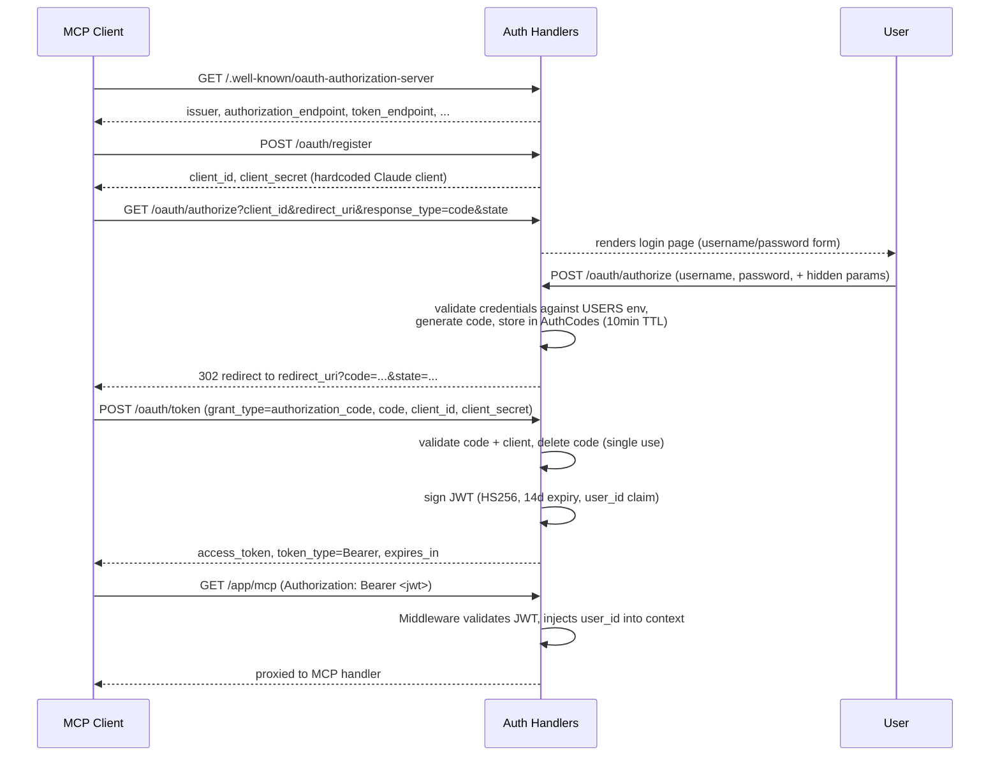
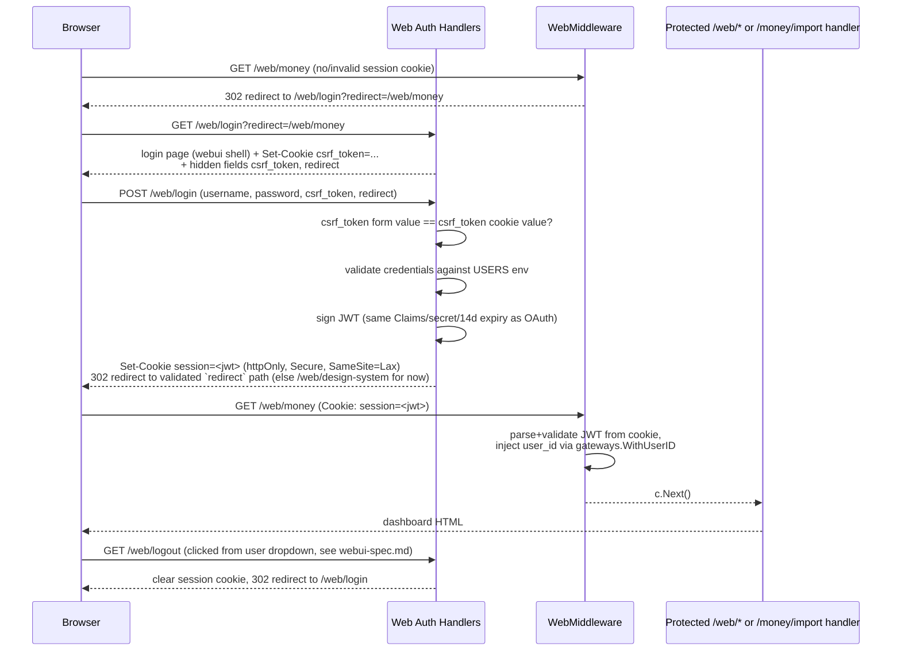

# Auth (OAuth 2.1 + Web Session) - Complete Specification

## Overview

The `action/auth` package covers two independent login flows that share one user store and one JWT secret:

1. **OAuth 2.1 Authorization Server** — protects the MCP endpoint (`/app/mcp`) for machine clients (Claude Desktop, other MCP clients). The server acts as its own provider: it implements the Authorization Code flow, issues bearer JWT access tokens, and supports dynamic client registration. No third-party identity provider is involved.
2. **Web Session Login** — a shared, cookie-based login for human browser access to the *new* `/web/*` dashboards (Money, Progress browse, Workouts, Navigation home page — each its own backlog item, built on top of this) plus `/money/import`. It replaces the inconsistent per-page auth that existed before: `/money/import` used to run its own HTTP Basic Auth with `IMPORT_USERNAME`/`IMPORT_PASSWORD` (now retired).

**Out of scope for the web session flow:** `action/progress/dashboard_web.go` (served at `/web/progress`) is purpose-built for black-and-white screenshot/e-ink display and stays exactly as it is today, unauthenticated included. It is not routed through `WebMiddleware`.

`GET /web/design-system` (the webui component demo page, `action/webui`) **is** routed through `WebMiddleware`, same as every other `/web/*` dashboard — it's a `/web/*` route rendered through the shared shell, and the shell now shows the logged-in username (see `webui-spec.md`), so it needs a real session like any other page.

## Best Practices Applied

- **Self-issued Provider**: this server is both the authorization server and the resource server — no external IdP
- **Env-configured Users**: valid username/password pairs come from the `USERS` env var (`ID:USERNAME:PASSWORD;...`), not a database table — shared by both the OAuth flow and the web session flow
- **In-memory Authorization Codes**: codes live in a process-local map (`AuthCodes`) with a 10-minute expiry, not persisted
- **Dynamic Client Registration**: `/oauth/register` always returns the single hardcoded Claude client's credentials — it satisfies clients that require the registration step without maintaining a real client store
- **JWT Access Tokens**: HS256-signed, 14-day expiry, carry `user_id` as a custom claim; `gateways.WithUserID` injects it into request context for downstream handlers
- **One token shape, two transports**: the web session cookie carries the exact same `Claims`/signing secret/expiry as the OAuth bearer token (now including `UserName`, added so the web shell can display it) — only how it travels (httpOnly cookie vs. `Authorization` header) and how a missing/invalid token is handled (redirect to a login page vs. JSON 401) differ
- **Stateless double-submit CSRF**: the login page (`GET /web/login`) sets a random `csrf_token` cookie and renders the same value into a hidden form field; `POST /web/login` rejects the request unless they match. No server-side session store is needed for this since it only has to hold up until login succeeds
- **Login-only CSRF scope**: `GET /web/logout` (a plain link, not a form) does not require a CSRF token — a forged logout only logs the victim out, which matches the backlog's explicit CSRF requirement (the login form only) and isn't worth the extra token plumbing
- **Open-redirect guard**: the `redirect` target passed through the login page (where to send the user after a successful login) must be a same-site relative path (`strings.HasPrefix(target, "/")` and not `//...`); anything else falls back to `/web/design-system` for now — revisit this fallback to the nav home page once that backlog item ships
- **Reuses the design system**: `GET /web/login` is rendered through `webui.RenderPage` (the same shell `/money/import` uses), not the plain hand-rolled HTML the OAuth `LoginPageHandler` still uses — the two login pages intentionally look different since they serve different audiences (human browser vs. MCP client redirect)
- **Toggleable via env**: `main.go` skips mounting all OAuth routes and the auth middleware entirely when `AUTH_DISABLED` is set (used for local/dev); the same flag skips `WebMiddleware`

## Go Code Structure

### Domain Models

```go
package auth

import (
    "time"
    "github.com/golang-jwt/jwt/v5"
)

// Claims are the custom JWT claims issued after a successful token exchange
// or web session login. UserName is only consumed by the web session flow
// (rendered into the shell's user menu, see webui-spec.md) but is set on
// every token, OAuth included, since both flows share this one struct.
type Claims struct {
    UserID   int64  `json:"user_id"`
    UserName string `json:"username"`
    jwt.RegisteredClaims
}

// Client represents a registered OAuth client (hardcoded, no persistence)
type Client struct {
    ID     string `json:"id"`
    Secret string `json:"secret"`
}

// User represents a login credential, loaded from the USERS env var
type User struct {
    ID       int64  `json:"id"`
    UserName string `json:"username"`
    Password string `json:"password"`
}

// AuthorizationCode is a short-lived code exchanged for a JWT, stored in-memory
type AuthorizationCode struct {
    Code        string    `json:"code"`
    ClientID    string    `json:"client_id"`
    UserID      string    `json:"user_id"`
    RedirectURI string    `json:"redirect_uri"`
    State       string    `json:"state"`
    ExpiresAt   time.Time `json:"expires_at"`
}
```

There is no repository/DB layer for auth — users and clients are held in package-level variables (`users`, `clients`), authorization codes in the `AuthCodes` map.

### Sequence Diagram: Authorization Code Flow



### Sequence Diagram: Web Session Login Flow



## HTTP Handlers

### WellKnownHandler
`GET /.well-known/oauth-authorization-server` (and the `*path` / `oauth-protected-resource` variants) — returns OAuth server metadata (endpoints, supported grant/response types, PKCE methods).

### RegisterClientHandler
`POST /oauth/register` — dynamic client registration; always returns the single hardcoded Claude client's ID/secret regardless of request body.

### AuthorizeHandler
`GET/POST /oauth/authorize` — GET renders the login page; POST validates client_id and username/password against the `USERS` env var, generates a short-lived authorization code, and redirects to `redirect_uri?code=...`.

### LoginPageHandler
Renders the plain HTML login form used by `AuthorizeHandler` (GET).

### TokenHandler
`POST /oauth/token` — exchanges a valid, unexpired, single-use authorization code (+ matching client_id/secret) for a signed JWT access token.

### Middleware
Applied to the `/app` route group (and skippable via `AUTH_DISABLED`). Validates the `Authorization: Bearer <jwt>` header, returns `401` with a `WWW-Authenticate` challenge header on missing/invalid/expired tokens, otherwise injects `user_id` into the request context via `gateways.WithUserID`.

### WebLoginPageHandler
`GET /web/login` — renders the cookie-login form (username/password + hidden `csrf_token` + hidden `redirect`) through `webui.RenderPage`. Sets the `csrf_token` cookie (short-lived, non-httpOnly, `SameSite=Lax`) if not already present, and embeds the same value in the form.

### WebLoginHandler
`POST /web/login` — rejects the request (400) unless the posted `csrf_token` matches the `csrf_token` cookie. Validates `username`/`password` against the `USERS` env var (same store as OAuth). On success, signs a JWT with the same `Claims` shape, secret, and 14-day expiry as `TokenHandler`, sets it as the `session` cookie (`httpOnly`, `Secure`, `SameSite=Lax`), and redirects to the posted `redirect` value if it's a safe same-site relative path, else to `/web/design-system` (see Best Practices). On failure, re-renders the login page with an error message.

### WebLogoutHandler
`GET /web/logout` — clears the `session` cookie and redirects to `/web/login`. A plain `<a href>` in the shell's user dropdown (see `webui-spec.md`) is enough to trigger it — no CSRF check needed (see Best Practices), so it doesn't need to be a POST/form.

### WebMiddleware
Applied to `/money/import` (replacing the retired `money.BasicAuthMiddleware`), `GET /web/design-system`, and future `/web/*` dashboard route groups as they're added (Money, Progress browse, Workouts, home — each a separate backlog item). Reads the `session` cookie and validates the JWT the same way `Middleware()` does for the bearer token; on a missing/invalid/expired token it redirects (302) to `/web/login?redirect=<original request path>` instead of returning a JSON 401. On success it injects `user_id` into the request context via `gateways.WithUserID`, and sets the username (from the JWT's `username` claim) on the gin context (`c.Set("user_name", ...)`) for handlers to pass into `webui.PageData.UserName`. Skippable via `AUTH_DISABLED`, same as `Middleware()`.

## Configuration

- **USERS**: `ID:USERNAME:PASSWORD;ID:USERNAME:PASSWORD` — required unless `AUTH_DISABLED` is set; shared by both flows
- **JWT_SECRET**: HS256 signing secret — required unless `AUTH_DISABLED` is set; shared by both flows
- **BASE_URL**: public base URL used to build issuer/endpoint URLs in OAuth metadata and JWT `iss` claim
- **AUTH_DISABLED**: when set (any value), `main.go` skips mounting OAuth routes, `Middleware()`, and `WebMiddleware` entirely
- **Token Expiry**: 14 days (both the OAuth bearer token and the web `session` cookie)
- **Authorization Code Expiry**: 10 minutes, single-use
- **CSRF Token Expiry**: 10 minutes, matches the `csrf_token` cookie lifetime
- **Retired**: `IMPORT_USERNAME`, `IMPORT_PASSWORD` — `/money/import` no longer uses HTTP Basic Auth
