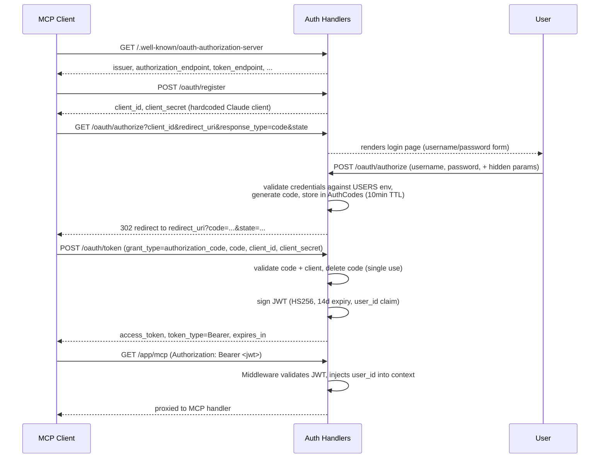

# Auth (OAuth 2.1) - Complete Specification

## Overview

OAuth 2.1 Authorization Server that protects the MCP endpoint (`/app/mcp`) and the `/web/*` routes. The server acts as its own provider: it implements the Authorization Code flow, issues JWT access tokens, and supports dynamic client registration. No third-party identity provider is involved.

## Best Practices Applied

- **Self-issued Provider**: this server is both the authorization server and the resource server — no external IdP
- **Env-configured Users**: valid username/password pairs come from the `USERS` env var (`ID:USERNAME:PASSWORD;...`), not a database table
- **In-memory Authorization Codes**: codes live in a process-local map (`AuthCodes`) with a 10-minute expiry, not persisted
- **Dynamic Client Registration**: `/oauth/register` always returns the single hardcoded Claude client's credentials — it satisfies clients that require the registration step without maintaining a real client store
- **JWT Access Tokens**: HS256-signed, 14-day expiry, carry `user_id` as a custom claim; `gateways.WithUserID` injects it into request context for downstream handlers
- **Toggleable via env**: `main.go` skips mounting all OAuth routes and the auth middleware entirely when `AUTH_DISABLED` is set (used for local/dev)

## Go Code Structure

### Domain Models

```go
package auth

import (
    "time"
    "github.com/golang-jwt/jwt/v5"
)

// Claims are the custom JWT claims issued after a successful token exchange
type Claims struct {
    UserID int64 `json:"user_id"`
    jwt.RegisteredClaims
}

// Client represents a registered OAuth client (hardcoded, no persistence)
type Client struct {
    ID     string `json:"id"`
    Secret string `json:"secret"`
}

// User represents a login credential, loaded from the USERS env var
type User struct {
    ID       int64  `json:"id"`
    UserName string `json:"username"`
    Password string `json:"password"`
}

// AuthorizationCode is a short-lived code exchanged for a JWT, stored in-memory
type AuthorizationCode struct {
    Code        string    `json:"code"`
    ClientID    string    `json:"client_id"`
    UserID      string    `json:"user_id"`
    RedirectURI string    `json:"redirect_uri"`
    State       string    `json:"state"`
    ExpiresAt   time.Time `json:"expires_at"`
}
```

There is no repository/DB layer for auth — users and clients are held in package-level variables (`users`, `clients`), authorization codes in the `AuthCodes` map.

### Sequence Diagram: Authorization Code Flow



## HTTP Handlers

### WellKnownHandler
`GET /.well-known/oauth-authorization-server` (and the `*path` / `oauth-protected-resource` variants) — returns OAuth server metadata (endpoints, supported grant/response types, PKCE methods).

### RegisterClientHandler
`POST /oauth/register` — dynamic client registration; always returns the single hardcoded Claude client's ID/secret regardless of request body.

### AuthorizeHandler
`GET/POST /oauth/authorize` — GET renders the login page; POST validates client_id and username/password against the `USERS` env var, generates a short-lived authorization code, and redirects to `redirect_uri?code=...`.

### LoginPageHandler
Renders the plain HTML login form used by `AuthorizeHandler` (GET).

### TokenHandler
`POST /oauth/token` — exchanges a valid, unexpired, single-use authorization code (+ matching client_id/secret) for a signed JWT access token.

### Middleware
Applied to the `/app` route group (and skippable via `AUTH_DISABLED`). Validates the `Authorization: Bearer <jwt>` header, returns `401` with a `WWW-Authenticate` challenge header on missing/invalid/expired tokens, otherwise injects `user_id` into the request context via `gateways.WithUserID`.

## Configuration

- **USERS**: `ID:USERNAME:PASSWORD;ID:USERNAME:PASSWORD` — required unless `AUTH_DISABLED` is set
- **JWT_SECRET**: HS256 signing secret — required unless `AUTH_DISABLED` is set
- **BASE_URL**: public base URL used to build issuer/endpoint URLs in OAuth metadata and JWT `iss` claim
- **AUTH_DISABLED**: when set (any value), `main.go` skips mounting OAuth routes and the auth middleware entirely
- **Token Expiry**: 14 days
- **Authorization Code Expiry**: 10 minutes, single-use
