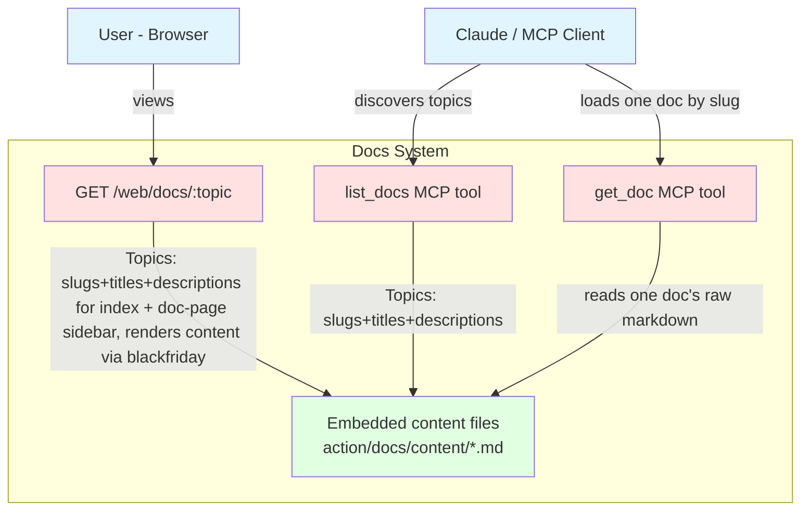

# Docs - Complete Specification

## Overview

New subdomain (`action/docs`) that serves a small set of hand-written, human-owned convention documents — not user data, not CRUD content — to two audiences: a read-only web page (for the user) and an MCP tool (for the agent, to pull in on demand, mid-session, when it needs more than the always-loaded `instructions` const in `transport/mcp/mcp.go` gives it). Docs are plain files, not database rows.

This spec is the mechanism only. Content lives as files under `action/docs/content/` (see that directory), written directly in their final location rather than inlined here, so Stage 2 has nothing left to do but wire them up once approved. Scope for this round is the activities subject only, split into two documents by kind rather than one document per subdomain:

- `action/docs/content/activity-mechanics.md` — what exists and how it's built: `action/progress` (activity, progress point, step, life part) and `action/achievements` (grouped here rather than in its own doc since an achievement is a target layered on top of an activity/exercise/transaction, not a fourth data model of its own). Normative against the code — fact-checked field-by-field and tool-by-tool against `action/progress`/`action/achievements` on 23-09-26, no discrepancies found. Source of truth is always the code; this doc is updated when they drift.
- `action/docs/content/activity-rituals.md` — the operating manual: when, why, and what a ritual (day/week/month/quarter) actually does, object lifecycles (inbox → someday → spike → activity), WIP limits, degradation rules, and the agent's contract (what it does unprompted, what it proposes, what it never does). This is the part a mechanical description of the schema can't give — process and judgment calls, not data shape.

`finance-workflow.md`, `workout-workflow.md`, and `nutrition-workflow.md` were drafted in an earlier pass of this spec and then deleted — mechanically listing tool/field mechanics per subdomain wasn't the actual ask; the activities rewrite above (mechanics + rituals, researched separately) is. Extending this same two-document pattern to other subjects (finance, workout, nutrition) is future scope, not part of this round — when/if that happens, it's just more files under `action/docs/content/`, discovered automatically, not a new mechanism.

`CLAUDE_LIFECOACH_INSTRUCTIONS.md` (repo root) is the unreferenced, stale precursor to the activities content — to be deleted once this spec + content are approved, not before. `CLAUDE_WORKOUT_INSTRUCTIONS.md` and `CLAUDE_NUTRITION_INSTRUCTIONS.md` have no replacement yet (out of scope this round) and stay untouched.

**`instructions` moves to an embedded file, and stays short**: `transport/mcp/mcp.go`'s `instructions` const becomes `//go:embed instructions.md` + `var instructions string` (`transport/mcp/instructions.md`) instead of a Go string literal — same reasoning as embedding the docs content itself: markdown as a file diffs and edits cleanly, a Go string literal doesn't. Content is rewritten as a dispatcher, not patched (see the dedicated section near the end of this doc) — it must not grow to carry per-domain detail; that detail lives in `action/docs/content/` instead, pulled in only when needed.

## Architecture Diagrams

### Entity Relation Diagram

No database entities — this subdomain has no table. Content lives entirely in `go:embed`-ed files, versioned in git.

### C4 Context Diagram



## Database Schema

### SQL DDL

None — no table for this subdomain.

## Go Code Structure

### Domain Models

```go
// Topic describes one discovered doc: its slug (content filename minus
// ".md"), title (the file's first "# " heading), and one-line description
// (the first blockquote line following the heading).
type Topic struct {
    Slug        string
    Title       string
    Description string
}

// Topics returns the current topic list, derived from the embedded content
// directory — not a fixed set. Called by list_docs and by the
// GET /web/docs index handler; both read the same list, never a hardcoded one.
func Topics() ([]Topic, error) { ... }

// ListDocsInput takes nothing — the tool always returns the full
// current topic list.
type ListDocsInput struct{}

type ListDocsOutput struct {
    Topics []Topic `json:"topics" jsonschema:"Available docs: slug, title, and one-line description each"`
}

// GetDocInput selects which document to return. Topic is a plain
// string (not a fixed enum type) since the valid set is discovered, not
// known at compile time — validated against the live Topics() list inside
// the handler, same pattern this codebase already uses for pseudo-enum
// string fields like progress_type/status. The agent is expected to have
// called list_docs first to get a valid slug.
type GetDocInput struct {
    Topic string `json:"topic" jsonschema:"Doc slug to load, from list_docs"`
}

type GetDocOutput struct {
    Content string `json:"content" jsonschema:"Full markdown text of the requested doc"`
}
```

### Repository Interface

None — no database access from this subdomain.

## MCP Tools

### list_docs

No input. Returns the current list of available docs (slug, title, one-line description), read live from `action/docs/content/`. The discovery half of the list-then-load pair — call this first to find the right slug.

### get_doc

Takes a `topic` slug (from `list_docs`). Returns the full markdown text of the matching document verbatim, for the agent to load on demand — not automatically, only when the current task's conventions are genuinely unclear from the always-loaded `instructions` const alone. Unknown `topic` is a tool error.

## HTTP Handlers

### GET /web/docs

Index page listing the available docs (title + one-line description each, from `docs.Topics()`), linking to each doc's page.

### GET /web/docs/{topic}

Renders one document as an HTML page under the shared `webui` layout/nav (new "Docs" nav entry), markdown rendered to HTML via `blackfriday` — read-only, no forms, no query params. A sidebar next to the doc lists every doc from `docs.Topics()` (title, linking to `/web/docs/{slug}`), current one highlighted via `aria-current="page"`. 404 for an unknown topic.

## E2E Tests

In `tests/docs_test.go`:

- `TestListDocs_*`: discovers embedded content
- `TestGetDoc`: known topic returns raw markdown; unknown topic; empty topic; path traversal rejected
- `TestDocsWeb`: index lists docs with links; doc page renders markdown to HTML; unknown topic is 404

## `transport/mcp` Instructions Update

Not part of `action/docs` itself, but bundled into this round since it's the file that makes the two new tools discoverable — and since it turned out to need more than a correctness pass. Two changes to `transport/mcp/`:

1. **`mcp.go`**: replace `const instructions = \`...\`` with:
   ```go
   //go:embed instructions.md
   var instructions string
   ```
   (needs `"embed"` added to imports). Everything else in `Server(...)` (the `mcp.ServerOptions{..., Instructions: instructions}` wiring) stays as-is.
2. **`transport/mcp/instructions.md`** — rewritten from scratch (not patched) at its final location, same as the `action/docs/content/` files. The old const was a per-subdomain procedure manual (food/workout step-by-step scripts, exact reply wording, metaphor tables) mixed with claims that no longer matched the code (`finish_activity`, wrong check-in ordering, duplicate section numbering) — that shape doesn't fit a file loaded into every session. Rewritten as a dispatcher: one short section per subdomain (food, workout, progress/activities/achievements, finance, telegram) naming its tools and the first call for the common case, plus a short cross-cutting-rules section (never state a fact without having called the tool this session; delete tools are hard/irreversible, confirm first; free-text fields carry the user's own words) that used to be scattered/implicit or activities-only. The progress/activities/achievements section is now intentionally thin — it points to `list_docs`/`get_doc` instead of repeating `activity-mechanics.md`/`activity-rituals.md`. Food, workout, and finance don't have that fallback yet, so trimming their sections to dispatcher-level is a real, accepted loss of detail until they get their own docs — tracked as `docs/backlog.md`, "25-09-26 — Mechanics/rituals docs for food, workout, finance". See the file directly for exact content.

## Changelog

- **03-10-26** — migrated to the new spec template: removed Best Practices Applied and the sequence diagrams together with every reference to them; E2E Tests rewritten as a list of the current tests; added Changelog (Architecture Diagrams, E2E Tests, Changelog)
- **26-09-26** — goals references renamed to achievements (Overview, `transport/mcp` Instructions Update)
- **26-09-26** — added sidebar navigation between docs on `/web/docs` pages (Architecture Diagrams, HTTP Handlers, E2E Tests)
- **25-09-26** — initial version: embedded convention docs served on the web and via `list_docs` / `get_doc`
