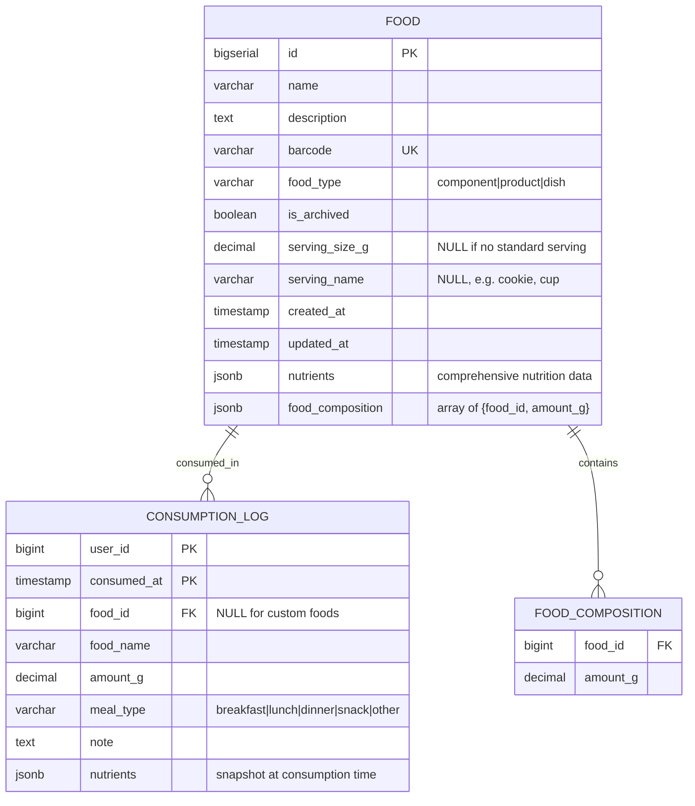
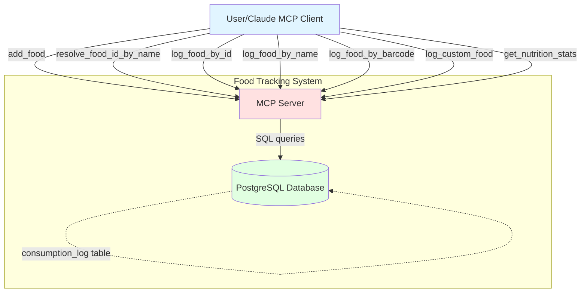
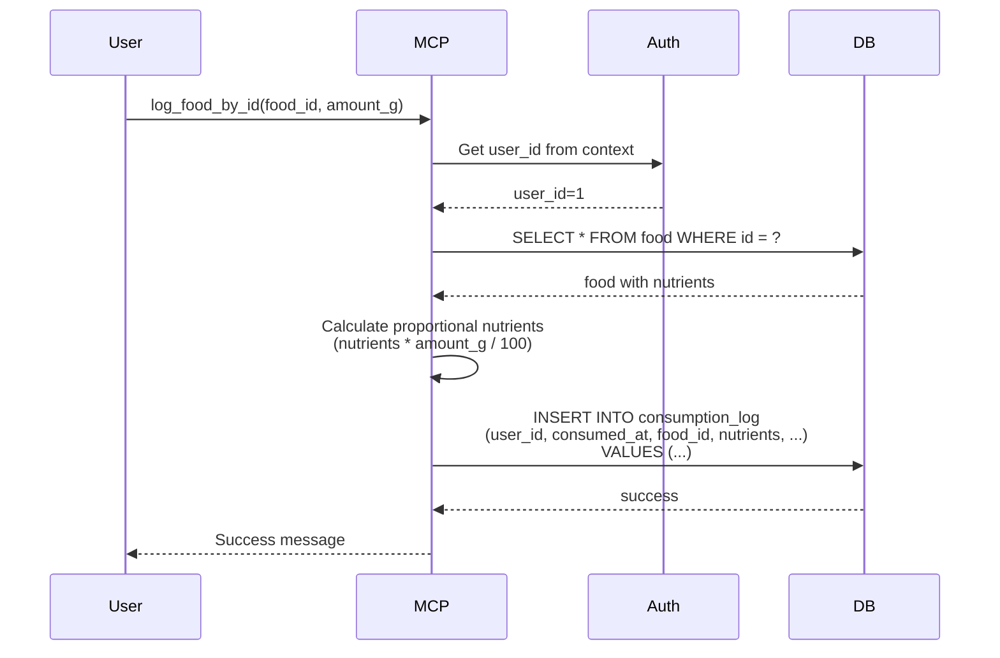
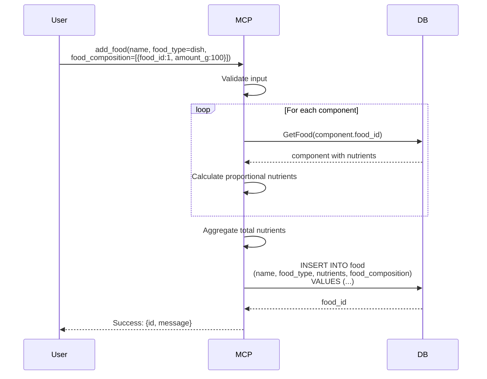
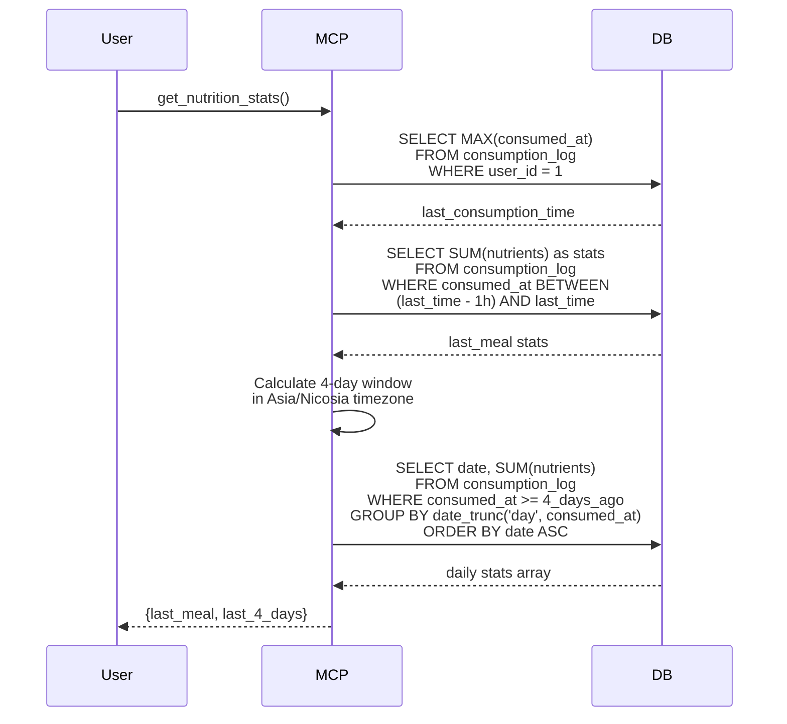

# Food Tracking System - Complete Specification

## Overview

System for tracking food consumption, nutritional intake, and meal history with MCP (Model Context Protocol) interface. Supports comprehensive nutrient tracking, recipe composition, and flexible food logging with multiple search strategies.

## Best Practices Applied

- **Multi-user Support**: All tables have user_id for data isolation (DEFAULT_USER_ID = 1)
- **Comprehensive Nutrition Data**: Detailed nutrients stored as JSONB (macros, vitamins, minerals, amino acids)
- **Flexible Food Types**: Support for components, products, and dishes (recipes)
- **Recipe Composition**: Dishes can be composed of other foods with automatic nutrient calculation
- **Multiple Search Strategies**: Search by ID, name, barcode, or log custom foods directly
- **Denormalized Reads**: Calculate last_consumed_at via JOIN instead of storing redundantly
- **Nullable Fields**: All nutritional values are nullable for incomplete data
- **User Context**: user_id extracted from authentication context (JWT/session), not passed explicitly
- **UTC Timezone**: All timestamps in UTC, timezone conversions in action layer

## Architecture Diagrams

### Entity Relation Diagram



### C4 Context Diagram



### Sequence Diagram: Log Food



### Sequence Diagram: Add Food with Recipe



### Sequence Diagram: Get Nutrition Stats



## Database Schema

### SQL DDL

```sql
-- Foods table
CREATE TABLE IF NOT EXISTS food (
    id BIGSERIAL PRIMARY KEY,
    name VARCHAR(255) NOT NULL,
    description TEXT,
    barcode VARCHAR(50) UNIQUE,
    food_type VARCHAR(20) NOT NULL, -- 'component', 'product', 'dish'
    is_archived BOOLEAN DEFAULT FALSE,
    serving_size_g DECIMAL(8,2), -- Nullable, standard serving size
    serving_name VARCHAR(20), -- Nullable, e.g., "cookie", "cup"
    created_at TIMESTAMP DEFAULT CURRENT_TIMESTAMP,
    updated_at TIMESTAMP DEFAULT CURRENT_TIMESTAMP,

    nutrients JSONB, -- Comprehensive nutrition data
    food_composition JSONB, -- Array of {food_id, amount_g} for recipes

    CONSTRAINT check_serving_positive CHECK (serving_size_g > 0 OR serving_size_g IS NULL)
);

CREATE INDEX idx_food_name ON food(name);
CREATE INDEX idx_food_barcode ON food(barcode) WHERE barcode IS NOT NULL;

-- Consumption log table
CREATE TABLE IF NOT EXISTS consumption_log (
    user_id BIGINT NOT NULL,
    consumed_at TIMESTAMP NOT NULL,
    food_id BIGINT, -- Nullable for custom foods
    food_name VARCHAR(255) NOT NULL,
    amount_g DECIMAL(8,2) NOT NULL CHECK (amount_g > 0),
    meal_type VARCHAR(20), -- 'breakfast', 'lunch', 'dinner', 'snack', 'other'
    note TEXT,

    nutrients JSONB, -- Snapshot of nutrients at consumption time

    PRIMARY KEY (user_id, consumed_at),
    FOREIGN KEY (food_id) REFERENCES food(id)
);

CREATE INDEX idx_consumption_log_user_consumed ON consumption_log(user_id, consumed_at DESC);
CREATE INDEX idx_consumption_log_food_id ON consumption_log(food_id);
```

## Go Code Structure

### Domain Models

```go
package food

import "time"

// EquipmentType represents the type of food
type FoodType string

const (
    FoodTypeComponent FoodType = "component" // Base ingredient
    FoodTypeProduct   FoodType = "product"   // Packaged product
    FoodTypeDish      FoodType = "dish"      // Recipe/prepared dish
)

// Food represents a trackable food item
type Food struct {
    ID              int64              `json:"id" db:"id"`
    Name            string             `json:"name" db:"name"`
    Description     *string            `json:"description,omitempty" db:"description"`
    Barcode         *string            `json:"barcode,omitempty" db:"barcode"`
    FoodType        FoodType           `json:"food_type" db:"food_type"`
    IsArchived      bool               `json:"is_archived" db:"is_archived"`
    ServingSizeG    *float64           `json:"serving_size_g,omitempty" db:"serving_size_g"`
    ServingName     *string            `json:"serving_name,omitempty" db:"serving_name"`
    CreatedAt       time.Time          `json:"created_at" db:"created_at"`
    UpdatedAt       time.Time          `json:"updated_at" db:"updated_at"`
    Nutrients       *Nutrients         `json:"nutrients,omitempty" db:"nutrients"`
    FoodComposition FoodComponentList  `json:"food_composition,omitempty" db:"food_composition"`
    LastConsumedAt  *time.Time         `json:"last_consumed_at,omitempty"` // Computed from logs
}

// Nutrients contains comprehensive nutritional information (per 100g)
type Nutrients struct {
    // Macronutrients (per 100g)
    Calories        *float64 `json:"calories,omitempty"`
    ProteinG        *float64 `json:"protein_g,omitempty"`
    TotalFatG       *float64 `json:"total_fat_g,omitempty"`
    CarbohydratesG  *float64 `json:"carbohydrates_g,omitempty"`
    DietaryFiberG   *float64 `json:"dietary_fiber_g,omitempty"`
    TotalSugarsG    *float64 `json:"total_sugars_g,omitempty"`
    AddedSugarsG    *float64 `json:"added_sugars_g,omitempty"`
    WaterG          *float64 `json:"water_g,omitempty"`

    // Fat breakdown (grams)
    SaturatedFatsG       *float64 `json:"saturated_fats_g,omitempty"`
    MonounsaturatedFatsG *float64 `json:"monounsaturated_fats_g,omitempty"`
    PolyunsaturatedFatsG *float64 `json:"polyunsaturated_fats_g,omitempty"`
    TransFatsG           *float64 `json:"trans_fats_g,omitempty"`

    // Omega fatty acids (milligrams)
    Omega3Mg                 *float64 `json:"omega_3_mg,omitempty"`
    Omega6Mg                 *float64 `json:"omega_6_mg,omitempty"`
    Omega9Mg                 *float64 `json:"omega_9_mg,omitempty"`
    AlphaLinolenicAcidMg     *float64 `json:"alpha_linolenic_acid_mg,omitempty"`
    LinoleicAcidMg           *float64 `json:"linoleic_acid_mg,omitempty"`
    EicosapentaenoicAcidMg   *float64 `json:"eicosapentaenoic_acid_mg,omitempty"`
    DocosahexaenoicAcidMg    *float64 `json:"docosahexaenoic_acid_mg,omitempty"`

    // Cholesterol (milligrams)
    CholesterolMg *float64 `json:"cholesterol_mg,omitempty"`

    // Vitamins
    VitaminAMcg   *float64 `json:"vitamin_a_mcg,omitempty"`
    VitaminCMg    *float64 `json:"vitamin_c_mg,omitempty"`
    VitaminDMcg   *float64 `json:"vitamin_d_mcg,omitempty"`
    VitaminEMg    *float64 `json:"vitamin_e_mg,omitempty"`
    VitaminKMcg   *float64 `json:"vitamin_k_mcg,omitempty"`
    VitaminB1Mg   *float64 `json:"vitamin_b1_mg,omitempty"`
    VitaminB2Mg   *float64 `json:"vitamin_b2_mg,omitempty"`
    VitaminB3Mg   *float64 `json:"vitamin_b3_mg,omitempty"`
    VitaminB5Mg   *float64 `json:"vitamin_b5_mg,omitempty"`
    VitaminB6Mg   *float64 `json:"vitamin_b6_mg,omitempty"`
    VitaminB7Mcg  *float64 `json:"vitamin_b7_mcg,omitempty"`
    VitaminB9Mcg  *float64 `json:"vitamin_b9_mcg,omitempty"`
    VitaminB12Mcg *float64 `json:"vitamin_b12_mcg,omitempty"`
    FolateDfeMcg  *float64 `json:"folate_dfe_mcg,omitempty"`
    CholineMg     *float64 `json:"choline_mg,omitempty"`

    // Minerals (milligrams)
    CalciumMg    *float64 `json:"calcium_mg,omitempty"`
    IronMg       *float64 `json:"iron_mg,omitempty"`
    MagnesiumMg  *float64 `json:"magnesium_mg,omitempty"`
    PhosphorusMg *float64 `json:"phosphorus_mg,omitempty"`
    PotassiumMg  *float64 `json:"potassium_mg,omitempty"`
    SodiumMg     *float64 `json:"sodium_mg,omitempty"`
    ZincMg       *float64 `json:"zinc_mg,omitempty"`
    CopperMg     *float64 `json:"copper_mg,omitempty"`
    ManganeseMg  *float64 `json:"manganese_mg,omitempty"`
    SeleniumMcg  *float64 `json:"selenium_mcg,omitempty"`
    IodineMcg    *float64 `json:"iodine_mcg,omitempty"`

    // Amino acids (milligrams)
    LysineMg        *float64 `json:"lysine_mg,omitempty"`
    MethionineMg    *float64 `json:"methionine_mg,omitempty"`
    CysteineMg      *float64 `json:"cysteine_mg,omitempty"`
    PhenylalanineMg *float64 `json:"phenylalanine_mg,omitempty"`
    TyrosineMg      *float64 `json:"tyrosine_mg,omitempty"`
    ThreonineMg     *float64 `json:"threonine_mg,omitempty"`
    TryptophanMg    *float64 `json:"tryptophan_mg,omitempty"`
    ValineMg        *float64 `json:"valine_mg,omitempty"`
    HistidineMg     *float64 `json:"histidine_mg,omitempty"`
    LeucineMg       *float64 `json:"leucine_mg,omitempty"`
    IsoleucineMg    *float64 `json:"isoleucine_mg,omitempty"`

    // Special substances
    CaffeineMg    *float64 `json:"caffeine_mg,omitempty"`
    EthylAlcoholG *float64 `json:"ethyl_alcohol_g,omitempty"`

    // Additional fields
    GlycemicIndex *int     `json:"glycemic_index,omitempty"`
    GlycemicLoad  *float64 `json:"glycemic_load,omitempty"`
}

// FoodComponent represents a component in a recipe
type FoodComponent struct {
    FoodID  int64   `json:"food_id"`
    AmountG float64 `json:"amount_g"`
}

// FoodComponentList implements driver.Valuer and sql.Scanner for JSONB
type FoodComponentList []FoodComponent

// ConsumptionLog represents a food consumption record
type ConsumptionLog struct {
    UserID     int64      `json:"user_id" db:"user_id"`
    ConsumedAt time.Time  `json:"consumed_at" db:"consumed_at"`
    FoodID     *int64     `json:"food_id,omitempty" db:"food_id"` // NULL for custom
    FoodName   string     `json:"food_name" db:"food_name"`
    AmountG    float64    `json:"amount_g" db:"amount_g"`
    MealType   *string    `json:"meal_type,omitempty" db:"meal_type"`
    Note       *string    `json:"note,omitempty" db:"note"`
    Nutrients  *Nutrients `json:"nutrients,omitempty" db:"nutrients"`
}

// NutritionStats represents aggregated nutrition data for a time period
type NutritionStats struct {
    PeriodStart   time.Time `json:"period_start"`
    PeriodEnd     time.Time `json:"period_end"`
    TotalCalories float64   `json:"total_calories"`
    TotalProtein  float64   `json:"total_protein"`
    TotalFat      float64   `json:"total_fat"`
    TotalCarbs    float64   `json:"total_carbs"`
    TotalWeight   float64   `json:"total_weight"`
}

// AggregationType defines how to aggregate nutrition stats
type AggregationType string

const (
    AggregationTypeTotal AggregationType = "total"  // Sum all records
    AggregationTypeByDay AggregationType = "by_day" // GROUP BY day
)

// NutritionStatsFilter defines query parameters for nutrition stats
type NutritionStatsFilter struct {
    UserID      int64           `db:"user_id"`
    From        time.Time       `db:"from"`
    To          time.Time       `db:"to"`
    Aggregation AggregationType `db:"-"`
}
```

### Repository Interface

```go
type DB interface {
    // Food management
    AddFood(ctx context.Context, food *domain.Food) (int64, error)
    GetFood(ctx context.Context, id int64) (*domain.Food, error)
    SearchFood(ctx context.Context, filter domain.FoodFilter) ([]*domain.Food, error)

    // Consumption logging
    AddConsumptionLog(ctx context.Context, log *domain.ConsumptionLog) error
    GetConsumptionLog(ctx context.Context, userID int64, consumedAt time.Time) (*domain.ConsumptionLog, error)
    GetConsumptionLogsByUser(ctx context.Context, userID int64) ([]*domain.ConsumptionLog, error)
    DeleteConsumptionLog(ctx context.Context, userID int64, consumedAt time.Time) error

    // Nutrition stats
    GetLastConsumptionTime(ctx context.Context, userID int64) (*time.Time, error)
    GetNutritionStats(ctx context.Context, filter domain.NutritionStatsFilter) ([]domain.NutritionStats, error)
}

type FoodFilter struct {
    IDs     []int64  `json:"ids,omitempty"`
    Name    *string  `json:"name,omitempty"`
    Barcode *string  `json:"barcode,omitempty"`
}
```

## MCP Tools

### add_food
Creates a new food item with optional nutrient data or recipe composition. Validates input, checks duplicates by name and barcode. If food_composition provided: fetches components and calculates aggregated nutrients. If nutrients provided: uses as-is.

### resolve_food_id_by_name
Searches for foods by 1-5 name variants, returns ranked results. Searches database for each variant, counts matches per food, sorts by match_count DESC then by ID, returns deduplicated list.

### log_food_by_id
Logs food consumption by known food ID. Validates food_id > 0, amount_g > 0 OR serving_count > 0. Fetches food, calculates final amount (if amount_g == 0, uses serving_count × serving_size_g), calculates proportional nutrients: (base_nutrients × amount_g) / 100.

### log_food_by_name
Searches by name and logs consumption. If exactly 1 match: proceeds like log_food_by_id. If multiple matches: returns error with first 2 suggestions. If no matches: returns "food not found" error.

### log_food_by_barcode
Finds food by barcode and logs consumption. Searches by barcode, if found proceeds like log_food_by_id, if not found returns "barcode not found" error.

### log_custom_food
Logs food with direct nutrient specification (no database food). Validates required fields, saves with food_id = NULL, uses provided nutrients as-is (already for consumed amount).

### get_nutrition_stats
Returns nutrition statistics for last meal and last 4 days. Loads timezone (Asia/Nicosia for user display), gets last consumption time. **Last meal**: gets stats for 1 hour before last consumption (inclusive) using AggregationTypeTotal. **Last 4 days**: calculates 4-day window in user timezone using AggregationTypeByDay, returns only days with data (0-4 elements). Repository works in UTC only.

## Configuration

- **Default User ID**: 1 (DEFAULT_USER_ID constant)
- **Stats Timezone**: Asia/Nicosia (for day boundaries)
- **Database Timezone**: UTC (all timestamps stored in UTC)
- **Food Types**: component, product, dish
- **Meal Types**: breakfast, lunch, dinner, snack, other
