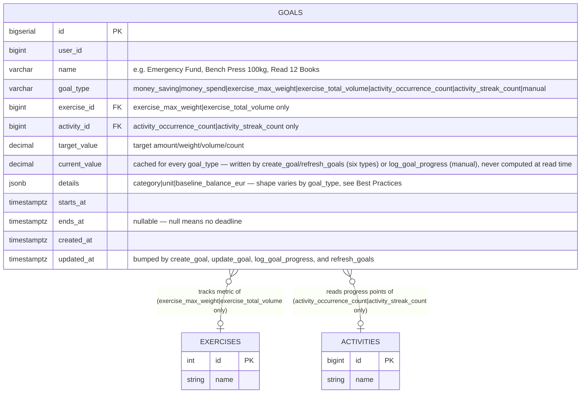
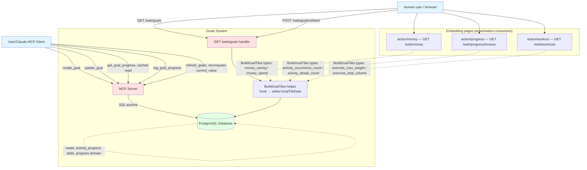
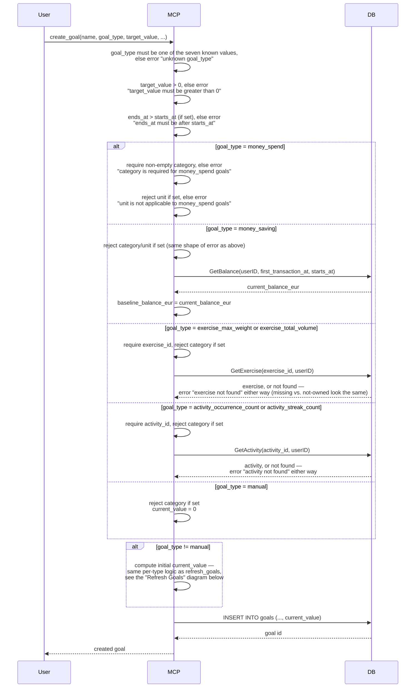
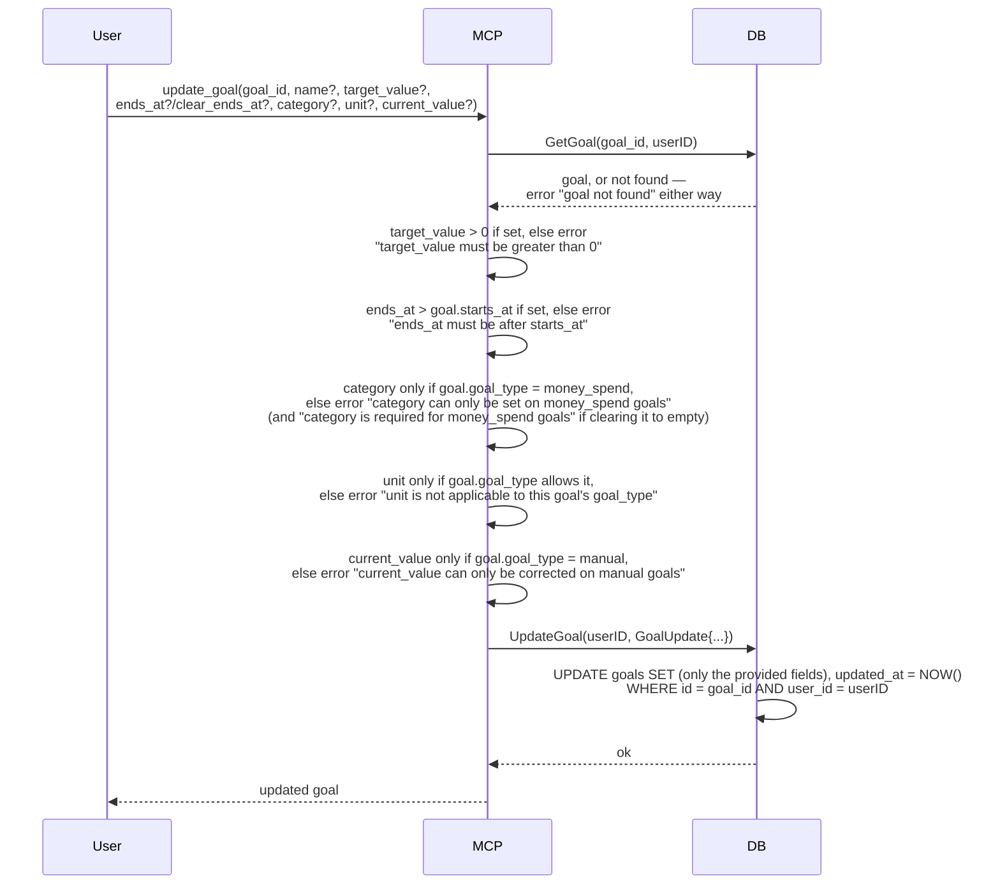
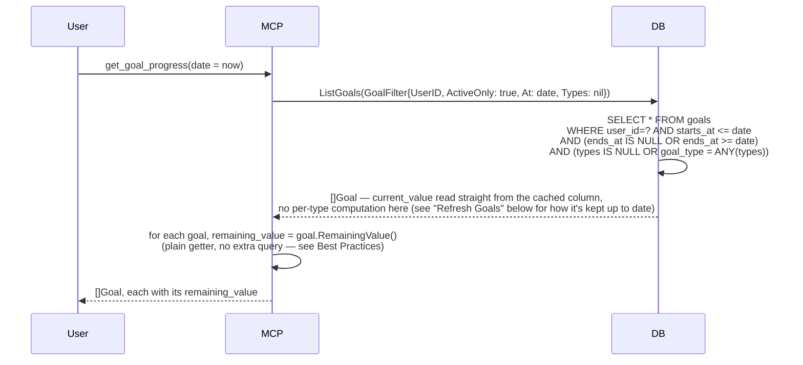
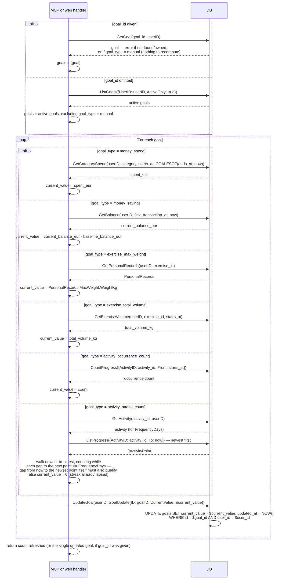
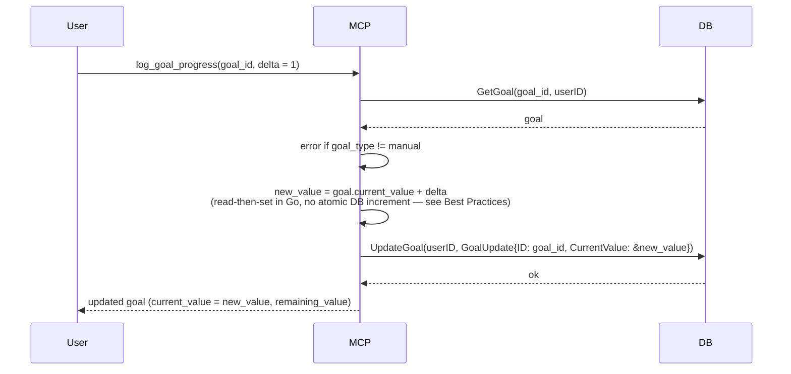
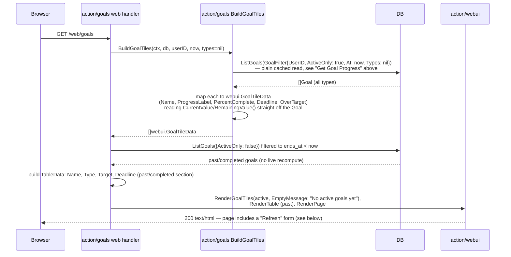
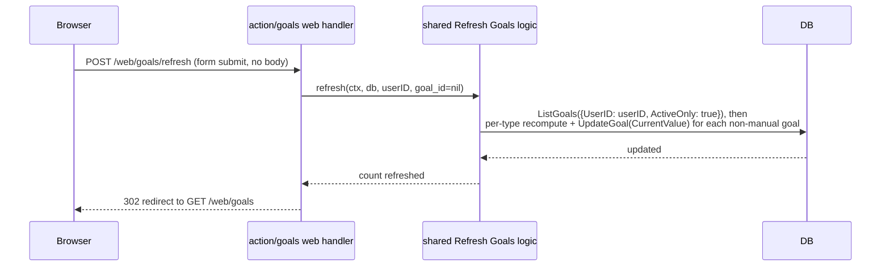
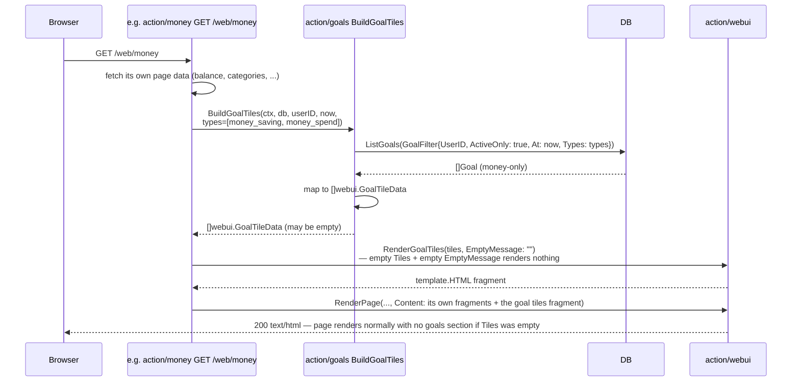

# Goals - Complete Specification

## Overview

Cross-domain system for tracking personal goals with MCP (Model Context Protocol) interface and a read-mostly web dashboard (one write route: a "Refresh" action, see HTTP Handlers). A goal is exactly one of seven types, each with its own required fields and its own way of computing current progress — there is no shared "money"/"exercise"/"activity" grouping, every type sits at the same level:

- **`money_saving`** — reach X in accumulated balance ("save X, optionally by a date")
- **`money_spend`** — don't spend more than X on a category (the old `Budget`, renamed)
- **`exercise_max_weight`** — reach X kg all-time max on a specific `workout` exercise (see `workout-spec.md`) — e.g. "bench press 100kg"
- **`exercise_total_volume`** — lift X kg total (weight × reps, summed) on a specific exercise since the goal was created — e.g. "lift 5000kg total this quarter"
- **`activity_occurrence_count`** — reach X occurrences of a `progress` activity since the goal was created (see `progress-spec.md`) — e.g. "meditate 30 times"
- **`activity_streak_count`** — reach a streak of X consecutive check-ins on a `progress` activity, where consecutive means the gap between two check-ins is within the activity's own `frequency_days` — e.g. "30-day meditation streak"
- **`manual`** — reach X of a standalone running tally the goal owns itself, for anything not already tracked elsewhere — e.g. "read 12 books this year"

All seven share the same shape (name, target value, optional deadline) and live in one `goals` table, distinguished by a single `goal_type` column, with a shared `current_value` column holding every goal's most-recently-known progress. `manual` writes it directly (`log_goal_progress`'s increment) — it owns no other data to derive from, so it's always exact. The other six (`money_saving`, `money_spend`, `exercise_max_weight`, `exercise_total_volume`, `activity_occurrence_count`, `activity_streak_count`) derive their value from data that already exists elsewhere, but that derivation is **cached, not live**: it runs once at `create_goal` (an initial snapshot) and again only when explicitly asked for via the `refresh_goals` MCP tool or the Goals page's "Refresh" button — reads (`get_goal_progress`, the web dashboard, embedded tile grids) always return whatever was last cached, never recompute on the spot. A goal's progress can be stale between refreshes; that's the deliberate trade for reads that don't fan out into every other subdomain's tables on every page load.

On the web, a goal always renders as the same **tile** (name, progress bar, label, optional deadline — see `webui-spec.md`'s `GoalTileData`/`RenderGoalTiles`), in one of two places: the dedicated `GET /web/goals` page shows every goal as a grid, and each of Money (`GET /web/money`), Progress browse (`GET /web/progress/browse`), and Workouts (`GET /web/workouts`) embeds the same tile grid filtered down to its own domain's goal types — `money_saving`/`money_spend` on Money, `activity_occurrence_count`/`activity_streak_count` on Progress browse, `exercise_max_weight`/`exercise_total_volume` on Workouts. `manual` goals have no domain page to embed into, so they only ever appear on the dedicated Goals page.

## Best Practices Applied

- **Multi-user Support**: `goals` has `user_id` for data isolation
- **One flat discriminator, no nested sub-types, ever**: `goals.goal_type` is one of seven values, all siblings. Two earlier drafts introduced a second-level discriminator — first `metric_source` nesting `exercise`/`activity` under a shared `count` type, then `exercise_metric` nesting `max_weight`/`total_volume` under a shared `exercise` type — both times because two things that differ in calculation the same way one goal type already differs from another (`money_saving` vs. `money_spend`) got treated as sub-cases instead of siblings. The rule going forward: if two variants need different required fields or a different progress calculation, they're different `goal_type` values, full stop — no exceptions carved out for "this one's basically the same type"
- **`money_spend` is `Budget` renamed, not redesigned**: `category` + `target_value` cap, matched the same way (`category` prefix match against transactions). `category` is required (non-empty) for this type only
- **`money_saving` snapshots the starting balance**: `baseline_balance_eur` is captured once at creation time (`GetBalance` as of `starts_at`) and never recomputed — progress is "how much have I saved *since setting this goal*," not "what's my total balance relative to the target." Required (non-null) for this type only
- **`exercise_max_weight` reads an all-time max, not a delta since creation**: via `workout`'s existing `GetPersonalRecords(userID, exercise_id).MaxWeight` — a PR-chasing goal is an absolute achievement bar, so a goal is already met if the user hit that weight before creating it, no baseline needed
- **`exercise_total_volume` sums `weight_kg × reps` since `starts_at`**: a new goal-scoped query (`GetExerciseVolume`) — unlike max weight, "lift 5000kg total this quarter" is inherently a since-creation tally, so it can't reuse `GetPersonalRecords`
- **Both exercise types require `exercise_id`, nothing else exercise-specific**: no metric field to also set — the type itself *is* the metric, so `create_goal` only needs to know which exercise, not which exercise plus which of two modes
- **`activity_occurrence_count` goals count occurrences since goal creation**: current value is `CountProgress({ActivityID: activity_id, From: starts_at})` (existing `progress` repository method, see `progress-spec.md`) — one progress point logged for that activity = one occurrence. This assumes the activity already exists (e.g. a `habit_progress` "Meditation" activity) — creating one is out of scope for `create_goal`, it's `progress`'s `create_activity`. `activity_id` is required for this type only. Named specifically (not just `activity`) so future `progress`-linked mechanics — the same way `money`/`exercise` each have two mechanics — can become their own sibling `goal_type` values instead of overloading this one. `activity_streak_count` (below) is the first such sibling. This computation runs at `create_goal` and `refresh_goals` only — see the caching bullet below
- **`activity_streak_count` counts consecutive check-ins, evaluated as of whenever it was last computed**: fetch the activity's `frequency_days` (`GetActivity`, existing `progress` method) and its points via `ListProgress({ActivityID: activity_id, To: at})` ordered newest-first (existing `progress` method, no new query needed), then walk from the most recent point backward, counting while each gap to the next-older point is `<= frequency_days`. If the *first* gap — from `at` back to the most recent point itself — already exceeds `frequency_days`, the streak has already lapsed and `current_value = 0` even though history exists; this matches ordinary streak semantics (a missed check-in resets it), not an all-time best. `activity_id` is required for this type, same as `activity_occurrence_count`. `at` is `now` at whichever moment `create_goal` or `refresh_goals` ran it — see the caching bullet below for why this is no longer literally "as of now" on every read
- **`manual` is a plain counter on the goal row, not an append-only log**: `current_value` lives directly on `goals` and `log_goal_progress` does a single increment. An earlier draft added a `goal_progress_entries` table mirroring `activity_progress`'s append-only shape (one row per log call, with note/timestamp) for history and per-entry notes — dropped as unnecessary weight for what this type actually needs: a running total, not an audit trail. The trade-off is real (no history of *when* progress happened, no per-increment notes) and accepted deliberately, not overlooked
- **`current_value` is its own `DECIMAL` column, not packed into `details`**: an earlier draft packed it into the JSONB column alongside `category`/`unit`/`baseline_balance_eur` as "just another sparse per-type scalar." Reconsidered for two reasons: it's the scalar with the most write paths (`log_goal_progress`, `update_goal` for `manual`, and now `create_goal`/`refresh_goals` for the other six), and — since the caching change below — it's no longer even type-scoped, every goal has one. A plain `UPDATE ... SET current_value = ...` is simpler and cheaper than `jsonb_set` regardless; `category`/`unit`/`baseline_balance_eur` stay in `details` since they're genuinely write-once-at-creation and type-scoped, the sparse case JSONB actually fits
- **`current_value` is cached, refreshed on demand — not recomputed on every read**: an earlier draft had `get_goal_progress` (and every page/tile render built on it) run each of the per-type calculations above live, on every call. Reconsidered: `exercise_total_volume`'s sum, `activity_streak_count`'s full point-history walk, and a `money_saving`/`money_spend` balance/spend query all cost real work, and the dedicated Goals page plus three embedded tile grids (Money/Progress-browse/Workouts) could each trigger that work on every load — for numbers that mostly don't change between one page view and the next. Now that computation only runs at `create_goal` (initial snapshot) and `refresh_goals` (on demand, see below); every read — `get_goal_progress`, `ListGoals`, `BuildGoalTiles` — is a plain `SELECT` against the cached `current_value` column. `manual` is unaffected either way, since it was always a plain column, never computed
- **No `GoalProgress` type, no `GetGoalProgress` method — everything comes from `Goal`**: an earlier draft wrapped `Goal` in a `GoalProgress{ Goal; CurrentValue; RemainingValue }` struct returned by its own `GetGoalProgress(userID, at, types)` repository method. Once `current_value` became a plain cached field on `Goal` itself (see the bullets above), that wrapper stopped adding anything — `CurrentValue` was a straight duplicate of `Goal.CurrentValue`, and `RemainingValue` is a one-line subtraction, not a query result. Reconsidered: `ListGoals(GoalFilter{ActiveOnly, At, Types})` (extended with the two fields `GetGoalProgress` used to own) is the one read path for a set of goals, full stop, and `Goal.RemainingValue()` is a plain getter method called on whatever a caller already has — no second type, no second method, no round-trip a getter can't replace
- **`refresh_goals` shares its computation with `create_goal`'s initial snapshot, not a second copy**: both call the same internal per-type logic (see the "Refresh Goals" sequence diagram) — `create_goal` runs it once right after validating a new goal (so it doesn't sit at a stale/zero value until the first refresh; a backdated `exercise_max_weight` goal can even start out already met), `refresh_goals` runs it again later, for one goal (`goal_id` provided) or every active goal owned by the user (`goal_id` omitted). `manual` goals are skipped by `refresh_goals` — there's nothing to derive, `current_value` is already authoritative
- **Cross-domain reads go straight through the existing shared repository, no new abstraction**: per `docs/architecture.md` there is a single repository interface for the whole app, so `action/goals` calls `GetBalance`/`GetPersonalRecords`/`CountProgress` the same way `action/money`/`action/workout`/`action/progress` already do internally — no adapter interfaces, no duplicated queries. Where no existing method fits (`money_spend`'s category-prefix sum, `exercise_total_volume`'s volume sum), Goals defines its own scoped query against that domain's tables, the same way the old `Budget`/`BudgetProgress` query worked directly against `transactions`. These calls now happen only from `create_goal`/`refresh_goals`, never from a read path (see the caching bullet above)
- **Real foreign keys across subdomains, deliberately**: `goals.exercise_id`/`activity_id` are true `REFERENCES exercises(id)`/`REFERENCES activities(id)` — a departure from `money`'s "flat schema, no FK overhead" convention (see `money-spec.md`), justified here because a goal pointing at a deleted exercise/activity is a real data-integrity bug, not just a display nuisance
- **`ends_at` is nullable for every type — null means no deadline, just tracked progress**: a goal can be open-ended ("save X, whenever") or dated ("save X by December")
- **`unit` is a display-only label, for `exercise_max_weight`/`exercise_total_volume`/`activity_occurrence_count`/`activity_streak_count`/`manual` only**: free text (e.g. `"kg"`, `"sessions"`, `"books"`) shown next to the value, never used in any calculation — enforced null for `money_saving`/`money_spend` by CHECK
- **A goal's progress window is `[starts_at, ends_at or the moment it was last computed]`**: for `money_spend` and `exercise_total_volume`, spend/volume-so-far sums activity in that window; for `money_saving`, `exercise_max_weight`, `activity_occurrence_count`, and `activity_streak_count`, the calculation evaluates as of whenever `create_goal`/`refresh_goals` last ran it, regardless of `ends_at` — there's no "window to close" for a point-in-time read (balance, all-time max) or an already-since-creation-bounded count. `manual`'s `current_value` has no window at all — it's just whatever it currently is. `ends_at` only gates whether a goal still shows as *active* for a given `get_goal_progress(date)` call — it has never gated *when* the value itself was computed
- **`get_goal_progress`'s `date` param filters which goals are active, not which instant their values reflect**: since `current_value` is a cached column now, `date` only feeds the `starts_at <= date AND (ends_at IS NULL OR ends_at >= date)` active-window check — it does not make the read compute progress "as of" that date. Progress is always whatever was last cached, no matter what `date` is passed
- **Web dashboard is read-mostly, one page, two sections, plus one Refresh action**: active goals as a **tile grid** with progress bars (`webui.RenderGoalTiles`, see `webui-spec.md`) and past/completed goals (`ends_at` before now) as a plain **table** below — final target/deadline only, no progress bar, since the window already closed and there's nothing to show progress toward. A table reads better than tiles for a historical list that's just going to grow. Creating goals, editing goals, and logging manual progress stay MCP-only (`create_goal`, `update_goal`, `log_goal_progress`); the one exception is a "Refresh" button (`POST /web/goals/refresh`, see HTTP Handlers) — the web equivalent of the `refresh_goals` MCP tool, since asking someone to open a chat just to refresh a number they're already looking at defeats the point of a dashboard
- **The same tile grid is embedded on three other pages, not re-derived**: Money, Progress browse, and Workouts each render a `webui.RenderGoalTiles` grid pre-filtered to their own domain's `goal_type`s (see Overview) — `GoalFilter.Types` (nil/empty = all, used by the dedicated Goals page and the `get_goal_progress` MCP tool) so each embedding page only ever queries its own goals via `ListGoals`, not the whole table
- **`action/goals` exports the tile-building step too, not just the data read**: `BuildGoalTiles(ctx, db, userID, at, types)` calls `ListGoals` and maps each `Goal` to a `webui.GoalTileData` (the same per-`goal_type` progress-label/percent formatting the dedicated page uses, reading `CurrentValue` and `RemainingValue()` straight off it) in one place — Money/Progress-browse/Workouts call this directly and pass the result straight to `webui.RenderGoalTiles`, instead of each subdomain re-implementing "how do I turn a `money_spend` goal into a percent and a label." This is the "cross-domain reads go straight through the shared repository" principle (above) extended one level up the stack: cross-domain *rendering* reuse, not just reads
- **An embedded tile grid disappears when its domain has no goals of its own; the dedicated page never does**: `BuildGoalTiles` returning zero tiles means Money/Progress-browse/Workouts render nothing for that section (`GoalTilesData.EmptyMessage` left unset — see `webui-spec.md`) rather than an empty grid with a message, since a page with no financial goals shouldn't dedicate screen space to saying so. `GET /web/goals` always sets `EmptyMessage` ("No active goals yet") because on that page, goals *are* the content — an empty state there is itself informative
- **Type-specific scalars are packed into one `details JSONB` column, not several nullable columns**: `category`, `unit`, and `baseline_balance_eur` are each populated for at most one or two of the seven `goal_type`s, written once at `create_goal` and never again, and are never filtered/indexed on `goals` itself (each is read once per goal, not searched across goals) — exactly the sparse, write-once-case JSONB fits, instead of several near-always-null columns each with its own CHECK. `exercise_id`/`activity_id` deliberately stay out of `details` and remain real columns — see the FK bullet above, unaffected by this. `current_value` used to be here too — see the bullet above for why it moved out
- **`details`'s per-type CHECKs use key-existence, not `IS NOT NULL`**: e.g. `check_spend_category` becomes `details ? 'category'` instead of `category IS NOT NULL` — same enforcement, just phrased for a JSONB column. `current_value` needs no such CHECK at all any more — now that every `goal_type` populates it, it's simply `NOT NULL` at the column level (see SQL DDL); the old `check_manual_counter` (type-scoped) is gone
- **`domain.Goal` keeps typed fields — JSON packing is a storage-layer-only detail**: the repository mapper (`mapper_goal.go`, per `docs/architecture.md`) is the only place that marshals `Category`/`Unit`/`BaselineBalanceEUR` into/out of the `details` column; `action/goals` and the MCP tool handlers never see raw JSON, only the same typed `Goal` struct as before this column existed. `CurrentValue` needs no such marshaling — it's a plain, always-populated `db:"current_value"` field like `TargetValue`
- **Exactly two write methods on the repository, ever: `CreateGoal` and `UpdateGoal`**: no `IncrementGoalCurrentValue`, no `SetGoalCurrentValue` — every write to an existing goal, no matter the caller or the reason, goes through the same generic `UpdateGoal(userID, domain.GoalUpdate)`. `log_goal_progress`'s "+delta" and `refresh_goals`' recompute both *compute an absolute new value themselves* (reading the current one first, or deriving it from another subdomain) and hand it to `UpdateGoal` as `GoalUpdate.CurrentValue`, the same field the `update_goal` MCP tool sets for a manual correction. This trades a theoretically-atomic `current_value = current_value + $delta` in SQL for a read-then-set in Go — a real, accepted race window (two concurrent `log_goal_progress` calls on the same goal could clobber each other) that doesn't matter for a single-user personal tool, in exchange for one write method instead of three
- **`updated_at` is bumped by every write path that touches a goal row**: `create_goal`, `update_goal`, `log_goal_progress`, and `refresh_goals` all end up setting it to `NOW()` — mechanically the first is `CreateGoal` and the other three are all `UpdateGoal` (see the bullet above) — so one column answers "when was this goal (or its cached progress) last touched" regardless of which of the four callers wrote it. `refresh_goals` skipping a `manual` goal (nothing to recompute) means it doesn't call `UpdateGoal` for that goal at all, so its `updated_at` doesn't move either — the column only moves when something actually changed
- **`update_goal` (the MCP tool) exposes corrections, not structure, and not the other six types' cached value**: `name`/`target_value`/`ends_at`(+`clear_ends_at`)/`category`/`unit` are user-settable for every applicable type (same partial-update convention as `money-spec.md`'s `edit_transactions` — nil means unchanged); `current_value` is user-settable *only* when the goal is `manual`. `goal_type`, `exercise_id`, `activity_id`, and `baseline_balance_eur` are never user-editable — the first three would change what the goal fundamentally *is*, and `baseline_balance_eur` is a deliberate one-time snapshot whose whole point is staying fixed. This restriction lives in the `update_goal` MCP tool handler, not in `domain.GoalUpdate` or `DB.UpdateGoal` themselves (see the bullet above — those stay generic so `refresh_goals`/`log_goal_progress` can reuse them): a user hand-editing one of the other six types' `current_value` would just get clobbered by the next `refresh_goals` anyway, and a mismatch between the cache and reality is a signal to refresh, not to paper over with a manual edit
- **Validation happens in the MCP tool handler, before any write — DB CHECKs are a backstop, never the error a caller is meant to see**: every rule that has a matching CHECK constraint (`target_value > 0`, `ends_at > starts_at`, `category` required/forbidden per `goal_type`, `unit` forbidden on `money_saving`/`money_spend`, `exercise_id`/`activity_id` required/forbidden per `goal_type`) is checked in Go, by `create_goal` and `update_goal`, *before* the `INSERT`/`UpdateGoal` call, and fails with a specific, human-readable message naming the actual problem (e.g. "category is required for money_spend goals," "target_value must be greater than 0," "unit is not applicable to money_saving goals") — never a raw Postgres constraint-violation message like `check_target_value` or `check_spend_category`. `exercise_id`/`activity_id` get an extra ownership/existence check (`GetExercise`/`GetActivity`) with its own clear error ("exercise not found") rather than surfacing as a foreign-key violation. The table's CHECK constraints stay in the schema regardless — they're a second line of defense against a future bug or a write that bypasses `action/goals` entirely, not the intended way a caller learns their input was invalid. `goal_type` itself is validated as one of the seven known values before anything else runs

## Architecture Diagrams

### Entity Relation Diagram



### C4 Context Diagram



### Sequence Diagram: Create Goal



### Sequence Diagram: Update Goal



### Sequence Diagram: Get Goal Progress



### Sequence Diagram: Refresh Goals

The only place the six derived types' `current_value` gets (re)computed — shared by `create_goal`'s initial snapshot (see above) and the `refresh_goals` MCP tool / `POST /web/goals/refresh` (see below):



### Sequence Diagram: Log Manual Goal Progress



### Sequence Diagram: Web Goals Page



### Sequence Diagram: Web Goals Refresh



### Sequence Diagram: Embedded Goal Tiles



Progress browse (`GET /web/progress/browse`) and Workouts (`GET /web/workouts`) follow the identical shape, just with `types=[activity_occurrence_count, activity_streak_count]` and `types=[exercise_max_weight, exercise_total_volume]` respectively.

## Database Schema

### SQL DDL

```sql
CREATE TABLE IF NOT EXISTS goals (
    id                    BIGSERIAL PRIMARY KEY,
    user_id               BIGINT NOT NULL,
    name                  VARCHAR(255) NOT NULL,
    goal_type             VARCHAR(25) NOT NULL,            -- 'money_saving', 'money_spend', 'exercise_max_weight', 'exercise_total_volume', 'activity_occurrence_count', 'activity_streak_count', 'manual'
    exercise_id           BIGINT REFERENCES exercises(id), -- exercise_max_weight|exercise_total_volume only
    activity_id           BIGINT REFERENCES activities(id), -- activity_occurrence_count|activity_streak_count only
    target_value          DECIMAL(12,2) NOT NULL,
    current_value         DECIMAL(12,2) NOT NULL DEFAULT 0, -- cached for every goal_type — see Best Practices for who writes it and when
    details               JSONB NOT NULL DEFAULT '{}',     -- remaining type-specific scalars, shape varies by goal_type — see Best Practices:
                                                            --   money_spend: {"category": "food/cafe"}
                                                            --   money_saving: {"baseline_balance_eur": 1234.56}
                                                            --   exercise_max_weight / exercise_total_volume: {"unit"?: "kg"}
                                                            --   activity_occurrence_count / activity_streak_count: {"unit"?: "sessions"}
                                                            --   manual: {"unit"?: "books"}
    starts_at             TIMESTAMPTZ NOT NULL,
    ends_at               TIMESTAMPTZ,                     -- nullable — null means no deadline
    created_at            TIMESTAMPTZ NOT NULL DEFAULT NOW(),
    updated_at            TIMESTAMPTZ NOT NULL DEFAULT NOW(), -- bumped by create_goal (insert) and every UpdateGoal call (update_goal, log_goal_progress, refresh_goals)

    CONSTRAINT check_goal_type CHECK (goal_type IN (
        'money_saving', 'money_spend', 'exercise_max_weight', 'exercise_total_volume',
        'activity_occurrence_count', 'activity_streak_count', 'manual'
    )),
    CONSTRAINT check_spend_category CHECK (
        (goal_type = 'money_spend' AND details ? 'category' AND details->>'category' <> '')
        OR (goal_type <> 'money_spend' AND NOT (details ? 'category'))
    ),
    CONSTRAINT check_saving_baseline CHECK (
        (goal_type = 'money_saving' AND details ? 'baseline_balance_eur')
        OR (goal_type <> 'money_saving' AND NOT (details ? 'baseline_balance_eur'))
    ),
    CONSTRAINT check_exercise_link CHECK (
        (goal_type IN ('exercise_max_weight', 'exercise_total_volume') AND exercise_id IS NOT NULL)
        OR (goal_type NOT IN ('exercise_max_weight', 'exercise_total_volume') AND exercise_id IS NULL)
    ),
    CONSTRAINT check_activity_link CHECK (
        (goal_type IN ('activity_occurrence_count', 'activity_streak_count') AND activity_id IS NOT NULL)
        OR (goal_type NOT IN ('activity_occurrence_count', 'activity_streak_count') AND activity_id IS NULL)
    ),
    CONSTRAINT check_unit_scope CHECK (
        NOT (details ? 'unit') OR goal_type IN (
            'exercise_max_weight', 'exercise_total_volume', 'activity_occurrence_count', 'activity_streak_count', 'manual'
        )
    ),
    CONSTRAINT check_target_value CHECK (target_value > 0),
    CONSTRAINT check_goal_period CHECK (ends_at IS NULL OR ends_at > starts_at)
);

CREATE INDEX idx_goals_user_period ON goals(user_id, starts_at, ends_at);
CREATE INDEX idx_goals_user_type   ON goals(user_id, goal_type);
```

`UpdateGoal` is the only write path for an existing goal, for every caller — the `update_goal` MCP tool, `refresh_goals`' recompute, and `log_goal_progress`'s increment all build a `domain.GoalUpdate` and go through it (see Best Practices: no separate increment/set methods). It's a dynamic partial `UPDATE` over whichever `GoalUpdate` fields are non-nil, always an absolute `SET`, never a `current_value = current_value + $delta` — `log_goal_progress` computes the new absolute value in Go first (`GetGoal` then add `delta`), the same as `refresh_goals` computes its new absolute value from other subdomains' data first:

```sql
UPDATE goals
SET name = COALESCE($name, name),
    target_value = COALESCE($target_value, target_value),
    current_value = COALESCE($current_value, current_value),
    category = ...,     -- only touched when Category is set on the GoalUpdate (see Best Practices for details vs. real columns)
    unit = ...,
    ends_at = CASE WHEN $clear_ends_at THEN NULL WHEN $ends_at IS NOT NULL THEN $ends_at ELSE ends_at END,
    updated_at = NOW()
WHERE id = $goal_id AND user_id = $user_id;
```

## Go Code Structure

### Domain Models

```go
package goals

import "time"

// GoalType is the kind of goal being tracked — seven flat, sibling values,
// each with its own required fields and progress calculation (see Best
// Practices). There is no shared "money"/"exercise"/"activity" grouping —
// a goal type is never nested inside another via a second discriminator field.
type GoalType string

const (
    GoalTypeMoneySaving             GoalType = "money_saving"             // reach TargetValue in accumulated balance
    GoalTypeMoneySpend              GoalType = "money_spend"              // don't exceed TargetValue spent on Category
    GoalTypeExerciseMaxWeight       GoalType = "exercise_max_weight"      // reach TargetValue kg all-time max for ExerciseID
    GoalTypeExerciseTotalVolume     GoalType = "exercise_total_volume"    // reach TargetValue kg total volume for ExerciseID since StartsAt
    GoalTypeActivityOccurrenceCount GoalType = "activity_occurrence_count" // reach TargetValue occurrences of ActivityID since StartsAt
    GoalTypeActivityStreakCount     GoalType = "activity_streak_count"    // reach TargetValue consecutive check-ins of ActivityID, evaluated as of now
    GoalTypeManual                  GoalType = "manual"                   // reach TargetValue; CurrentValue incremented directly via log_goal_progress
)

// Goal represents any of the seven goal types — see Best Practices for
// which fields apply to which GoalType. Category/Unit/BaselineBalanceEUR are
// stored packed into the goals.details JSONB column, not their own columns —
// mapper_goal.go marshals/unmarshals them, so this struct's shape is
// unaffected by that storage choice. CurrentValue is a real, always-populated
// column (not packed, not nullable) — cached, not computed live, see Best
// Practices for who writes it (create_goal/refresh_goals for six types,
// log_goal_progress for manual) and why reads never recompute it.
type Goal struct {
    ID                 int64      `json:"id" db:"id"`
    UserID             int64      `json:"user_id" db:"user_id"`
    Name               string     `json:"name" db:"name"`
    GoalType           GoalType   `json:"goal_type" db:"goal_type"`
    ExerciseID         *int64     `json:"exercise_id,omitempty" db:"exercise_id"`   // exercise_max_weight|exercise_total_volume only
    ActivityID         *int64     `json:"activity_id,omitempty" db:"activity_id"`   // activity_occurrence_count|activity_streak_count only
    TargetValue        float64    `json:"target_value" db:"target_value"`
    CurrentValue       float64    `json:"current_value" db:"current_value"` // cached — see Best Practices, not omitempty since every goal_type populates it
    Category           *string    `json:"category,omitempty"`             // money_spend only — packed into details
    Unit               *string    `json:"unit,omitempty"`                 // exercise_max_weight|exercise_total_volume|activity_occurrence_count|activity_streak_count|manual only — packed into details
    BaselineBalanceEUR *float64   `json:"baseline_balance_eur,omitempty"` // money_saving only — packed into details
    StartsAt           time.Time  `json:"starts_at" db:"starts_at"`
    EndsAt             *time.Time `json:"ends_at,omitempty" db:"ends_at"` // nil means no deadline
    CreatedAt          time.Time  `json:"created_at" db:"created_at"`
    UpdatedAt          time.Time  `json:"updated_at" db:"updated_at"` // bumped by create_goal, update_goal, log_goal_progress, refresh_goals
}

// goalDetails is the JSON shape stored in goals.details — assembled from
// and unpacked back into Goal's typed fields by mapper_goal.go only.
// Never referenced outside that mapper; action/goals works with Goal directly.
// CurrentValue is deliberately not in here — see Best Practices.
type goalDetails struct {
    Category           *string  `json:"category,omitempty"`
    Unit               *string  `json:"unit,omitempty"`
    BaselineBalanceEUR *float64 `json:"baseline_balance_eur,omitempty"`
}

// GoalUpdate is a partial edit of an existing goal — every field but ID is
// optional; nil/false means "leave unchanged" (same convention as
// money-spec.md's TransactionUpdate). It's the payload for DB.UpdateGoal,
// the repository's only write method besides CreateGoal — three different
// callers build one: the update_goal MCP tool (user-facing correction —
// Name/TargetValue/EndsAt/ClearEndsAt/Category/Unit, or CurrentValue but
// only for manual goals), refresh_goals (CurrentValue only, for the other
// six types' recomputed snapshot), and log_goal_progress (CurrentValue
// only, set to current+delta computed in Go — see Best Practices for why
// there's no separate atomic-increment method). Structural/one-time fields
// — GoalType, ExerciseID, ActivityID, BaselineBalanceEUR — aren't on this
// struct at all; they're never editable, see Best Practices.
type GoalUpdate struct {
    ID           int64      `json:"id"`
    Name         *string    `json:"name,omitempty"`
    TargetValue  *float64   `json:"target_value,omitempty"`
    EndsAt       *time.Time `json:"ends_at,omitempty"`       // set a new deadline
    ClearEndsAt  bool       `json:"clear_ends_at,omitempty"` // explicitly remove the deadline; ignored if EndsAt is also set
    Category     *string    `json:"category,omitempty"`      // money_spend only — DB CHECK rejects it otherwise
    Unit         *string    `json:"unit,omitempty"`          // exercise_max_weight|exercise_total_volume|activity_occurrence_count|activity_streak_count|manual only — DB CHECK rejects it otherwise
    CurrentValue *float64   `json:"current_value,omitempty"` // no DB-level type restriction (see Best Practices) — which goal_type may set it is a rule each caller enforces itself
}

// RemainingValue is a plain getter, not a stored/duplicated field — every
// caller that used to read a GoalProgress.RemainingValue (an earlier draft
// had that as its own struct wrapping Goal) now just calls this on the Goal
// it already has. No repository round-trip, no separate type.
func (g Goal) RemainingValue() float64 {
    return g.TargetValue - g.CurrentValue // negative means over/exceeded
}

// GoalFilter defines query parameters for listing goals — the one read path
// for more than one goal at a time (see Best Practices: there is no
// separate GetGoalProgress, ListGoals covers it with these two extra fields).
type GoalFilter struct {
    UserID     int64
    ActiveOnly bool        // starts_at <= At AND (ends_at IS NULL OR ends_at >= At)
    At         time.Time   // moment ActiveOnly's window is evaluated against; zero value means now
    Types      []GoalType  // nil/empty = every type; non-empty scopes to a subset (e.g. Money's embedded tile grid)
}
```

### Repository Interface

```go
type DB interface {
    // Write
    CreateGoal(ctx context.Context, g *domain.Goal) (int64, error)

    // UpdateGoal is the only way to write to an existing goal — the entire
    // repository has exactly two write methods, this and CreateGoal (see
    // Best Practices). A dynamic partial update over whichever
    // domain.GoalUpdate fields are non-nil/true (goalID is GoalUpdate.ID,
    // not a separate parameter), bumping updated_at. Always an absolute
    // SET, never a delta — a caller that needs "+delta" semantics (only
    // log_goal_progress does) reads the current value first and computes
    // the new absolute value itself; atomicity of that read-then-set isn't
    // a concern for a single-user personal tool (see Best Practices). This
    // method does no business validation of its own — every caller (the
    // update_goal MCP tool, refresh_goals, log_goal_progress) validates
    // and builds a well-formed GoalUpdate before calling it, per the
    // "validate in the tool, not the DB" bullet in Best Practices. The
    // table's own CHECK constraints (per-goal_type field applicability,
    // target_value > 0, ends_at > starts_at) still apply underneath and
    // will reject a malformed write, but that is a backstop against a bug,
    // never the caller's expected/only source of a validation error.
    // CurrentValue has no per-type CHECK at all (every goal_type populates
    // it now — see Best Practices) — it's each caller's own job (the
    // update_goal MCP tool for manual corrections, refresh_goals for the
    // other six, log_goal_progress for manual's increment) to only set it
    // when appropriate for that goal's type.
    UpdateGoal(ctx context.Context, userID int64, update domain.GoalUpdate) error

    // Read
    GetGoal(ctx context.Context, goalID int64, userID int64) (*domain.Goal, error)

    // ListGoals is the one query method for more than one goal — no
    // separate GetGoalProgress (see Best Practices). ActiveOnly+At covers
    // what a "progress as of a date" read needs (starts_at <= At AND
    // (ends_at IS NULL OR ends_at >= At)), Types scopes to a subset of
    // GoalType. A plain read of already-cached current_value columns, no
    // per-goal_type computation — that only happens in create_goal/
    // refresh_goals (see Best Practices). Callers get remaining_value by
    // calling Goal.RemainingValue() on each result, not from this method.
    ListGoals(ctx context.Context, filter domain.GoalFilter) ([]domain.Goal, error)

    // GetCategorySpend sums transactions.amount_eur where category starts
    // with the given prefix, within [from, to] — powers money_spend goals.
    // Same query the old Budget/BudgetProgress used, now goal-scoped.
    GetCategorySpend(ctx context.Context, userID int64, category string, from, to time.Time) (float64, error)

    // GetExerciseVolume sums sets.weight_kg * sets.reps for an exercise
    // since a given time — powers exercise_total_volume goals.
    GetExerciseVolume(ctx context.Context, userID int64, exerciseID int64, since time.Time) (float64, error)

    // Cross-domain reads used directly inside create_goal's initial
    // snapshot and refresh_goals' recompute, not redefined here — see
    // money-spec.md's GetBalance, workout-spec.md's GetPersonalRecords, and
    // progress-spec.md's CountProgress/GetActivity/ListProgress (the latter
    // two power activity_streak_count's walk — see Best Practices, no new
    // progress-domain method needed). All live on the same shared
    // repository (docs/architecture.md), so action/goals calls them the
    // same way their own actions do. Never called from ListGoals —
    // see the caching bullet in Best Practices.
}
```

## MCP Tools

### create_goal
Creates a new goal. Required: `name`, `goal_type` (one of the seven values — errors with an unknown-type message if it isn't), `target_value` (errors "target_value must be greater than 0" if not). Type-specific requirements, each with its own clear error if missing/misapplied: `money_spend` requires non-empty `category` ("category is required for money_spend goals") and rejects `unit`; `money_saving` auto-captures `baseline_balance_eur` via `GetBalance` as of `starts_at` (not caller-supplied) and also rejects `category`/`unit`; `exercise_max_weight`/`exercise_total_volume` require `exercise_id`, checked for existence/ownership via `GetExercise` ("exercise not found") and reject `category`; `activity_occurrence_count`/`activity_streak_count` require `activity_id`, checked via `GetActivity` ("activity not found") and reject `category`; `manual` initializes `current_value` to 0 and rejects `category`. `exercise_max_weight`/`exercise_total_volume`/`activity_occurrence_count`/`activity_streak_count`/`manual` accept an optional `unit` display label; the other two reject it ("unit is not applicable to money_saving/money_spend goals"). `ends_at` is optional for every type (omit for no deadline); when provided, errors "ends_at must be after starts_at" if it isn't. All of this validates in Go before any DB write — see Best Practices. For the six non-`manual` types, also computes and stores an initial `current_value` snapshot (same logic as `refresh_goals`, see Best Practices) so the goal isn't stuck at zero until the first refresh — a backdated goal can even start out already met.

### update_goal
Edits mutable fields of an existing goal by ID: `name`, `target_value`, `ends_at` (or `clear_ends_at` to remove the deadline), and, when they apply to the goal's own `goal_type`, `category` (money_spend only) and `unit`. `current_value` is only editable this way for `manual` goals — a direct correction (e.g. "actually I've read 15 books not 12"), distinct from `log_goal_progress`'s delta-based `+1`. For the other six types, `current_value` is cached/derived and not editable via `update_goal` at all — use `refresh_goals` to bring it up to date instead (see Best Practices). All fields optional except `goal_id`; only provided fields change. `goal_type`, `exercise_id`, `activity_id`, and `baseline_balance_eur` are not editable at all. Validates the same rules as `create_goal`, with the same specific error messages, for whichever fields are provided — "goal not found" if `goal_id` doesn't exist or isn't owned by the user, "target_value must be greater than 0", "ends_at must be after starts_at", "category can only be set on money_spend goals" (and the reverse — required, not just settable, when the goal is money_spend), "unit is not applicable to `<goal_type>` goals", "current_value can only be corrected on manual goals" — never a raw DB constraint error (see Best Practices). Bumps `updated_at`.

### refresh_goals
Recomputes and persists `current_value` for the six derived goal types (`money_saving`/`money_spend`/`exercise_max_weight`/`exercise_total_volume`/`activity_occurrence_count`/`activity_streak_count`) — the same per-`goal_type` calculation `create_goal` uses for its initial snapshot, run again on demand instead of automatically (see Best Practices for why this is opt-in, not live). Optional `goal_id`: omitted refreshes every active goal owned by the user; provided refreshes just that one goal — errors "goal not found" if it doesn't exist or isn't owned, or "manual goals have no derived progress to refresh; use log_goal_progress or update_goal instead" if it's `manual`. Returns the count of goals refreshed, or the single updated goal when `goal_id` is given. Bumps `updated_at` on every goal it actually recomputes.

### get_goal_progress
Returns all goals active as of a given date (defaults to now, i.e. `starts_at <= date` and `ends_at` null or `>= date`), each with `remaining_value` from `Goal.RemainingValue()` — a plain getter over the cached `current_value` column, no per-`goal_type` computation (see Best Practices; call `refresh_goals` first if the numbers might be stale). Always calls `ListGoals` with `Types: nil` (every type) — the MCP tool has no type filter of its own; that's a web-only need (see HTTP Handlers).

### log_goal_progress
Increments a `goal_type = manual` goal's `current_value` by `delta` (defaults to 1), returning the new value. Errors "goal not found" if `goal_id` doesn't exist or isn't owned by the user, or "log_goal_progress only applies to manual goals" if the goal is one of the other six types.

## HTTP Handlers

### GET /web/goals
**Auth**: `WebMiddleware` session cookie (see `auth-spec.md`), same as every other `/web/*` dashboard

Read-mostly, single page, built on the shared `action/webui` design system (see `webui-spec.md`):
- A **"Refresh" button** at the top of the page — a plain `<form method="POST" action="/web/goals/refresh">` with one submit button, rendered locally by `action/goals`' own page template (not a shared `webui` component, same convention as `money-spec.md`'s export checkbox form) — see `POST /web/goals/refresh` below
- **Active goals** tile grid via `BuildGoalTiles(ctx, db, userID, now, types=nil)` + `webui.RenderGoalTiles` — every goal type, each tile showing name, progress bar, label (e.g. `"€420 / €1,000 (42%)"`, `"82kg / 100kg"`, `"3200kg / 5000kg"`, `"12 / 30 sessions"`, `"14 / 30 day streak"`), and deadline when set. Values come straight from the cached `current_value` column (see Best Practices) — this page load never recomputes anything itself, only "Refresh" does. `EmptyMessage` is always set ("No active goals yet")
- **Past/completed goals** table below (goals with `ends_at < now`): Name, Type, Target, Deadline — no recompute, since the window already closed
- No add/edit form otherwise — creating and editing goals, and logging manual progress, stay MCP-only (`create_goal`, `update_goal`, `log_goal_progress`)

### POST /web/goals/refresh
**Auth**: same `WebMiddleware` session cookie

The one write route among the `/web/*` dashboards — every other one (Money, Progress browse, Workouts) is strictly read-only/GET-only, see `money-spec.md`/`workout-spec.md` — the web equivalent of the `refresh_goals` MCP tool with no `goal_id` (refreshes every active goal owned by the user; see the "Refresh Goals" and "Web Goals Refresh" sequence diagrams above). Takes no body/params — the "Refresh" button on `/web/goals` is the only caller. On success, redirects (`302`) back to `GET /web/goals`, so the page reloads showing the freshly recomputed values.

### Embedded goal tiles on Money, Progress browse, and Workouts
Each of `GET /web/money`, `GET /web/progress/browse`, and `GET /web/workouts` (see `money-spec.md`, `progress-spec.md`, `workout-spec.md`) calls `BuildGoalTiles` with its own domain's `types` and embeds the resulting `webui.RenderGoalTiles` fragment on its existing page — no new route. `EmptyMessage` is left unset on all three, so a domain with no goals of its own renders no goals section at all rather than an empty grid (see Best Practices).

### `goals.BuildGoalTiles(ctx context.Context, db DB, userID int64, at time.Time, types []domain.GoalType) ([]webui.GoalTileData, error)`
Not a route — an exported Go function, the single place that turns a `Goal` into a `webui.GoalTileData`: calls `ListGoals(GoalFilter{UserID: userID, ActiveOnly: true, At: at, Types: types})` (a plain cached read, see Best Practices), then for each goal formats `ProgressLabel`/`PercentComplete` per `goal_type` from its already-computed `CurrentValue`/`RemainingValue()` — pure display formatting, no further computation or DB calls — sets `Deadline` from `EndsAt` (empty if nil), and sets `OverTarget` when `CurrentValue > TargetValue` for `money_spend` only (the one type where exceeding is a bad thing). Called by `GET /web/goals` (with `types=nil`) and by the Money/Progress-browse/Workouts handlers (each with their own `types` subset) — see the "Embedded Goal Tiles" sequence diagram above.

## Configuration

- **Log Goal Progress Default Delta**: 1 (one call = one occurrence, for `log_goal_progress` when `delta` is omitted)
- **Money Goal Progress**: transfers excluded from `money_spend` spent calculation (same as `get_balance`)
- **Exercise Goal Volume**: only sets with both `weight_kg` and `reps` set count toward `exercise_total_volume` (same restriction `get_personal_records` already applies)
- **Activity Streak Lookback**: `activity_streak_count` fetches progress points via `ListProgress` with no `Limit` cap — a personal-tool activity's total history is small enough that walking the full set is cheap; revisit only if a single activity's point count grows unusually large
