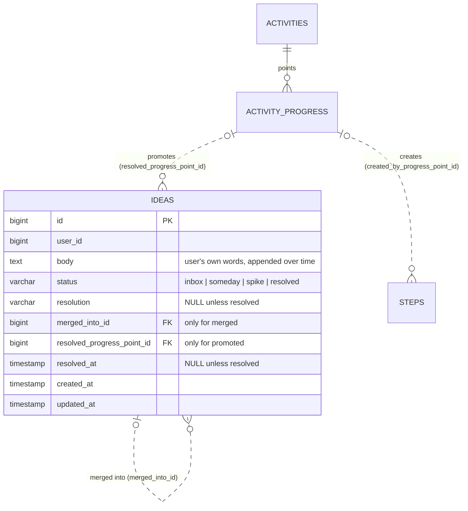
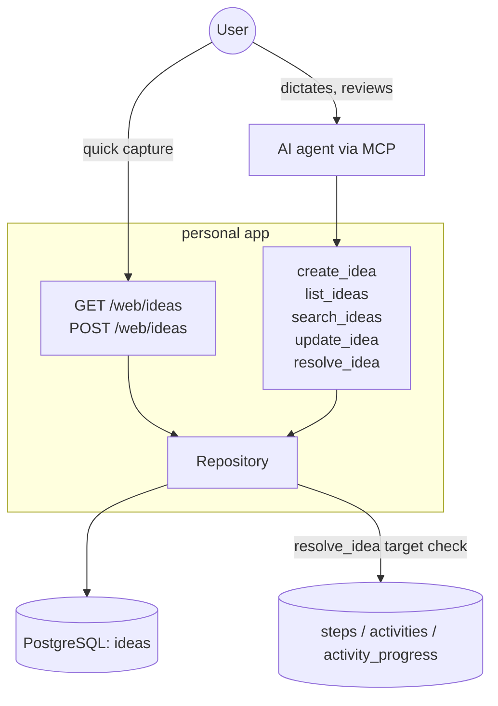
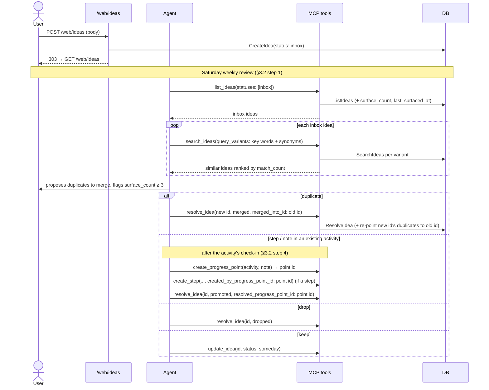
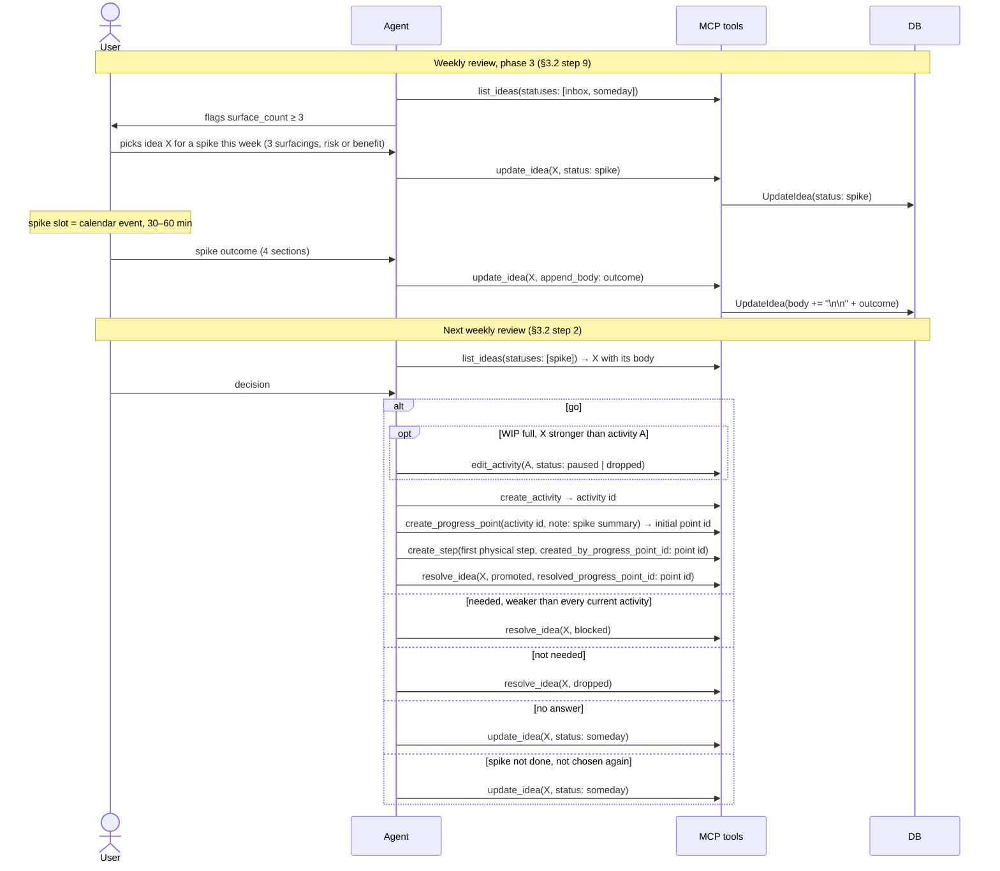
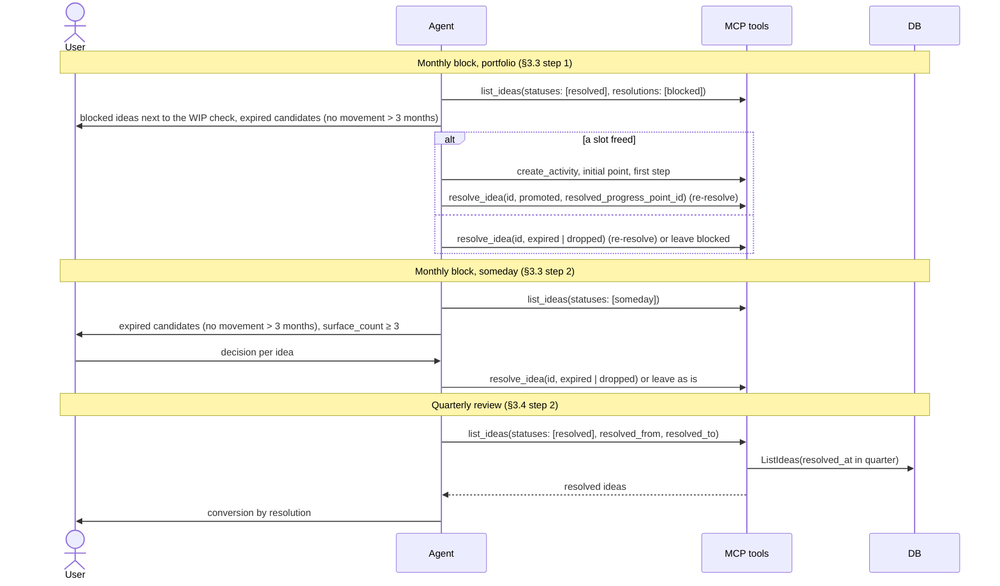

# Ideas - Complete Specification

## Overview

An **idea** is a raw thought captured outside any existing activity. It lives through the inbox lifecycle from `action/docs/content/activity-rituals.md` §2.1–2.5:

```
capture → inbox → weekly review ─┬─ resolved (dropped / merged / promoted)
                                 └─ someday ── monthly review ─┬─ resolved (dropped / expired)
                                                               └─ stays someday
inbox | someday ── trigger fired, chosen at weekly step 9 ──→ spike
spike → next weekly review ─┬─ go: resolved (promoted), displacing an activity if WIP is full
                            ├─ needed, weaker than every current activity: resolved (blocked)
                            ├─ not needed: resolved (dropped)
                            ├─ no answer: someday
                            └─ spike not done: someday, or stays spike if chosen again
resolved (blocked) ── monthly portfolio check ─┬─ slot freed: re-resolved as promoted, no new spike
                                               └─ re-resolved as dropped / expired
```

A spike is earned by one of three triggers (§2.5, trigger 3 is new):
1. The idea surfaced 3 times (`surface_count ≥ 3`, computed).
2. The idea carries an explicit risk to an area of life (health, injury, family).
3. The idea hits a goal the current portfolio covers poorly: a track or 2-year goal with no active activity while a slot is taken by an activity tied to no goal (§3.4 step 1), a different approach to a track whose activity is stuck (§2.8), or a direct hit on a goal of the year while current activities serve it weakly. It is checked against the activity list and «0. Зачем», not by weighing the benefit (that is the spike's job).

Triggers aren't stored: at spike choice (§3.2 step 9) the agent flags trigger 1 from `surface_count`, and the user names ideas with triggers 2 and 3.

It replaces the planned «Inbox» service activity (§2.2), where each thought would have been a `value=0` progress point. Nothing is ever hard-deleted: leaving the list means getting a `resolution`.

Interfaces:
- **Web**: `GET /web/ideas` has a quick capture form (§3.1) plus the open ideas list. `POST /web/ideas` creates an idea.
- **MCP**: `create_idea` (when the user dictates, §5.1), `list_ideas`, `search_ideas` (find similar ideas by text), `update_idea` (append text, change status), `resolve_idea`.

Out of scope: notes on activities, the diary, retro summaries. Those stay progress points.

## Best Practices Applied

- **Multi-user support**: `ideas.user_id` everywhere; every read and write is scoped by it
- **Own table, not progress points**: `activity_progress` is an event log. Soft delete, a duplicate counter, and appending to text don't belong there (see `docs/wontdo.md`)
- **`status` + `resolution`**: `status` is `inbox` | `someday` | `spike` | `resolved`: each open status is a separate queue reviewed at its own ritual. `resolution` (`dropped`, `merged`, `expired`, `promoted`, `blocked`) and `resolved_at` are set if and only if `status = resolved`, enforced by a CHECK. `resolved` never goes back to an open status; a returning thought is captured again
- **Reviews read by status, not by date**: the weekly review takes every `inbox` idea (step 1), every `spike` idea (step 2), and `inbox` + `someday` for the spike choice (step 9); the monthly review takes every `someday` idea (§3.3 step 2) and every idea resolved as `blocked` (portfolio check, §3.3 step 1). The "since the last point in activity 70" boundary from §3.2 is no longer needed
- **Promotion always lands in one progress point**: whatever an idea becomes is progress on an activity. A step or note on an existing activity is a progress point on it (steps are created by that point via `created_by_progress_point_id`); a new activity after a go gets its initial progress point, which creates the first step. So a promoted idea keeps one link, `resolved_progress_point_id`, a real FK to `activity_progress`. The activity (`activity_progress.activity_id`) and the steps (`steps.created_by_progress_point_id`) are reached through links that already exist. One point can promote several ideas; one idea is promoted by one point
- **`promoted` replaces `to_step` / `to_activity` / `to_note`**: what the idea became is read from the point (new activity or existing one, which steps it created), not duplicated in the resolution. The quarterly review (§3.4 step 2) counts `promoted` vs `dropped` + `expired`
- **Deleting the point doesn't block or cascade**: `resolved_progress_point_id` is `ON DELETE SET NULL`, same as the step ↔ point links. Deleting a point is an exceptional correction; the idea stays `promoted` without a link. So the DB only checks "link only for `promoted`", and "`promoted` needs a link" is checked by `resolve_idea` (`GetProgress`, own point)
- **On the weekly review the idea is resolved with the check-in point, not an extra one**: §5.5 says one clean point beats several fragments. An idea that becomes a step or note on an activity is resolved against that activity's check-in point from step 4 of §3.2. It stays `inbox` until that point exists
- **`merged_into_id`** is a real self-FK, set only for `merged`: a merge always goes into exactly one older idea
- **Surface count is computed, not stored**: `surface_count` = 1 + number of ideas with `merged_into_id = id`. `last_surfaced_at` = the latest `created_at` among the idea and those merged into it. `ListIdeas` computes both with a `LEFT JOIN`, so there are no counters to keep in sync
- **`create_step` gets an optional `created_by_progress_point_id`** (change in `progress`): today only the web form links a step to the point it's logged with; MCP `create_step` always leaves it NULL. Without it a step created in chat from an idea isn't reachable from `resolved_progress_point_id`. The point must be the user's own and belong to the same activity as the step
- **Merging re-points the duplicate's own duplicates**: when idea B is merged into A, every idea already merged into B is re-pointed to A in the same transaction. A keeps the full count, and `merged_into_id` never points at a `merged` idea. A merge target must be the user's own, not `resolved`, and not the idea itself
- **Spike is a status of the idea, not a separate entity**: choosing an idea for a spike this week (§3.2 step 9) moves it to `status = spike`, so the DB knows which ideas are being spiked; the next weekly review (§3.2 step 2) takes every idea in `spike` instead of parsing the summary in activity 70. Each spike's slot is only a calendar event. The number of spikes per week (1 in §2.5, possibly 2) is a ritual rule, not checked in code
- **Spike outcome goes into `body`**: the 4 sections from §2.5 are appended with `update_idea(append_body)`. The go / no-go at the next weekly review ends in one of these:
  - **go** → `create_activity`, its initial `create_progress_point` (spike summary as note), `create_step` for the first physical step linked to that point, then `resolve_idea` `promoted` with the point's ID. If the WIP limit is full and the spike showed the idea is stronger than some current activity, that activity is paused or dropped (`edit_activity`) in the same session: displacement, not waiting (principle 3)
  - **needed, but weaker than every current activity** → `resolve_idea` `blocked`
  - **not needed** → `resolve_idea` `dropped`
  - **no answer** (not enough information) → `someday`, the findings are already in `body`
  - If the spike wasn't done, the idea goes back to `someday` (a skip is not a debt, principle 6), or stays `spike` if it is chosen again at step 9
- **`blocked` is a resolution, but not a final one**: the decision is made ("needed, not now"), so the idea leaves the open queues. It waits for a free slot, not for a new spike. At the monthly portfolio check (§3.3 step 1), or whenever an activity is paused, finished or dropped, `resolve_idea` re-resolves it as `promoted`, or as `dropped` / `expired`. This is the only resolution that can be changed; `resolved_at` is overwritten, so the quarterly review counts the final outcome
- **Expiry is the same for `someday` and `blocked` ideas**: an `expired` candidate is an idea with no movement for 3 months, where movement = the latest of `last_surfaced_at` and `updated_at` (a new +1, a status change, or appended text). Computed by the agent from `list_ideas` output, no server-side flag (§2.3)
- **Append only, no rewriting**: `update_idea.append_body` adds `"\n\n" + text` to `body`. `body` holds the user's own words (MCP cross-cutting rule), so overwriting isn't offered
- **Transitions via `update_idea`**; setting the current status again is a no-op, nothing moves back to `inbox`, every open status goes to `resolved` through `resolve_idea`:

  | From | To |
  |---|---|
  | `inbox` | `someday`, `spike` |
  | `someday` | `spike` |
  | `spike` | `someday` (no answer or spike not done) |
- **Similar ideas found by `search_ideas`, same pattern as `search_progress_notes`**: 1-5 query variants, each an ILIKE substring match on `body`, ranked by `match_count` (variants matched) DESC, then `created_at` DESC. No embeddings or full-text index: the agent supplies synonyms and translations as variants. Used before `create_idea` in chat (§5.1) and at the weekly review (§3.2 step 1) to find an older duplicate in any status, not just among `inbox` ideas
- **`search_ideas` searches every status by default, resolved included**: a returning thought shows that it was `dropped` or `expired` before, or is already `blocked`. `statuses` narrows it. A `merged` idea is returned with its `merged_into_id`, so the agent follows it to the idea it was merged into
- **Resolved ideas are hidden by default**: `list_ideas` without `statuses` returns every open status. The quarterly review asks for `resolved` with a `resolved_from`/`resolved_to` window (§3.4 step 2)
- **Web page follows the existing write-then-redirect pattern**: plain form, no client-side JS, `POST /web/ideas` → `303` back to `GET /web/ideas`. New top-level nav item «Ideas»
- **New package `action/ideas`**, migration `gateways/db/migrations/z_ideas.sql` (`z_` so it runs after `progress.sql`, whose `activity_progress` it references)

## Architecture Diagrams

### Entity Relation Diagram



#### Entities and Tables

| Entity | Table | Role here |
|---|---|---|
| Idea | `ideas` (new) | A raw thought outside existing activities, with its inbox lifecycle |
| Progress point | `activity_progress` (existing) | The point a `promoted` idea became: a check-in on an existing activity or the initial point of a new one |
| Activity | `activities` (existing) | Reached through the point's `activity_id`, not linked from `ideas` |
| Step | `steps` (existing) | Reached through `steps.created_by_progress_point_id` of the promoting point, not linked from `ideas` |

#### Idea Statuses

| `status` | Meaning | Reviewed at | Next |
|---|---|---|---|
| `inbox` | Captured, not reviewed yet | Weekly review (§3.2 step 1) | `someday`, `spike` or `resolved` |
| `someday` | Kept after a weekly review: waits for a new +1, a spike or expiry; also where an idea goes when a spike gave no answer or wasn't done | Monthly review (§3.3 step 2); spike choice (§3.2 step 9) | `spike` or `resolved` (`dropped`, `expired`) |
| `spike` | A trigger fired and the idea was chosen for a spike this week | Next weekly review, go / no-go (§3.2 step 2) | `resolved` (go: `promoted`; not needed: `dropped`; needed, not now: `blocked`) or `someday` |
| `resolved` | A decision has been made; terminal, hidden from lists by default | Quarterly review, by `resolved_at` (§3.4 step 2) | — |

#### Idea Resolutions

Set only when `status = resolved`.

| `resolution` | When | Link |
|---|---|---|
| `dropped` | Decided not to do it, at any review, including "not needed" after a spike | — |
| `merged` | A duplicate: the new idea is merged into the older one, which gets +1 to `surface_count` | `merged_into_id` → the older idea |
| `expired` | A `someday` idea or a `blocked` one with no movement for more than 3 months, closed at a monthly review | — |
| `blocked` | After a spike: needed, but weaker than every current activity while the WIP limit is full. Can later be re-resolved as `promoted`, `dropped` or `expired` | — |
| `promoted` | Became progress: a step or note on an existing activity, or a new activity after a go or from `blocked` | `resolved_progress_point_id` → the point; NULL if that point was later deleted |

"No answer" after a spike is not a resolution: the idea goes back to `someday`, and the findings are already in `body`.

### C4 Context Diagram



### Sequence Diagram: Capture and Weekly Review



### Sequence Diagram: Spike and Go / No-go



### Sequence Diagram: Monthly and Quarterly Review



## Database Schema

### SQL DDL

```sql
-- gateways/db/migrations/z_ideas.sql
CREATE TABLE IF NOT EXISTS ideas (
    id BIGSERIAL PRIMARY KEY,
    user_id BIGINT NOT NULL,
    body TEXT NOT NULL CHECK (body <> ''),
    status VARCHAR(20) NOT NULL DEFAULT 'inbox' CHECK (status IN ('inbox', 'someday', 'spike', 'resolved')),
    resolution VARCHAR(20) CHECK (resolution IN ('dropped', 'merged', 'expired', 'promoted', 'blocked')),
    merged_into_id BIGINT,
    resolved_progress_point_id BIGINT,
    resolved_at TIMESTAMP,
    created_at TIMESTAMP NOT NULL DEFAULT CURRENT_TIMESTAMP,
    updated_at TIMESTAMP NOT NULL DEFAULT CURRENT_TIMESTAMP,

    CONSTRAINT fk_idea_merged_into FOREIGN KEY (merged_into_id) REFERENCES ideas(id),
    CONSTRAINT fk_idea_resolved_point FOREIGN KEY (resolved_progress_point_id) REFERENCES activity_progress(id) ON DELETE SET NULL,
    -- resolution and resolved_at are set iff status = resolved
    CONSTRAINT check_idea_resolution CHECK ((status = 'resolved') = (resolution IS NOT NULL)),
    CONSTRAINT check_idea_resolved_at CHECK ((status = 'resolved') = (resolved_at IS NOT NULL)),
    -- merged_into_id iff merged; point link only for promoted (NULL after the point is deleted)
    CONSTRAINT check_idea_merged_into CHECK (COALESCE(resolution = 'merged', FALSE) = (merged_into_id IS NOT NULL)),
    CONSTRAINT check_idea_resolved_point CHECK (resolved_progress_point_id IS NULL OR resolution = 'promoted')
);

CREATE INDEX IF NOT EXISTS idx_ideas_user_status ON ideas(user_id, status);
CREATE INDEX IF NOT EXISTS idx_ideas_merged_into_id ON ideas(merged_into_id) WHERE merged_into_id IS NOT NULL;
```

## Go Code Structure

### Domain Models

```go
// domain/idea.go

type IdeaStatus string

const (
    IdeaStatusInbox     IdeaStatus = "inbox"
    IdeaStatusSomeday   IdeaStatus = "someday"
    IdeaStatusSpike     IdeaStatus = "spike"
    IdeaStatusResolved  IdeaStatus = "resolved"
)

type IdeaResolution string

const (
    IdeaResolutionDropped    IdeaResolution = "dropped"
    IdeaResolutionMerged     IdeaResolution = "merged"
    IdeaResolutionExpired    IdeaResolution = "expired"
    IdeaResolutionPromoted   IdeaResolution = "promoted"
    IdeaResolutionBlocked    IdeaResolution = "blocked"
)

type Idea struct {
    ID            int64           `json:"id" db:"id"`
    UserID        int64           `json:"-" db:"user_id"`
    Body          string          `json:"body" db:"body" jsonschema:"The user's own words; spike outcomes are appended"`
    Status        IdeaStatus      `json:"status" db:"status" jsonschema:"inbox, someday, spike or resolved"`
    Resolution    *IdeaResolution `json:"resolution,omitempty" db:"resolution" jsonschema:"Set only when status is resolved"`
    MergedIntoID  *int64          `json:"merged_into_id,omitempty" db:"merged_into_id" jsonschema:"Older idea this one was merged into (resolution merged)"`
    ResolvedProgressPointID *int64 `json:"resolved_progress_point_id,omitempty" db:"resolved_progress_point_id" jsonschema:"Progress point the idea was promoted into (resolution promoted); its activity and created steps show what it became"`
    ResolvedAt    *time.Time      `json:"resolved_at,omitempty" db:"resolved_at"`
    CreatedAt     time.Time       `json:"created_at" db:"created_at"`
    UpdatedAt     time.Time       `json:"updated_at" db:"updated_at"`
    // Read-only, computed by ListIdeas/GetIdea from ideas merged into this one
    SurfaceCount   int       `json:"surface_count" db:"surface_count" jsonschema:"1 + number of duplicates merged into this idea; 3+ is a spike trigger"`
    LastSurfacedAt time.Time `json:"last_surfaced_at" db:"last_surfaced_at" jsonschema:"Latest created_at of this idea and its merged duplicates"`
}

// IdeaFilter defines query parameters for listing ideas
type IdeaFilter struct {
    UserID       int64
    Statuses     []IdeaStatus // empty = every open status (all but resolved)
    Resolutions  []IdeaResolution // only resolved ideas with these resolutions, e.g. [blocked] for the portfolio check
    ResolvedFrom *time.Time   // resolved_at >= ResolvedFrom
    ResolvedTo   *time.Time   // resolved_at < ResolvedTo
}

// IdeaSearchFilter defines parameters for a single-variant body search
type IdeaSearchFilter struct {
    UserID   int64
    Query    string       // required, ILIKE substring on body
    Statuses []IdeaStatus // empty = every status, resolved included
}

// IdeaResolve is the input of ResolveIdea
type IdeaResolve struct {
    IdeaID        int64
    UserID        int64
    Resolution    IdeaResolution
    MergedIntoID  *int64
    ResolvedProgressPointID *int64
    ResolvedAt    time.Time
}
```

### Repository Interface

```go
// Ideas
CreateIdea(ctx context.Context, idea *domain.Idea) (int64, error)
GetIdea(ctx context.Context, ideaID int64, userID int64) (*domain.Idea, error) // fills SurfaceCount/LastSurfacedAt
ListIdeas(ctx context.Context, filter domain.IdeaFilter) ([]domain.Idea, error) // fills SurfaceCount/LastSurfacedAt; ordered by created_at ASC
SearchIdeas(ctx context.Context, filter domain.IdeaSearchFilter) ([]domain.Idea, error) // one variant; fills SurfaceCount/LastSurfacedAt; the action merges variants and counts match_count
UpdateIdea(ctx context.Context, idea *domain.Idea) error // body, status, updated_at; caller has already merged the change onto a fetched idea
ResolveIdea(ctx context.Context, resolve domain.IdeaResolve) error // sets status=resolved + resolution fields (overwrites them when re-resolving a blocked idea); for merged also re-points ideas merged into IdeaID to MergedIntoID, in one transaction
```

## MCP Tools

### create_idea
Captures an idea in `inbox` with the user's own words as `body`. Used when the user dictates a thought (§5.1).

### list_ideas
Lists the user's ideas with `surface_count` and `last_surfaced_at`. Optional `statuses` (default: every open status), `resolutions` (e.g. `blocked` for the monthly portfolio check) and `resolved_from` / `resolved_to` for the quarterly review.

### search_ideas
Searches the user's ideas by `body` with 1-5 `query_variants` (ILIKE), optional `statuses` (default: every status, resolved included). Returns ideas with `surface_count`, `last_surfaced_at`, `resolution`, `merged_into_id` and `match_count`, ranked by `match_count` DESC, then `created_at` DESC. Same pattern as `search_progress_notes`.

### update_idea
Appends text to an idea's `body` (`append_body`) and/or changes `status` along the allowed transitions (see Best Practices). Fails on a `resolved` idea or a transition not in the table.

### resolve_idea
Resolves an idea in any open status with a `resolution`, or re-resolves a `blocked` idea as `promoted`, `dropped` or `expired`. `blocked` is accepted only from `spike`. `merged` requires `merged_into_id` (own, unresolved, not itself). `promoted` requires `resolved_progress_point_id`, checked to exist and belong to the user. `dropped` / `expired` take neither.

## HTTP Handlers

### GET /web/ideas
Capture form (one textarea) on top, then the open ideas grouped by status in the order `spike`, `inbox`, `someday`, then the `blocked` ones: body, created date, surface count when > 1. Nav item «Ideas».

### POST /web/ideas
Creates an idea in `inbox` from the form's `body` (empty → re-render with an error), then `303` redirect to `GET /web/ideas`.

## Configuration

- **Append separator**: `"\n\n"` between the existing `body` and the appended text
- **Expired window**: none in code. The agent uses "latest of `last_surfaced_at` and `updated_at` older than 3 months" as the approximation of "3 monthly reviews without movement" (§2.3), for `someday` and `blocked` ideas

## E2E Tests

`tests/ideas_test.go` (MCP) and `tests/ideas_web_test.go` (HTTP), table-driven, state asserted through the repository only.

- `TestCreateIdea`: created in `inbox` with body; empty body fails
- `TestListIdeas`: default hides `resolved`; `statuses` filter; `resolutions: [blocked]` returns only blocked ideas; `resolved_from` / `resolved_to` window; other user's ideas not returned
- `TestSearchIdeas`: case-insensitive substring match; ranked by `match_count`, then newest first; an idea matched by several variants appears once; default includes resolved ideas; `statuses` filter; merged idea returned with `merged_into_id`; 0 or more than 5 variants, or an empty variant, fails; other user's ideas not returned
- `TestUpdateIdea`: append adds `"\n\n" + text`; every transition from the table succeeds; setting the current status is a no-op; transitions not in the table fail (e.g. `someday → inbox`, `spike → inbox`); any change on a `resolved` idea fails
- `TestResolveIdea`:
  - `dropped` / `expired` set `status=resolved`, `resolution`, `resolved_at`
  - `merged` into an older idea → older idea's `surface_count` = 2 and `last_surfaced_at` = duplicate's `created_at`
  - merging B (with one duplicate) into A → A's `surface_count` = 3, the duplicate now points to A
  - `merged` into itself, into a resolved idea, into another user's idea, or without `merged_into_id` fails
  - `promoted` with the user's own point succeeds; missing point id, other user's point, or non-existent point fails
  - deleting the promoting point (`delete_progress_point`) keeps the idea `promoted` with `resolved_progress_point_id` = NULL
  - `spike` idea resolved as `blocked` succeeds; `blocked` from `inbox` or `someday` fails
  - `blocked` idea re-resolved as `promoted` / `dropped` / `expired` succeeds and updates `resolved_at`
  - re-resolving any other resolved idea fails
- `TestCreateStep_CreatedByProgressPoint` (in `tests/progress_steps_test.go`): link saved; other user's point or a point of another activity fails
- `TestIdeasWeb`: `GET /web/ideas` shows open ideas grouped by status and the blocked ones, hides other resolved, shows surface count; `POST /web/ideas` creates and redirects `303`; empty body re-renders with an error and creates nothing

## Follow-ups after implementation

- Update `activity-rituals.md` §2.2–2.5, §3.1, §3.2 step 1–2, §3.3 step 2, §3.4 step 2 (inbox is `ideas`, no «Inbox» activity, spike is the idea's `spike` status instead of a step on «Inbox», outcome appended to the idea), and the «Inbox» rows in `activity-mechanics.md`
- Add `action/ideas` to `docs/architecture.md`, route ideas in `transport/mcp/instructions.md` (`search_ideas` before `create_idea`)
- Update `progress-spec.md`: `create_step` input `created_by_progress_point_id`
- `activity-rituals.md` §2.5: trigger 3 (benefit over the current portfolio), spike outcomes (go with displacement / resolution blocked / dropped / someday), the spike limit (1 or 2 per week, also §3.2 step 9); §3.3 step 1: review ideas resolved as `blocked` at the portfolio check
- Remove the backlog item
