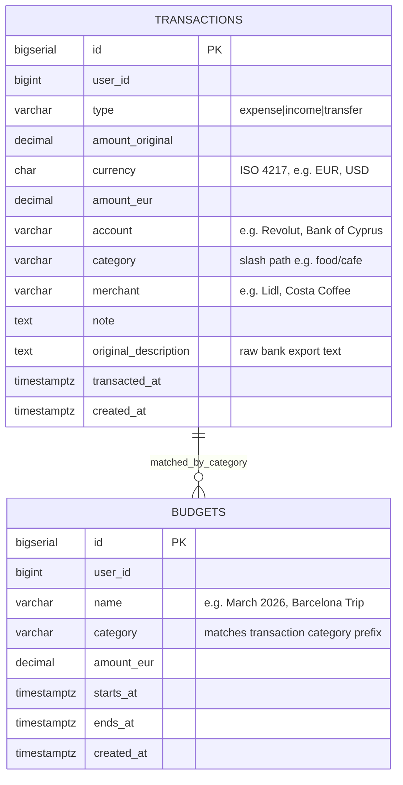
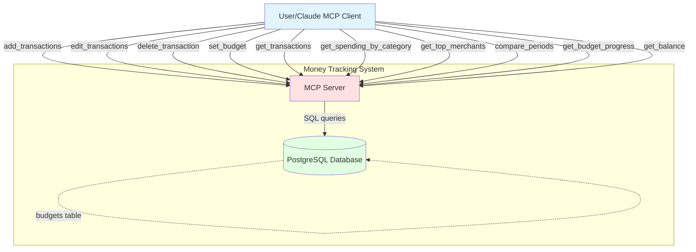
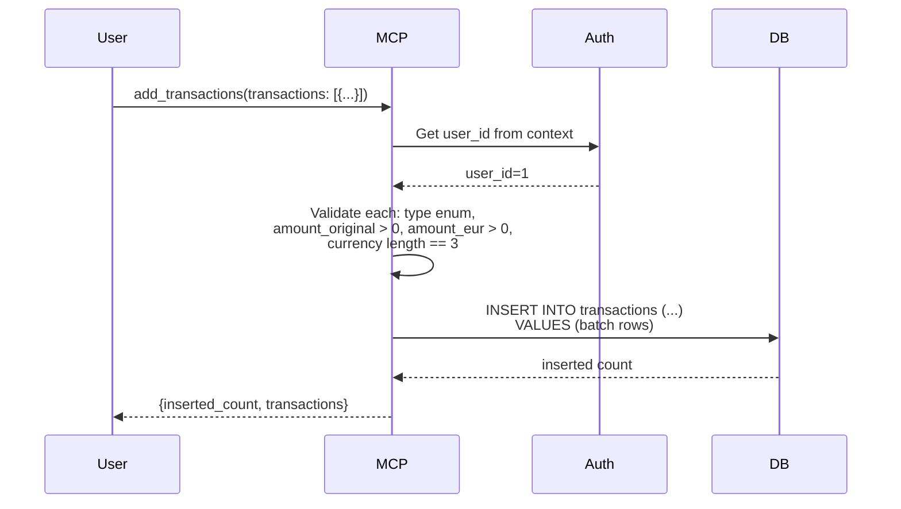
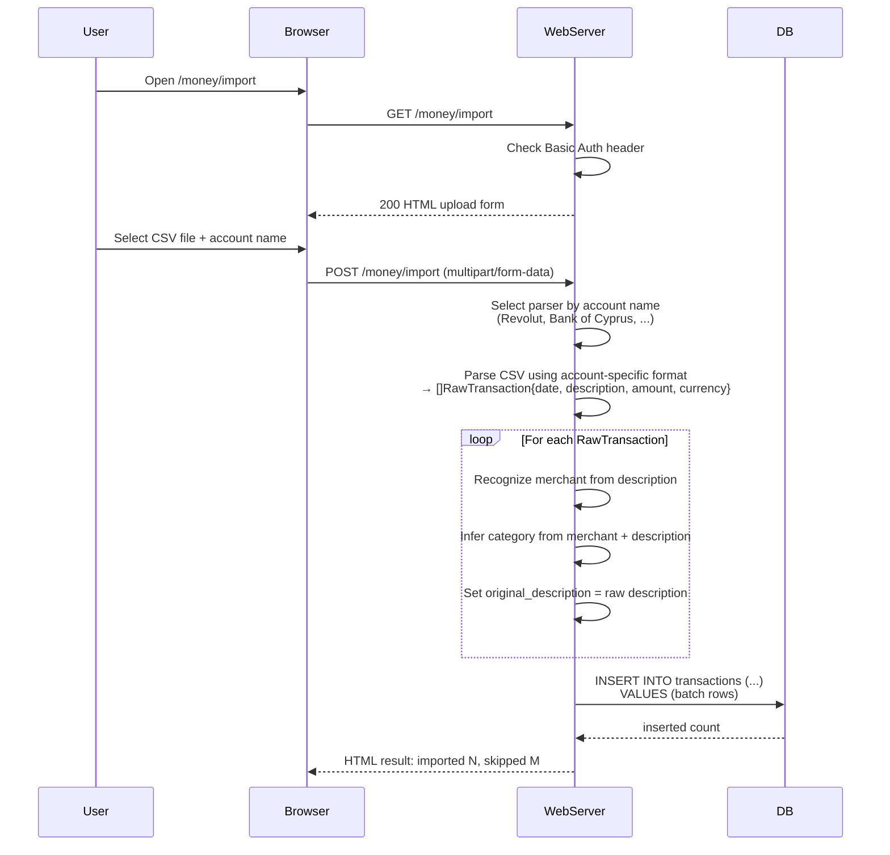
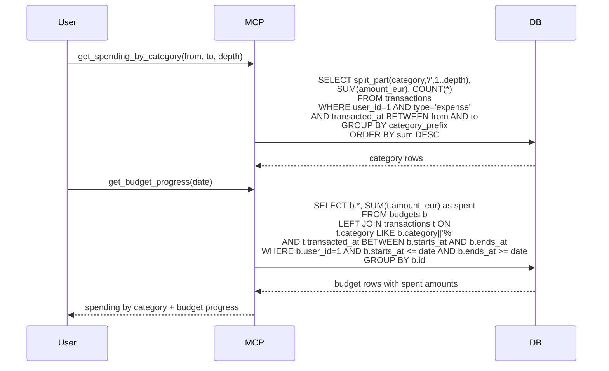
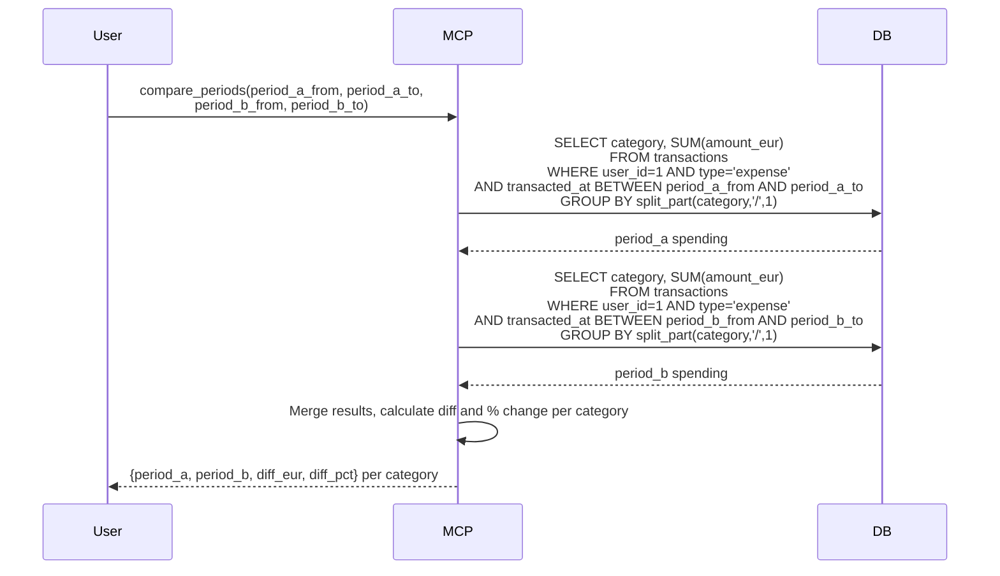

# Money Tracking System - Complete Specification

## Overview

System for tracking personal financial transactions, income, expenses, and budgets with MCP (Model Context Protocol) interface. Supports multi-currency logging with EUR conversion, hierarchical category paths, merchant tracking, bulk import from bank CSV exports, and analytical tools for spending analysis and budget progress monitoring.

## Best Practices Applied

- **Multi-user Support**: All tables have user_id for data isolation (DEFAULT_USER_ID = 1)
- **User Context**: user_id extracted from authentication context (JWT/session), not passed explicitly
- **UTC Timezone**: All timestamps in UTC, timezone conversions in action layer
- **Multi-currency**: Stores original currency + amount alongside EUR equivalent at transaction time
- **Hierarchical Categories**: Slash-separated paths (e.g. `food/cafe`) — group by prefix for rollups
- **Original Description**: Raw bank text preserved for future re-categorization without data loss
- **Flat Schema**: accounts, merchants, and categories are plain strings — no foreign key overhead
- **Budget Matching**: Budget covers all transactions where category starts with budget.category path
- **Nullable Fields**: note and original_description are nullable for manual entries

## Architecture Diagrams

### Entity Relation Diagram



### C4 Context Diagram



### Sequence Diagram: Add Transactions



### Sequence Diagram: Import CSV via Web UI



### Sequence Diagram: Spending Analysis



### Sequence Diagram: Compare Periods



## Database Schema

### SQL DDL

```sql
CREATE TABLE IF NOT EXISTS transactions (
    id               BIGSERIAL PRIMARY KEY,
    user_id          BIGINT NOT NULL,
    type             VARCHAR(10) NOT NULL,           -- 'expense', 'income', 'transfer'
    amount_original  DECIMAL(12,2) NOT NULL,
    currency         CHAR(3) NOT NULL,               -- ISO 4217, e.g. 'EUR', 'USD'
    amount_eur       DECIMAL(12,2) NOT NULL,
    account          VARCHAR(100) NOT NULL,
    category         VARCHAR(255) NOT NULL DEFAULT '',
    merchant         VARCHAR(255) NOT NULL DEFAULT '',
    note             TEXT,
    original_description TEXT,
    transacted_at    TIMESTAMPTZ NOT NULL,
    created_at       TIMESTAMPTZ NOT NULL DEFAULT NOW(),

    CONSTRAINT check_type CHECK (type IN ('expense', 'income', 'transfer')),
    CONSTRAINT check_amount_original CHECK (amount_original > 0),
    CONSTRAINT check_amount_eur CHECK (amount_eur > 0),
    CONSTRAINT check_currency_length CHECK (char_length(currency) = 3)
);

CREATE INDEX idx_transactions_user_date   ON transactions(user_id, transacted_at DESC);
CREATE INDEX idx_transactions_user_cat    ON transactions(user_id, category);
CREATE INDEX idx_transactions_user_type   ON transactions(user_id, type);
CREATE INDEX idx_transactions_merchant    ON transactions(user_id, merchant);

CREATE TABLE IF NOT EXISTS budgets (
    id          BIGSERIAL PRIMARY KEY,
    user_id     BIGINT NOT NULL,
    name        VARCHAR(255) NOT NULL,
    category    VARCHAR(255) NOT NULL,
    amount_eur  DECIMAL(12,2) NOT NULL,
    starts_at   TIMESTAMPTZ NOT NULL,
    ends_at     TIMESTAMPTZ NOT NULL,
    created_at  TIMESTAMPTZ NOT NULL DEFAULT NOW(),

    CONSTRAINT check_budget_amount CHECK (amount_eur > 0),
    CONSTRAINT check_budget_period CHECK (ends_at > starts_at)
);

CREATE INDEX idx_budgets_user_period ON budgets(user_id, starts_at, ends_at);
CREATE INDEX idx_budgets_user_cat    ON budgets(user_id, category);
```

## Go Code Structure

### Domain Models

```go
package money

import "time"

// TransactionType represents the direction of a financial transaction
type TransactionType string

const (
    TransactionTypeExpense  TransactionType = "expense"
    TransactionTypeIncome   TransactionType = "income"
    TransactionTypeTransfer TransactionType = "transfer"
)

// Transaction represents a single financial record
type Transaction struct {
    ID                  int64           `json:"id" db:"id"`
    UserID              int64           `json:"user_id" db:"user_id"`
    Type                TransactionType `json:"type" db:"type"`
    AmountOriginal      float64         `json:"amount_original" db:"amount_original"`
    Currency            string          `json:"currency" db:"currency"`
    AmountEUR           float64         `json:"amount_eur" db:"amount_eur"`
    Account             string          `json:"account" db:"account"`
    Category            string          `json:"category" db:"category"`
    Merchant            string          `json:"merchant" db:"merchant"`
    Note                *string         `json:"note,omitempty" db:"note"`
    OriginalDescription *string         `json:"original_description,omitempty" db:"original_description"`
    TransactedAt        time.Time       `json:"transacted_at" db:"transacted_at"`
    CreatedAt           time.Time       `json:"created_at" db:"created_at"`
}

// Budget represents a spending limit for a category over a time period
type Budget struct {
    ID        int64     `json:"id" db:"id"`
    UserID    int64     `json:"user_id" db:"user_id"`
    Name      string    `json:"name" db:"name"`
    Category  string    `json:"category" db:"category"`
    AmountEUR float64   `json:"amount_eur" db:"amount_eur"`
    StartsAt  time.Time `json:"starts_at" db:"starts_at"`
    EndsAt    time.Time `json:"ends_at" db:"ends_at"`
    CreatedAt time.Time `json:"created_at" db:"created_at"`
}

// TransactionFilter defines query parameters for listing transactions
type TransactionFilter struct {
    UserID   int64
    From     *time.Time
    To       *time.Time
    Account  *string
    Category *string
    Type     *TransactionType
    Merchant *string
    Limit    int
    Offset   int
}

// SpendingByCategory is an aggregated spending row for one category prefix
type SpendingByCategory struct {
    Category   string  `json:"category"`
    TotalEUR   float64 `json:"total_eur"`
    Count      int     `json:"count"`
}

// MerchantSummary is an aggregated row for one merchant
type MerchantSummary struct {
    Merchant string  `json:"merchant"`
    TotalEUR float64 `json:"total_eur"`
    Count    int     `json:"count"`
}

// BudgetProgress is a budget with its spent amount calculated
type BudgetProgress struct {
    Budget
    SpentEUR    float64 `json:"spent_eur"`
    RemainingEUR float64 `json:"remaining_eur"`
}

// PeriodSpending is spending aggregated by category for one period
type PeriodSpending struct {
    From       time.Time            `json:"from"`
    To         time.Time            `json:"to"`
    Categories []SpendingByCategory `json:"categories"`
    TotalEUR   float64              `json:"total_eur"`
}

// PeriodComparison is a side-by-side comparison of two periods
type PeriodComparison struct {
    PeriodA  PeriodSpending       `json:"period_a"`
    PeriodB  PeriodSpending       `json:"period_b"`
    Diff     []CategoryDiff       `json:"diff"`
}

// CategoryDiff is the delta between two periods for one category
type CategoryDiff struct {
    Category string  `json:"category"`
    PeriodA  float64 `json:"period_a_eur"`
    PeriodB  float64 `json:"period_b_eur"`
    DiffEUR  float64 `json:"diff_eur"`
    DiffPct  float64 `json:"diff_pct"`
}

// BalanceResult is income minus expenses for a period
type BalanceResult struct {
    From        time.Time `json:"from"`
    To          time.Time `json:"to"`
    IncomeEUR   float64   `json:"income_eur"`
    ExpenseEUR  float64   `json:"expense_eur"`
    BalanceEUR  float64   `json:"balance_eur"`
}

// TransactionUpdate is one item in a bulk edit_transactions call — all fields optional except ID
type TransactionUpdate struct {
    ID           int64            `json:"id"`
    Type         *TransactionType `json:"type,omitempty"`
    AmountOriginal *float64       `json:"amount_original,omitempty"`
    Currency     *string          `json:"currency,omitempty"`
    AmountEUR    *float64         `json:"amount_eur,omitempty"`
    Account      *string          `json:"account,omitempty"`
    Category     *string          `json:"category,omitempty"`
    Merchant     *string          `json:"merchant,omitempty"`
    Note         *string          `json:"note,omitempty"`
    TransactedAt *time.Time       `json:"transacted_at,omitempty"`
}
```

### Repository Interface

```go
type DB interface {
    // Write
    AddTransactions(ctx context.Context, txs []*domain.Transaction) (int, error)
    EditTransactions(ctx context.Context, userID int64, updates []domain.TransactionUpdate) (int, error)
    DeleteTransaction(ctx context.Context, id int64, userID int64) error
    SetBudget(ctx context.Context, b *domain.Budget) (int64, error)

    // Read
    GetTransactions(ctx context.Context, filter domain.TransactionFilter) ([]*domain.Transaction, error)

    // Analytics
    GetSpendingByCategory(ctx context.Context, userID int64, from, to time.Time, depth int) ([]domain.SpendingByCategory, error)
    GetTopMerchants(ctx context.Context, userID int64, from, to time.Time, limit int) ([]domain.MerchantSummary, error)
    GetSpendingForPeriod(ctx context.Context, userID int64, from, to time.Time) ([]domain.SpendingByCategory, error)
    GetBudgetProgress(ctx context.Context, userID int64, at time.Time) ([]domain.BudgetProgress, error)
    GetBalance(ctx context.Context, userID int64, from, to time.Time) (domain.BalanceResult, error)
}
```

## MCP Tools

### edit_transactions
Batch edit transactions. All fields except id are optional per item. Works for a single transaction or many at once — e.g. correcting one note or re-categorizing a hundred imports.

Input:
```json
{
  "updates": [
    { "id": 42, "category": "food/restaurant", "merchant": "Zuma" },
    { "id": 43, "note": "team lunch", "category": "work/food" }
  ]
}
```

Output:
```json
{ "updated_count": 2 }
```

Logic: Validate all IDs belong to user_id. Apply partial update per item (only provided fields are changed). Bulk update via EditTransactions.

Errors: any ID not found or not owned by user → return error, no partial updates applied.

---

### delete_transaction
Delete a transaction by ID.

Input:
```json
{ "id": 42 }
```

Output:
```json
{ "deleted": true }
```

Logic: Verify transaction belongs to user_id. Delete record.

Errors: transaction not found, not owned by user.

---

### add_transactions
Add multiple transactions in one call.

Input:
```json
{
  "transactions": [
    { "type": "expense", "amount_original": 5.00, "currency": "EUR", "amount_eur": 5.00, "account": "Revolut", "category": "food/cafe", "merchant": "Starbucks", "transacted_at": "2026-04-04T09:00:00Z" },
    { "type": "expense", "amount_original": 45.00, "currency": "EUR", "amount_eur": 45.00, "account": "Bank of Cyprus", "category": "transport/taxi", "merchant": "Bolt", "transacted_at": "2026-04-04T20:00:00Z" }
  ]
}
```

Output:
```json
{ "inserted_count": 2, "transactions": [ ... ] }
```

Logic: Validate each transaction. Bulk insert using AddTransactions. Return all created records.

---

### set_budget
Create or update a budget for a category over a period.

Input:
```json
{
  "name": "Food - April 2026",
  "category": "food",
  "amount_eur": 500.00,
  "starts_at": "2026-04-01T00:00:00Z",
  "ends_at": "2026-04-30T23:59:59Z"
}
```

Output:
```json
{ "id": 7, "budget": { ... } }
```

Logic: Validate amount > 0, ends_at > starts_at. Upsert budget (match on user_id + name). Return saved budget.

---

### get_transactions
List transactions with optional filters.

Input:
```json
{
  "from": "2026-04-01T00:00:00Z",
  "to": "2026-04-30T23:59:59Z",
  "account": "Revolut",
  "category": "food",
  "type": "expense",
  "merchant": "Lidl",
  "limit": 50,
  "offset": 0
}
```

Output:
```json
{ "transactions": [ ... ], "total": 12 }
```

Logic: All filters are optional. category filter matches transactions where category starts with the provided prefix (LIKE 'food%'). Default limit 50, max 200.

---

### get_spending_by_category
Aggregated spending per category for a period. depth controls grouping level (1 = top-level only, 2 = two levels).

Input:
```json
{
  "from": "2026-04-01T00:00:00Z",
  "to": "2026-04-30T23:59:59Z",
  "depth": 1
}
```

Output:
```json
{
  "from": "2026-04-01T00:00:00Z",
  "to": "2026-04-30T23:59:59Z",
  "categories": [
    { "category": "food", "total_eur": 320.50, "count": 18 },
    { "category": "transport", "total_eur": 90.00, "count": 7 }
  ],
  "total_eur": 410.50
}
```

Logic: Filter transactions by user_id, type=expense, date range. GROUP BY split_part(category, '/', 1..depth). ORDER BY total_eur DESC.

---

### get_top_merchants
Top merchants ranked by total spend for a period.

Input:
```json
{
  "from": "2026-04-01T00:00:00Z",
  "to": "2026-04-30T23:59:59Z",
  "limit": 10
}
```

Output:
```json
{
  "merchants": [
    { "merchant": "Lidl", "total_eur": 180.00, "count": 8 },
    { "merchant": "Costa Coffee", "total_eur": 45.00, "count": 9 }
  ]
}
```

Logic: Filter by user_id, type=expense, date range. GROUP BY merchant. ORDER BY total_eur DESC. LIMIT limit (default 10).

---

### compare_periods
Side-by-side comparison of spending between two time periods by category.

Input:
```json
{
  "period_a_from": "2026-03-01T00:00:00Z",
  "period_a_to": "2026-03-31T23:59:59Z",
  "period_b_from": "2026-04-01T00:00:00Z",
  "period_b_to": "2026-04-30T23:59:59Z"
}
```

Output:
```json
{
  "period_a": { "from": "...", "to": "...", "total_eur": 890.00, "categories": [ ... ] },
  "period_b": { "from": "...", "to": "...", "total_eur": 1020.00, "categories": [ ... ] },
  "diff": [
    { "category": "food", "period_a_eur": 280.00, "period_b_eur": 320.50, "diff_eur": 40.50, "diff_pct": 14.5 }
  ]
}
```

Logic: Run GetSpendingForPeriod for each period at depth=1. Merge results by category. Calculate diff_eur = period_b - period_a, diff_pct = (diff / period_a) * 100. Include categories present in either period (zero-fill missing side).

---

### get_budget_progress
Active budgets with spent and remaining amounts as of a given date.

Input:
```json
{
  "at": "2026-04-05T00:00:00Z"
}
```

Output:
```json
{
  "budgets": [
    {
      "id": 7,
      "name": "Food - April 2026",
      "category": "food",
      "amount_eur": 500.00,
      "spent_eur": 320.50,
      "remaining_eur": 179.50,
      "starts_at": "...",
      "ends_at": "..."
    }
  ]
}
```

Logic: Find budgets where starts_at <= at AND ends_at >= at. For each budget: SUM(amount_eur) from transactions where category LIKE budget.category || '%' AND transacted_at BETWEEN starts_at AND ends_at AND type = 'expense'. remaining_eur = amount_eur - spent_eur.

---

### get_balance
Income minus expenses for a period, optionally broken down by account.

Input:
```json
{
  "from": "2026-04-01T00:00:00Z",
  "to": "2026-04-30T23:59:59Z"
}
```

Output:
```json
{
  "from": "2026-04-01T00:00:00Z",
  "to": "2026-04-30T23:59:59Z",
  "income_eur": 3500.00,
  "expense_eur": 1020.00,
  "balance_eur": 2480.00
}
```

Logic: Two aggregations in one query — SUM(amount_eur) WHERE type='income' and SUM(amount_eur) WHERE type='expense' for the period. balance_eur = income_eur - expense_eur. Transfer transactions are excluded from balance calculation.

---

## Web UI

### Import Page

**Route**: `GET /money/import`, `POST /money/import`
**Auth**: HTTP Basic Auth

Simple HTML page for uploading bank CSV exports. Not exposed via MCP — intended for manual bulk import sessions.

**GET** — renders upload form with:
- File input (CSV)
- Account name text field (e.g. "Revolut", "Bank of Cyprus")
- Submit button

**POST** — processes uploaded file in three stages:

**Stage 1 — Account-specific parsing** (branches by account name):
- Select parser implementation by account name (e.g. `RevolutParser`, `BankOfCyprusParser`)
- Each parser knows its CSV columns, date format, amount sign convention
- Output: `[]RawTransaction{date, description, amount, currency}`
- If amount < 0 → type = expense; if amount > 0 → type = income

**Stage 2 — Merchant recognition** (account-agnostic):
- Strip noise from description (store numbers, city suffixes, terminal IDs)
- Normalize to clean merchant name (e.g. `"LIDL CYPRUS 0042 NICOSIA"` → `"Lidl"`)
- Set `original_description` = raw description before any normalization

**Stage 3 — Categorization** (account-agnostic):
- Infer `category` from merchant name + description using keyword heuristics
- Falls back to empty string if no match — agent can fix later via `edit_transactions`

**Final step**:
- `amount_eur` = amount if currency = EUR, else store original and set amount_eur = 0 for manual correction
- Bulk insert via `AddTransactions`
- Render result page: imported N rows, skipped M rows (duplicates or parse errors)

## Configuration

- **Default User ID**: 1 (DEFAULT_USER_ID constant)
- **Display Timezone**: Asia/Nicosia (for day boundaries in analytics)
- **Database Timezone**: UTC (all timestamps stored in UTC)
- **Transaction Types**: expense, income, transfer
- **Default Query Limit**: 50
- **Max Query Limit**: 200
- **Category Depth Default**: 1 (top-level grouping)
- **Budget Progress**: transfers excluded from spent calculation
