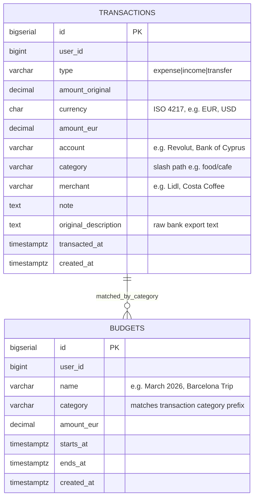
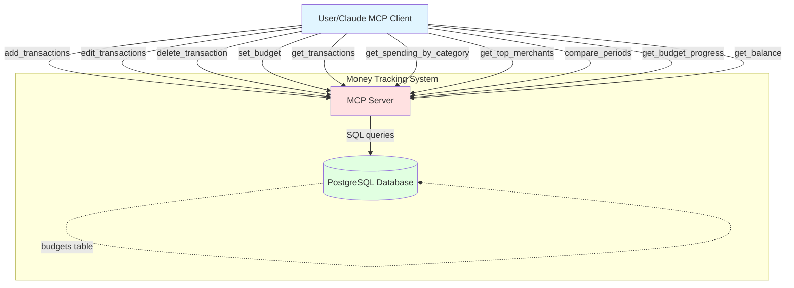
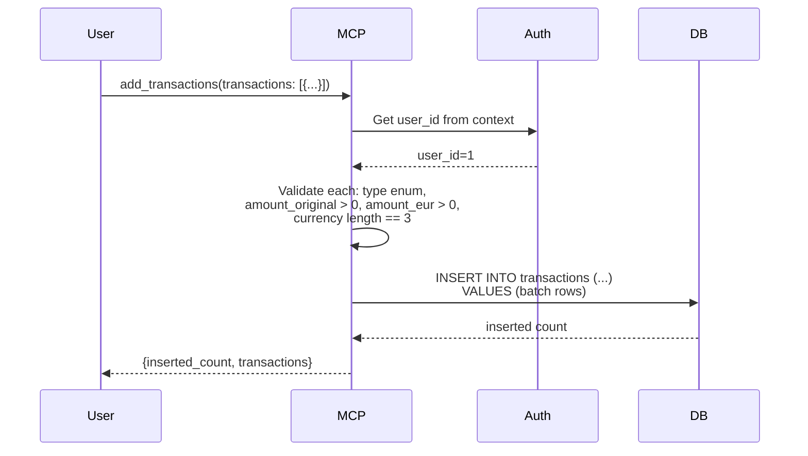
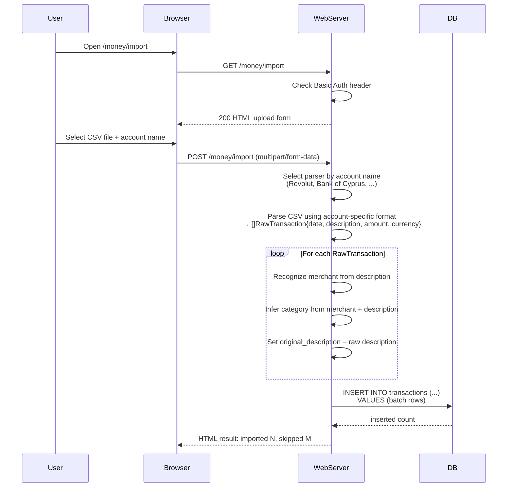
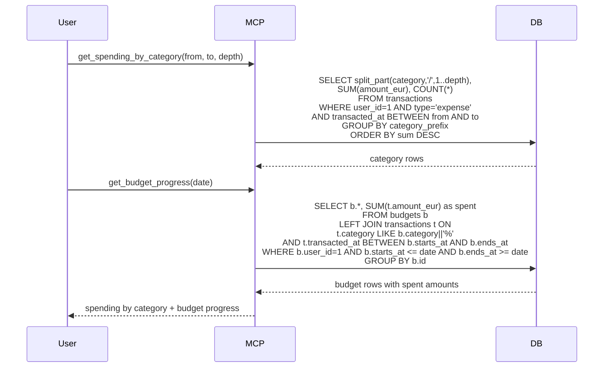
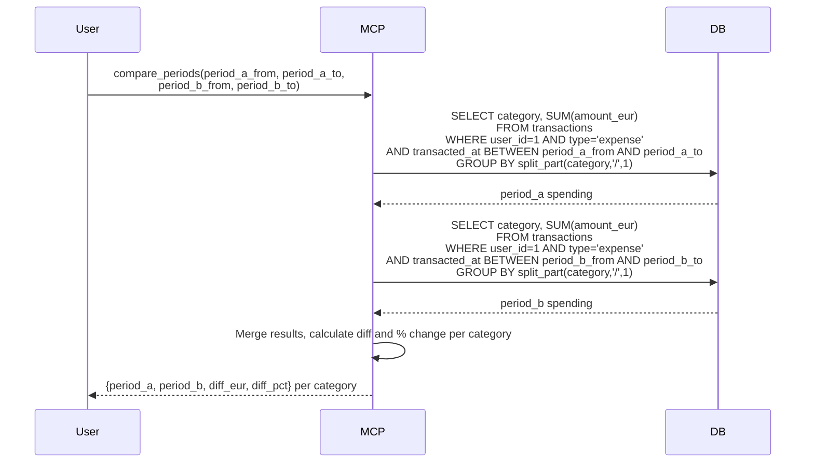

# Money Tracking System - Complete Specification

## Overview

System for tracking personal financial transactions, income, expenses, and budgets with MCP (Model Context Protocol) interface. Supports multi-currency logging with EUR conversion, hierarchical category paths, merchant tracking, bulk import from bank CSV exports, and analytical tools for spending analysis and budget progress monitoring.

## Best Practices Applied

- **Multi-user Support**: All tables have user_id for data isolation (DEFAULT_USER_ID = 1)
- **User Context**: user_id extracted from authentication context (JWT/session), not passed explicitly
- **UTC Timezone**: All timestamps in UTC, timezone conversions in action layer
- **Multi-currency**: Stores original currency + amount alongside EUR equivalent at transaction time
- **Hierarchical Categories**: Slash-separated paths (e.g. `food/cafe`) — group by prefix for rollups
- **Original Description**: Raw bank text preserved for future re-categorization without data loss
- **Flat Schema**: accounts, merchants, and categories are plain strings — no foreign key overhead
- **Budget Matching**: Budget covers all transactions where category starts with budget.category path
- **Nullable Fields**: note and original_description are nullable for manual entries

## Architecture Diagrams

### Entity Relation Diagram


```mermaid
erDiagram
    TRANSACTIONS ||--o{ BUDGETS : "matched_by_category"

    TRANSACTIONS {
        bigserial id PK
        bigint user_id
        varchar type "expense|income|transfer"
        decimal amount_original
        char currency "ISO 4217, e.g. EUR, USD"
        decimal amount_eur
        varchar account "e.g. Revolut, Bank of Cyprus"
        varchar category "slash path e.g. food/cafe"
        varchar merchant "e.g. Lidl, Costa Coffee"
        text note
        text original_description "raw bank export text"
        timestamptz transacted_at
        timestamptz created_at
    }

    BUDGETS {
        bigserial id PK
        bigint user_id
        varchar name "e.g. March 2026, Barcelona Trip"
        varchar category "matches transaction category prefix"
        decimal amount_eur
        timestamptz starts_at
        timestamptz ends_at
        timestamptz created_at
    }
```

### C4 Context Diagram


```mermaid
graph TB
    User[User/Claude MCP Client]

    subgraph "Money Tracking System"
        MCP[MCP Server]
        DB[(PostgreSQL Database)]

        MCP -->|SQL queries| DB
    end

    User -->|add_transactions| MCP
    User -->|edit_transactions| MCP
    User -->|delete_transaction| MCP
    User -->|set_budget| MCP
    User -->|get_transactions| MCP
    User -->|get_spending_by_category| MCP
    User -->|get_top_merchants| MCP
    User -->|compare_periods| MCP
    User -->|get_budget_progress| MCP
    User -->|get_balance| MCP

    DB -.->|transactions table| DB
    DB -.->|budgets table| DB

    style User fill:#e1f5ff
    style MCP fill:#ffe1e1
    style DB fill:#e1ffe1
```

### Sequence Diagram: Add Transactions


```mermaid
sequenceDiagram
    participant User
    participant MCP
    participant Auth
    participant DB

    User->>MCP: add_transactions(transactions: [{...}])
    MCP->>Auth: Get user_id from context
    Auth-->>MCP: user_id=1

    MCP->>MCP: Validate each: type enum,<br/>amount_original > 0, amount_eur > 0,<br/>currency length == 3

    MCP->>DB: INSERT INTO transactions (...)<br/>VALUES (batch rows)
    DB-->>MCP: inserted count

    MCP-->>User: {inserted_count, transactions}
```

### Sequence Diagram: Import CSV via Web UI


```mermaid
sequenceDiagram
    participant User
    participant Browser
    participant WebServer
    participant DB

    User->>Browser: Open /money/import
    Browser->>WebServer: GET /money/import
    WebServer->>WebServer: Check Basic Auth header
    WebServer-->>Browser: 200 HTML upload form

    User->>Browser: Select CSV file + account name
    Browser->>WebServer: POST /money/import (multipart/form-data)

    WebServer->>WebServer: Select parser by account name<br/>(Revolut, Bank of Cyprus, ...)
    WebServer->>WebServer: Parse CSV using account-specific format<br/>→ []RawTransaction{date, description, amount, currency}

    loop For each RawTransaction
        WebServer->>WebServer: Recognize merchant from description
        WebServer->>WebServer: Infer category from merchant + description
        WebServer->>WebServer: Set original_description = raw description
    end

    WebServer->>DB: INSERT INTO transactions (...)<br/>VALUES (batch rows)
    DB-->>WebServer: inserted count

    WebServer-->>Browser: HTML result: imported N, skipped M
```

### Sequence Diagram: Spending Analysis


```mermaid
sequenceDiagram
    participant User
    participant MCP
    participant DB

    User->>MCP: get_spending_by_category(from, to, depth)
    MCP->>DB: SELECT split_part(category,'/',1..depth),<br/>SUM(amount_eur), COUNT(*)<br/>FROM transactions<br/>WHERE user_id=1 AND type='expense'<br/>AND transacted_at BETWEEN from AND to<br/>GROUP BY category_prefix<br/>ORDER BY sum DESC
    DB-->>MCP: category rows

    User->>MCP: get_budget_progress(date)
    MCP->>DB: SELECT b.*, SUM(t.amount_eur) as spent<br/>FROM budgets b<br/>LEFT JOIN transactions t ON<br/>t.category LIKE b.category||'%'<br/>AND t.transacted_at BETWEEN b.starts_at AND b.ends_at<br/>WHERE b.user_id=1 AND b.starts_at <= date AND b.ends_at >= date<br/>GROUP BY b.id
    DB-->>MCP: budget rows with spent amounts

    MCP-->>User: spending by category + budget progress
```

### Sequence Diagram: Compare Periods


```mermaid
sequenceDiagram
    participant User
    participant MCP
    participant DB

    User->>MCP: compare_periods(period_a_from, period_a_to,<br/>period_b_from, period_b_to)

    MCP->>DB: SELECT category, SUM(amount_eur)<br/>FROM transactions<br/>WHERE user_id=1 AND type='expense'<br/>AND transacted_at BETWEEN period_a_from AND period_a_to<br/>GROUP BY split_part(category,'/',1)
    DB-->>MCP: period_a spending

    MCP->>DB: SELECT category, SUM(amount_eur)<br/>FROM transactions<br/>WHERE user_id=1 AND type='expense'<br/>AND transacted_at BETWEEN period_b_from AND period_b_to<br/>GROUP BY split_part(category,'/',1)
    DB-->>MCP: period_b spending

    MCP->>MCP: Merge results, calculate diff and % change per category

    MCP-->>User: {period_a, period_b, diff_eur, diff_pct} per category
```

## Database Schema

### SQL DDL

```sql
CREATE TABLE IF NOT EXISTS transactions (
    id               BIGSERIAL PRIMARY KEY,
    user_id          BIGINT NOT NULL,
    type             VARCHAR(10) NOT NULL,           -- 'expense', 'income', 'transfer'
    amount_original  DECIMAL(12,2) NOT NULL,
    currency         CHAR(3) NOT NULL,               -- ISO 4217, e.g. 'EUR', 'USD'
    amount_eur       DECIMAL(12,2) NOT NULL,
    account          VARCHAR(100) NOT NULL,
    category         VARCHAR(255) NOT NULL DEFAULT '',
    merchant         VARCHAR(255) NOT NULL DEFAULT '',
    note             TEXT,
    original_description TEXT,
    transacted_at    TIMESTAMPTZ NOT NULL,
    created_at       TIMESTAMPTZ NOT NULL DEFAULT NOW(),

    CONSTRAINT check_type CHECK (type IN ('expense', 'income', 'transfer')),
    CONSTRAINT check_amount_original CHECK (amount_original > 0),
    CONSTRAINT check_amount_eur CHECK (amount_eur > 0),
    CONSTRAINT check_currency_length CHECK (char_length(currency) = 3)
);

CREATE INDEX idx_transactions_user_date   ON transactions(user_id, transacted_at DESC);
CREATE INDEX idx_transactions_user_cat    ON transactions(user_id, category);
CREATE INDEX idx_transactions_user_type   ON transactions(user_id, type);
CREATE INDEX idx_transactions_merchant    ON transactions(user_id, merchant);

CREATE TABLE IF NOT EXISTS budgets (
    id          BIGSERIAL PRIMARY KEY,
    user_id     BIGINT NOT NULL,
    name        VARCHAR(255) NOT NULL,
    category    VARCHAR(255) NOT NULL,
    amount_eur  DECIMAL(12,2) NOT NULL,
    starts_at   TIMESTAMPTZ NOT NULL,
    ends_at     TIMESTAMPTZ NOT NULL,
    created_at  TIMESTAMPTZ NOT NULL DEFAULT NOW(),

    CONSTRAINT check_budget_amount CHECK (amount_eur > 0),
    CONSTRAINT check_budget_period CHECK (ends_at > starts_at)
);

CREATE INDEX idx_budgets_user_period ON budgets(user_id, starts_at, ends_at);
CREATE INDEX idx_budgets_user_cat    ON budgets(user_id, category);
```

## Go Code Structure

### Domain Models

```go
package money

import "time"

// TransactionType represents the direction of a financial transaction
type TransactionType string

const (
    TransactionTypeExpense  TransactionType = "expense"
    TransactionTypeIncome   TransactionType = "income"
    TransactionTypeTransfer TransactionType = "transfer"
)

// Transaction represents a single financial record
type Transaction struct {
    ID                  int64           `json:"id" db:"id"`
    UserID              int64           `json:"user_id" db:"user_id"`
    Type                TransactionType `json:"type" db:"type"`
    AmountOriginal      float64         `json:"amount_original" db:"amount_original"`
    Currency            string          `json:"currency" db:"currency"`
    AmountEUR           float64         `json:"amount_eur" db:"amount_eur"`
    Account             string          `json:"account" db:"account"`
    Category            string          `json:"category" db:"category"`
    Merchant            string          `json:"merchant" db:"merchant"`
    Note                *string         `json:"note,omitempty" db:"note"`
    OriginalDescription *string         `json:"original_description,omitempty" db:"original_description"`
    TransactedAt        time.Time       `json:"transacted_at" db:"transacted_at"`
    CreatedAt           time.Time       `json:"created_at" db:"created_at"`
}

// Budget represents a spending limit for a category over a time period
type Budget struct {
    ID        int64     `json:"id" db:"id"`
    UserID    int64     `json:"user_id" db:"user_id"`
    Name      string    `json:"name" db:"name"`
    Category  string    `json:"category" db:"category"`
    AmountEUR float64   `json:"amount_eur" db:"amount_eur"`
    StartsAt  time.Time `json:"starts_at" db:"starts_at"`
    EndsAt    time.Time `json:"ends_at" db:"ends_at"`
    CreatedAt time.Time `json:"created_at" db:"created_at"`
}

// TransactionFilter defines query parameters for listing transactions
type TransactionFilter struct {
    UserID   int64
    From     *time.Time
    To       *time.Time
    Account  *string
    Category *string
    Type     *TransactionType
    Merchant *string
    Limit    int
    Offset   int
}

// SpendingByCategory is an aggregated spending row for one category prefix
type SpendingByCategory struct {
    Category   string  `json:"category"`
    TotalEUR   float64 `json:"total_eur"`
    Count      int     `json:"count"`
}

// MerchantSummary is an aggregated row for one merchant
type MerchantSummary struct {
    Merchant string  `json:"merchant"`
    TotalEUR float64 `json:"total_eur"`
    Count    int     `json:"count"`
}

// BudgetProgress is a budget with its spent amount calculated
type BudgetProgress struct {
    Budget
    SpentEUR    float64 `json:"spent_eur"`
    RemainingEUR float64 `json:"remaining_eur"`
}

// PeriodSpending is spending aggregated by category for one period
type PeriodSpending struct {
    From       time.Time            `json:"from"`
    To         time.Time            `json:"to"`
    Categories []SpendingByCategory `json:"categories"`
    TotalEUR   float64              `json:"total_eur"`
}

// PeriodComparison is a side-by-side comparison of two periods
type PeriodComparison struct {
    PeriodA  PeriodSpending       `json:"period_a"`
    PeriodB  PeriodSpending       `json:"period_b"`
    Diff     []CategoryDiff       `json:"diff"`
}

// CategoryDiff is the delta between two periods for one category
type CategoryDiff struct {
    Category string  `json:"category"`
    PeriodA  float64 `json:"period_a_eur"`
    PeriodB  float64 `json:"period_b_eur"`
    DiffEUR  float64 `json:"diff_eur"`
    DiffPct  float64 `json:"diff_pct"`
}

// BalanceResult is income minus expenses for a period
type BalanceResult struct {
    From        time.Time `json:"from"`
    To          time.Time `json:"to"`
    IncomeEUR   float64   `json:"income_eur"`
    ExpenseEUR  float64   `json:"expense_eur"`
    BalanceEUR  float64   `json:"balance_eur"`
}

// TransactionUpdate is one item in a bulk edit_transactions call — all fields optional except ID
type TransactionUpdate struct {
    ID           int64            `json:"id"`
    Type         *TransactionType `json:"type,omitempty"`
    AmountOriginal *float64       `json:"amount_original,omitempty"`
    Currency     *string          `json:"currency,omitempty"`
    AmountEUR    *float64         `json:"amount_eur,omitempty"`
    Account      *string          `json:"account,omitempty"`
    Category     *string          `json:"category,omitempty"`
    Merchant     *string          `json:"merchant,omitempty"`
    Note         *string          `json:"note,omitempty"`
    TransactedAt *time.Time       `json:"transacted_at,omitempty"`
}
```

### Repository Interface

```go
type DB interface {
    // Write
    AddTransactions(ctx context.Context, txs []*domain.Transaction) (int, error)
    EditTransactions(ctx context.Context, userID int64, updates []domain.TransactionUpdate) (int, error)
    DeleteTransaction(ctx context.Context, id int64, userID int64) error
    SetBudget(ctx context.Context, b *domain.Budget) (int64, error)

    // Read
    GetTransactions(ctx context.Context, filter domain.TransactionFilter) ([]*domain.Transaction, error)

    // Analytics
    GetSpendingByCategory(ctx context.Context, userID int64, from, to time.Time, depth int) ([]domain.SpendingByCategory, error)
    GetTopMerchants(ctx context.Context, userID int64, from, to time.Time, limit int) ([]domain.MerchantSummary, error)
    GetSpendingForPeriod(ctx context.Context, userID int64, from, to time.Time) ([]domain.SpendingByCategory, error)
    GetBudgetProgress(ctx context.Context, userID int64, at time.Time) ([]domain.BudgetProgress, error)
    GetBalance(ctx context.Context, userID int64, from, to time.Time) (domain.BalanceResult, error)
}
```

## MCP Tools

### edit_transactions
Batch-edit transactions by ID; all fields except `id` are optional per item, only provided fields change. Any ID not found or not owned by the user aborts the whole batch with no partial updates.

### delete_transaction
Deletes a transaction by ID after verifying it belongs to the user.

### add_transactions
Bulk-inserts multiple transactions in one call after validating each; returns all created records.

### set_budget
Creates or updates a budget for a category over a period (upsert on user_id + name). Validates amount > 0 and ends_at > starts_at.

### get_transactions
Lists transactions with optional filters (from/to/account/category/type/merchant). `category` matches by prefix (`LIKE 'food%'`). Default limit 50, max 200.

### get_spending_by_category
Aggregated spending per category for a period, grouped by `split_part(category, '/', 1..depth)`, ordered by total_eur DESC.

### get_top_merchants
Top merchants ranked by total spend for a period (type=expense, grouped by merchant, default limit 10).

### compare_periods
Side-by-side spending comparison between two periods, merged by top-level category with diff_eur and diff_pct computed per category.

### get_budget_progress
Returns budgets active as of a given date with spent_eur (transactions matching category prefix within the budget period) and remaining_eur.

### get_balance
Income minus expenses for a period in one aggregation query; transfer transactions are excluded from the balance.

## Web UI

### Import Page

**Route**: `GET /money/import`, `POST /money/import`
**Auth**: HTTP Basic Auth

Simple HTML page for uploading bank CSV exports. Not exposed via MCP — intended for manual bulk import sessions.

**GET** — renders upload form with:
- File input (CSV)
- Account name text field (e.g. "Revolut", "Bank of Cyprus")
- Submit button

**POST** — processes uploaded file in three stages:

**Stage 1 — Account-specific parsing** (branches by account name):
- Select parser implementation by account name (e.g. `RevolutParser`, `BankOfCyprusParser`)
- Each parser knows its CSV columns, date format, amount sign convention
- Output: `[]RawTransaction{date, description, amount, currency}`
- If amount < 0 → type = expense; if amount > 0 → type = income

**Stage 2 — Merchant recognition** (account-agnostic):
- Strip noise from description (store numbers, city suffixes, terminal IDs)
- Normalize to clean merchant name (e.g. `"LIDL CYPRUS 0042 NICOSIA"` → `"Lidl"`)
- Set `original_description` = raw description before any normalization

**Stage 3 — Categorization** (account-agnostic):
- Infer `category` from merchant name + description using keyword heuristics
- Falls back to empty string if no match — agent can fix later via `edit_transactions`

**Final step**:
- `amount_eur` = amount if currency = EUR, else store original and set amount_eur = 0 for manual correction
- Bulk insert via `AddTransactions`
- Render result page: imported N rows, skipped M rows (duplicates or parse errors)

## Configuration

- **Default User ID**: 1 (DEFAULT_USER_ID constant)
- **Display Timezone**: Asia/Nicosia (for day boundaries in analytics)
- **Database Timezone**: UTC (all timestamps stored in UTC)
- **Transaction Types**: expense, income, transfer
- **Default Query Limit**: 50
- **Max Query Limit**: 200
- **Category Depth Default**: 1 (top-level grouping)
- **Budget Progress**: transfers excluded from spent calculation
