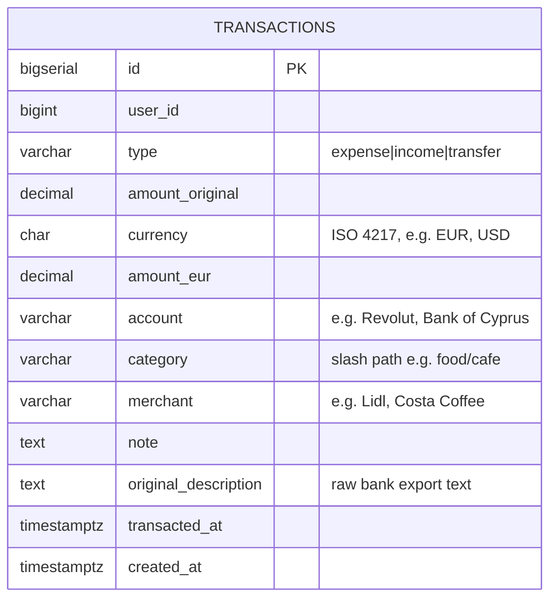
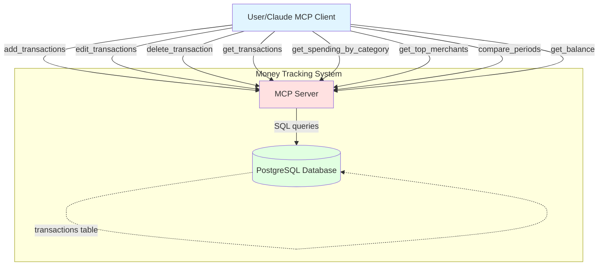
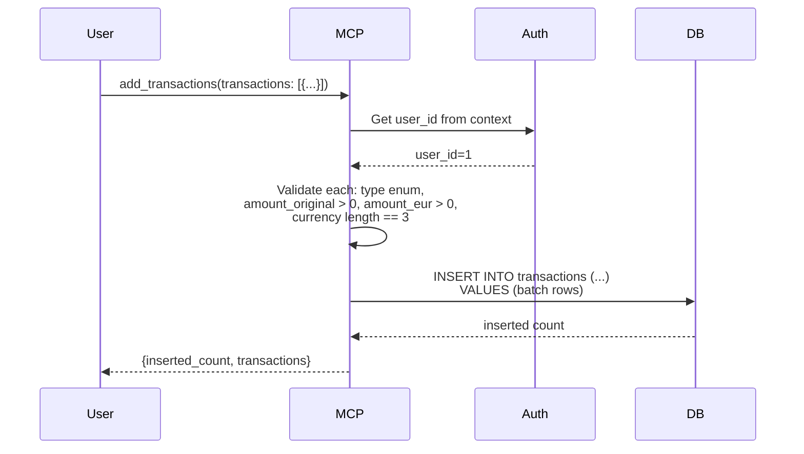
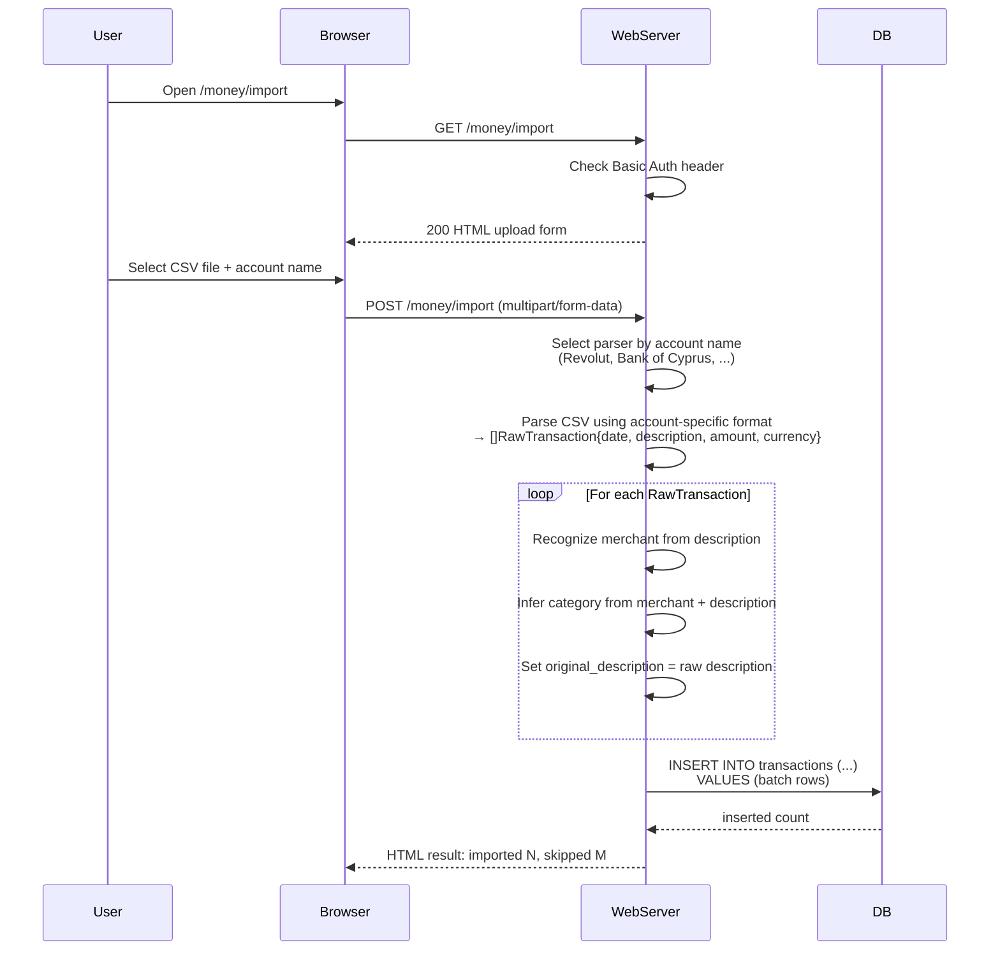
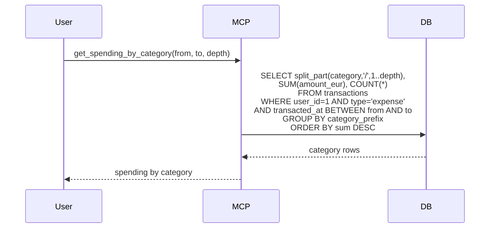
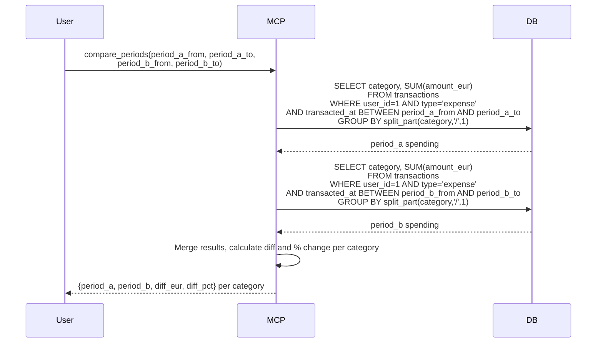
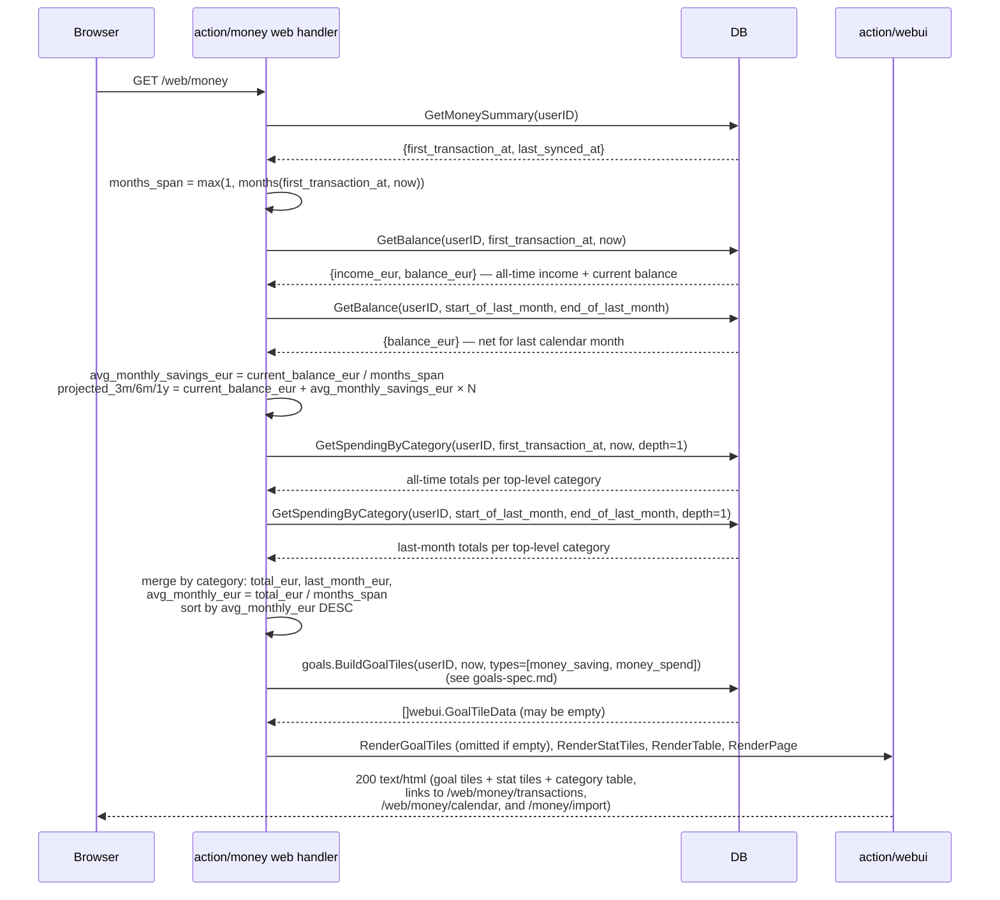
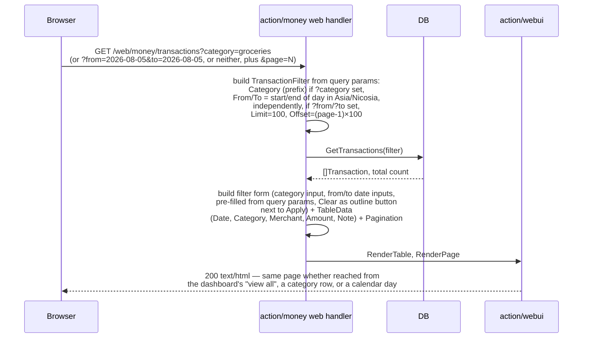
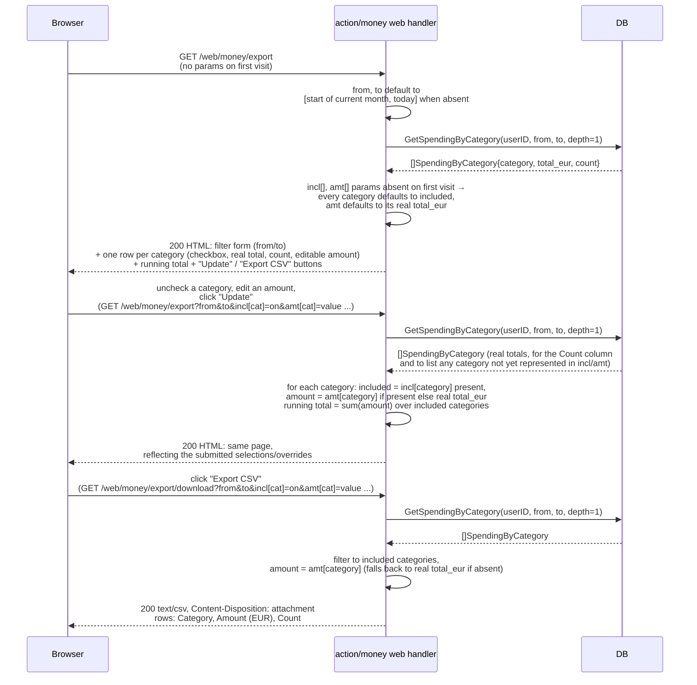

# Money Tracking System - Complete Specification

## Overview

System for tracking personal financial transactions, income, and expenses with MCP (Model Context Protocol) interface. Supports multi-currency logging with EUR conversion, hierarchical category paths, merchant tracking, bulk import from bank CSV exports, and analytical tools for spending analysis.

**Budgets have moved to the cross-domain Goals feature** (see `goals-spec.md`) — the old `set_budget`/`get_budget_progress` MCP tools and `budgets` table are superseded by `goals-spec.md`'s `money_spend`-type goal, alongside a new `money_saving` type and count-based goals (workout PRs, habit counts) that don't belong in the money subdomain. This spec keeps only what's genuinely money-specific: transactions and the read-only financial dashboard.

A **read-only** web dashboard (`GET /web/money`, `GET /web/money/transactions`, `GET /web/money/calendar`, `GET /web/money/export`) sits on top of this same data for reviewing the overall financial picture — balance, income/spend trends, category weight, sync freshness, a day-by-day calendar of activity — at a glance, plus a dedicated screen for exporting a category-level spending breakdown as CSV. Adding/editing/deleting transactions stays out of scope for the dashboard; it links out to the existing `/money/import` bulk-import page instead of duplicating it. Built on the shared `action/webui` design system (see `webui-spec.md`), the same way `action/progress`'s browse view is.

## Best Practices Applied

- **Multi-user Support**: All tables have user_id for data isolation (DEFAULT_USER_ID = 1)
- **User Context**: user_id extracted from authentication context (JWT/session), not passed explicitly
- **UTC Timezone**: All timestamps in UTC, timezone conversions in action layer
- **Multi-currency**: Stores original currency + amount alongside EUR equivalent at transaction time
- **Hierarchical Categories**: Slash-separated paths (e.g. `food/cafe`) — group by prefix for rollups
- **Original Description**: Raw bank text preserved for future re-categorization without data loss
- **Flat Schema**: accounts, merchants, and categories are plain strings — no foreign key overhead
- **Nullable Fields**: note and original_description are nullable for manual entries
- **Money dashboard embeds its own goal tiles, built elsewhere**: `GET /web/money` shows a `money_saving`/`money_spend` tile grid between the stat tiles and the category table, via `goals.BuildGoalTiles(ctx, db, userID, now, types)` + `webui.RenderGoalTiles` (see `goals-spec.md`) — `action/money` doesn't own any goal logic itself, it just calls the helper and drops the fragment into its page. The section disappears entirely when the user has no money goals (empty `EmptyMessage`, see `webui-spec.md`)
- **Web dashboard reuses existing analytics methods**: both the all-time and last-calendar-month figures (current balance, total income, net, per-category totals) are built from the same `GetBalance` and `GetSpendingByCategory` calls the MCP tools already use, just with different `from`/`to` bounds — the only new repository method is `GetMoneySummary`, needed because nothing today exposes the date range itself (see next point)
- **"Last sync" is import freshness, not transaction age**: `GetMoneySummary.LastSyncedAt` is `MAX(created_at)`, not `MAX(transacted_at)` — a backdated manual entry or an import of old bank history would make the newest transaction's own date look stale even right after a sync. `created_at` answers "when did I last touch this data," which is what the dashboard's sync-freshness indicator is for
- **Months-span is global, not per-category**: average monthly spend per category divides that category's all-time total by the number of months since the user's overall first transaction (`GetMoneySummary.FirstTransactionAt`), not that category's own first transaction — otherwise a category that only started appearing recently would show an inflated average relative to older categories
- **Months-span floors at 1**: `max(1, months since FirstTransactionAt)` avoids a divide-by-zero (and a meaningless huge average) for an account with less than a month of history
- **Average monthly savings drives projections, nothing new to store**: `avg_monthly_savings_eur = current_balance_eur / months_span`; the 3/6/12-month projections are `current_balance_eur + avg_monthly_savings_eur × N` computed in the handler — no repository method needed beyond the pieces above
- **Balance trend renders as a combo chart, not a plain line**: `webui.RenderComboChart` (see `webui-spec.md`) draws the -12/-9/-6/-3 month actual balances, current balance, and +3/+6/+9/+12 month projections as one series shown both as bars (the per-point magnitude reads clearly) and an overlaid line (the trend's shape reads clearly) — a plain `LineChartData` was tried first and dropped for this reason
- **One transaction list page, three entry points**: the dashboard's "view all", a category's row, and a calendar day all land on the same `GET /web/money/transactions` — the only difference is which query params (`category`, `from`, `to`) are pre-filled. This matches `TransactionFilter` already having independent `Category` and `From`/`To` fields, so no new filter combination needs to be supported server-side, only surfaced in a GET filter form
- **Transactions list filters on a from/to range, not a single day**: `?from`/`?to` are independent — either, both, or neither may be set, giving an open-ended range when only one bound is provided. A calendar day click sets both to the same date, which is exactly a one-day range, so no separate single-day query param is needed
- **Filters live in the URL, not a session**: `category`/`from`/`to`/`page` are query params on `GET /web/money/transactions`, set by an HTML `<form method="GET">` — bookmarkable/shareable, and consistent with pagination already being query-param-driven everywhere else in this design system
- **Clear sits next to Apply, not on its own line**: on both the transactions list and calendar filter forms, "Clear" is an outline-styled link-button inside the same `<fieldset role="group">` as "Apply" — a reset action, not a second row of content
- **Calendar totals are spend, not net**: each day cell shows one combined line, spend amount then transaction count in parentheses (e.g. `€42.10 (3)`) — no "transactions" wording, no separate count line — restricted to `type = 'expense'`, matching the category table's expense-only convention. A "how much did I spend that day" read, not a net-including-income one
- **Calendar day boundaries use the display timezone**: day grouping for `GetDailyTransactionSummary` uses `Asia/Nicosia` (the existing Configuration display timezone), same as the `from`/`to` query params on the transactions list — a day in the calendar and its drill-down link always mean the same 24h window
- **Calendar is a from/to range, defaulting to the last 3 months**: unlike the single-month `RenderCalendar` component call, the calendar *page* takes `?from`/`?to` and defaults to `[today - 3 calendar months, today]` when absent — 3 single-month grids stacked on one page, so the common case ("what's been going on lately") doesn't require paging month-by-month, while an arbitrary range is still one filter-form edit away
- **Calendar renders one grid per calendar month in range, newest first, zero-fills client-side**: the handler calls `GetDailyTransactionSummary(from, to)` once for the whole range (it only returns rows for days that actually have transactions), splits the result by calendar month, and calls `webui.RenderCalendar` once per month in descending order (most recent month at the top, oldest at the bottom) — each grid fills its own days with no transactions as zero-count cells rather than the DB padding empty rows
- **Calendar has one Prev/Next control for the whole page, not one per month grid**: clicking Prev/Next shifts both `from` and `to` by one calendar month and re-renders the whole stack — a single control at the top of the page, never repeated per grid (`webui.RenderCalendar`'s own per-card Prev/Next is left unset here; see webui-spec.md)
- **Calendar Next is hidden once the range reaches the current month**: shifting forward from there would only move into the future, which has nothing to show — Prev has no such limit, since browsing further into the past is always valid
- **Spending export reuses `GetSpendingByCategory`, no new repository method**: the export preview is the same top-level (`depth=1`) category breakdown the dashboard already computes for a date range — `from`/`to` are the only new query shape, and both dashboard and export can share one repository call
- **Export state lives entirely in the URL, GET-only, no session**: same convention as the transactions list and calendar filters — `from`/`to` for the date range, `incl[<category>]=on` per included category (a plain HTML checkbox; an unchecked/absent category is excluded), `amt[<category>]=<value>` per category's exported amount, pre-filled with the real total and directly editable. There is no separate "override" flag: `amt[<category>]` *is* the exported value, it just starts out equal to the real total
- **One `<form method="GET">`, two submit buttons via `formaction`**: "Update" (`formaction="/web/money/export"`) and "Export CSV" (`formaction="/web/money/export/download"`) submit the same field set — date inputs, one checkbox + one amount input per category row — to two different routes, avoiding a second form or any client-side JS to keep them in sync
- **Preview computes a running total from the submitted state, not from the DB**: once `incl`/`amt` params are present (i.e. after the first "Update" or "Export"), the preview's total row sums the *submitted* `amt` values for *included* categories — letting the user see the effect of an override or exclusion immediately, without it being silently overwritten by the real DB total on the next render
- **Export default range is the current calendar month**: unlike the transactions list (no default = all transactions) or the calendar (last 3 months), export's typical use case is "pull this month's spending" — first visit with no `from`/`to` defaults to `[start of current month, today]`, immediately adjustable via the same filter form used for "Update"
- **Category checkbox/amount table is not a shared `webui` component**: `TableData.Rows` is plain-text `[]string` cells, which can't host a checkbox or a text input — the export preview table is rendered by a local template in `action/money`, the same pattern `renderTransactionsFilterForm` already uses for the transactions filter form, not a new addition to `action/webui`

## Architecture Diagrams

### Entity Relation Diagram


```mermaid
erDiagram
    TRANSACTIONS {
        bigserial id PK
        bigint user_id
        varchar type "expense|income|transfer"
        decimal amount_original
        char currency "ISO 4217, e.g. EUR, USD"
        decimal amount_eur
        varchar account "e.g. Revolut, Bank of Cyprus"
        varchar category "slash path e.g. food/cafe"
        varchar merchant "e.g. Lidl, Costa Coffee"
        text note
        text original_description "raw bank export text"
        timestamptz transacted_at
        timestamptz created_at
    }
```

### C4 Context Diagram


```mermaid
graph TB
    User[User/Claude MCP Client]

    subgraph "Money Tracking System"
        MCP[MCP Server]
        DB[(PostgreSQL Database)]

        MCP -->|SQL queries| DB
    end

    User -->|add_transactions| MCP
    User -->|edit_transactions| MCP
    User -->|delete_transaction| MCP
    User -->|get_transactions| MCP
    User -->|get_spending_by_category| MCP
    User -->|get_top_merchants| MCP
    User -->|compare_periods| MCP
    User -->|get_balance| MCP

    DB -.->|transactions table| DB

    style User fill:#e1f5ff
    style MCP fill:#ffe1e1
    style DB fill:#e1ffe1
```

### Sequence Diagram: Add Transactions


```mermaid
sequenceDiagram
    participant User
    participant MCP
    participant Auth
    participant DB

    User->>MCP: add_transactions(transactions: [{...}])
    MCP->>Auth: Get user_id from context
    Auth-->>MCP: user_id=1

    MCP->>MCP: Validate each: type enum,<br/>amount_original > 0, amount_eur > 0,<br/>currency length == 3

    MCP->>DB: INSERT INTO transactions (...)<br/>VALUES (batch rows)
    DB-->>MCP: inserted count

    MCP-->>User: {inserted_count, transactions}
```

### Sequence Diagram: Import CSV via Web UI


```mermaid
sequenceDiagram
    participant User
    participant Browser
    participant WebServer
    participant DB

    User->>Browser: Open /money/import
    Browser->>WebServer: GET /money/import
    WebServer->>WebServer: Check Basic Auth header
    WebServer-->>Browser: 200 HTML upload form

    User->>Browser: Select CSV file + account name
    Browser->>WebServer: POST /money/import (multipart/form-data)

    WebServer->>WebServer: Select parser by account name<br/>(Revolut, Bank of Cyprus, ...)
    WebServer->>WebServer: Parse CSV using account-specific format<br/>→ []RawTransaction{date, description, amount, currency}

    loop For each RawTransaction
        WebServer->>WebServer: Recognize merchant from description
        WebServer->>WebServer: Infer category from merchant + description
        WebServer->>WebServer: Set original_description = raw description
    end

    WebServer->>DB: INSERT INTO transactions (...)<br/>VALUES (batch rows)
    DB-->>WebServer: inserted count

    WebServer-->>Browser: HTML result: imported N, skipped M
```

### Sequence Diagram: Spending Analysis


```mermaid
sequenceDiagram
    participant User
    participant MCP
    participant DB

    User->>MCP: get_spending_by_category(from, to, depth)
    MCP->>DB: SELECT split_part(category,'/',1..depth),<br/>SUM(amount_eur), COUNT(*)<br/>FROM transactions<br/>WHERE user_id=1 AND type='expense'<br/>AND transacted_at BETWEEN from AND to<br/>GROUP BY category_prefix<br/>ORDER BY sum DESC
    DB-->>MCP: category rows

    MCP-->>User: spending by category
```

### Sequence Diagram: Compare Periods


```mermaid
sequenceDiagram
    participant User
    participant MCP
    participant DB

    User->>MCP: compare_periods(period_a_from, period_a_to,<br/>period_b_from, period_b_to)

    MCP->>DB: SELECT category, SUM(amount_eur)<br/>FROM transactions<br/>WHERE user_id=1 AND type='expense'<br/>AND transacted_at BETWEEN period_a_from AND period_a_to<br/>GROUP BY split_part(category,'/',1)
    DB-->>MCP: period_a spending

    MCP->>DB: SELECT category, SUM(amount_eur)<br/>FROM transactions<br/>WHERE user_id=1 AND type='expense'<br/>AND transacted_at BETWEEN period_b_from AND period_b_to<br/>GROUP BY split_part(category,'/',1)
    DB-->>MCP: period_b spending

    MCP->>MCP: Merge results, calculate diff and % change per category

    MCP-->>User: {period_a, period_b, diff_eur, diff_pct} per category
```

### Sequence Diagram: Web Dashboard — Overview


```mermaid
sequenceDiagram
    participant Browser
    participant Handler as action/money web handler
    participant DB
    participant Webui as action/webui

    Browser->>Handler: GET /web/money
    Handler->>DB: GetMoneySummary(userID)
    DB-->>Handler: {first_transaction_at, last_synced_at}
    Handler->>Handler: months_span = max(1, months(first_transaction_at, now))

    Handler->>DB: GetBalance(userID, first_transaction_at, now)
    DB-->>Handler: {income_eur, balance_eur} — all-time income + current balance
    Handler->>DB: GetBalance(userID, start_of_last_month, end_of_last_month)
    DB-->>Handler: {balance_eur} — net for last calendar month

    Handler->>Handler: avg_monthly_savings_eur = current_balance_eur / months_span<br/>projected_3m/6m/1y = current_balance_eur + avg_monthly_savings_eur × N

    Handler->>DB: GetSpendingByCategory(userID, first_transaction_at, now, depth=1)
    DB-->>Handler: all-time totals per top-level category
    Handler->>DB: GetSpendingByCategory(userID, start_of_last_month, end_of_last_month, depth=1)
    DB-->>Handler: last-month totals per top-level category
    Handler->>Handler: merge by category: total_eur, last_month_eur,<br/>avg_monthly_eur = total_eur / months_span<br/>sort by avg_monthly_eur DESC

    Handler->>DB: goals.BuildGoalTiles(userID, now, types=[money_saving, money_spend])<br/>(see goals-spec.md)
    DB-->>Handler: []webui.GoalTileData (may be empty)

    Handler->>Webui: RenderGoalTiles (omitted if empty), RenderStatTiles, RenderTable, RenderPage
    Webui-->>Browser: 200 text/html (goal tiles + stat tiles + category table,<br/>links to /web/money/transactions,<br/>/web/money/calendar, and /money/import)
```

### Sequence Diagram: Transactions List (shared by all three entry points)


```mermaid
sequenceDiagram
    participant Browser
    participant Handler as action/money web handler
    participant DB
    participant Webui as action/webui

    Browser->>Handler: GET /web/money/transactions?category=groceries<br/>(or ?from=2026-08-05&to=2026-08-05, or neither, plus &page=N)
    Handler->>Handler: build TransactionFilter from query params:<br/>Category (prefix) if ?category set,<br/>From/To = start/end of day in Asia/Nicosia,<br/>independently, if ?from/?to set,<br/>Limit=100, Offset=(page-1)×100
    Handler->>DB: GetTransactions(filter)
    DB-->>Handler: []Transaction, total count
    Handler->>Handler: build filter form (category input, from/to date inputs,<br/>pre-filled from query params, Clear as outline button<br/>next to Apply) + TableData<br/>(Date, Category, Merchant, Amount, Note) + Pagination
    Handler->>Webui: RenderTable, RenderPage
    Webui-->>Browser: 200 text/html — same page whether reached from<br/>the dashboard's "view all", a category row, or a calendar day
```

### Sequence Diagram: Transaction Calendar

```mermaid
sequenceDiagram
    participant Browser
    participant Handler as action/money web handler
    participant DB
    participant Webui as action/webui

    Browser->>Handler: GET /web/money/calendar?from=2026-06-01&to=2026-08-22<br/>(defaults to [today - 3 calendar months, today] when absent)
    Handler->>Handler: from, to resolved to day bounds in Asia/Nicosia
    Handler->>DB: GetDailyTransactionSummary(userID, from, to)
    DB-->>Handler: []DailySummary — one row per day that has transactions,<br/>spanning however many calendar months [from, to] covers
    Handler->>Handler: split DailySummary rows by calendar month, newest first;<br/>for each month, build a 7-column week grid,<br/>filling days with no transactions as zero-count cells;<br/>each day with Count > 0 shows "€spend (count)" and links to<br/>/web/money/transactions?from=YYYY-MM-DD&to=YYYY-MM-DD
    Handler->>Handler: build one page-level Prev/Next nav<br/>(Next omitted once the range reaches the current month)
    loop For each calendar month in [from, to], newest first
        Handler->>Webui: RenderCalendar(monthGrid)<br/>(no per-grid Prev/Next)
    end
    Handler->>Webui: RenderPage(page-level nav,<br/>the from/to filter form with Clear next to Apply,<br/>then the calendar grids stacked newest-first)
    Webui-->>Browser: 200 text/html

    Browser->>Handler: click a day → GET /web/money/transactions?from=2026-08-05&to=2026-08-05
    Note over Browser,Handler: handled by the Transactions List flow above
```

### Sequence Diagram: Spending Export


```mermaid
sequenceDiagram
    participant Browser
    participant Handler as action/money web handler
    participant DB

    Browser->>Handler: GET /web/money/export<br/>(no params on first visit)
    Handler->>Handler: from, to default to<br/>[start of current month, today] when absent
    Handler->>DB: GetSpendingByCategory(userID, from, to, depth=1)
    DB-->>Handler: []SpendingByCategory{category, total_eur, count}
    Handler->>Handler: incl[], amt[] params absent on first visit →<br/>every category defaults to included,<br/>amt defaults to its real total_eur
    Handler-->>Browser: 200 HTML: filter form (from/to)<br/>+ one row per category (checkbox, real total, count, editable amount)<br/>+ running total + "Update" / "Export CSV" buttons

    Browser->>Handler: uncheck a category, edit an amount,<br/>click "Update"<br/>(GET /web/money/export?from&to&incl[cat]=on&amt[cat]=value ...)
    Handler->>DB: GetSpendingByCategory(userID, from, to, depth=1)
    DB-->>Handler: []SpendingByCategory (real totals, for the Count column<br/>and to list any category not yet represented in incl/amt)
    Handler->>Handler: for each category: included = incl[category] present,<br/>amount = amt[category] if present else real total_eur<br/>running total = sum(amount) over included categories
    Handler-->>Browser: 200 HTML: same page,<br/>reflecting the submitted selections/overrides

    Browser->>Handler: click "Export CSV"<br/>(GET /web/money/export/download?from&to&incl[cat]=on&amt[cat]=value ...)
    Handler->>DB: GetSpendingByCategory(userID, from, to, depth=1)
    DB-->>Handler: []SpendingByCategory
    Handler->>Handler: filter to included categories,<br/>amount = amt[category] (falls back to real total_eur if absent)
    Handler-->>Browser: 200 text/csv, Content-Disposition: attachment<br/>rows: Category, Amount (EUR), Count
```

## Database Schema

### SQL DDL

```sql
CREATE TABLE IF NOT EXISTS transactions (
    id               BIGSERIAL PRIMARY KEY,
    user_id          BIGINT NOT NULL,
    type             VARCHAR(10) NOT NULL,           -- 'expense', 'income', 'transfer'
    amount_original  DECIMAL(12,2) NOT NULL,
    currency         CHAR(3) NOT NULL,               -- ISO 4217, e.g. 'EUR', 'USD'
    amount_eur       DECIMAL(12,2) NOT NULL,
    account          VARCHAR(100) NOT NULL,
    category         VARCHAR(255) NOT NULL DEFAULT '',
    merchant         VARCHAR(255) NOT NULL DEFAULT '',
    note             TEXT,
    original_description TEXT,
    transacted_at    TIMESTAMPTZ NOT NULL,
    created_at       TIMESTAMPTZ NOT NULL DEFAULT NOW(),

    CONSTRAINT check_type CHECK (type IN ('expense', 'income', 'transfer')),
    CONSTRAINT check_amount_original CHECK (amount_original > 0),
    CONSTRAINT check_amount_eur CHECK (amount_eur > 0),
    CONSTRAINT check_currency_length CHECK (char_length(currency) = 3)
);

CREATE INDEX idx_transactions_user_date   ON transactions(user_id, transacted_at DESC);
CREATE INDEX idx_transactions_user_cat    ON transactions(user_id, category);
CREATE INDEX idx_transactions_user_type   ON transactions(user_id, type);
CREATE INDEX idx_transactions_merchant    ON transactions(user_id, merchant);
```

## Go Code Structure

### Domain Models

```go
package money

import "time"

// TransactionType represents the direction of a financial transaction
type TransactionType string

const (
    TransactionTypeExpense  TransactionType = "expense"
    TransactionTypeIncome   TransactionType = "income"
    TransactionTypeTransfer TransactionType = "transfer"
)

// Transaction represents a single financial record
type Transaction struct {
    ID                  int64           `json:"id" db:"id"`
    UserID              int64           `json:"user_id" db:"user_id"`
    Type                TransactionType `json:"type" db:"type"`
    AmountOriginal      float64         `json:"amount_original" db:"amount_original"`
    Currency            string          `json:"currency" db:"currency"`
    AmountEUR           float64         `json:"amount_eur" db:"amount_eur"`
    Account             string          `json:"account" db:"account"`
    Category            string          `json:"category" db:"category"`
    Merchant            string          `json:"merchant" db:"merchant"`
    Note                *string         `json:"note,omitempty" db:"note"`
    OriginalDescription *string         `json:"original_description,omitempty" db:"original_description"`
    TransactedAt        time.Time       `json:"transacted_at" db:"transacted_at"`
    CreatedAt           time.Time       `json:"created_at" db:"created_at"`
}

// TransactionFilter defines query parameters for listing transactions
type TransactionFilter struct {
    UserID   int64
    From     *time.Time
    To       *time.Time
    Account  *string
    Category *string
    Type     *TransactionType
    Merchant *string
    Limit    int
    Offset   int
}

// SpendingByCategory is an aggregated spending row for one category prefix
type SpendingByCategory struct {
    Category   string  `json:"category"`
    TotalEUR   float64 `json:"total_eur"`
    Count      int     `json:"count"`
}

// MerchantSummary is an aggregated row for one merchant
type MerchantSummary struct {
    Merchant string  `json:"merchant"`
    TotalEUR float64 `json:"total_eur"`
    Count    int     `json:"count"`
}

// PeriodSpending is spending aggregated by category for one period
type PeriodSpending struct {
    From       time.Time            `json:"from"`
    To         time.Time            `json:"to"`
    Categories []SpendingByCategory `json:"categories"`
    TotalEUR   float64              `json:"total_eur"`
}

// PeriodComparison is a side-by-side comparison of two periods
type PeriodComparison struct {
    PeriodA  PeriodSpending       `json:"period_a"`
    PeriodB  PeriodSpending       `json:"period_b"`
    Diff     []CategoryDiff       `json:"diff"`
}

// CategoryDiff is the delta between two periods for one category
type CategoryDiff struct {
    Category string  `json:"category"`
    PeriodA  float64 `json:"period_a_eur"`
    PeriodB  float64 `json:"period_b_eur"`
    DiffEUR  float64 `json:"diff_eur"`
    DiffPct  float64 `json:"diff_pct"`
}

// BalanceResult is income minus expenses for a period
type BalanceResult struct {
    From        time.Time `json:"from"`
    To          time.Time `json:"to"`
    IncomeEUR   float64   `json:"income_eur"`
    ExpenseEUR  float64   `json:"expense_eur"`
    BalanceEUR  float64   `json:"balance_eur"`
}

// MoneySummary is the two dates the web dashboard needs and nothing else
// exposes: the start of the user's transaction history (to bound the
// "all time" queries and compute months-span for averages) and the last
// sync/import timestamp (to show data freshness). Both are nil when the
// user has no transactions yet.
type MoneySummary struct {
    FirstTransactionAt *time.Time `json:"first_transaction_at,omitempty"` // MIN(transacted_at)
    LastSyncedAt        *time.Time `json:"last_synced_at,omitempty"`      // MAX(created_at) — import freshness, not transaction age
}

// DailySummary is one calendar day's activity — powers the transaction
// calendar. Only days with at least one transaction are returned by the
// repository; the handler zero-fills the rest of the displayed month.
type DailySummary struct {
    Date     time.Time `json:"date"`      // day, truncated to midnight in the display timezone
    Count    int       `json:"count"`     // all transaction types
    SpendEUR float64   `json:"spend_eur"` // sum of amount_eur where type = 'expense' only
}

// TransactionUpdate is one item in a bulk edit_transactions call — all fields optional except ID
type TransactionUpdate struct {
    ID           int64            `json:"id"`
    Type         *TransactionType `json:"type,omitempty"`
    AmountOriginal *float64       `json:"amount_original,omitempty"`
    Currency     *string          `json:"currency,omitempty"`
    AmountEUR    *float64         `json:"amount_eur,omitempty"`
    Account      *string          `json:"account,omitempty"`
    Category     *string          `json:"category,omitempty"`
    Merchant     *string          `json:"merchant,omitempty"`
    Note         *string          `json:"note,omitempty"`
    TransactedAt *time.Time       `json:"transacted_at,omitempty"`
}
```

### Repository Interface

```go
type DB interface {
    // Write
    AddTransactions(ctx context.Context, txs []*domain.Transaction) (int, error)
    EditTransactions(ctx context.Context, userID int64, updates []domain.TransactionUpdate) (int, error)
    DeleteTransaction(ctx context.Context, id int64, userID int64) error

    // Read
    GetTransactions(ctx context.Context, filter domain.TransactionFilter) ([]*domain.Transaction, error)

    // Analytics
    GetSpendingByCategory(ctx context.Context, userID int64, from, to time.Time, depth int) ([]domain.SpendingByCategory, error)
    GetTopMerchants(ctx context.Context, userID int64, from, to time.Time, limit int) ([]domain.MerchantSummary, error)
    GetSpendingForPeriod(ctx context.Context, userID int64, from, to time.Time) ([]domain.SpendingByCategory, error)
    GetBalance(ctx context.Context, userID int64, from, to time.Time) (domain.BalanceResult, error)

    // GetMoneySummary returns the user's first transaction date and last
    // sync/import timestamp — powers the web dashboard's sync-freshness
    // stat tile and the months-span used for every "average monthly" figure.
    GetMoneySummary(ctx context.Context, userID int64) (domain.MoneySummary, error)

    // GetDailyTransactionSummary returns one DailySummary per day in
    // [from, to] that has at least one transaction, day boundaries computed
    // in the display timezone — powers the transaction calendar.
    GetDailyTransactionSummary(ctx context.Context, userID int64, from, to time.Time) ([]domain.DailySummary, error)
}
```

## MCP Tools

### edit_transactions
Batch-edit transactions by ID; all fields except `id` are optional per item, only provided fields change. Any ID not found or not owned by the user aborts the whole batch with no partial updates.

### delete_transaction
Deletes a transaction by ID after verifying it belongs to the user.

### add_transactions
Bulk-inserts multiple transactions in one call after validating each; returns all created records.

### get_transactions
Lists transactions with optional filters (from/to/account/category/type/merchant). `category` matches by prefix (`LIKE 'food%'`). Default limit 50, max 200.

### get_spending_by_category
Aggregated spending per category for a period, grouped by `split_part(category, '/', 1..depth)`, ordered by total_eur DESC.

### get_top_merchants
Top merchants ranked by total spend for a period (type=expense, grouped by merchant, default limit 10).

### compare_periods
Side-by-side spending comparison between two periods, merged by top-level category with diff_eur and diff_pct computed per category.

### get_balance
Income minus expenses for a period in one aggregation query; transfer transactions are excluded from the balance.

## Web UI

### Money Dashboard

**Route**: `GET /web/money`
**Auth**: `WebMiddleware` session cookie (see `auth-spec.md`), same as every other `/web/*` dashboard

Read-only overview built on the shared `action/webui` design system (see `webui-spec.md`):
- Stat tiles: last sync date (`GetMoneySummary.LastSyncedAt`), current balance, total income (all time), net for last calendar month, average monthly savings, and projected balance 3 months / 6 months / 1 year out (see the "Web Dashboard" sequence diagram and Best Practices above for how each is derived)
- A financial goal tile grid (`money_saving`/`money_spend` types only) via `goals.BuildGoalTiles` + `webui.RenderGoalTiles` (see `goals-spec.md`), placed directly below the stat tiles — omitted entirely when the user has no money goals
- A balance trend combo chart (`webui.RenderComboChart`, see `webui-spec.md`) plotting actual balance 12/9/6/3 months ago through the current balance to a 3/6/9/12-month projection, as one series drawn as both a bar and an overlaid line
- A table of top-level categories sorted by average monthly spend descending, columns: Category, Avg monthly spend, Total (all time), Last month — each row links to `/web/money/transactions?category=:category`
- A "View all transactions" link to `/web/money/transactions` (no filters — most recent first)
- A "Calendar" link to `/web/money/calendar`
- A link to `/money/import` for bulk-importing new transactions

Empty state (no transactions yet, `GetMoneySummary.FirstTransactionAt == nil`): stat tiles show zero/placeholder values and the category table is empty, rather than the handler erroring — this is a fresh account's expected first-visit state, not a failure.

### Transactions List

**Route**: `GET /web/money/transactions`
**Auth**: same `WebMiddleware` session cookie

The one paginated transaction list page in the dashboard — every entry point (dashboard "view all", a category's table row, a calendar day) links here, differing only in which query params are pre-filled:
- `?category=groceries` — prefix-matches `TransactionFilter.Category`, same semantics as `get_transactions` MCP tool
- `?from=2026-08-05&?to=2026-08-10` — resolved to `TransactionFilter.From`/`To` = start/end of day in the display timezone (Asia/Nicosia); `from` and `to` are independent, so either alone gives an open-ended range. A calendar day click sets both to the same date
- `?page=N` — 1-indexed, page size 100 (see Configuration)
- `category`, `from`, and `to` can all be combined; all are optional

A GET `<form>` at the top of the page (category text input, from/to date inputs, "Apply" button, "Clear" as an outline-styled link-button right next to Apply in the same fieldset) lets the user set or change any filter directly in the UI — submitting it just re-navigates to this same URL with different query params, so the filter state is always in the URL, never server-side session state. Table columns: Date, Category, Merchant, Amount (EUR), Note. No stat tiles.

### Transaction Calendar

**Route**: `GET /web/money/calendar`
**Auth**: same `WebMiddleware` session cookie

One or more month-grid calendars (weeks as rows, Mon–Sun as columns) stacked on one page in descending order — most recent month at the top, oldest at the bottom — built from a single `GetDailyTransactionSummary` call over the requested range and split by calendar month — one `webui.RenderCalendar` call per month (see `webui-spec.md`; that component itself only ever renders one month, with no per-grid Prev/Next of its own on this page). Each day cell shows one combined line, the day's total spend then transaction count in parentheses (EUR, expense-only — see Best Practices), e.g. `€42.10 (3)` — no separate count line, no "transactions" wording. A day with `Count > 0` links to `/web/money/transactions?from=YYYY-MM-DD&to=YYYY-MM-DD` (both set to that day), a day with no transactions is not a link.
- `?from=2026-06-01&to=2026-08-22` selects the range; both default to `[today - 3 calendar months, today]` when either is absent — the common case is "what's been going on lately," not a single month
- A GET `<form>` (from/to date inputs, "Apply" button, "Clear" as an outline-styled link-button next to Apply — "Clear" returns to the 3-month default) lets the user widen or narrow the range directly in the UI, same convention as the Transactions List filter form
- A single Prev/Next control at the top of the page — not repeated per month grid — shifts both `from` and `to` back/forward by one calendar month. Prev is never disabled (browsing further into the past is always valid); Next is hidden once the range already reaches the current month, since shifting further would only move into the future

### Spending Export

**Route**: `GET /web/money/export`, `GET /web/money/export/download`
**Auth**: same `WebMiddleware` session cookie

A dedicated screen for reviewing and exporting a category-level spending breakdown as CSV, separate from the read-only `/web/money` overview — for pulling a clean, shareable figure out of the system (e.g. to hand to someone else) without going through the raw transaction export or asking the agent. Linked from the money dashboard alongside "View all transactions" and "Calendar".

Both routes share the same query params, all optional, all GET (no session state, no POST):
- `from`, `to` — date range, `YYYY-MM-DD`, resolved to day bounds in the display timezone (Asia/Nicosia), same convention as the transactions list and calendar. Default when both absent: `[start of current month, today]`
- `incl[<category>]=on` — one checkbox per category; present = included in the preview total and the export, absent = excluded. Every category is included by default when no `incl` params are present at all (first visit)
- `amt[<category>]=<value>` — the amount that will be exported for that category; pre-filled with the real computed total (`GetSpendingByCategory`'s `total_eur`), directly editable to redact or adjust the figure. `GetSpendingByCategory`'s `count` is shown read-only and is never editable

**`GET /web/money/export`** (preview) renders:
- The date filter form (from/to inputs, "Apply" — same outline-Clear-next-to-Apply convention as the rest of the dashboard)
- One `<form method="GET">` containing: a table with one row per top-level category — checkbox, category name, real total (EUR), count, editable amount input — a running total row (sum of `amt` over included rows, computed from the submitted state so an edit or exclusion is reflected immediately), and two submit buttons: "Update" (`formaction="/web/money/export"`) and "Export CSV" (`formaction="/web/money/export/download"`)

**`GET /web/money/export/download`** re-runs `GetSpendingByCategory` for the same `from`/`to`, filters to categories present in `incl`, and streams `text/csv` with `Content-Disposition: attachment; filename="spending-export-<from>-<to>.csv"`, columns: Category, Amount (EUR), Count.

### Import Page

**Route**: `GET /money/import`, `POST /money/import`
**Auth**: HTTP Basic Auth

Simple HTML page for uploading bank CSV exports. Not exposed via MCP — intended for manual bulk import sessions.

**GET** — renders upload form with:
- File input (CSV)
- Account name text field (e.g. "Revolut", "Bank of Cyprus")
- Submit button

**POST** — processes uploaded file in three stages:

**Stage 1 — Account-specific parsing** (branches by account name):
- Select parser implementation by account name (e.g. `RevolutParser`, `BankOfCyprusParser`)
- Each parser knows its CSV columns, date format, amount sign convention
- Output: `[]RawTransaction{date, description, amount, currency}`
- If amount < 0 → type = expense; if amount > 0 → type = income

**Stage 2 — Merchant recognition** (account-agnostic):
- Strip noise from description (store numbers, city suffixes, terminal IDs)
- Normalize to clean merchant name (e.g. `"LIDL CYPRUS 0042 NICOSIA"` → `"Lidl"`)
- Set `original_description` = raw description before any normalization

**Stage 3 — Categorization** (account-agnostic):
- Infer `category` from merchant name + description using keyword heuristics
- Falls back to empty string if no match — agent can fix later via `edit_transactions`

**Final step**:
- `amount_eur` = amount if currency = EUR, else store original and set amount_eur = 0 for manual correction
- Bulk insert via `AddTransactions`
- Render result page: imported N rows, skipped M rows (duplicates or parse errors)

## Configuration

- **Default User ID**: 1 (DEFAULT_USER_ID constant)
- **Display Timezone**: Asia/Nicosia (for day boundaries in analytics)
- **Database Timezone**: UTC (all timestamps stored in UTC)
- **Transaction Types**: expense, income, transfer
- **Default Query Limit**: 50
- **Max Query Limit**: 200
- **Category Depth Default**: 1 (top-level grouping)
- **Web Money Transactions List Page Size**: 100 (`GET /web/money/transactions`, distinct from the MCP `get_transactions` default limit of 50)
- **Spending Export Default Range**: current calendar month (`[start of current month, today]`) when `from`/`to` are absent
- **Spending Export Category Depth**: 1 (top-level grouping, same as the dashboard's category table)
