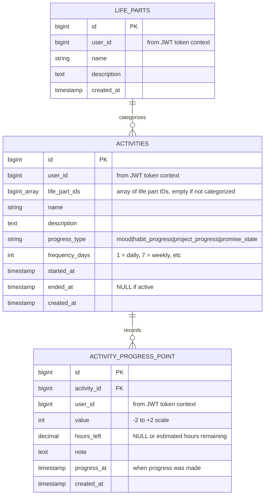

# Live Goals Tracking System - Complete Specification

## Overview

System for tracking progress across life areas, projects, and goals with periodic reflection and statistics. Supports different progress types
(mood, habit progress, project progress, promise state), enables daily/weekly reflections, and provides detailed statistics on trends and completion
rates. Activities can represent habits (daily recurring), projects (time-bound with completion), or maintenance goals (ongoing without completion).

## Features

### Core Entities

**Life Parts** - Categorize activities by life area (discipline, health, fame, professionalism, business, career). Important for organizing
reflections by theme and understanding life balance.

**Activities** - Represent trackable items like habits, projects, or goals. Important for defining what to track and how frequently to check in.

**Activity Progress Points** - Record progress values at specific times. Important for tracking trends, calculating statistics, and reflecting on
movement towards goals.

### Key Actions

**Create Activity** - Define new trackable activity with progress scale type and check-in frequency. Important to establish tracking system and
reflection cadence.

**Create Life Part** - Organize activities into life areas. Important for structured reflection and balanced life review.

**Create Progress Point** - Log progress with value and optional notes. Important for building historical data and trend analysis.

**Get Activity List** - View all active activities ordered by priority. Important for systematic reflection without missing items.

**Get Activity Stats** - View last 3 points, trend averages, and percentiles. Important for understanding current state and progress direction.

**Get New Points** - View recently created points (last 6 hours). Important for summarizing completed reflection sessions.

**Finish Activity** - Mark activity as completed and set end date. Important for project completion and preventing future check-ins.

## Database



## Entities

```go
package progress

import "time"

// ProgressType represents the value scale used for tracking
type ProgressType string

const (
    ProgressTypeMood           ProgressType = "mood"            // Emotional state scale
    ProgressTypeHabitProgress  ProgressType = "habit_progress"  // Adherence to habit scale
    ProgressTypeProjectProgress ProgressType = "project_progress" // Movement towards goal scale
    ProgressTypePromiseState   ProgressType = "promise_state"   // Commitment tracking scale
)

// ProgressValue scale: -2 to +2
// For mood: red/hell (-2), black/dark (-1), gray (0), white/bright (+1), green/happy (+2)
// For habit_progress: missing (-2), mostly not doing (-1), trying (0), mostly doing (+1), doing well (+2)
// For project_progress: plans changed (-2), rolled back (-1), stuck (0), moving forward (+1), good progress (+2)
// For promise_state: I forgot (-1), I remember (0), I am trying (+1), [special: done/failed outside scale]

// LifePart represents a life area categorization
type LifePart struct {
    ID          int64     `json:"id" db:"id"`
    UserID      int64     `json:"user_id" db:"user_id"`
    Name        string    `json:"name" db:"name" jsonschema:"Life area name"`
    Description string    `json:"description,omitempty" db:"description" jsonschema:"Life area description"`
    CreatedAt   time.Time `json:"created_at" db:"created_at"`
}

// Activity represents a trackable goal or habit
type Activity struct {
    ID            int64        `json:"id" db:"id"`
    UserID        int64        `json:"user_id" db:"user_id"`
    LifePartIDs   []int64      `json:"life_part_ids,omitempty" db:"life_part_ids" jsonschema:"Array of life part IDs this activity belongs to"`
    Name          string       `json:"name" db:"name" jsonschema:"Activity name"`
    Description   string       `json:"description,omitempty" db:"description" jsonschema:"Activity description"`
    ProgressType  ProgressType `json:"progress_type" db:"progress_type" jsonschema:"Progress value scale type (mood|habit_progress|project_progress|promise_state)"`
    FrequencyDays int          `json:"frequency_days" db:"frequency_days" jsonschema:"Check-in frequency in days (1 = daily, 7 = weekly)"`
    StartedAt     time.Time    `json:"started_at" db:"started_at"`
    EndedAt       time.Time    `json:"ended_at,omitempty" db:"ended_at"` // Zero value if active
    CreatedAt     time.Time    `json:"created_at" db:"created_at"`
}

// ActivityPoint represents a single progress point
type ActivityPoint struct {
    ID         int64     `json:"id" db:"id"`
    ActivityID int64     `json:"activity_id" db:"activity_id" jsonschema:"Activity ID this progress point belongs to"`
    UserID     int64     `json:"user_id" db:"user_id"`
    Value      int       `json:"value" db:"value" jsonschema:"Progress value from -2 to +2"`
    HoursLeft  float64   `json:"hours_left,omitempty" db:"hours_left" jsonschema:"Estimated hours remaining for projects (0 if not tracking)"`
    Note       string    `json:"note,omitempty" db:"note" jsonschema:"Optional note about this progress point"`
    ProgressAt  time.Time `json:"progress_at" db:"progress_at" jsonschema:"When progress was made (defaults to now if empty)"`
    CreatedAt  time.Time `json:"created_at" db:"created_at"`
}

// ActivityStats represents calculated statistics for an activity
type ActivityStats struct {
    ActivityID        int64              `json:"activity_id" jsonschema:"Activity ID"`
    Last3Points       []ActivityPoint `json:"last_3_points" jsonschema:"Last 3 progress points"`
    TrendOverall      TrendStats         `json:"trend_overall" jsonschema:"Statistics for all time"`
    TrendLastMonth    TrendStats         `json:"trend_last_month" jsonschema:"Statistics for last 30 days"`
    TrendLastWeek     TrendStats         `json:"trend_last_week" jsonschema:"Statistics for last 7 days"`
}

// TrendStats represents aggregated trend data for a time period
type TrendStats struct {
    Count         int     `json:"count" jsonschema:"Number of progress points in this period"`
    Average       float64 `json:"average,omitempty" jsonschema:"Average progress value (0 if no data)"`
    Percentile80  float64 `json:"percentile_80,omitempty" jsonschema:"80th percentile value (0 if no data)"`
}

// ProgressTypeExamples represents all natural language mapping examples
type ProgressTypeExamples struct {
    Examples []ProgressTypeMapping `json:"examples" jsonschema:"Mapping examples for each progress type"`
}

// ProgressTypeMapping represents mapping examples for a single progress type
type ProgressTypeMapping struct {
    ProgressType ProgressType `json:"progress_type" jsonschema:"Progress type (mood|habit_progress|project_progress|promise_state)"`
    Mappings     []MappingSet `json:"mappings" jsonschema:"Different mapping metaphors for this progress type"`
}

// MappingSet represents a single mapping metaphor with its values
type MappingSet struct {
    MappingName string         `json:"mapping_name" jsonschema:"Name of mapping metaphor (e.g. 'mood as weather')"`
    Values      []MappingValue `json:"values" jsonschema:"Natural language mappings for each value"`
}

// MappingValue represents a single natural language to numeric value mapping
type MappingValue struct {
    Word  string `json:"word" jsonschema:"Natural language word or phrase"`
    Value int    `json:"value" jsonschema:"Progress value from -2 to +2"`
    Emoji string `json:"emoji" jsonschema:"Associated emoji"`
}

// ActivityFilter defines query parameters for listing activities
type ActivityFilter struct {
    UserID       int64     `json:"user_id"`
    ActiveOnly   bool      `json:"active_only" jsonschema:"Only return active activities (not finished)"`
    LifePartIDs  []int64   `json:"life_part_ids,omitempty" jsonschema:"Filter by life part IDs"`
}

// ProgressFilter defines query parameters for listing progress points
type ProgressFilter struct {
    UserID     int64     `json:"user_id"`
    ActivityID int64     `json:"activity_id,omitempty" jsonschema:"Filter by activity ID (0 = all activities)"`
    From       time.Time `json:"from,omitempty" jsonschema:"Start date filter (empty = no start filter)"`
    To         time.Time `json:"to,omitempty" jsonschema:"End date filter (empty = no end filter)"`
	Limit      int64     `json:"limit,omitempty" jsonschema:"Limit of returned progresses sorted by progress_at DESC"`
}
```

## Repository

```go
// gateways/progress_repository.go
type ProgressRepository interface {
    // Life Part CRUD
    CreateLifePart(ctx context.Context, lifePart LifePart) (int64, error)
    ListLifeParts(ctx context.Context, userID int64) ([]LifePart, error)

    // Activity CRUD
    CreateActivity(ctx context.Context, activity *Activity) (int64, error)
    ListActivities(ctx context.Context, filter ActivityFilter) ([]Activity, error)
    UpdateActivity(ctx context.Context, activity *Activity) error
    FinishActivity(ctx context.Context, activityID int64, endedAt time.Time) error

    // Progress CRUD
    CreateProgress(ctx context.Context, progress *ActivityPoint) (int64, error)
    ListProgress(ctx context.Context, filter ProgressFilter) ([]ActivityPoint, error)

    // Statistics helpers
    GetTrendStats(ctx context.Context, activityID int64, from time.Time, to time.Time) (TrendStats, error)
}
```


## MCP Tools

### create_life_part
**DO NOT IMPLEMENT** - Life parts will be created via repository/script, not through MCP tools.

Creates a new life area category. Validates name is 1-100 characters. Generates ID, sets timestamps, saves to database. Returns created life part
with ID.

**Input**:
```json
{"name": "string", "description": ""}
```

**Output**:
```json
{"life_part": {"id": 123, "name": "...", "description": "...", "created_at": "..."}}
```

**Errors**: Invalid name length, database error

### create_activity
**DO NOT IMPLEMENT** - Activities will be created via repository/script, not through MCP tools.

Creates a new trackable activity. Validates all required fields, sets started_at to current time, ended_at to NULL. Requires progress_type
(mood/habit_progress/project_progress/promise_state) and frequency_days (positive integer). Activity can belong to multiple life parts via
life_part_ids array.

**Input**:
```json
{
  "name": "string",
  "progress_type": "mood|habit_progress|project_progress|promise_state",
  "frequency_days": 1,
  "life_part_ids": [123, 456],
  "description": ""
}
```

**Output**:
```json
{"activity": {"id": 456, "name": "...", "life_part_ids": [123, 456], ...}}
```

**Errors**: Invalid fields, invalid enums, database error

### get_activity_list
Lists all active activities (ended_at IS NULL) for authenticated user, ordered by frequency_days ASC (most frequent first), then by name. Returns
array of activities with basic info.

**Input**:
```json
{}
```

**Output**:
```json
{"activities": [{"id": 456, "name": "...", "progress_type": "...", "frequency_days": 1}]}
```

**Errors**: Database error

### get_progress_type_examples
Returns natural language mapping examples for all progress types. No input parameters required. Returns structured mapping sets showing how to express
progress values using natural language with emojis.

**Input**:
```json
{}
```

**Output**:
```json
{
  "examples": [
    {
      "progress_type": "mood",
      "mappings": [
        {
          "mapping_name": "mood as weather",
          "values": [
            {"word": "sunny", "value": 2, "emoji": "☀️"},
            {"word": "partly cloudy", "value": 1, "emoji": "⛅"},
            {"word": "overcast", "value": 0, "emoji": "☁️"},
            {"word": "rainy", "value": -1, "emoji": "🌧️"},
            {"word": "stormy", "value": -2, "emoji": "⛈️"}
          ]
        },
        {
          "mapping_name": "mood as light",
          "values": [
            {"word": "bright", "value": 2, "emoji": "✨"},
            {"word": "light", "value": 1, "emoji": "💡"},
            {"word": "dim", "value": 0, "emoji": "🕯️"},
            {"word": "dark", "value": -1, "emoji": "🌑"},
            {"word": "pitch black", "value": -2, "emoji": "⚫"}
          ]
        },
        {
          "mapping_name": "mood as colors",
          "values": [
            {"word": "green", "value": 2, "emoji": "💚"},
            {"word": "white", "value": 1, "emoji": "🤍"},
            {"word": "gray", "value": 0, "emoji": "🩶"},
            {"word": "black", "value": -1, "emoji": "🖤"},
            {"word": "red", "value": -2, "emoji": "❤️‍🔥"}
          ]
        }
      ]
    },
    {
      "progress_type": "habit_progress",
      "mappings": [
        {
          "mapping_name": "habit consistency",
          "values": [
            {"word": "crushing it", "value": 2, "emoji": "💪"},
            {"word": "mostly doing", "value": 1, "emoji": "👍"},
            {"word": "trying", "value": 0, "emoji": "🤔"},
            {"word": "rarely", "value": -1, "emoji": "😔"},
            {"word": "not doing", "value": -2, "emoji": "❌"}
          ]
        },
        {
          "mapping_name": "habit as garden",
          "values": [
            {"word": "blooming", "value": 2, "emoji": "🌸"},
            {"word": "growing", "value": 1, "emoji": "🌱"},
            {"word": "planted", "value": 0, "emoji": "🌰"},
            {"word": "wilting", "value": -1, "emoji": "🥀"},
            {"word": "withered", "value": -2, "emoji": "🍂"}
          ]
        }
      ]
    },
    {
      "progress_type": "project_progress",
      "mappings": [
        {
          "mapping_name": "project momentum",
          "values": [
            {"word": "breakthrough", "value": 2, "emoji": "🚀"},
            {"word": "moving forward", "value": 1, "emoji": "➡️"},
            {"word": "stuck", "value": 0, "emoji": "⏸️"},
            {"word": "setback", "value": -1, "emoji": "↩️"},
            {"word": "changed plans", "value": -2, "emoji": "🔄"}
          ]
        },
        {
          "mapping_name": "project as journey",
          "values": [
            {"word": "sprinting", "value": 2, "emoji": "🏃"},
            {"word": "walking", "value": 1, "emoji": "🚶"},
            {"word": "resting", "value": 0, "emoji": "🧘"},
            {"word": "backtracking", "value": -1, "emoji": "🔙"},
            {"word": "lost", "value": -2, "emoji": "🗺️"}
          ]
        }
      ]
    },
    {
      "progress_type": "promise_state",
      "mappings": [
        {
          "mapping_name": "promise awareness",
          "values": [
            {"word": "did something", "value": 1, "emoji": "✅"},
            {"word": "remember", "value": 0, "emoji": "💭"},
            {"word": "forgot", "value": -1, "emoji": "🤷"}
          ]
        },
        {
          "mapping_name": "promise as flame",
          "values": [
            {"word": "burning", "value": 1, "emoji": "🔥"},
            {"word": "lit", "value": 0, "emoji": "🕯️"},
            {"word": "extinguished", "value": -1, "emoji": "💨"}
          ]
        }
      ]
    }
  ]
}
```

**Errors**: None (hardcoded data)

### get_activity_stats
Returns comprehensive statistics for a specific activity. Fetches last 3 points, calculates trend averages and 80th percentiles for three time
windows: overall (from started_at), last 30 days, last 7 days. Returns NULL for periods with no data.

**Input**:
```json
{"activity_id": 456}
```

**Output**:
```json
{
  "stats": {
    "activity_id": 456,
    "last_3_points": [],
    "trend_overall": {"count": 45, "average": 1.2, "percentile_80": 2},
    "trend_last_month": {"count": 12, "average": 1.5, "percentile_80": 2},
    "trend_last_week": {"count": 3, "average": 1.8, "percentile_80": 2}
  }
}
```

**Errors**: Activity not found, unauthorized access

### create_progress_point
Creates a progress point for an activity. Validates activity ownership, validates value is between -2 and +2, sets progress_at to current time (or
provided time). Optional fields: note, hours_left (for projects tracking remaining work).

**Input**:
```json
{
  "activity_id": 456,
  "value": 1,
  "note": "",
  "hours_left": 0,
  "progress_at": ""
}
```

**Output**:
```json
{"progress": {"id": 789, "activity_id": 456, "value": 1, "progress_at": "..."}}
```

**Errors**: Activity not found, unauthorized, invalid value range

### finish_activity
Marks an activity as finished by setting ended_at timestamp. Verifies ownership, validates activity is currently active (ended_at IS NULL). Used for
completing projects or ending habits/maintenance goals.

**Input**:
```json
{
  "activity_id": 456,
  "ended_at": ""
}
```

**Output**:
```json
{
  "success": true,
  "message": "Activity finished",
  "activity": {"id": 456, "ended_at": "..."}
}
```

**Errors**: Activity not found, unauthorized, already finished

### get_new_points
Lists recently created progress points (last 6 hours) for authenticated user across all activities. Returns points with activity names, ordered by
created_at DESC. Useful for summarizing completed reflection sessions.

**Input**:
```json
{}
```

**Output**:
```json
{
  "points": [
    {
      "id": 789,
      "activity_id": 456,
      "activity_name": "...",
      "value": 1,
      "note": "...",
      "created_at": "..."
    }
  ]
}
```

**Errors**: Database error

## Database Migration

```sql
-- Life parts table
CREATE TABLE IF NOT EXISTS life_parts (
    id BIGSERIAL PRIMARY KEY,
    user_id BIGINT NOT NULL,
    name VARCHAR(100) NOT NULL,
    description TEXT,
    created_at TIMESTAMP NOT NULL DEFAULT CURRENT_TIMESTAMP
);

CREATE INDEX idx_life_parts_user_id ON life_parts(user_id);

-- Activities table
CREATE TABLE IF NOT EXISTS activities (
    id BIGSERIAL PRIMARY KEY,
    user_id BIGINT NOT NULL,
    life_part_ids BIGINT[] DEFAULT '{}',
    name VARCHAR(255) NOT NULL,
    description TEXT,
    progress_type VARCHAR(30) NOT NULL CHECK (progress_type IN ('mood', 'habit_progress', 'project_progress', 'promise_state')),
    frequency_days INT NOT NULL CHECK (frequency_days > 0),
    started_at TIMESTAMP NOT NULL DEFAULT CURRENT_TIMESTAMP,
    ended_at TIMESTAMP, -- NULL means active
    created_at TIMESTAMP NOT NULL DEFAULT CURRENT_TIMESTAMP
);

CREATE INDEX idx_activities_user_id ON activities(user_id);
CREATE INDEX idx_activities_ended_at ON activities(ended_at) WHERE ended_at IS NULL;
CREATE INDEX idx_activities_frequency ON activities(frequency_days);
CREATE INDEX idx_activities_life_part_ids ON activities USING GIN(life_part_ids);

-- Activity progress table
CREATE TABLE IF NOT EXISTS activity_progress (
    id BIGSERIAL PRIMARY KEY,
    activity_id BIGINT NOT NULL,
    user_id BIGINT NOT NULL,
    value INT NOT NULL CHECK (value BETWEEN -2 AND 2),
    hours_left DECIMAL(8,2),
    note TEXT,
    progress_at TIMESTAMP NOT NULL DEFAULT CURRENT_TIMESTAMP,
    created_at TIMESTAMP NOT NULL DEFAULT CURRENT_TIMESTAMP,

    CONSTRAINT fk_progress_activity FOREIGN KEY (activity_id) REFERENCES activities(id) ON DELETE CASCADE
);

CREATE INDEX idx_progress_activity_id ON activity_progress(activity_id);
CREATE INDEX idx_progress_user_id ON activity_progress(user_id);
CREATE INDEX idx_progress_progress_at ON activity_progress(progress_at DESC);
CREATE INDEX idx_progress_created_at ON activity_progress(created_at DESC);
```

## Dialog Instructions for AI

### Using Progress Type Examples

Before starting a reflection session, call `get_progress_type_examples()` to retrieve all available natural language mappings. This tool provides multiple
metaphorical mappings for each progress type (e.g., "mood as weather", "mood as light", "habit as garden"). Use these mappings to:

1. **Offer expressive options**: Present different metaphors to users so they can choose the most resonant way to express their state
2. **Parse responses**: Match user's natural language against the provided keywords and mappings
3. **Suggest metaphors**: When user seems stuck, suggest a specific metaphor: "Would you describe your mood more like weather, light, or colors?"
4. **Show examples with emojis**: Use the emoji field to make the conversation more visual and engaging

The examples returned by `get_progress_type_examples()` serve as the canonical source of truth for natural language to numeric value mappings. Always
prefer using these mappings over hardcoded keywords.

### Natural Language to Numeric Value Mapping

When the user describes their state in natural language, map their words to numeric values (-2 to +2) based on the activity's progress_type. The mappings
below are provided as reference, but you should primarily use the data from `get_progress_type_examples()` for the most up-to-date and comprehensive
mappings.

#### Mood Scale (progress_type: "mood")

- **+2 (Green/Happy)**: "happy", "great", "amazing", "excellent", "fantastic", "wonderful", "green", "joyful", "thrilled"
- **+1 (White/Bright)**: "good", "bright", "positive", "fine", "okay", "decent", "white", "pleasant", "alright"
- **0 (Gray/Neutral)**: "neutral", "meh", "so-so", "average", "gray", "normal", "okay-ish"
- **-1 (Black/Dark)**: "bad", "dark", "difficult", "tough", "sad", "black", "down", "low", "rough"
- **-2 (Red/Hell)**: "terrible", "awful", "hell", "horrible", "worst", "red", "miserable", "devastating"

#### Habit Progress Scale (progress_type: "habit_progress")

- **+2 (Doing well)**: "doing well", "consistent", "on track", "nailing it", "crushing it", "perfect adherence"
- **+1 (Mostly doing)**: "mostly doing", "usually", "pretty good", "often", "regularly", "most days"
- **0 (Trying)**: "trying", "working on it", "inconsistent", "sometimes", "hit or miss", "up and down"
- **-1 (Mostly not doing)**: "mostly not doing", "rarely", "struggling", "not often", "falling behind", "slipping"
- **-2 (Missing/Not doing)**: "not doing", "missing", "abandoned", "gave up", "stopped", "zero progress"

#### Project Progress Scale (progress_type: "project_progress")

- **+2 (Good progress)**: "great progress", "moving fast", "crushing it", "major breakthrough", "huge step", "significant advancement"
- **+1 (Moving forward)**: "moving forward", "making progress", "steady", "some progress", "advancing", "improving"
- **0 (Stuck)**: "stuck", "no progress", "blocked", "standstill", "paused", "stagnant", "waiting"
- **-1 (Rolled back)**: "setback", "rolled back", "step backward", "lost ground", "regressed", "went backwards"
- **-2 (Plans changed)**: "changed plans", "pivoting", "complete restart", "abandoned approach", "new direction"

**Special states** (use `finish_activity` instead of creating progress point):
- "done", "finished", "completed", "achieved" → Mark activity as finished
- "cancelled", "failed", "gave up permanently" → Mark activity as finished

#### Promise State Scale (progress_type: "promise_state")

- **+1 (Trying/Did something)**: "I'm trying", "I did something", "working on it", "made effort", "took action", "started"
- **0 (Remember)**: "I remember", "haven't started", "on my mind", "aware of it", "planning to", "thinking about it"
- **-1 (Forgot)**: "I forgot", "didn't remember", "slipped my mind", "overlooked", "forgot about it"

**Special states** (use `finish_activity` instead):
- "I did it", "completed", "fulfilled", "kept my promise" → Mark as finished
- "I failed", "broke the promise", "won't do it", "can't do it" → Mark as finished

### Conversation Flow Guidelines

#### Starting a Reflection Session

1. Call `get_progress_type_examples()` to load all available natural language mappings
2. Call `get_activity_list()` to retrieve active activities ordered by frequency
3. For each activity, call `get_activity_stats(activity_id)` to show context
4. Present stats naturally: "Last time you were at [value]. Over the past month, your average is [avg]."
5. Ask progress question based on activity type, optionally suggesting a metaphor from the examples

#### Asking Progress Questions

**For Mood activities:**
- "How are you feeling today?"
- "What's your mood like right now?"
- "Would you describe your mood more like weather (sunny ☀️ to stormy ⛈️) or light (bright ✨ to dark 🌑)?"

**For Habit activities:**
- "How's [habit name] going?"
- "Are you keeping up with [habit name]?"
- "How's your [habit name] garden? Blooming 🌸 or wilting 🥀?"

**For Project activities:**
- "Any progress on [project name]?"
- "How's [project name] moving along?"
- "Are you sprinting 🏃 or stuck resting 🧘 on [project name]?"

**For Promise activities:**
- "Did you remember to [promise description]?"
- "How's your commitment to [promise description] going?"
- "Is the flame still burning 🔥 for [promise description]?"

#### Handling User Responses

1. **Parse natural language**: Look for keywords from `get_progress_type_examples()` data
2. **Infer numeric value**: Map the user's words to -2 to +2 scale using the loaded examples
3. **Use emojis in feedback**: Confirm with emoji: "So you're feeling sunny ☀️ today (+2)?"
4. **Clarify if ambiguous**: If response doesn't clearly map to a value, ask follow-up with specific metaphor options
5. **Capture notes**: If user provides details, include them in the `note` field
6. **Call MCP tool**: Use `create_progress_point` with mapped value

#### Ambiguity Handling

If the user's response doesn't clearly map to a single value, ask clarifying questions:

**Between adjacent values:**
- "Sounds like you're between 'trying' (0) and 'mostly doing' (+1) - which feels more accurate?"
- "Is this more of a 'dark' day (-1) or closer to 'hell' (-2)?"
- "Are you 'stuck' (0) or actually taking 'steps backward' (-1)?"

**Completely unclear:**
- "Could you describe that a bit more? Are things going well, poorly, or somewhere in between?"
- "On a scale from 'not doing at all' to 'crushing it', where would you say you are?"

**Multiple dimensions mentioned:**
- User: "I'm trying but struggling"
- AI: "It sounds like you're making effort ('trying' = 0) but finding it hard. Does that capture it?"

#### Offering Metaphor Choices

When a user seems uncertain or asks for guidance, offer them metaphor choices from `get_progress_type_examples()`:

**Example 1: Mood tracking**
```
AI: "How would you like to describe your mood? I can help you think of it like:
    - Weather (sunny ☀️ to stormy ⛈️)
    - Light (bright ✨ to dark 🌑)
    - Colors (green 💚 to red ❤️‍🔥)
    Which feels most natural to you?"
```

**Example 2: Habit progress**
```
AI: "Let's check in on your meditation habit. Would you describe it more like:
    - Consistency (crushing it 💪 to not doing ❌)
    - A garden (blooming 🌸 to withered 🍂)?"
User: "Hmm, the garden metaphor is nice. I'd say it's planted 🌰 but not quite growing yet."
AI: [Maps "planted" → 0 from "habit as garden" mapping]
```

**Example 3: When user expresses confusion**
```
User: "I don't know how to describe where I'm at..."
AI: "No problem! Here are some ways to think about it:
    For your project, are you more like:
    - Sprinting forward 🏃
    - Walking steadily 🚶
    - Resting/paused 🧘
    - Backtracking 🔙
    - Feeling lost 🗺️?"
```

### Example Conversation Flows

#### Mood Reflection with Metaphor
```
AI: [Calls get_progress_type_examples()]
    [Calls get_activity_list()]
    [Calls get_activity_stats(mood_activity_id)]
    "Last time you logged your mood, it was at 0 (neutral/gray). How are you feeling today?"
User: "Pretty bright actually!"
AI: [Maps "bright" → +1 using "mood as light" mapping]
    [Calls create_progress_point(mood_activity_id, value: 1, note: "")]
    "Great to hear! Capturing that as a bright day ✨. That's an improvement from last time!"
```

#### Habit Check-in
```
AI: "How's your morning workout habit going?"
User: "I'm trying but it's inconsistent, maybe 3 times this week"
AI: [Maps "trying" + "inconsistent" → 0]
    [Calls create_progress_point(workout_habit_id, value: 0, note: "3 times this week")]
    "Got it - you're working on it. 3 times is still progress!"
```

#### Project Progress
```
AI: "Any progress on your architecture strategy?"
User: "Actually hit a major breakthrough yesterday!"
AI: [Maps "major breakthrough" → +2]
    [Calls create_progress_point(project_id, value: 2, note: "breakthrough yesterday")]
    "Excellent! That's significant progress. Want to tell me more?"
```

#### Promise Follow-up
```
AI: "Did you remember to call your mom this week?"
User: "Oh no, I completely forgot!"
AI: [Maps "forgot" → -1]
    [Calls create_progress_point(promise_id, value: -1, note: "")]
    "No worries - it happens. Want to set a reminder for next week?"
```

#### Offering Metaphor When User is Uncertain
```
AI: "How's your project going?"
User: "I'm not sure how to describe it..."
AI: "No problem! Think of it like a journey - are you:
    - Sprinting forward 🏃 (major progress)
    - Walking steadily 🚶 (moving forward)
    - Taking a rest 🧘 (stuck/paused)
    - Backtracking 🔙 (setback)
    - Feeling lost 🗺️ (changed plans)?"
User: "Definitely backtracking. Had to redo some work."
AI: [Maps "backtracking" → -1 from "project as journey" mapping]
    [Calls create_progress_point(project_id, value: -1, note: "had to redo some work")]
    "Got it - setbacks happen. Capturing that you're backtracking 🔙 for now."
```

#### Completion Detection
```
AI: "How's the trainer project going?"
User: "I finished it! Deployed to production yesterday."
AI: [Detects "finished" - special state]
    [Calls finish_activity(trainer_project_id)]
    "Congratulations on completing it! 🎉 Marking this as done."
```

### Session Summary

After collecting progress points, call `get_new_points()` to retrieve the session's updates and present a summary with emojis:

```
AI: "Great reflection session! Here's what we captured:
    - Mood: Bright day ✨ (+1)
    - Morning workout: Planted 🌰 but not quite growing (0) - 3x this week
    - Architecture strategy: Sprinting 🏃 with major breakthrough (+2)
    - Call mom promise: Flame extinguished 💨 - forgot this time (-1)

    Keep up the sprinting pace on the architecture strategy!"
```

### Edge Cases

**User provides a numeric value directly:**
- User: "I'd say a 1"
- AI: Accept it, no need to map

**User describes multiple activities at once:**
- Parse each separately and create individual progress points

**User wants to backdate a point:**
- Accept date/time and pass in `progress_at` field
- User: "Actually yesterday was terrible"
- AI: "Got it, logging yesterday as a difficult day. What date should I record?"

**User cancels mid-session:**
- No problem - progress points are saved immediately as they're created
- Resume later by calling `get_activity_list()` again
