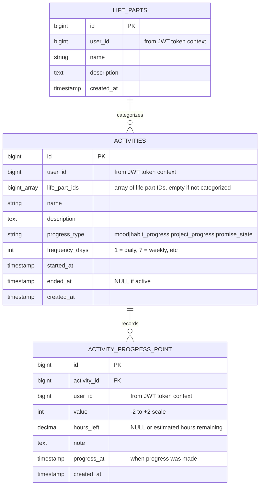
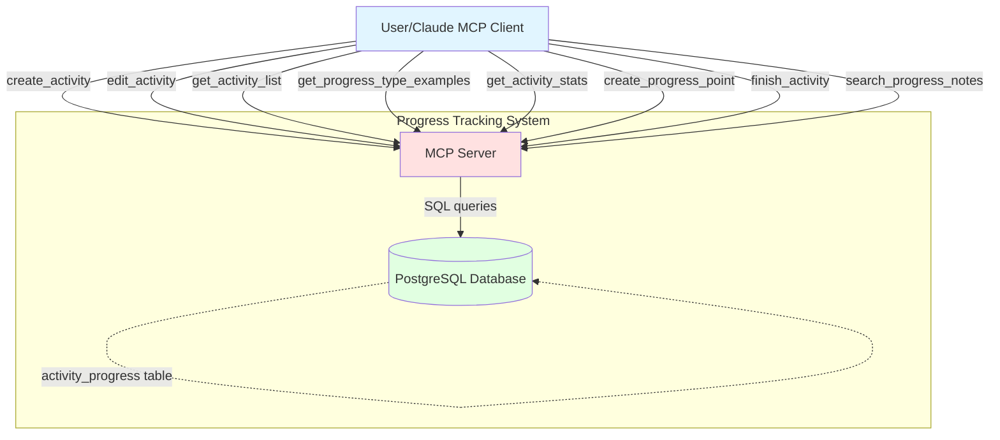
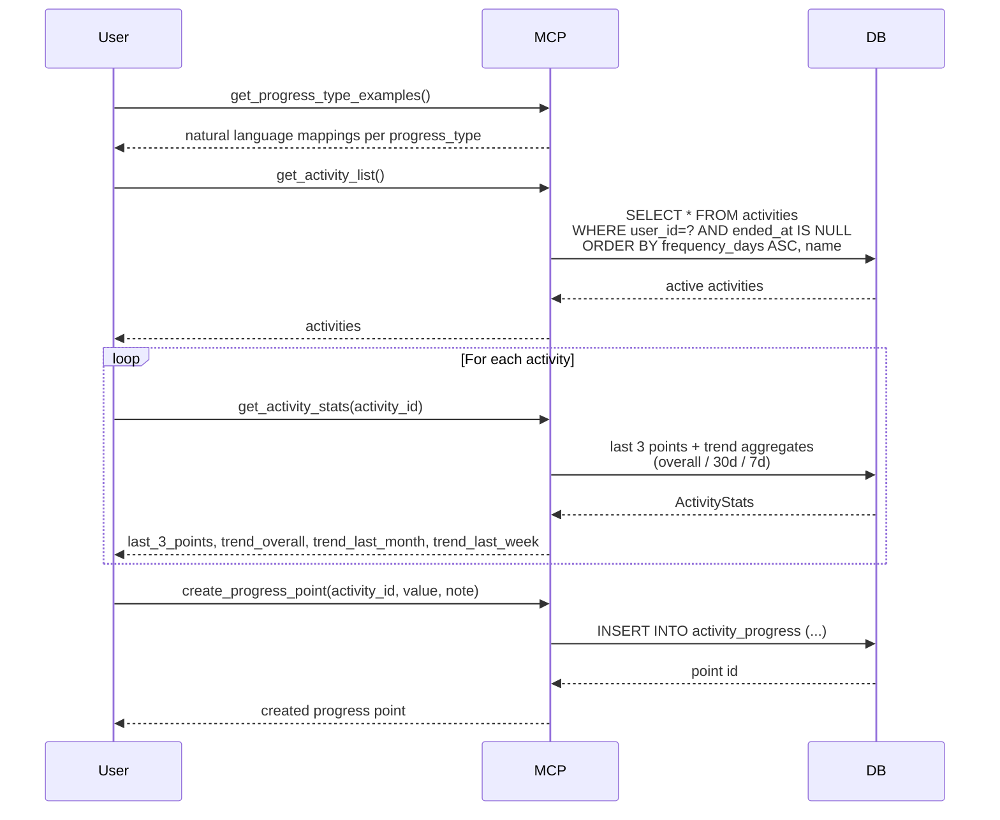

# Live Goals Tracking System - Complete Specification

## Overview

System for tracking progress across life areas, projects, and goals with periodic reflection and statistics. Supports different progress types (mood, habit progress, project progress, promise state), enables daily/weekly reflections, and provides detailed statistics on trends and completion rates. Activities can represent habits (daily recurring), projects (time-bound with completion), or maintenance goals (ongoing without completion).

## Best Practices Applied

- **Multi-user Support**: user_id extracted from JWT/session context on every table, not passed explicitly
- **Bounded Value Scale**: every progress point is a single int from -2 to +2, interpreted differently per progress_type (mood/habit_progress/project_progress/promise_state)
- **Natural Language Mapping**: `get_progress_type_examples` is the canonical source of word/emoji → value mappings, used by the AI to parse free-form user responses instead of hardcoded keyword lists
- **Flexible Activity Shapes**: frequency_days plus nullable ended_at let the same table represent daily habits, weekly check-ins, and time-bound projects
- **Optional Life-area Categorization**: life_part_ids is an array (an activity can belong to zero or more life parts); life parts themselves are seeded via repository/script, not exposed as an MCP tool
- **Multi-variant Search**: `search_progress_notes` follows the same 1-5 variant + match_count ranking pattern as `resolve_food_id_by_name` and `search_exercises`
- **UTC Timezone**: all timestamps in UTC

## Architecture Diagrams

### Entity Relation Diagram


```mermaid
erDiagram
    LIFE_PARTS ||--o{ ACTIVITIES : categorizes
    ACTIVITIES ||--o{ ACTIVITY_PROGRESS_POINT : records

    LIFE_PARTS {
        bigint id PK
        bigint user_id "from JWT token context"
        string name
        text description
        timestamp created_at
    }

    ACTIVITIES {
        bigint id PK
        bigint user_id "from JWT token context"
        bigint_array life_part_ids "array of life part IDs, empty if not categorized"
        string name
        text description
        string progress_type "mood|habit_progress|project_progress|promise_state"
        int frequency_days "1 = daily, 7 = weekly, etc"
        timestamp started_at
        timestamp ended_at "NULL if active"
        timestamp created_at
    }

    ACTIVITY_PROGRESS_POINT {
        bigint id PK
        bigint activity_id FK
        bigint user_id "from JWT token context"
        int value "-2 to +2 scale"
        decimal hours_left "NULL or estimated hours remaining"
        text note
        timestamp progress_at "when progress was made"
        timestamp created_at
    }
```

### C4 Context Diagram


```mermaid
graph TB
    User[User/Claude MCP Client]

    subgraph "Progress Tracking System"
        MCP[MCP Server]
        DB[(PostgreSQL Database)]

        MCP -->|SQL queries| DB
    end

    User -->|create_activity| MCP
    User -->|edit_activity| MCP
    User -->|get_activity_list| MCP
    User -->|get_progress_type_examples| MCP
    User -->|get_activity_stats| MCP
    User -->|create_progress_point| MCP
    User -->|finish_activity| MCP
    User -->|search_progress_notes| MCP

    DB -.->|life_parts table| DB
    DB -.->|activities table| DB
    DB -.->|activity_progress table| DB

    style User fill:#e1f5ff
    style MCP fill:#ffe1e1
    style DB fill:#e1ffe1
```

### Sequence Diagram: Reflection Check-in


```mermaid
sequenceDiagram
    participant User
    participant MCP
    participant DB

    User->>MCP: get_progress_type_examples()
    MCP-->>User: natural language mappings per progress_type

    User->>MCP: get_activity_list()
    MCP->>DB: SELECT * FROM activities<br/>WHERE user_id=? AND ended_at IS NULL<br/>ORDER BY frequency_days ASC, name
    DB-->>MCP: active activities
    MCP-->>User: activities

    loop For each activity
        User->>MCP: get_activity_stats(activity_id)
        MCP->>DB: last 3 points + trend aggregates<br/>(overall / 30d / 7d)
        DB-->>MCP: ActivityStats
        MCP-->>User: last_3_points, trend_overall, trend_last_month, trend_last_week
    end

    User->>MCP: create_progress_point(activity_id, value, note)
    MCP->>DB: INSERT INTO activity_progress (...)
    DB-->>MCP: point id
    MCP-->>User: created progress point
```

## Database Schema

### SQL DDL

```sql
-- Life parts table
CREATE TABLE IF NOT EXISTS life_parts (
    id BIGSERIAL PRIMARY KEY,
    user_id BIGINT NOT NULL,
    name VARCHAR(100) NOT NULL,
    description TEXT,
    created_at TIMESTAMP NOT NULL DEFAULT CURRENT_TIMESTAMP
);

CREATE INDEX idx_life_parts_user_id ON life_parts(user_id);

-- Activities table
CREATE TABLE IF NOT EXISTS activities (
    id BIGSERIAL PRIMARY KEY,
    user_id BIGINT NOT NULL,
    life_part_ids BIGINT[] DEFAULT '{}',
    name VARCHAR(255) NOT NULL,
    description TEXT,
    progress_type VARCHAR(30) NOT NULL CHECK (progress_type IN ('mood', 'habit_progress', 'project_progress', 'promise_state')),
    frequency_days INT NOT NULL CHECK (frequency_days > 0),
    started_at TIMESTAMP NOT NULL DEFAULT CURRENT_TIMESTAMP,
    ended_at TIMESTAMP, -- NULL means active
    created_at TIMESTAMP NOT NULL DEFAULT CURRENT_TIMESTAMP
);

CREATE INDEX idx_activities_user_id ON activities(user_id);
CREATE INDEX idx_activities_ended_at ON activities(ended_at) WHERE ended_at IS NULL;
CREATE INDEX idx_activities_frequency ON activities(frequency_days);
CREATE INDEX idx_activities_life_part_ids ON activities USING GIN(life_part_ids);

-- Activity progress table
CREATE TABLE IF NOT EXISTS activity_progress (
    id BIGSERIAL PRIMARY KEY,
    activity_id BIGINT NOT NULL,
    user_id BIGINT NOT NULL,
    value INT NOT NULL CHECK (value BETWEEN -2 AND 2),
    hours_left DECIMAL(8,2),
    note TEXT,
    progress_at TIMESTAMP NOT NULL DEFAULT CURRENT_TIMESTAMP,
    created_at TIMESTAMP NOT NULL DEFAULT CURRENT_TIMESTAMP,

    CONSTRAINT fk_progress_activity FOREIGN KEY (activity_id) REFERENCES activities(id) ON DELETE CASCADE
);

CREATE INDEX idx_progress_activity_id ON activity_progress(activity_id);
CREATE INDEX idx_progress_user_id ON activity_progress(user_id);
CREATE INDEX idx_progress_progress_at ON activity_progress(progress_at DESC);
CREATE INDEX idx_progress_created_at ON activity_progress(created_at DESC);
```

## Go Code Structure

### Domain Models

```go
package progress

import "time"

// ProgressType represents the value scale used for tracking
type ProgressType string

const (
    ProgressTypeMood            ProgressType = "mood"            // Emotional state scale
    ProgressTypeHabitProgress   ProgressType = "habit_progress"  // Adherence to habit scale
    ProgressTypeProjectProgress ProgressType = "project_progress" // Movement towards goal scale
    ProgressTypePromiseState    ProgressType = "promise_state"   // Commitment tracking scale
)

// ProgressValue scale: -2 to +2
// For mood: red/hell (-2), black/dark (-1), gray (0), white/bright (+1), green/happy (+2)
// For habit_progress: missing (-2), mostly not doing (-1), trying (0), mostly doing (+1), doing well (+2)
// For project_progress: plans changed (-2), rolled back (-1), stuck (0), moving forward (+1), good progress (+2)
// For promise_state: I forgot (-1), I remember (0), I am trying (+1), [special: done/failed outside scale]

// LifePart represents a life area categorization
type LifePart struct {
    ID          int64     `json:"id" db:"id"`
    UserID      int64     `json:"user_id" db:"user_id"`
    Name        string    `json:"name" db:"name" jsonschema:"Life area name"`
    Description string    `json:"description,omitempty" db:"description" jsonschema:"Life area description"`
    CreatedAt   time.Time `json:"created_at" db:"created_at"`
}

// Activity represents a trackable goal or habit
type Activity struct {
    ID            int64        `json:"id" db:"id"`
    UserID        int64        `json:"user_id" db:"user_id"`
    LifePartIDs   []int64      `json:"life_part_ids,omitempty" db:"life_part_ids" jsonschema:"Array of life part IDs this activity belongs to"`
    Name          string       `json:"name" db:"name" jsonschema:"Activity name"`
    Description   string       `json:"description,omitempty" db:"description" jsonschema:"Activity description"`
    ProgressType  ProgressType `json:"progress_type" db:"progress_type" jsonschema:"Progress value scale type (mood|habit_progress|project_progress|promise_state)"`
    FrequencyDays int          `json:"frequency_days" db:"frequency_days" jsonschema:"Check-in frequency in days (1 = daily, 7 = weekly)"`
    StartedAt     time.Time    `json:"started_at" db:"started_at"`
    EndedAt       time.Time    `json:"ended_at,omitempty" db:"ended_at"` // Zero value if active
    CreatedAt     time.Time    `json:"created_at" db:"created_at"`
}

// ActivityPoint represents a single progress point
type ActivityPoint struct {
    ID         int64     `json:"id" db:"id"`
    ActivityID int64     `json:"activity_id" db:"activity_id" jsonschema:"Activity ID this progress point belongs to"`
    UserID     int64     `json:"user_id" db:"user_id"`
    Value      int       `json:"value" db:"value" jsonschema:"Progress value from -2 to +2"`
    HoursLeft  float64   `json:"hours_left,omitempty" db:"hours_left" jsonschema:"Estimated hours remaining for projects (0 if not tracking)"`
    Note       string    `json:"note,omitempty" db:"note" jsonschema:"Optional note about this progress point"`
    ProgressAt time.Time `json:"progress_at" db:"progress_at" jsonschema:"When progress was made (defaults to now if empty)"`
    CreatedAt  time.Time `json:"created_at" db:"created_at"`
}

// ActivityPointWithActivity is ActivityPoint enriched with activity name, used by search_progress_notes
type ActivityPointWithActivity struct {
    ActivityPoint
    ActivityName string `json:"activity_name" db:"activity_name"`
}

// ActivityStats represents calculated statistics for an activity
type ActivityStats struct {
    ActivityID     int64           `json:"activity_id" jsonschema:"Activity ID"`
    Last3Points    []ActivityPoint `json:"last_3_points" jsonschema:"Last 3 progress points"`
    TrendOverall   TrendStats      `json:"trend_overall" jsonschema:"Statistics for all time"`
    TrendLastMonth TrendStats      `json:"trend_last_month" jsonschema:"Statistics for last 30 days"`
    TrendLastWeek  TrendStats      `json:"trend_last_week" jsonschema:"Statistics for last 7 days"`
}

// TrendStats represents aggregated trend data for a time period
type TrendStats struct {
    Count        int     `json:"count" jsonschema:"Number of progress points in this period"`
    Average      float64 `json:"average,omitempty" jsonschema:"Average progress value (0 if no data)"`
    Percentile80 float64 `json:"percentile_80,omitempty" jsonschema:"80th percentile value (0 if no data)"`
}

// ProgressTypeExamples represents all natural language mapping examples
type ProgressTypeExamples struct {
    Examples []ProgressTypeMapping `json:"examples" jsonschema:"Mapping examples for each progress type"`
}

// ProgressTypeMapping represents mapping examples for a single progress type
type ProgressTypeMapping struct {
    ProgressType ProgressType `json:"progress_type" jsonschema:"Progress type (mood|habit_progress|project_progress|promise_state)"`
    Mappings     []MappingSet `json:"mappings" jsonschema:"Different mapping metaphors for this progress type"`
}

// MappingSet represents a single mapping metaphor with its values
type MappingSet struct {
    MappingName string         `json:"mapping_name" jsonschema:"Name of mapping metaphor (e.g. 'mood as weather')"`
    Values      []MappingValue `json:"values" jsonschema:"Natural language mappings for each value"`
}

// MappingValue represents a single natural language to numeric value mapping
type MappingValue struct {
    Word  string `json:"word" jsonschema:"Natural language word or phrase"`
    Value int    `json:"value" jsonschema:"Progress value from -2 to +2"`
    Emoji string `json:"emoji" jsonschema:"Associated emoji"`
}

// ActivityFilter defines query parameters for listing activities
type ActivityFilter struct {
    UserID      int64   `json:"user_id"`
    ActiveOnly  bool    `json:"active_only" jsonschema:"Only return active activities (not finished)"`
    LifePartIDs []int64 `json:"life_part_ids,omitempty" jsonschema:"Filter by life part IDs"`
}

// ProgressFilter defines query parameters for listing progress points
type ProgressFilter struct {
    UserID     int64     `json:"user_id"`
    ActivityID int64     `json:"activity_id,omitempty" jsonschema:"Filter by activity ID (0 = all activities)"`
    From       time.Time `json:"from,omitempty" jsonschema:"Start date filter (empty = no start filter)"`
    To         time.Time `json:"to,omitempty" jsonschema:"End date filter (empty = no end filter)"`
    Limit      int64     `json:"limit,omitempty" jsonschema:"Limit of returned progresses sorted by progress_at DESC"`
}

// ProgressNoteSearchFilter defines parameters for a single-variant note search
type ProgressNoteSearchFilter struct {
    UserID     int64     `json:"user_id"`
    Query      string    `json:"query"`                 // required, ILIKE substring
    ActivityID int64     `json:"activity_id,omitempty"` // 0 = all activities
    From       time.Time `json:"from,omitempty"`
    To         time.Time `json:"to,omitempty"`
    ValueMin   *int      `json:"value_min,omitempty"`
    ValueMax   *int      `json:"value_max,omitempty"`
}
```

### Repository Interface

```go
// gateways/progress_repository.go
type ProgressRepository interface {
    // Life Part CRUD (seeded via repository/script, no MCP tool)
    CreateLifePart(ctx context.Context, lifePart LifePart) (int64, error)
    ListLifeParts(ctx context.Context, userID int64) ([]LifePart, error)

    // Activity CRUD
    CreateActivity(ctx context.Context, activity *Activity) (int64, error)
    GetActivity(ctx context.Context, activityID int64, userID int64) (*Activity, error)
    ListActivities(ctx context.Context, filter ActivityFilter) ([]Activity, error)
    UpdateActivity(ctx context.Context, activity *Activity) error
    FinishActivity(ctx context.Context, activityID int64, userID int64, endedAt time.Time) error

    // Progress CRUD
    CreateProgress(ctx context.Context, progress *ActivityPoint) (int64, error)
    ListProgress(ctx context.Context, filter ProgressFilter) ([]ActivityPoint, error)
    SearchProgressNotes(ctx context.Context, filter ProgressNoteSearchFilter) ([]ActivityPointWithActivity, error)

    // Statistics helpers
    GetTrendStats(ctx context.Context, activityID int64, from time.Time, to time.Time) (TrendStats, error)
}
```

## MCP Tools

### create_activity
Creates a new trackable activity (name, progress_type, frequency_days, optional life_part_ids/description/started_at). Validates progress_type enum and frequency_days >= 1.

### edit_activity
Updates mutable fields (name, description, frequency_days, life_part_ids) of an existing activity. At least one field required; unspecified fields keep their current value.

### get_activity_list
Lists active activities (ended_at IS NULL) ordered by frequency_days ASC, then name.

### get_progress_type_examples
Returns hardcoded natural language ↔ numeric value mapping examples (multiple metaphors per progress_type, with emojis) — no input, no DB access. Canonical source for interpreting free-form user responses.

### get_activity_stats
Returns last 3 progress points plus trend averages and 80th percentiles for three windows: overall, last 30 days, last 7 days.

### create_progress_point
Logs a progress point for an activity: value (-2 to +2, required), optional note, hours_left, and progress_at (defaults to now).

### finish_activity
Sets ended_at on an active activity, marking it complete. Errors if the activity is already finished or not owned by the user.

### search_progress_notes
Searches `activity_progress.note` by 1-5 query variants (ILIKE), with optional activity_id/from/to/value_min/value_max filters. Same match_count ranking pattern as `resolve_food_id_by_name` and `search_exercises`.

> `create_life_part` is intentionally **not** exposed as an MCP tool — life parts are seeded via repository/script.

## HTTP Handlers

### GET /web/progress
Renders a read-only dashboard of all activities with recent progress, staleness indicators, and trend summaries. Protected by the same auth middleware as other `/web/*` routes.

## Dialog & Conversation Guidelines

### Using Progress Type Examples

Before starting a reflection session, call `get_progress_type_examples()` to retrieve all available natural language mappings. This tool provides multiple
metaphorical mappings for each progress type (e.g., "mood as weather", "mood as light", "habit as garden"). Use these mappings to:

1. **Offer expressive options**: Present different metaphors to users so they can choose the most resonant way to express their state
2. **Parse responses**: Match user's natural language against the provided keywords and mappings
3. **Suggest metaphors**: When user seems stuck, suggest a specific metaphor: "Would you describe your mood more like weather, light, or colors?"
4. **Show examples with emojis**: Use the emoji field to make the conversation more visual and engaging

The examples returned by `get_progress_type_examples()` serve as the canonical source of truth for natural language to numeric value mappings. Always
prefer using these mappings over hardcoded keywords.

### Natural Language to Numeric Value Mapping

When the user describes their state in natural language, map their words to numeric values (-2 to +2) based on the activity's progress_type. The mappings
below are provided as reference, but you should primarily use the data from `get_progress_type_examples()` for the most up-to-date and comprehensive
mappings.

#### Mood Scale (progress_type: "mood")

- **+2 (Green/Happy)**: "happy", "great", "amazing", "excellent", "fantastic", "wonderful", "green", "joyful", "thrilled"
- **+1 (White/Bright)**: "good", "bright", "positive", "fine", "okay", "decent", "white", "pleasant", "alright"
- **0 (Gray/Neutral)**: "neutral", "meh", "so-so", "average", "gray", "normal", "okay-ish"
- **-1 (Black/Dark)**: "bad", "dark", "difficult", "tough", "sad", "black", "down", "low", "rough"
- **-2 (Red/Hell)**: "terrible", "awful", "hell", "horrible", "worst", "red", "miserable", "devastating"

#### Habit Progress Scale (progress_type: "habit_progress")

- **+2 (Doing well)**: "doing well", "consistent", "on track", "nailing it", "crushing it", "perfect adherence"
- **+1 (Mostly doing)**: "mostly doing", "usually", "pretty good", "often", "regularly", "most days"
- **0 (Trying)**: "trying", "working on it", "inconsistent", "sometimes", "hit or miss", "up and down"
- **-1 (Mostly not doing)**: "mostly not doing", "rarely", "struggling", "not often", "falling behind", "slipping"
- **-2 (Missing/Not doing)**: "not doing", "missing", "abandoned", "gave up", "stopped", "zero progress"

#### Project Progress Scale (progress_type: "project_progress")

- **+2 (Good progress)**: "great progress", "moving fast", "crushing it", "major breakthrough", "huge step", "significant advancement"
- **+1 (Moving forward)**: "moving forward", "making progress", "steady", "some progress", "advancing", "improving"
- **0 (Stuck)**: "stuck", "no progress", "blocked", "standstill", "paused", "stagnant", "waiting"
- **-1 (Rolled back)**: "setback", "rolled back", "step backward", "lost ground", "regressed", "went backwards"
- **-2 (Plans changed)**: "changed plans", "pivoting", "complete restart", "abandoned approach", "new direction"

**Special states** (use `finish_activity` instead of creating progress point):
- "done", "finished", "completed", "achieved" → Mark activity as finished
- "cancelled", "failed", "gave up permanently" → Mark activity as finished

#### Promise State Scale (progress_type: "promise_state")

- **+1 (Trying/Did something)**: "I'm trying", "I did something", "working on it", "made effort", "took action", "started"
- **0 (Remember)**: "I remember", "haven't started", "on my mind", "aware of it", "planning to", "thinking about it"
- **-1 (Forgot)**: "I forgot", "didn't remember", "slipped my mind", "overlooked", "forgot about it"

**Special states** (use `finish_activity` instead):
- "I did it", "completed", "fulfilled", "kept my promise" → Mark as finished
- "I failed", "broke the promise", "won't do it", "can't do it" → Mark as finished

### Conversation Flow Guidelines

#### Starting a Reflection Session

1. Call `get_progress_type_examples()` to load all available natural language mappings
2. Call `get_activity_list()` to retrieve active activities ordered by frequency
3. For each activity, call `get_activity_stats(activity_id)` to show context
4. Present stats naturally: "Last time you were at [value]. Over the past month, your average is [avg]."
5. Ask progress question based on activity type, optionally suggesting a metaphor from the examples

#### Asking Progress Questions

**For Mood activities:**
- "How are you feeling today?"
- "What's your mood like right now?"
- "Would you describe your mood more like weather (sunny ☀️ to stormy ⛈️) or light (bright ✨ to dark 🌑)?"

**For Habit activities:**
- "How's [habit name] going?"
- "Are you keeping up with [habit name]?"
- "How's your [habit name] garden? Blooming 🌸 or wilting 🥀?"

**For Project activities:**
- "Any progress on [project name]?"
- "How's [project name] moving along?"
- "Are you sprinting 🏃 or stuck resting 🧘 on [project name]?"

**For Promise activities:**
- "Did you remember to [promise description]?"
- "How's your commitment to [promise description] going?"
- "Is the flame still burning 🔥 for [promise description]?"

#### Handling User Responses

1. **Parse natural language**: Look for keywords from `get_progress_type_examples()` data
2. **Infer numeric value**: Map the user's words to -2 to +2 scale using the loaded examples
3. **Use emojis in feedback**: Confirm with emoji: "So you're feeling sunny ☀️ today (+2)?"
4. **Clarify if ambiguous**: If response doesn't clearly map to a value, ask follow-up with specific metaphor options
5. **Capture notes**: If user provides details, include them in the `note` field
6. **Call MCP tool**: Use `create_progress_point` with mapped value

#### Ambiguity Handling

If the user's response doesn't clearly map to a single value, ask clarifying questions:

**Between adjacent values:**
- "Sounds like you're between 'trying' (0) and 'mostly doing' (+1) - which feels more accurate?"
- "Is this more of a 'dark' day (-1) or closer to 'hell' (-2)?"
- "Are you 'stuck' (0) or actually taking 'steps backward' (-1)?"

**Completely unclear:**
- "Could you describe that a bit more? Are things going well, poorly, or somewhere in between?"
- "On a scale from 'not doing at all' to 'crushing it', where would you say you are?"

**Multiple dimensions mentioned:**
- User: "I'm trying but struggling"
- AI: "It sounds like you're making effort ('trying' = 0) but finding it hard. Does that capture it?"

#### Offering Metaphor Choices

When a user seems uncertain or asks for guidance, offer them metaphor choices from `get_progress_type_examples()`:

**Example 1: Mood tracking**
```
AI: "How would you like to describe your mood? I can help you think of it like:
    - Weather (sunny ☀️ to stormy ⛈️)
    - Light (bright ✨ to dark 🌑)
    - Colors (green 💚 to red ❤️‍🔥)
    Which feels most natural to you?"
```

**Example 2: Habit progress**
```
AI: "Let's check in on your meditation habit. Would you describe it more like:
    - Consistency (crushing it 💪 to not doing ❌)
    - A garden (blooming 🌸 to withered 🍂)?"
User: "Hmm, the garden metaphor is nice. I'd say it's planted 🌰 but not quite growing yet."
AI: [Maps "planted" → 0 from "habit as garden" mapping]
```

**Example 3: When user expresses confusion**
```
User: "I don't know how to describe where I'm at..."
AI: "No problem! Here are some ways to think about it:
    For your project, are you more like:
    - Sprinting forward 🏃
    - Walking steadily 🚶
    - Resting/paused 🧘
    - Backtracking 🔙
    - Feeling lost 🗺️?"
```

### Example Conversation Flows

#### Mood Reflection with Metaphor
```
AI: [Calls get_progress_type_examples()]
    [Calls get_activity_list()]
    [Calls get_activity_stats(mood_activity_id)]
    "Last time you logged your mood, it was at 0 (neutral/gray). How are you feeling today?"
User: "Pretty bright actually!"
AI: [Maps "bright" → +1 using "mood as light" mapping]
    [Calls create_progress_point(mood_activity_id, value: 1, note: "")]
    "Great to hear! Capturing that as a bright day ✨. That's an improvement from last time!"
```

#### Habit Check-in
```
AI: "How's your morning workout habit going?"
User: "I'm trying but it's inconsistent, maybe 3 times this week"
AI: [Maps "trying" + "inconsistent" → 0]
    [Calls create_progress_point(workout_habit_id, value: 0, note: "3 times this week")]
    "Got it - you're working on it. 3 times is still progress!"
```

#### Project Progress
```
AI: "Any progress on your architecture strategy?"
User: "Actually hit a major breakthrough yesterday!"
AI: [Maps "major breakthrough" → +2]
    [Calls create_progress_point(project_id, value: 2, note: "breakthrough yesterday")]
    "Excellent! That's significant progress. Want to tell me more?"
```

#### Promise Follow-up
```
AI: "Did you remember to call your mom this week?"
User: "Oh no, I completely forgot!"
AI: [Maps "forgot" → -1]
    [Calls create_progress_point(promise_id, value: -1, note: "")]
    "No worries - it happens. Want to set a reminder for next week?"
```

#### Offering Metaphor When User is Uncertain
```
AI: "How's your project going?"
User: "I'm not sure how to describe it..."
AI: "No problem! Think of it like a journey - are you:
    - Sprinting forward 🏃 (major progress)
    - Walking steadily 🚶 (moving forward)
    - Taking a rest 🧘 (stuck/paused)
    - Backtracking 🔙 (setback)
    - Feeling lost 🗺️ (changed plans)?"
User: "Definitely backtracking. Had to redo some work."
AI: [Maps "backtracking" → -1 from "project as journey" mapping]
    [Calls create_progress_point(project_id, value: -1, note: "had to redo some work")]
    "Got it - setbacks happen. Capturing that you're backtracking 🔙 for now."
```

#### Completion Detection
```
AI: "How's the trainer project going?"
User: "I finished it! Deployed to production yesterday."
AI: [Detects "finished" - special state]
    [Calls finish_activity(trainer_project_id)]
    "Congratulations on completing it! 🎉 Marking this as done."
```

### Session Summary

The AI already has a full record of every `create_progress_point` / `finish_activity` call it made during the session — no separate tool call is needed to summarize. Present a recap directly from that record:

```
AI: "Great reflection session! Here's what we captured:
    - Mood: Bright day ✨ (+1)
    - Morning workout: Planted 🌰 but not quite growing (0) - 3x this week
    - Architecture strategy: Sprinting 🏃 with major breakthrough (+2)
    - Call mom promise: Flame extinguished 💨 - forgot this time (-1)

    Keep up the sprinting pace on the architecture strategy!"
```

Use `search_progress_notes` to pull up past reflections on a topic if the user wants to look back further than the current session.

### Edge Cases

**User provides a numeric value directly:**
- User: "I'd say a 1"
- AI: Accept it, no need to map

**User describes multiple activities at once:**
- Parse each separately and create individual progress points

**User wants to backdate a point:**
- Accept date/time and pass in `progress_at` field
- User: "Actually yesterday was terrible"
- AI: "Got it, logging yesterday as a difficult day. What date should I record?"

**User cancels mid-session:**
- No problem - progress points are saved immediately as they're created
- Resume later by calling `get_activity_list()` again
