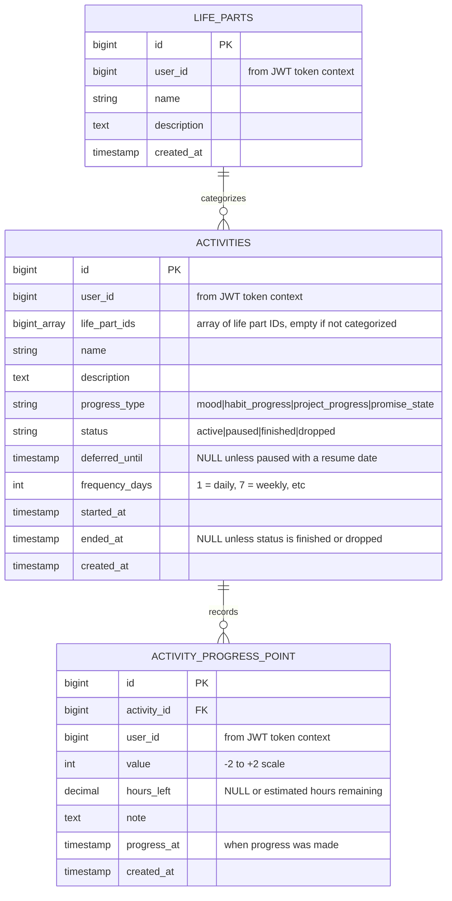
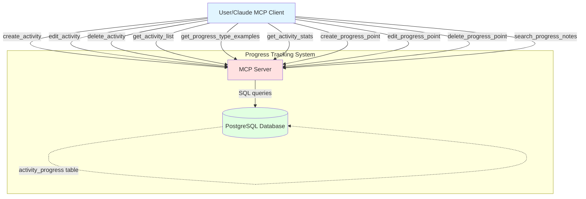
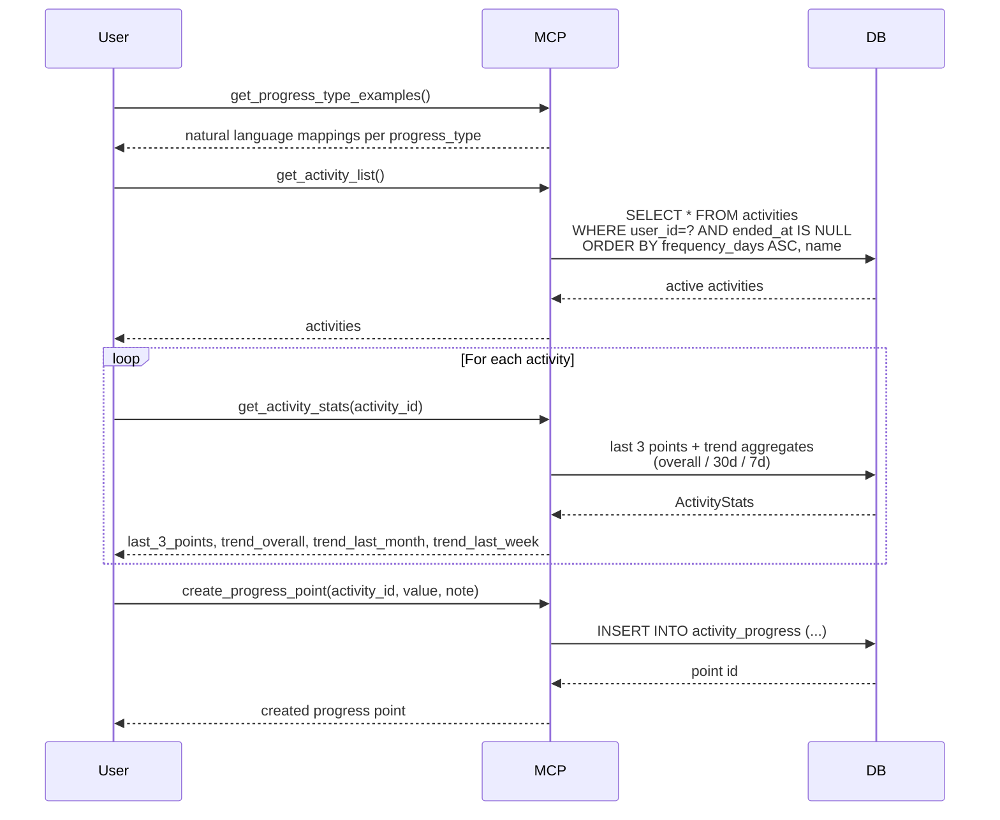
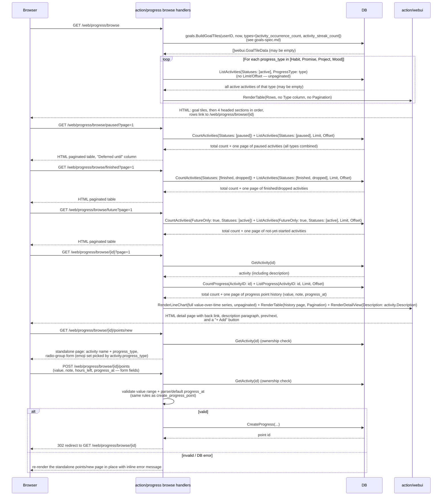

# Live Goals Tracking System - Complete Specification

## Overview

System for tracking progress across life areas, projects, and goals with periodic reflection and statistics. Supports different progress types (mood, habit progress, project progress, promise state), enables daily/weekly reflections, and provides detailed statistics on trends and completion rates. Activities can represent habits (daily recurring), projects (time-bound with completion), or maintenance goals (ongoing without completion).

## Best Practices Applied

- **Multi-user Support**: user_id extracted from JWT/session context on every table, not passed explicitly
- **Bounded Value Scale**: every progress point is a single int from -2 to +2, interpreted differently per progress_type (mood/habit_progress/project_progress/promise_state)
- **Natural Language Mapping**: `get_progress_type_examples` is the canonical source of word/emoji → value mappings, used by the AI to parse free-form user responses instead of hardcoded keyword lists
- **Flexible Activity Shapes**: frequency_days plus nullable ended_at let the same table represent daily habits, weekly check-ins, and time-bound projects
- **Optional Life-area Categorization**: life_part_ids is an array (an activity can belong to zero or more life parts); life parts themselves are seeded via repository/script, not exposed as an MCP tool
- **Multi-variant Search**: `search_progress_notes` follows the same 1-5 variant + match_count ranking pattern as `resolve_food_id_by_name` and `search_exercises`
- **UTC Timezone**: all timestamps in UTC
- **Browse view reuses the shared design system**: `/web/progress/browse` is built entirely from `action/webui` components (table, stat tiles, line chart, detail view — see `webui-spec.md`); it owns no CSS/JS of its own and adds no database tables
- **Screenshot dashboard stays untouched**: `dashboard_web.go` (`GET /web/progress`) keeps its separate fixed-viewport, black-and-white, top-5-only implementation; the browse view is new, additional code, not a replacement
- **Filter extended, not replaced**: `ActivityFilter` gains new fields (`FutureOnly`, `Limit`, `Offset`) instead of new query methods — `applyActivityFilter` grows one more clause per field instead of a new method per query shape, and `LIMIT`/`OFFSET` are one more clause too
- **Every browse list and the drill-down history are paginated**: fixed page size, `?page=N` query param (1-indexed, defaults to 1); each list handler calls a `Count*` repository method alongside the paginated `List*` call to build `webui.PaginationData` (see `webui-spec.md`)
- **Browse view embeds its own goal tiles, built elsewhere**: `GET /web/progress/browse` shows an `activity_occurrence_count`/`activity_streak_count` tile grid above the activities table, via `goals.BuildGoalTiles(ctx, db, userID, now, types)` + `webui.RenderGoalTiles` (see `goals-spec.md`) — `action/progress` owns no goal logic, it just calls the helper and drops the fragment in. The section disappears entirely when the user has no activity goals (empty `EmptyMessage`, see `webui-spec.md`)
- **Description shown, not just stored**: `Activity.Description` already rendered on the screenshot dashboard (`dashboard_web.go`'s `activity-desc` div) but was write-only on the browse view; the browse list's table now has a plain-text "Description" column (`webui.TableRow.Cells`, auto-escaped, no markdown rendering) and the drill-down detail view shows it as a paragraph under the title via `webui.DetailViewData.Description`, reusing the same `renderBoldMarkdown` helper the screenshot dashboard uses (see `webui-spec.md`)
- **Active list is split by progress_type, finished/future are not**: `GET /web/progress/browse` (active only) renders four separate, unpaginated tables in fixed order — Habit, Promise, Project, Mood — each headed by its type name, via `ActivityFilter.ProgressType` (new field; empty = no filter, existing callers unaffected) added to the shared `applyActivityFilter`. A type with zero active activities still renders its heading with an empty table (`webui.TableData{Rows: nil}` renders a headers-only table), so the four-section layout stays predictable. Since each table is already scoped to one type, its "Type" column is dropped (`buildActivityTable`'s Type/`progressTypeLabel` column is only used by the still-combined finished/future tables). `GET /web/progress/browse/finished` and `/future` are untouched by this — single combined table across all types, same pagination as before — splitting was judged not worth the complexity for those lower-traffic views
- **Progress point correction mirrors activity correction**: `edit_progress_point` follows the same partial-update pattern as `edit_activity` — pointer fields, at least one required, unspecified fields keep their current value — scoped to the point's owning activity/user the same way `create_progress_point` already verifies ownership before writing
- **`progress_type` is just another editable field**: `edit_activity` gains `progress_type` alongside its existing pointer fields, same partial-update pattern (omit to keep current). No new remap mechanism — if old points need new values to match the new type's semantics, the AI calls the existing `edit_progress_point` tool per point, same as any other correction
- **`status` is the explicit source of truth for lifecycle state**: activities gain a `status` column (`active|paused|finished|dropped`) instead of inferring state purely from `started_at`/`ended_at`. `ended_at` keeps its existing meaning (set once, timestamp of completion) and is only set together with `status` moving to `finished` or `dropped` — it is never set for `paused`. `status` and `deferred_until` are set the same way `progress_type` is: as two more pointer fields on `edit_activity`, no dedicated pause/resume/drop tool — reuses the existing partial-update pattern instead of inventing a new mechanism
- **`delete_activity` is a new, separate hard delete — `status: "dropped"` is not a delete**: the two are easy to conflate now that both mean "this didn't work out", so they're kept clearly distinct. `status="dropped"`/`"finished"` (via `edit_activity`) keep the row and its `activity_progress` history, just marked over. `delete_activity` is the new tool that actually removes the row (progress points cascade via the existing `fk_progress_activity ON DELETE CASCADE`); it's blocked with a foreign-key error if a `goals` row still references the activity (`goals.activity_id` has no `ON DELETE` clause), since silently orphaning or cascading into a goal would be a worse surprise than a clear error asking to deal with the goal first
- **`finish_activity` is removed, not extended**: completion was a dedicated tool only because `edit_activity` couldn't touch `ended_at`/status before this change — now that `edit_activity` has both `status` and `ended_at` as pointer fields, a separate finish tool is a redundant second way to do the same write. Finishing/dropping an activity is `edit_activity(status: "finished" | "dropped", ended_at: <time>)`; the repository's dedicated `FinishActivity` method goes too, folded into the existing `UpdateActivity` path
- **`ActiveOnly`/`PausedOnly` booleans replaced by `Statuses []ActivityStatus`, not joined by a third bool**: a one-bool-per-status-value field doesn't scale (it was already awkward with two, a third for `PausedOnly` would be worse) and the whole point of adding the `status` column is that it's a real enum now, not a fact worth re-encoding as more booleans. `applyActivityFilter` drops its `ActiveOnly`/`PausedOnly`/default switch entirely: `started_at` gets one unconditional clause (`> NOW()` if `FutureOnly`, else `<= NOW()`), and `status IN (...)` is applied whenever `len(Statuses) > 0` — no branching left except that one `FutureOnly` if/else. Every call site now states its status filter explicitly instead of relying on a bool's implied meaning: active lists pass `Statuses: []ActivityStatus{ActivityStatusActive}`, the finished list passes `Statuses: []ActivityStatus{ActivityStatusFinished, ActivityStatusDropped}` (the old default branch, now explicit), paused passes `Statuses: []ActivityStatus{ActivityStatusPaused}`, and future passes `FutureOnly: true` together with `Statuses: []ActivityStatus{ActivityStatusActive}` to match the old `FutureOnly` behavior (a future activity that's already paused/dropped doesn't belong in the future list either)
- **`ListActivities`'s `ORDER BY` follows what kind of status was asked for, not a specific bool**: the old switch (`FutureOnly` → `started_at ASC`, `ActiveOnly` → check-in urgency, default → `ended_at DESC`) becomes: `FutureOnly` → `started_at ASC` (unchanged); else if `Statuses` contains `active` or `paused` (an ongoing state) → the same check-in-urgency ordering; else (`finished`/`dropped`, a terminal state) → `ended_at DESC` (unchanged). A mixed `Statuses` list spanning both groups isn't a call any current caller makes, so it's not a case the ordering needs to handle
- **Paused activities get their own page, not a section bolted onto Active**: `dashboard_web.go` needs no code change at all — since the active-list callers now filter `Statuses: [active]` explicitly, paused activities simply stop appearing there without dashboard code ever mentioning `paused`. `browse_web.go` gets a new `GET /web/progress/browse/paused` route, a fourth entry in `browseCrossLinks` alongside Active/Finished/Future, built with the same `renderActivityList` helper as Finished/Future (paginated, all `progress_type`s combined in one table) — not a fifth section appended to the active page's four `progress_type` tables. Its one differing column is "Deferred until" instead of Finished/Starts. `get_activity_list` returns a second output list, `paused_activities`, populated alongside `activities` when `active_only=true` — no new input parameter, so existing callers are unaffected
- **Schema change follows the `last_point_at` precedent**: `status`/`deferred_until` are added to the `CREATE TABLE` block for fresh installs only, same as `last_point_at` was — no `ALTER TABLE` in this file. `CREATE TABLE IF NOT EXISTS` is a no-op against the already-deployed `activities` table, so on the live DB the column is added and backfilled (`UPDATE activities SET status = 'finished' WHERE ended_at IS NOT NULL`) by hand, once, out of band, exactly like `last_point_at` was — not through an automated migration statement that would otherwise re-run (and risk re-clobbering data) on every restart. No dedicated `status` index either — the table is small enough (personal, single-user) that one isn't worth the added migration surface
- **Web point creation shares validation with the MCP tool, not a fork of it**: `POST /web/progress/browse/{id}/points` (new) and `create_progress_point` both funnel through the same internal validation (value range check, ownership via `GetActivity`, `progress_at` parse-or-default-to-now) before calling the shared `CreateProgress` repository method — one rule set, not two that can drift apart
- **Logging a point is a standalone page, not a form bolted onto the drill-down**: `GET /web/progress/browse/{id}/points/new` is its own page, reached via a "+ Add" button at the top of the drill-down (`GET /web/progress/browse/{id}`) — it isn't embedded inline there, so it doesn't compete for space with the chart/history/stats and its header can clearly name which activity the point is for. The form has no `webui` equivalent to build on (`action/webui` has no form components at all), so it's a local `html/template` constant, matching the existing `goalsRefreshFormSrc` (`action/goals/dashboard_web.go`) / `importFormContentSrc` (`action/money/import_web.go`) convention — success redirects to `GET /web/progress/browse/{id}` (`RefreshWebHandler`-style write-then-redirect), a validation or DB failure re-renders the same standalone page in place with an inline error message instead (`import_web.go`-style)
- **Value picked via a radio group with one fixed emoji-per-value metaphor per `progress_type`, not the full `get_progress_type_examples` set**: the MCP reflection flow benefits from offering several metaphors (weather/light/colors for mood, etc.) so the AI can pick whichever resonates, but a web form needs exactly one label per value, hardcoded per type in the web handler — mood uses "mood as weather" (☀️+2 ⛅+1 ☁️0 🌧️-1 ⛈️-2), habit_progress uses "habit consistency" (💪+2 👍+1 🤔0 😔-1 ❌-2), project_progress uses "project momentum" (🚀+2 ➡️+1 ⏸️0 ↩️-1 🔄-2), promise_state uses "promise awareness" with only 3 options since it has no ±2 anywhere in the domain (✅+1 💭0 🤷-1). No new domain model or MCP-facing change — `get_progress_type_examples`'s full multi-metaphor output is untouched, this is presentation-only data local to the web handler

## Architecture Diagrams

### Entity Relation Diagram


```mermaid
erDiagram
    LIFE_PARTS ||--o{ ACTIVITIES : categorizes
    ACTIVITIES ||--o{ ACTIVITY_PROGRESS_POINT : records

    LIFE_PARTS {
        bigint id PK
        bigint user_id "from JWT token context"
        string name
        text description
        timestamp created_at
    }

    ACTIVITIES {
        bigint id PK
        bigint user_id "from JWT token context"
        bigint_array life_part_ids "array of life part IDs, empty if not categorized"
        string name
        text description
        string progress_type "mood|habit_progress|project_progress|promise_state"
        string status "active|paused|finished|dropped"
        timestamp deferred_until "NULL unless paused with a resume date"
        int frequency_days "1 = daily, 7 = weekly, etc"
        timestamp started_at
        timestamp ended_at "NULL unless status is finished or dropped"
        timestamp created_at
    }

    ACTIVITY_PROGRESS_POINT {
        bigint id PK
        bigint activity_id FK
        bigint user_id "from JWT token context"
        int value "-2 to +2 scale"
        decimal hours_left "NULL or estimated hours remaining"
        text note
        timestamp progress_at "when progress was made"
        timestamp created_at
    }
```

### C4 Context Diagram


```mermaid
graph TB
    User[User/Claude MCP Client]

    subgraph "Progress Tracking System"
        MCP[MCP Server]
        DB[(PostgreSQL Database)]

        MCP -->|SQL queries| DB
    end

    User -->|create_activity| MCP
    User -->|edit_activity| MCP
    User -->|delete_activity| MCP
    User -->|get_activity_list| MCP
    User -->|get_progress_type_examples| MCP
    User -->|get_activity_stats| MCP
    User -->|create_progress_point| MCP
    User -->|edit_progress_point| MCP
    User -->|delete_progress_point| MCP
    User -->|search_progress_notes| MCP

    DB -.->|life_parts table| DB
    DB -.->|activities table| DB
    DB -.->|activity_progress table| DB

    style User fill:#e1f5ff
    style MCP fill:#ffe1e1
    style DB fill:#e1ffe1
```

### Sequence Diagram: Reflection Check-in


```mermaid
sequenceDiagram
    participant User
    participant MCP
    participant DB

    User->>MCP: get_progress_type_examples()
    MCP-->>User: natural language mappings per progress_type

    User->>MCP: get_activity_list()
    MCP->>DB: SELECT * FROM activities<br/>WHERE user_id=? AND ended_at IS NULL<br/>ORDER BY frequency_days ASC, name
    DB-->>MCP: active activities
    MCP-->>User: activities

    loop For each activity
        User->>MCP: get_activity_stats(activity_id)
        MCP->>DB: last 3 points + trend aggregates<br/>(overall / 30d / 7d)
        DB-->>MCP: ActivityStats
        MCP-->>User: last_3_points, trend_overall, trend_last_month, trend_last_week
    end

    User->>MCP: create_progress_point(activity_id, value, note)
    MCP->>DB: INSERT INTO activity_progress (...)
    DB-->>MCP: point id
    MCP-->>User: created progress point
```

### Sequence Diagram: Browse View Drill-down


```mermaid
sequenceDiagram
    participant Browser
    participant Handler as action/progress browse handlers
    participant DB
    participant Webui as action/webui

    Browser->>Handler: GET /web/progress/browse
    Handler->>DB: goals.BuildGoalTiles(userID, now, types=[activity_occurrence_count, activity_streak_count])<br/>(see goals-spec.md)
    DB-->>Handler: []webui.GoalTileData (may be empty)
    loop For each progress_type in [Habit, Promise, Project, Mood]
        Handler->>DB: ListActivities(Statuses: [active], ProgressType: type)<br/>(no Limit/Offset — unpaginated)
        DB-->>Handler: all active activities of that type (may be empty)
        Handler->>Webui: RenderTable(Rows, no Type column, no Pagination)
    end
    Webui-->>Browser: HTML: goal tiles, then 4 headed sections in order,<br/>rows link to /web/progress/browse/{id}

    Browser->>Handler: GET /web/progress/browse/paused?page=1
    Handler->>DB: CountActivities(Statuses: [paused]) + ListActivities(Statuses: [paused], Limit, Offset)
    DB-->>Handler: total count + one page of paused activities (all types combined)
    Handler-->>Browser: HTML paginated table, "Deferred until" column

    Browser->>Handler: GET /web/progress/browse/finished?page=1
    Handler->>DB: CountActivities(Statuses: [finished, dropped]) + ListActivities(Statuses: [finished, dropped], Limit, Offset)
    DB-->>Handler: total count + one page of finished/dropped activities
    Handler-->>Browser: HTML paginated table

    Browser->>Handler: GET /web/progress/browse/future?page=1
    Handler->>DB: CountActivities(FutureOnly: true, Statuses: [active]) + ListActivities(FutureOnly: true, Statuses: [active], Limit, Offset)
    DB-->>Handler: total count + one page of not-yet-started activities
    Handler-->>Browser: HTML paginated table

    Browser->>Handler: GET /web/progress/browse/{id}?page=1
    Handler->>DB: GetActivity(id)
    DB-->>Handler: activity (including description)
    Handler->>DB: CountProgress(ActivityID: id) + ListProgress(ActivityID: id, Limit, Offset)
    DB-->>Handler: total count + one page of progress point history (value, note, progress_at)
    Handler->>Webui: RenderLineChart(full value-over-time series, unpaginated) + RenderTable(history page, Pagination) + RenderDetailView(Description: activity.Description)
    Webui-->>Browser: HTML detail page with back link, description paragraph, prev/next,<br/>and a "+ Add" button

    Browser->>Handler: GET /web/progress/browse/{id}/points/new
    Handler->>DB: GetActivity(id) (ownership check)
    Handler-->>Browser: standalone page: activity name + progress_type,<br/>radio-group form (emoji set picked by activity.progress_type)

    Browser->>Handler: POST /web/progress/browse/{id}/points<br/>(value, note, hours_left, progress_at — form fields)
    Handler->>DB: GetActivity(id) (ownership check)
    Handler->>Handler: validate value range + parse/default progress_at<br/>(same rules as create_progress_point)
    alt valid
        Handler->>DB: CreateProgress(...)
        DB-->>Handler: point id
        Handler-->>Browser: 302 redirect to GET /web/progress/browse/{id}
    else invalid / DB error
        Handler-->>Browser: re-render the standalone points/new page in place with inline error message
    end
```

## Database Schema

### SQL DDL

```sql
-- Life parts table
CREATE TABLE IF NOT EXISTS life_parts (
    id BIGSERIAL PRIMARY KEY,
    user_id BIGINT NOT NULL,
    name VARCHAR(100) NOT NULL,
    description TEXT,
    created_at TIMESTAMP NOT NULL DEFAULT CURRENT_TIMESTAMP
);

CREATE INDEX IF NOT EXISTS idx_life_parts_user_id ON life_parts(user_id);

-- Activities table
CREATE TABLE IF NOT EXISTS activities (
    id BIGSERIAL PRIMARY KEY,
    user_id BIGINT NOT NULL,
    life_part_ids BIGINT[] DEFAULT '{}',
    name VARCHAR(255) NOT NULL,
    description TEXT,
    progress_type VARCHAR(30) NOT NULL CHECK (progress_type IN ('mood', 'habit_progress', 'project_progress', 'promise_state')),
    frequency_days INT NOT NULL CHECK (frequency_days > 0),
    started_at TIMESTAMP NOT NULL DEFAULT CURRENT_TIMESTAMP,
    ended_at TIMESTAMP, -- NULL unless status is finished or dropped
    created_at TIMESTAMP NOT NULL DEFAULT CURRENT_TIMESTAMP,
    last_point_at TIMESTAMP, -- NULL means no points
    status VARCHAR(20) NOT NULL DEFAULT 'active' CHECK (status IN ('active', 'paused', 'finished', 'dropped')),
    deferred_until TIMESTAMP -- NULL unless paused with a resume date
);

CREATE INDEX IF NOT EXISTS idx_activities_user_id ON activities(user_id);
CREATE INDEX IF NOT EXISTS idx_activities_life_part_ids ON activities USING GIN(life_part_ids);

-- Activity progress table
CREATE TABLE IF NOT EXISTS activity_progress (
    id BIGSERIAL PRIMARY KEY,
    activity_id BIGINT NOT NULL,
    user_id BIGINT NOT NULL,
    value INT NOT NULL CHECK (value BETWEEN -2 AND 2),
    hours_left DECIMAL(8,2),
    note TEXT,
    progress_at TIMESTAMP NOT NULL DEFAULT CURRENT_TIMESTAMP,
    created_at TIMESTAMP NOT NULL DEFAULT CURRENT_TIMESTAMP,

    CONSTRAINT fk_progress_activity FOREIGN KEY (activity_id) REFERENCES activities(id) ON DELETE CASCADE
);

CREATE INDEX IF NOT EXISTS idx_progress_activity_progress_at ON activity_progress(activity_id, progress_at DESC);
CREATE INDEX IF NOT EXISTS idx_progress_user_progress_at ON activity_progress(user_id, progress_at DESC);
```

## Go Code Structure

### Domain Models

```go
package progress

import "time"

// ProgressType represents the value scale used for tracking
type ProgressType string

const (
    ProgressTypeMood            ProgressType = "mood"            // Emotional state scale
    ProgressTypeHabitProgress   ProgressType = "habit_progress"  // Adherence to habit scale
    ProgressTypeProjectProgress ProgressType = "project_progress" // Movement towards goal scale
    ProgressTypePromiseState    ProgressType = "promise_state"   // Commitment tracking scale
)

// ProgressValue scale: -2 to +2
// For mood: red/hell (-2), black/dark (-1), gray (0), white/bright (+1), green/happy (+2)
// For habit_progress: missing (-2), mostly not doing (-1), trying (0), mostly doing (+1), doing well (+2)
// For project_progress: plans changed (-2), rolled back (-1), stuck (0), moving forward (+1), good progress (+2)
// For promise_state: I forgot (-1), I remember (0), I am trying (+1), [special: done/failed outside scale]

// LifePart represents a life area categorization
type LifePart struct {
    ID          int64     `json:"id" db:"id"`
    UserID      int64     `json:"user_id" db:"user_id"`
    Name        string    `json:"name" db:"name" jsonschema:"Life area name"`
    Description string    `json:"description,omitempty" db:"description" jsonschema:"Life area description"`
    CreatedAt   time.Time `json:"created_at" db:"created_at"`
}

// ActivityStatus is the explicit lifecycle state of an activity — source of
// truth going forward, instead of inferring state purely from started_at/ended_at.
type ActivityStatus string

const (
    ActivityStatusActive   ActivityStatus = "active"
    ActivityStatusPaused   ActivityStatus = "paused"
    ActivityStatusFinished ActivityStatus = "finished" // goal reached
    ActivityStatusDropped  ActivityStatus = "dropped"  // abandoned
)

// Activity represents a trackable goal or habit
type Activity struct {
    ID            int64          `json:"id" db:"id"`
    UserID        int64          `json:"user_id" db:"user_id"`
    LifePartIDs   []int64        `json:"life_part_ids,omitempty" db:"life_part_ids" jsonschema:"Array of life part IDs this activity belongs to"`
    Name          string         `json:"name" db:"name" jsonschema:"Activity name"`
    Description   string         `json:"description,omitempty" db:"description" jsonschema:"Activity description"`
    ProgressType  ProgressType   `json:"progress_type" db:"progress_type" jsonschema:"Progress value scale type (mood|habit_progress|project_progress|promise_state)"`
    Status        ActivityStatus `json:"status" db:"status" jsonschema:"Lifecycle status (active|paused|finished|dropped)"`
    DeferredUntil *time.Time     `json:"deferred_until,omitempty" db:"deferred_until" jsonschema:"When a paused activity should resume (null unless paused with a resume date)"`
    FrequencyDays int            `json:"frequency_days" db:"frequency_days" jsonschema:"Check-in frequency in days (1 = daily, 7 = weekly)"`
    StartedAt     time.Time      `json:"started_at" db:"started_at"`
    EndedAt       time.Time      `json:"ended_at,omitempty" db:"ended_at"` // Zero value unless finished/dropped
    CreatedAt     time.Time      `json:"created_at" db:"created_at"`
}

// ActivityPoint represents a single progress point
type ActivityPoint struct {
    ID         int64     `json:"id" db:"id"`
    ActivityID int64     `json:"activity_id" db:"activity_id" jsonschema:"Activity ID this progress point belongs to"`
    UserID     int64     `json:"user_id" db:"user_id"`
    Value      int       `json:"value" db:"value" jsonschema:"Progress value from -2 to +2"`
    HoursLeft  float64   `json:"hours_left,omitempty" db:"hours_left" jsonschema:"Estimated hours remaining for projects (0 if not tracking)"`
    Note       string    `json:"note,omitempty" db:"note" jsonschema:"Optional note about this progress point"`
    ProgressAt time.Time `json:"progress_at" db:"progress_at" jsonschema:"When progress was made (defaults to now if empty)"`
    CreatedAt  time.Time `json:"created_at" db:"created_at"`
}

// ActivityPointWithActivity is ActivityPoint enriched with activity name, used by search_progress_notes
type ActivityPointWithActivity struct {
    ActivityPoint
    ActivityName string `json:"activity_name" db:"activity_name"`
}

// ActivityStats represents calculated statistics for an activity
type ActivityStats struct {
    ActivityID     int64           `json:"activity_id" jsonschema:"Activity ID"`
    Last3Points    []ActivityPoint `json:"last_3_points" jsonschema:"Last 3 progress points"`
    TrendOverall   TrendStats      `json:"trend_overall" jsonschema:"Statistics for all time"`
    TrendLastMonth TrendStats      `json:"trend_last_month" jsonschema:"Statistics for last 30 days"`
    TrendLastWeek  TrendStats      `json:"trend_last_week" jsonschema:"Statistics for last 7 days"`
}

// TrendStats represents aggregated trend data for a time period
type TrendStats struct {
    Count        int     `json:"count" jsonschema:"Number of progress points in this period"`
    Average      float64 `json:"average,omitempty" jsonschema:"Average progress value (0 if no data)"`
    Percentile80 float64 `json:"percentile_80,omitempty" jsonschema:"80th percentile value (0 if no data)"`
}

// ProgressTypeExamples represents all natural language mapping examples
type ProgressTypeExamples struct {
    Examples []ProgressTypeMapping `json:"examples" jsonschema:"Mapping examples for each progress type"`
}

// ProgressTypeMapping represents mapping examples for a single progress type
type ProgressTypeMapping struct {
    ProgressType ProgressType `json:"progress_type" jsonschema:"Progress type (mood|habit_progress|project_progress|promise_state)"`
    Mappings     []MappingSet `json:"mappings" jsonschema:"Different mapping metaphors for this progress type"`
}

// MappingSet represents a single mapping metaphor with its values
type MappingSet struct {
    MappingName string         `json:"mapping_name" jsonschema:"Name of mapping metaphor (e.g. 'mood as weather')"`
    Values      []MappingValue `json:"values" jsonschema:"Natural language mappings for each value"`
}

// MappingValue represents a single natural language to numeric value mapping
type MappingValue struct {
    Word  string `json:"word" jsonschema:"Natural language word or phrase"`
    Value int    `json:"value" jsonschema:"Progress value from -2 to +2"`
    Emoji string `json:"emoji" jsonschema:"Associated emoji"`
}

// ActivityFilter defines query parameters for listing activities
type ActivityFilter struct {
    UserID       int64            `json:"user_id"`
    Statuses     []ActivityStatus `json:"statuses,omitempty" jsonschema:"Only return activities whose status is one of these (empty = no status filter); replaces the old ActiveOnly/PausedOnly booleans — callers pass e.g. []ActivityStatus{ActivityStatusActive} or {ActivityStatusFinished, ActivityStatusDropped}"`
    FutureOnly   bool             `json:"future_only,omitempty" jsonschema:"Only return not-yet-started activities (started_at in the future) instead of started_at<=NOW(); status is still filtered separately via Statuses — the old FutureOnly behavior is Statuses:[active], FutureOnly:true"`
    ProgressType ProgressType     `json:"progress_type,omitempty" jsonschema:"Only return activities of this progress_type (empty = all types); used by the browse view's per-type active-list sections"`
    LifePartIDs  []int64          `json:"life_part_ids,omitempty" jsonschema:"Filter by life part IDs"`
    Limit        int64            `json:"limit,omitempty" jsonschema:"Page size for browse-view pagination (0 = no limit, existing MCP callers unaffected)"`
    Offset       int64            `json:"offset,omitempty" jsonschema:"Row offset for browse-view pagination"`
}

// ProgressFilter defines query parameters for listing progress points
type ProgressFilter struct {
    UserID     int64     `json:"user_id"`
    ActivityID int64     `json:"activity_id,omitempty" jsonschema:"Filter by activity ID (0 = all activities)"`
    From       time.Time `json:"from,omitempty" jsonschema:"Start date filter (empty = no start filter)"`
    To         time.Time `json:"to,omitempty" jsonschema:"End date filter (empty = no end filter)"`
    Limit      int64     `json:"limit,omitempty" jsonschema:"Limit of returned progresses sorted by progress_at DESC"`
    Offset     int64     `json:"offset,omitempty" jsonschema:"Row offset for browse-view drill-down pagination"`
}

// ProgressNoteSearchFilter defines parameters for a single-variant note search
type ProgressNoteSearchFilter struct {
    UserID     int64     `json:"user_id"`
    Query      string    `json:"query"`                 // required, ILIKE substring
    ActivityID int64     `json:"activity_id,omitempty"` // 0 = all activities
    From       time.Time `json:"from,omitempty"`
    To         time.Time `json:"to,omitempty"`
    ValueMin   *int      `json:"value_min,omitempty"`
    ValueMax   *int      `json:"value_max,omitempty"`
}
```

### Repository Interface

```go
// gateways/progress_repository.go
type ProgressRepository interface {
    // Life Part CRUD (seeded via repository/script, no MCP tool)
    CreateLifePart(ctx context.Context, lifePart LifePart) (int64, error)
    ListLifeParts(ctx context.Context, userID int64) ([]LifePart, error)

    // Activity CRUD
    CreateActivity(ctx context.Context, activity *Activity) (int64, error)
    GetActivity(ctx context.Context, activityID int64, userID int64) (*Activity, error)
    ListActivities(ctx context.Context, filter ActivityFilter) ([]Activity, error)
    CountActivities(ctx context.Context, filter ActivityFilter) (int, error) // same WHERE clauses as ListActivities, ignores Limit/Offset — for browse-view pagination
    UpdateActivity(ctx context.Context, activity *Activity) error // now also writes progress_type, status, deferred_until; finishing/dropping goes through here too, no separate FinishActivity method
    DeleteActivity(ctx context.Context, activityID int64, userID int64) error // hard delete; activity_progress rows cascade via FK, but a goal still referencing this activity (goals.activity_id, no ON DELETE clause) blocks it with a foreign-key violation

    // Progress CRUD
    CreateProgress(ctx context.Context, progress *ActivityPoint) (int64, error)
    ListProgress(ctx context.Context, filter ProgressFilter) ([]ActivityPoint, error)
    CountProgress(ctx context.Context, filter ProgressFilter) (int, error) // same WHERE clauses as ListProgress, ignores Limit/Offset — for drill-down pagination
    UpdateProgress(ctx context.Context, progress *ActivityPoint) error // ID + UserID identify the row; caller has already merged partial-update fields onto a fetched point
    DeleteProgress(ctx context.Context, progressID int64, userID int64) error
    SearchProgressNotes(ctx context.Context, filter ProgressNoteSearchFilter) ([]ActivityPointWithActivity, error)

    // Statistics helpers
    GetTrendStats(ctx context.Context, activityID int64, from time.Time, to time.Time) (TrendStats, error)
}
```

## MCP Tools

### create_activity
Creates a new trackable activity (name, progress_type, frequency_days, optional life_part_ids/description/started_at). Validates progress_type enum and frequency_days >= 1.

### edit_activity
Updates mutable fields (name, description, frequency_days, life_part_ids, progress_type, status, deferred_until, started_at, ended_at) of an existing activity. At least one field required; unspecified fields keep their current value. Changing `progress_type` does not touch existing points — use `edit_progress_point` per point to remap stale values to the new type's semantics. `status` moves an activity between active/paused/finished/dropped directly — this is also how an activity is marked complete (`status: "finished"` or `status: "dropped"`, together with `ended_at`) now that there's no separate `finish_activity` tool; `deferred_until` is only meaningful alongside `status=paused`.

### delete_activity
Permanently deletes an activity by ID, scoped to the owning user — including all its `activity_progress` history (`ON DELETE CASCADE`). This is different from `status: "dropped"` via `edit_activity`: dropping keeps the activity and its history around (just marked over, still shows in the finished/dropped list and in stats), while `delete_activity` erases the row and its progress points for good. Errors if the activity doesn't exist / isn't owned by the user, or if a goal still references it (`goals.activity_id` has no `ON DELETE CASCADE` — the goal must be deleted or repointed first). Cannot be undone.

### get_activity_list
Lists activities ordered by frequency_days ASC, then name. `active_only=true` returns `status='active'` activities in `activities` plus, separately, every `status='paused'` activity in `paused_activities` — so a paused activity is never silently missing, just shown in its own section. `active_only=false` returns finished/dropped activities (unchanged).

### get_progress_type_examples
Returns hardcoded natural language ↔ numeric value mapping examples (multiple metaphors per progress_type, with emojis) — no input, no DB access. Canonical source for interpreting free-form user responses.

### get_activity_stats
Returns last 3 progress points plus trend averages and 80th percentiles for three windows: overall, last 30 days, last 7 days.

### create_progress_point
Logs a progress point for an activity: value (-2 to +2, required), optional note, hours_left, and progress_at (defaults to now).

### edit_progress_point
Updates mutable fields (value, note, hours_left, progress_at) of an existing progress point, scoped to the owning user. At least one field required; unspecified fields keep their current value. Same partial-update pointer-field pattern as `edit_activity`.

### delete_progress_point
Deletes a progress point by ID, scoped to the owning user. Errors if the point doesn't exist or isn't owned by the user. Cannot be undone.

### search_progress_notes
Searches `activity_progress.note` by 1-5 query variants (ILIKE), with optional activity_id/from/to/value_min/value_max filters. Same match_count ranking pattern as `resolve_food_id_by_name` and `search_exercises`.

> `create_life_part` is intentionally **not** exposed as an MCP tool — life parts are seeded via repository/script.

## HTTP Handlers

### GET /web/progress
Renders a read-only dashboard of all activities with recent progress, staleness indicators, and trend summaries. Protected by the same auth middleware as other `/web/*` routes. Purpose-built fixed-viewport/B&W/top-5-only screenshot page (`dashboard_web.go`) — untouched by the browse view below.

### GET /web/progress/browse
New free-scrolling, full-color browse page built on the `action/webui` design system. Shows an activity goal tile grid above the lists (see Best Practices), then **four separate, unpaginated tables**, one per `progress_type`, in fixed order — Habit, Promise, Project, Mood — each with a heading and columns Name, Description, Frequency, Last update (no Type column, redundant with the heading); a type with no active activities still renders its heading with an empty table. Links to the paused/finished/future lists (`browseCrossLinks`: Active · Finished · Future · Paused) and to each activity's drill-down. Protected by `WebMiddleware` like every other `/web/*` route.

### GET /web/progress/browse/paused
Lists activities where `status = 'paused'` (`ListActivities(Statuses: [paused])`), same combined-across-types table shape and pagination as `/finished` and `/future` (via `renderActivityList`), with a "Deferred until" column in place of Finished/Starts, and a back link.

### GET /web/progress/browse/finished
Lists activities where `status` is `finished` or `dropped` (`ListActivities(Statuses: [finished, dropped])`), same table shape (including the Description column) and pagination as the main browse view, with a back link.

### GET /web/progress/browse/future
Lists activities where `started_at` is in the future (`ListActivities(FutureOnly: true, Statuses: [active])`), same table shape (including the Description column) and pagination, with a back link.

### GET /web/progress/browse/{id}
Drill-down for one activity: a `DetailView` with the activity's description (when set) shown as a paragraph under the title, stat tiles (trend averages, reusing `GetTrendStats`), a line chart of the **full** value-over-time series (`RenderLineChart`, not paginated — the chart is more useful showing the whole trend), a paginated table of progress points (date, value, note) via `ListProgress(ActivityID: id, Limit, Offset)` + `CountProgress`, newest first, `?page=N` (default 1), and a "+ Add" button at the top linking to `GET /web/progress/browse/{id}/points/new`. Back link returns to wherever the user came from (main/finished/future list).

### GET /web/progress/browse/{id}/points/new
Standalone "log a point" page, reached via the drill-down's "+ Add" button — not a form embedded on the drill-down itself. Header names the activity (name + `progress_type`) so it's unambiguous which activity the point is for. Form fields: `value` (radio group, one emoji per value, the set picked by the activity's `progress_type` — see Best Practices), `note` (optional text), `hours_left` (optional number), `progress_at` (optional datetime-local; blank defaults to now, same as the MCP tool). Posts to `POST /web/progress/browse/{id}/points` below. Back link returns to the drill-down.

### POST /web/progress/browse/{id}/points
Logs a progress point for the activity directly from the browser, instead of requiring the MCP tool `create_progress_point`. Runs the same value-range + ownership (`GetActivity`) validation as `create_progress_point` before calling `CreateProgress`. On success, redirects (302) to `GET /web/progress/browse/{id}` (write-then-redirect, same pattern as `POST /web/goals/refresh`); on validation or DB failure, re-renders the standalone `points/new` page in place with an inline error message instead of redirecting. Protected by `WebMiddleware` like the rest of `/web/progress/browse/*`.

## Dialog & Conversation Guidelines

### Using Progress Type Examples

Before starting a reflection session, call `get_progress_type_examples()` to retrieve all available natural language mappings. This tool provides multiple
metaphorical mappings for each progress type (e.g., "mood as weather", "mood as light", "habit as garden"). Use these mappings to:

1. **Offer expressive options**: Present different metaphors to users so they can choose the most resonant way to express their state
2. **Parse responses**: Match user's natural language against the provided keywords and mappings
3. **Suggest metaphors**: When user seems stuck, suggest a specific metaphor: "Would you describe your mood more like weather, light, or colors?"
4. **Show examples with emojis**: Use the emoji field to make the conversation more visual and engaging

The examples returned by `get_progress_type_examples()` serve as the canonical source of truth for natural language to numeric value mappings. Always
prefer using these mappings over hardcoded keywords.

### Natural Language to Numeric Value Mapping

When the user describes their state in natural language, map their words to numeric values (-2 to +2) based on the activity's progress_type. The mappings
below are provided as reference, but you should primarily use the data from `get_progress_type_examples()` for the most up-to-date and comprehensive
mappings.

#### Mood Scale (progress_type: "mood")

- **+2 (Green/Happy)**: "happy", "great", "amazing", "excellent", "fantastic", "wonderful", "green", "joyful", "thrilled"
- **+1 (White/Bright)**: "good", "bright", "positive", "fine", "okay", "decent", "white", "pleasant", "alright"
- **0 (Gray/Neutral)**: "neutral", "meh", "so-so", "average", "gray", "normal", "okay-ish"
- **-1 (Black/Dark)**: "bad", "dark", "difficult", "tough", "sad", "black", "down", "low", "rough"
- **-2 (Red/Hell)**: "terrible", "awful", "hell", "horrible", "worst", "red", "miserable", "devastating"

#### Habit Progress Scale (progress_type: "habit_progress")

- **+2 (Doing well)**: "doing well", "consistent", "on track", "nailing it", "crushing it", "perfect adherence"
- **+1 (Mostly doing)**: "mostly doing", "usually", "pretty good", "often", "regularly", "most days"
- **0 (Trying)**: "trying", "working on it", "inconsistent", "sometimes", "hit or miss", "up and down"
- **-1 (Mostly not doing)**: "mostly not doing", "rarely", "struggling", "not often", "falling behind", "slipping"
- **-2 (Missing/Not doing)**: "not doing", "missing", "abandoned", "gave up", "stopped", "zero progress"

#### Project Progress Scale (progress_type: "project_progress")

- **+2 (Good progress)**: "great progress", "moving fast", "crushing it", "major breakthrough", "huge step", "significant advancement"
- **+1 (Moving forward)**: "moving forward", "making progress", "steady", "some progress", "advancing", "improving"
- **0 (Stuck)**: "stuck", "no progress", "blocked", "standstill", "paused", "stagnant", "waiting"
- **-1 (Rolled back)**: "setback", "rolled back", "step backward", "lost ground", "regressed", "went backwards"
- **-2 (Plans changed)**: "changed plans", "pivoting", "complete restart", "abandoned approach", "new direction"

**Special states** (use `edit_activity` instead of creating a progress point — set `status` and `ended_at`, not a progress point):
- "done", "finished", "completed", "achieved" → `status: "finished"`
- "cancelled", "failed", "gave up permanently" → `status: "dropped"` (distinct outcome from `finished` — see the `status` field)

#### Promise State Scale (progress_type: "promise_state")

- **+1 (Trying/Did something)**: "I'm trying", "I did something", "working on it", "made effort", "took action", "started"
- **0 (Remember)**: "I remember", "haven't started", "on my mind", "aware of it", "planning to", "thinking about it"
- **-1 (Forgot)**: "I forgot", "didn't remember", "slipped my mind", "overlooked", "forgot about it"

**Special states** (use `edit_activity` instead — set `status` and `ended_at`, not a progress point):
- "I did it", "completed", "fulfilled", "kept my promise" → `status: "finished"`
- "I failed", "broke the promise", "won't do it", "can't do it" → `status: "dropped"`

### Conversation Flow Guidelines

#### Starting a Reflection Session

1. Call `get_progress_type_examples()` to load all available natural language mappings
2. Call `get_activity_list()` to retrieve active activities ordered by frequency
3. For each activity, call `get_activity_stats(activity_id)` to show context
4. Present stats naturally: "Last time you were at [value]. Over the past month, your average is [avg]."
5. Ask progress question based on activity type, optionally suggesting a metaphor from the examples

#### Asking Progress Questions

**For Mood activities:**
- "How are you feeling today?"
- "What's your mood like right now?"
- "Would you describe your mood more like weather (sunny ☀️ to stormy ⛈️) or light (bright ✨ to dark 🌑)?"

**For Habit activities:**
- "How's [habit name] going?"
- "Are you keeping up with [habit name]?"
- "How's your [habit name] garden? Blooming 🌸 or wilting 🥀?"

**For Project activities:**
- "Any progress on [project name]?"
- "How's [project name] moving along?"
- "Are you sprinting 🏃 or stuck resting 🧘 on [project name]?"

**For Promise activities:**
- "Did you remember to [promise description]?"
- "How's your commitment to [promise description] going?"
- "Is the flame still burning 🔥 for [promise description]?"

#### Handling User Responses

1. **Parse natural language**: Look for keywords from `get_progress_type_examples()` data
2. **Infer numeric value**: Map the user's words to -2 to +2 scale using the loaded examples
3. **Use emojis in feedback**: Confirm with emoji: "So you're feeling sunny ☀️ today (+2)?"
4. **Clarify if ambiguous**: If response doesn't clearly map to a value, ask follow-up with specific metaphor options
5. **Capture notes**: If user provides details, include them in the `note` field
6. **Call MCP tool**: Use `create_progress_point` with mapped value

#### Ambiguity Handling

If the user's response doesn't clearly map to a single value, ask clarifying questions:

**Between adjacent values:**
- "Sounds like you're between 'trying' (0) and 'mostly doing' (+1) - which feels more accurate?"
- "Is this more of a 'dark' day (-1) or closer to 'hell' (-2)?"
- "Are you 'stuck' (0) or actually taking 'steps backward' (-1)?"

**Completely unclear:**
- "Could you describe that a bit more? Are things going well, poorly, or somewhere in between?"
- "On a scale from 'not doing at all' to 'crushing it', where would you say you are?"

**Multiple dimensions mentioned:**
- User: "I'm trying but struggling"
- AI: "It sounds like you're making effort ('trying' = 0) but finding it hard. Does that capture it?"

#### Offering Metaphor Choices

When a user seems uncertain or asks for guidance, offer them metaphor choices from `get_progress_type_examples()`:

**Example 1: Mood tracking**
```
AI: "How would you like to describe your mood? I can help you think of it like:
    - Weather (sunny ☀️ to stormy ⛈️)
    - Light (bright ✨ to dark 🌑)
    - Colors (green 💚 to red ❤️‍🔥)
    Which feels most natural to you?"
```

**Example 2: Habit progress**
```
AI: "Let's check in on your meditation habit. Would you describe it more like:
    - Consistency (crushing it 💪 to not doing ❌)
    - A garden (blooming 🌸 to withered 🍂)?"
User: "Hmm, the garden metaphor is nice. I'd say it's planted 🌰 but not quite growing yet."
AI: [Maps "planted" → 0 from "habit as garden" mapping]
```

**Example 3: When user expresses confusion**
```
User: "I don't know how to describe where I'm at..."
AI: "No problem! Here are some ways to think about it:
    For your project, are you more like:
    - Sprinting forward 🏃
    - Walking steadily 🚶
    - Resting/paused 🧘
    - Backtracking 🔙
    - Feeling lost 🗺️?"
```

### Example Conversation Flows

#### Mood Reflection with Metaphor
```
AI: [Calls get_progress_type_examples()]
    [Calls get_activity_list()]
    [Calls get_activity_stats(mood_activity_id)]
    "Last time you logged your mood, it was at 0 (neutral/gray). How are you feeling today?"
User: "Pretty bright actually!"
AI: [Maps "bright" → +1 using "mood as light" mapping]
    [Calls create_progress_point(mood_activity_id, value: 1, note: "")]
    "Great to hear! Capturing that as a bright day ✨. That's an improvement from last time!"
```

#### Habit Check-in
```
AI: "How's your morning workout habit going?"
User: "I'm trying but it's inconsistent, maybe 3 times this week"
AI: [Maps "trying" + "inconsistent" → 0]
    [Calls create_progress_point(workout_habit_id, value: 0, note: "3 times this week")]
    "Got it - you're working on it. 3 times is still progress!"
```

#### Project Progress
```
AI: "Any progress on your architecture strategy?"
User: "Actually hit a major breakthrough yesterday!"
AI: [Maps "major breakthrough" → +2]
    [Calls create_progress_point(project_id, value: 2, note: "breakthrough yesterday")]
    "Excellent! That's significant progress. Want to tell me more?"
```

#### Promise Follow-up
```
AI: "Did you remember to call your mom this week?"
User: "Oh no, I completely forgot!"
AI: [Maps "forgot" → -1]
    [Calls create_progress_point(promise_id, value: -1, note: "")]
    "No worries - it happens. Want to set a reminder for next week?"
```

#### Offering Metaphor When User is Uncertain
```
AI: "How's your project going?"
User: "I'm not sure how to describe it..."
AI: "No problem! Think of it like a journey - are you:
    - Sprinting forward 🏃 (major progress)
    - Walking steadily 🚶 (moving forward)
    - Taking a rest 🧘 (stuck/paused)
    - Backtracking 🔙 (setback)
    - Feeling lost 🗺️ (changed plans)?"
User: "Definitely backtracking. Had to redo some work."
AI: [Maps "backtracking" → -1 from "project as journey" mapping]
    [Calls create_progress_point(project_id, value: -1, note: "had to redo some work")]
    "Got it - setbacks happen. Capturing that you're backtracking 🔙 for now."
```

#### Completion Detection
```
AI: "How's the trainer project going?"
User: "I finished it! Deployed to production yesterday."
AI: [Detects "finished" - special state]
    [Calls edit_activity(trainer_project_id, status: "finished", ended_at: now)]
    "Congratulations on completing it! 🎉 Marking this as done."
```

### Session Summary

The AI already has a full record of every `create_progress_point` / `edit_activity` call it made during the session — no separate tool call is needed to summarize. Present a recap directly from that record:

```
AI: "Great reflection session! Here's what we captured:
    - Mood: Bright day ✨ (+1)
    - Morning workout: Planted 🌰 but not quite growing (0) - 3x this week
    - Architecture strategy: Sprinting 🏃 with major breakthrough (+2)
    - Call mom promise: Flame extinguished 💨 - forgot this time (-1)

    Keep up the sprinting pace on the architecture strategy!"
```

Use `search_progress_notes` to pull up past reflections on a topic if the user wants to look back further than the current session.

### Edge Cases

**User provides a numeric value directly:**
- User: "I'd say a 1"
- AI: Accept it, no need to map

**User describes multiple activities at once:**
- Parse each separately and create individual progress points

**User wants to backdate a point:**
- Accept date/time and pass in `progress_at` field
- User: "Actually yesterday was terrible"
- AI: "Got it, logging yesterday as a difficult day. What date should I record?"

**User cancels mid-session:**
- No problem - progress points are saved immediately as they're created
- Resume later by calling `get_activity_list()` again

**User wants to fix a mis-logged point:**
- "That was wrong, I meant -1 not +1" / "delete that entry, I logged it twice" → use `edit_progress_point` / `delete_progress_point` on the point in question (find it via `search_progress_notes` or the last-created point's ID from this session)
