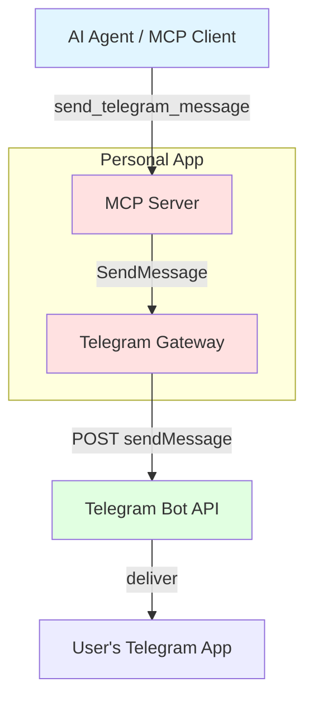
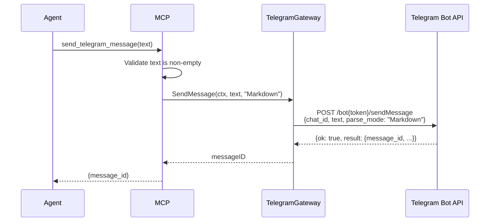

# Telegram Notifications - Complete Specification

## Overview

MCP tool that lets the agent proactively send a text message to the user's Telegram chat, outside of an active conversation turn (e.g. reminders, background-task completion notices, questions that need attention between sessions). Outbound-only: the app calls the Telegram Bot API's `sendMessage` endpoint over plain HTTP. There is no inbound bot (no long polling / webhook, no bot commands) — receiving messages from Telegram is a separate, future backlog item.

## Best Practices Applied

- **Env-configured recipient**: bot token and destination chat ID come from env vars (`TELEGRAM_BOT_TOKEN`, `TELEGRAM_CHAT_ID`), read once at startup like `DATABASE_URL`/`BASE_URL` in `main.go`. No DB table, no per-user chat-ID resolution — this app has a single Telegram recipient.
- **Gateway wraps external API, not DB**: introduces the first non-DB gateway in `gateways/`, following the existing "Gateway: wrapper around external API or database" convention. Implementation lives in `gateways/telegram/client.go`, separate from the Postgres `DB` implementation in `gateways/db/`.
- **Library**: uses `gopkg.in/telebot.v3` for the Telegram API client rather than hand-rolled HTTP calls. The bot is constructed without starting its update poller (`bot.Start()` is never called) since this feature is outbound-only — `bot.Send(...)` works standalone.
- **Context-scoped like DB**: the Telegram client is injected into `context.Context` the same way `DB` is (`gateways.WithTelegram` / `gateways.TelegramFromContext`), so the MCP handler reads it from context rather than a package-level global.
- **No stored message history**: sent messages are not persisted anywhere; Telegram itself is the record of what was sent.
- **Minimal surface**: one MCP tool, one gateway method. No retry/queueing — a failed send returns an error to the caller (the agent can retry the tool call itself).

## Architecture Diagrams

### Entity Relation Diagram

No new entities. No DB table is introduced — chat ID and bot token are configuration values (env vars), not stored data.

### C4 Context Diagram



### Sequence Diagram: Send Telegram Message



## Database Schema

### SQL DDL

None. No migration file is added for this feature.

## Go Code Structure

### Domain Models

No new domain package needed — the MCP input/output structs (below) are sufficient, following the pattern of simple tools like `get_balance`.

### Repository Interface

New gateway interface, separate from `gateways.DB`, added to `gateways/interfaces.go`:

```go
// Telegram wraps the Telegram Bot API for outbound notifications.
type Telegram interface {
    // SendMessage sends text to the configured chat. parseMode is "" (plain text),
    // "Markdown", or "HTML" per the Telegram Bot API sendMessage parse_mode param.
    SendMessage(ctx context.Context, text string, parseMode string) (messageID int64, err error)
}
```

Context wiring added to `gateways/context.go`, mirroring `WithDB`/`DBFromContext`:

```go
func WithTelegram(ctx context.Context, tg Telegram) context.Context
func TelegramFromContext(ctx context.Context) Telegram
```

Implementation: `gateways/telegram/client.go` — a small struct wrapping a `*telebot.Bot` (from `gopkg.in/telebot.v3`) and the destination `chatID` (from env vars, passed in at construction in `main.go`). `SendMessage` calls `bot.Send(telebot.ChatID(chatID), text, opts)`, mapping `parseMode` to `telebot.SendOptions.ParseMode`. The bot is created via `telebot.NewBot(telebot.Settings{Token: botToken})` with no `Poller` configured and `bot.Start()` is never called, since this feature only sends.

## MCP Tools

### send_telegram_message

Sends a text message to the user's configured Telegram chat. Input is just `text` — `parse_mode` is not exposed to the agent; every message is sent with Telegram Markdown parse mode hard-coded in the handler. The tool description tells the agent to write Markdown syntax directly in `text` when it wants rich formatting, instead of offering a separate parameter. Returns the Telegram `message_id` of the sent message. Returns an error if the Telegram API call fails (e.g. invalid token, chat not found, malformed Markdown) — no automatic retry.

## Configuration

- **`TELEGRAM_BOT_TOKEN`**: bot token from BotFather, required — app fails to start if missing (same pattern as `DATABASE_URL`).
- **`TELEGRAM_CHAT_ID`**: destination chat ID, required — same fail-fast pattern.
- **Out of scope**: inbound bot commands, long polling/webhook, multi-recipient support, message history storage. Tracked as a separate future backlog item if needed.
