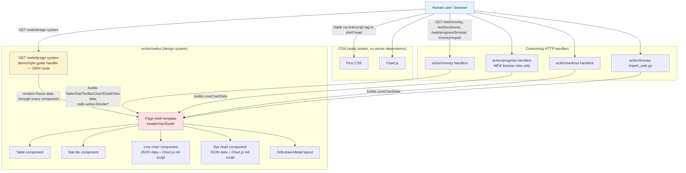
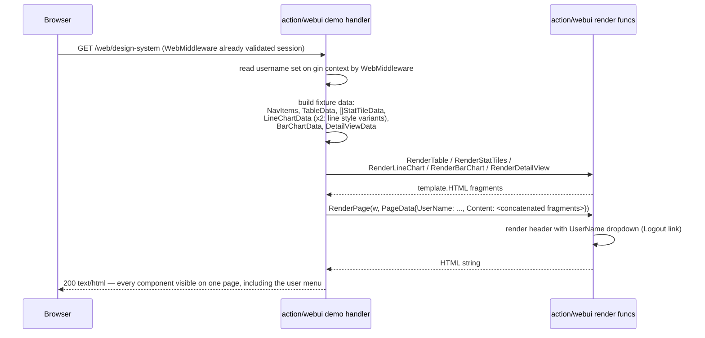
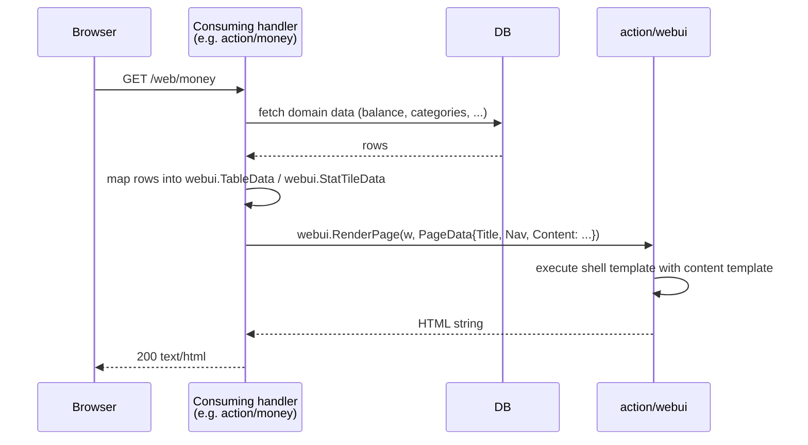
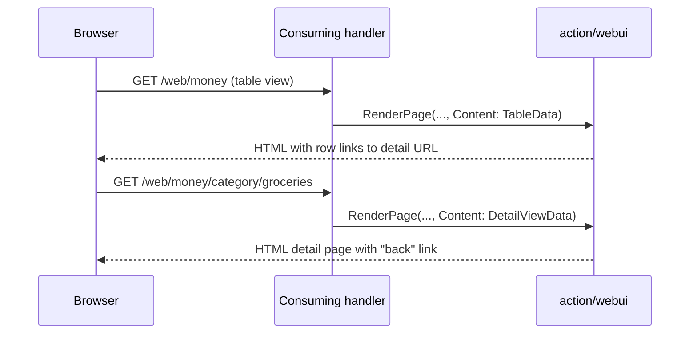

# Web UI Design System - Complete Specification

## Overview

Shared visual language and reusable Go `html/template` building blocks for the *new* `/web/*` dashboard pages (Money, Progress browse view, Workouts, Navigation home page) plus `/money/import`. Provides one page shell (header/nav/footer), a data table component, summary/stat tiles, a line chart and a bar chart, and a drill-down/detail layout, all themed consistently (light + dark) from a single place.

Built on **Pico CSS** (classless CSS framework, loaded via CDN) for base typography/layout/forms, plus a small hand-written CSS layer on top for the pieces Pico doesn't cover (nav active state, stat tile emphasis, chart container). Charts are rendered with **Chart.js** (also CDN), fed by server-rendered JSON data — no hand-rolled SVG/canvas math to maintain.

This is a **presentation-only, infrastructure layer**: it owns no database tables and no MCP tools. It exposes exactly one HTTP route of its own — a **demo/style-guide page** (`GET /web/design-system`) showing every component with sample data, so the design language can be reviewed and iterated on before any of the real dashboards (Money, Progress browse, Workouts) exist. All other pages are built by other actions' HTTP handlers (`action/money`, `action/progress`, `action/workout`), which import this package and call it to render their pages.

**Explicitly out of scope / untouched:** `action/progress/dashboard_web.go` (`/web/progress`) is a separate, purpose-built black-and-white fixed-viewport page for screenshot/e-ink display. It does not use this design system and must not be modified as part of this work.

**Replaces:** the hand-rolled inline `<style>` blocks in `action/money/import_web.go` (`importFormHTML`) — that page's form is rewired to use the shared shell, but its form logic/handler behavior is unchanged.

## Best Practices Applied

- **Pico CSS for the heavy lifting**: base typography, spacing, form controls, and light/dark come from Pico CSS (CDN `<link>`, no build step) instead of hand-writing them — minimizes custom CSS surface area to maintain
- **Minimal custom CSS on top**: only what Pico doesn't provide — nav active-link state, stat tile emphasis styling, table drill-down link affordance, chart container sizing — kept in one small stylesheet, not per-page
- **No CSS build step, no JS framework**: Pico CSS and Chart.js are both plain CDN `<script>`/`<link>` tags, matching the existing codebase style (no bundler, no npm) — consistent with `dashboard_web.go` and `import_web.go`
- **Real `.html` template files, not Go string constants**: every template — shell, each component, each page — is its own file under `action/webui/templates/`, embedded via `go:embed` and parsed with `html/template`'s named `{{define "..."}}` blocks, instead of large HTML strings living inside `.go` files
- **Composition via named templates, not Go-side string concatenation**: a page's content is its own `templates/pages/{name}.html` file that lays out `{{.SomeComponentHTML}}` fields declaratively; the handler's only job is building the data (calling `RenderTable`/`RenderStatTiles`/etc. to produce each fragment) and executing the page template once — no handler manually writes `<section>` markup or concatenates HTML strings
- **Design tokens as CSS custom properties**: custom (non-Pico) colors/spacing defined once as `:root` CSS variables; component CSS never hardcodes a color, so swapping the palette or adding a new theme touches one place
- **Automatic light/dark via `prefers-color-scheme`**: no theme toggle or stored preference — both Pico CSS and the custom layer (and Chart.js, via a small init script reading the resolved CSS variables) follow the OS/browser setting
- **Chart.js for two chart types**: server builds the data series as JSON, a thin inline script initializes a Chart.js chart from it — no server-side chart image/SVG generation to maintain. Two shapes cover every known future use: a **line chart** (single series over time — Workouts weight/reps trend, Progress activity value-over-time drill-down) and a **bar chart** (categorical comparison — Money spend-by-category)
- **Typed Go structs, not raw HTML, as the component API**: pages build a `Table`, `StatTile`, `LineChart`, `BarChart`, or `DetailView` struct and hand it to the shell; the shell owns the markup
- **Responsive by default**: flexbox/grid + relative units (`rem`, `%`, `minmax()`), no fixed `100vw`/`100vh` sizing (that pattern stays confined to the untouched screenshot dashboard)
- **Single shared Go package (`action/webui`)**: matches `action/{subdomain}` convention; the package exposes one real route (the demo page below) plus render functions other subdomains' handlers call directly
- **Demo page doubles as living documentation**: `GET /web/design-system` renders every component (nav, stat tiles, table, line chart, bar chart, drill-down/detail layout, user menu) against fixture data, so visual regressions are caught by looking at one page instead of hunting through whichever real dashboard happens to use a given component
- **User menu is a Pico dropdown, no custom JS**: the shell header shows `PageData.UserName` as a `<details class="dropdown"><summary>` element (Pico CSS v2's built-in disclosure pattern); clicking it opens a one-item menu with a "Logout" link — no click-outside/open-state JS to write or maintain
- **Every shell-rendered page carries a username**: `action/auth`'s `WebMiddleware` (see `auth-spec.md`) puts the logged-in username on the gin context; every `/web/*` handler (including this package's own `GET /web/design-system`) reads it and sets `PageData.UserName` before calling `RenderPage`

## Architecture Diagrams

### Entity Relation Diagram

Not applicable — this is a presentation layer with no database tables of its own. It renders data owned by the Money, Progress, and Workout subdomains.

### C4 Context Diagram



### Sequence Diagram: Demo page render flow



### Sequence Diagram: Page render flow



### Sequence Diagram: Drill-down navigation



## Database Schema

### SQL DDL

None — no new tables. This layer only renders data already owned by other subdomains.

## Go Code Structure

### Domain Models

```go
// action/webui/types.go
package webui

// NavItem is one link in the shared page nav.
type NavItem struct {
    Label  string
    URL    string
    Active bool // current page, for highlighting
}

// PageData is the top-level data passed to the shell template.
type PageData struct {
    Title    string
    Nav      []NavItem
    UserName string        // logged-in user's name, shown in the header dropdown; empty hides it
    Content  template.HTML // pre-rendered content template output
}

// StatTileData is one summary number (e.g. "Current balance: €4,231").
type StatTileData struct {
    Label     string
    Value     string
    SubLabel  string // optional, e.g. "vs last month: +€120"
    Emphasis  bool   // visually highlighted tile (e.g. the primary metric)
}

// TableColumn describes one column header.
type TableColumn struct {
    Label string
    Align string // "left" | "right", default left
}

// TableRow is one row's cells plus an optional drill-down link.
type TableRow struct {
    Cells   []string
    LinkURL string // empty = not clickable
}

// TableData is a full table component.
type TableData struct {
    Columns []TableColumn
    Rows    []TableRow
}

// DetailViewData is a drill-down page: a header plus a table of related records.
type DetailViewData struct {
    Title    string
    BackURL  string
    BackText string
    Stats    []StatTileData // optional summary tiles at top
    Table    TableData
}

// LineChartPoint is one (x, y) sample in a trend line chart.
type LineChartPoint struct {
    Label string  // x-axis label, e.g. "2026-08-01"
    Value float64 // y-axis value, e.g. weight in kg or rep count
}

// LineChartData is a single-series line chart (e.g. exercise weight/reps over time,
// or a Progress activity's value-over-time drill-down).
type LineChartData struct {
    ID         string // unique DOM id for this chart's <canvas>, caller-supplied
    Title      string
    SeriesName string // legend label, e.g. "Weight (kg)"
    Points     []LineChartPoint
}

// BarChartBar is one labeled bar in a bar chart.
type BarChartBar struct {
    Label string  // e.g. category name "groceries"
    Value float64 // e.g. average monthly spend
}

// BarChartData is a single-series categorical bar chart (e.g. Money spend-by-category).
type BarChartData struct {
    ID         string // unique DOM id for this chart's <canvas>, caller-supplied
    Title      string
    SeriesName string // legend label, e.g. "Avg monthly spend (EUR)"
    Bars       []BarChartBar
}
```

### Repository Interface

None — this package performs no database access. Consuming handlers fetch their own data and pass it in as the structs above.

### Template File Layout

Every template is a real `.html` file, embedded at compile time and parsed once into a single named-template set:

```
action/webui/templates/
  layout.html                    {{define "layout"}}      — shell: head/nav/footer, design tokens
  components/
    table.html                   {{define "components/table"}}
    stat_tiles.html               {{define "components/stat_tiles"}}
    chart.html                    {{define "components/chart"}}       — shared by line + bar (differ by .Type)
    detail_view.html               {{define "components/detail_view"}}
  pages/
    design_system.html             {{define "pages/design_system"}}   — demo page's own composition
```

A page's `.html` file (e.g. `pages/design_system.html`) never calls a component template directly — the Go handler renders each component to a `template.HTML` fragment first (via `RenderTable`, `RenderStatTiles`, ...), then the page template just places those fragments into `<section>`s declaratively. This keeps every `.html` file focused on markup/layout only, and keeps the small data-shaping (e.g. splitting `LineChartData.Points` into parallel label/value slices) in Go where it belongs.

## HTTP Handlers

### GET /web/design-system
The one real route this package owns. Renders a single page built entirely from fixture data, exercising every component in this design system so the whole visual language can be reviewed in a browser before any real dashboard is wired up:
- Page shell with populated nav (multiple items, one marked active)
- A stat tile row (mix of plain and emphasized tiles)
- A table (with at least one clickable/drill-down row)
- A line chart with sample time-series data (styled to preview both a Workouts-style "weight over time" and a Progress-style "value over time" use)
- A bar chart with sample categorical data (previewing a Money-style "spend by category" use)
- A drill-down/detail view section (stat tiles + table, as a linked sub-page)

Behind `WebMiddleware` (see `auth-spec.md`'s "Authorization for web dashboards" flow) like every other `/web/*` dashboard — it renders through the same shell, and the shell now shows the logged-in username, so it needs a real session to demo that correctly.

The handler itself only builds fixture data and calls the render functions below; the actual page layout lives in `templates/pages/design_system.html` (see Template File Layout). Future dashboard handlers (Money, Progress, Workouts) follow the same shape: build data, call `RenderTable`/`RenderStatTiles`/etc. for each fragment, put the fragments into their own `PageData`/content template — never assembling HTML by hand in Go.

### Render functions
Everything else is a Go function, not a route — called from other subdomains' handlers to build their pages:

### `webui.RenderPage(w io.Writer, data PageData) error`
Executes the shared shell template (head/nav/footer + design tokens, light/dark via `prefers-color-scheme`) with `data.Content` dropped into the content slot. When `data.UserName` is set, the header also renders it as a `<details class="dropdown">` menu (Pico CSS's built-in disclosure pattern, no custom JS) containing one item: a "Logout" link to `GET /web/logout` (see `auth-spec.md`). Used by every `/web/*` handler, including the demo page above.

### `webui.RenderTable(data TableData) template.HTML`
Renders a `TableData` into the shared table component markup, to be embedded as `PageData.Content` (directly, or composed inside a page's own content template).

### `webui.RenderStatTiles(data []StatTileData) template.HTML`
Renders a row of summary/stat tiles.

### `webui.RenderLineChart(data LineChartData) template.HTML`
Renders a `<canvas>` placeholder plus the `LineChartData` points as embedded JSON and a small inline script that initializes a Chart.js line chart against it, colored from the page's CSS variables (so it follows light/dark automatically).

### `webui.RenderBarChart(data BarChartData) template.HTML`
Same as `RenderLineChart`, but initializes a Chart.js bar chart from `BarChartData`.

### `webui.RenderDetailView(data DetailViewData) template.HTML`
Renders the drill-down/detail layout: back link, optional stat tiles, then a table.
