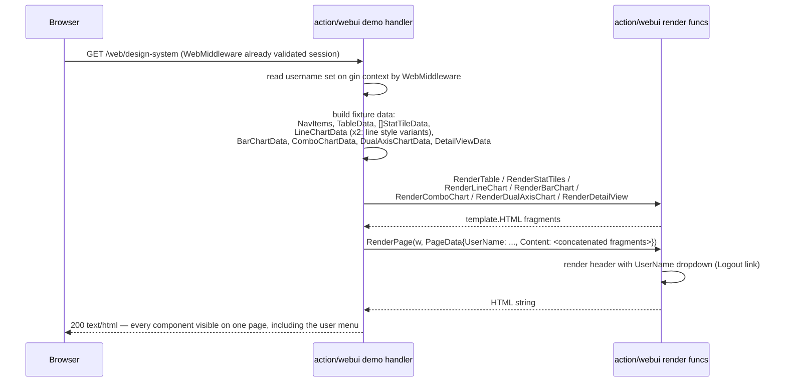
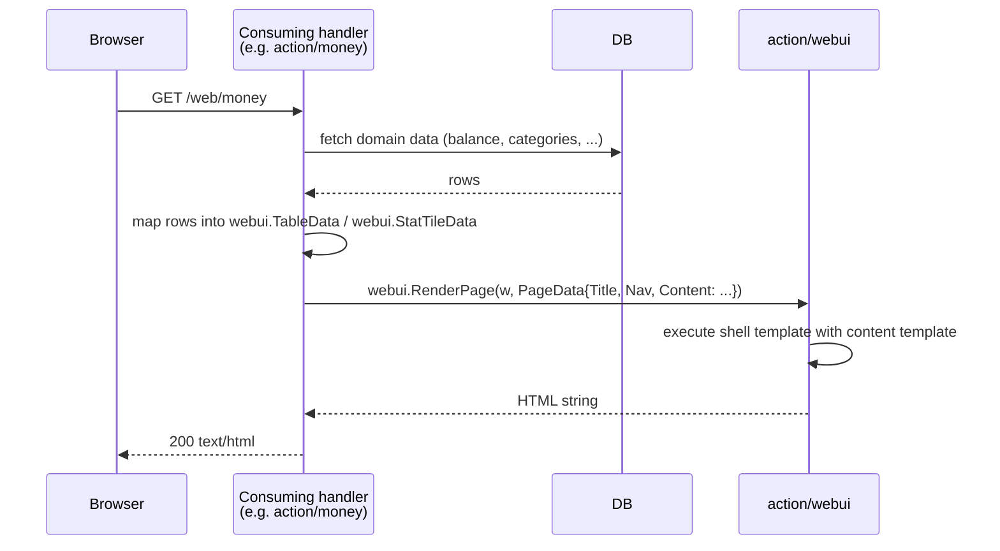
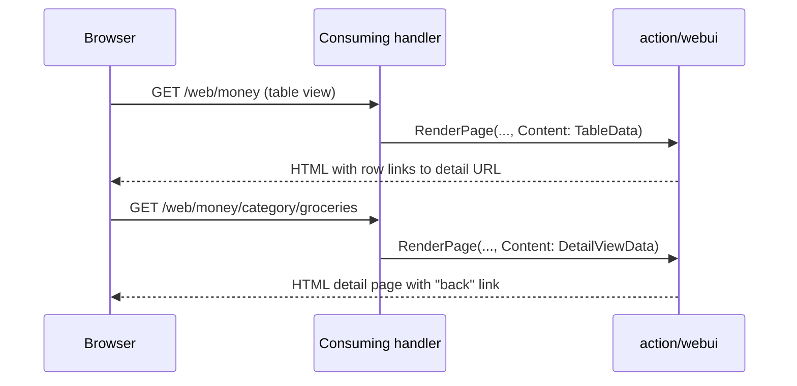

# Web UI Design System - Complete Specification

## Overview

Shared visual language and reusable Go `html/template` building blocks for the *new* `/web/*` dashboard pages (Money, Progress browse view, Workouts, Achievements) plus `/money/import`. Provides one page shell (header/nav/footer), a data table component, summary/stat tiles, a line chart, a bar chart, a combo chart, a dual-axis line chart, a month-grid calendar, a drill-down/detail layout, and an achievement-progress tile grid, all themed consistently (light + dark) from a single place.

Built on **Pico CSS** (classless CSS framework, loaded via CDN) for base typography/layout/forms, plus a small hand-written CSS layer on top for the pieces Pico doesn't cover (nav active state, stat tile emphasis, chart container). Charts are rendered with **Chart.js** (also CDN), fed by server-rendered JSON data — no hand-rolled SVG/canvas math to maintain.

This is a **presentation-only, infrastructure layer**: it owns no database tables and no MCP tools. It exposes exactly one HTTP route of its own — a **demo/style-guide page** (`GET /web/design-system`) showing every component with sample data, so the design language can be reviewed and iterated on before any of the real dashboards (Money, Progress browse, Workouts, Achievements) exist. All other pages are built by other actions' HTTP handlers (`action/money`, `action/progress`, `action/workout`, `action/achievements`), which import this package and call it to render their pages.

**Explicitly out of scope / untouched:** `action/progress/dashboard_web.go` (`/web/progress`) is a separate, purpose-built black-and-white fixed-viewport page for screenshot/e-ink display. It does not use this design system and must not be modified as part of this work.

**Replaces:** the hand-rolled inline `<style>` blocks in `action/money/import_web.go` (`importFormHTML`) — that page's form is rewired to use the shared shell, but its form logic/handler behavior is unchanged.

## Best Practices Applied

- **Pico CSS for the heavy lifting**: base typography, spacing, form controls, and light/dark come from Pico CSS (CDN `<link>`, no build step) instead of hand-writing them — minimizes custom CSS surface area to maintain
- **Minimal custom CSS on top**: only what Pico doesn't provide — nav active-link state, stat tile emphasis styling, table drill-down link affordance, chart container sizing — kept in one small stylesheet, not per-page
- **No CSS build step, no JS framework**: Pico CSS and Chart.js are both plain CDN `<script>`/`<link>` tags, matching the existing codebase style (no bundler, no npm) — consistent with `dashboard_web.go` and `import_web.go`
- **Real `.html` template files, not Go string constants**: every template — shell, each component, each page — is its own file under `action/webui/templates/`, embedded via `go:embed` and parsed with `html/template`'s named `{{define "..."}}` blocks, instead of large HTML strings living inside `.go` files
- **Composition via named templates, not Go-side string concatenation**: a page's content is its own `templates/pages/{name}.html` file that lays out `{{.SomeComponentHTML}}` fields declaratively; the handler's only job is building the data (calling `RenderTable`/`RenderStatTiles`/etc. to produce each fragment) and executing the page template once — no handler manually writes `<section>` markup or concatenates HTML strings
- **Design tokens as CSS custom properties**: custom (non-Pico) colors/spacing defined once as `:root` CSS variables; component CSS never hardcodes a color, so swapping the palette or adding a new theme touches one place
- **Automatic light/dark via `prefers-color-scheme`**: no theme toggle or stored preference — both Pico CSS and the custom layer (and Chart.js, via a small init script reading the resolved CSS variables) follow the OS/browser setting
- **Chart.js for four chart types**: server builds the data series as JSON, a thin inline script initializes a Chart.js chart from it — no server-side chart image/SVG generation to maintain. A **line chart** (single series over time — Progress activity value-over-time drill-down), a **bar chart** (categorical comparison — Money spend-by-category), and a **combo chart** (one series over time, rendered as both a bar and a line at once — Money's balance trend), and a **dual-axis line chart** (two different series over the same x-axis, each on its own Y axis — Workouts weight + reps per set) cover every known use
- **Combo chart is one series, drawn twice for readability — not two different series**: it plots the *same* `Points[].Value` per x-axis label as both a bar and an overlaid line via Chart.js's native mixed-dataset support (one `type: "bar"` chart with a second dataset overridden to `type: "line"`) — the per-period magnitude reads clearly from the bars, the shape of the trend reads clearly from the line, both for one number. Because both datasets carry identical values, the legend stays off (same convention as the single-series line/bar charts — a legend would just show the same label twice) and a second color token (`--webui-chart-bar`, alongside the existing `--webui-chart-line`) keeps the bar visually distinct from its own line overlay
- **Dual-axis chart is two different series on two Y axes, modeled on the combo chart**: one Chart.js `type: "line"` chart with two datasets over the shared `Points[].Label` x-axis — the left dataset on the default `y` axis (`position: "left"`), the right one on a secondary `y1` axis (`position: "right"`, `grid.drawOnChartArea: false` so grid lines come from the left axis only). A point's missing value is `null` in JSON (Go `*float64` = nil), which Chart.js draws as a gap in that line only (`spanGaps` left at its default `false`). Unlike the other charts the legend is **on** — the two lines are different series, so the legend is what tells them apart. Colors reuse the existing tokens (left = `--webui-chart-line`, right = `--webui-chart-bar`), no new token
- **Achievement tiles reuse Pico's native `<progress>` element, no Chart.js**: `RenderAchievementTiles` renders each achievement as its own card with a `<progress value=... max=100>` bar plus a text label — Pico CSS already themes `<progress>` for light/dark, so this needs no canvas, no JS init script, and no new custom CSS beyond the card grid layout. One component, two placements: the dedicated `/web/achievements` page renders every achievement in one grid, while Money/Progress-browse/Workouts each embed the same component with an `AchievementTilesData.Tiles` slice pre-filtered to their own domain's achievement types (see `achievements-spec.md`)
- **Typed Go structs, not raw HTML, as the component API**: pages build a `Table`, `StatTile`, `LineChart`, `BarChart`, or `DetailView` struct and hand it to the shell; the shell owns the markup
- **Responsive by default**: flexbox/grid + relative units (`rem`, `%`, `minmax()`), no fixed `100vw`/`100vh` sizing (that pattern stays confined to the untouched screenshot dashboard)
- **Pagination lives on `TableData`, not as a separate component call**: a table and its pagination controls are one visual unit, so `TableData.Pagination *PaginationData` is enough for any caller (list page or drill-down history table) to get consistent prev/next + "page X of Y" controls without composing an extra fragment
- **Pico's card is a bare `<article>`**: table, stat tile, and chart components render as `<article>` (Pico styles it as a card automatically — background, border-radius, shadow — no extra class needed); `<header>`/`<footer>` are used only where content actually maps to them (chart title in `<header>`, table pagination in `<footer>`) rather than on every card
- **Single shared Go package (`action/webui`)**: matches `action/{subdomain}` convention; the package exposes one real route (the demo page below) plus render functions other subdomains' handlers call directly
- **Demo page doubles as living documentation**: `GET /web/design-system` renders every component (nav, stat tiles, table, line chart, bar chart, calendar, drill-down/detail layout, user menu) against fixture data, so visual regressions are caught by looking at one page instead of hunting through whichever real dashboard happens to use a given component
- **User menu is a Pico dropdown, no custom JS**: the shell header shows `PageData.UserName` as a `<details class="dropdown"><summary>` element (Pico CSS v2's built-in disclosure pattern); clicking it opens a one-item menu with a "Logout" link — no click-outside/open-state JS to write or maintain
- **Every shell-rendered page carries a username**: `action/auth`'s `WebMiddleware` (see `auth-spec.md`) puts the logged-in username on the gin context; every `/web/*` handler (including this package's own `GET /web/design-system`) reads it and sets `PageData.UserName` before calling `RenderPage`
- **Calendar is Go-computed weeks, not template date math**: `CalendarData.Weeks` is a pre-built `[][]CalendarDay` (7 columns per week, including the leading/trailing days of adjacent months needed to fill the grid) — the template just ranges over rows and cells, it never computes a weekday or month boundary itself (`html/template` has no date arithmetic to do that safely anyway)
- **Calendar cells link like table rows do**: `CalendarDay.LinkURL` is empty for a day with nothing to show (mirrors `TableRow.LinkURL`'s "empty = not clickable" convention) instead of a separate boolean flag
- **Sub-groups within one table are a heading row, not separate tables**: `TableRow.Heading` (empty = normal row) lets a caller split one logical list into labeled sub-sections (e.g. Progress browse's active list grouping by progress_type) without starting a new `<table>` per group — a heading row renders as a single full-width cell (`colspan` across every column, including the tags column when present) instead of `Cells`. This exists because separate `<table>` elements each size their own columns independently, so column widths visibly jump between sections; one `<table>` with heading rows keeps column widths consistent across the whole list. A group with zero rows still gets its heading row (mirrors the "heading always renders, even with an empty table" convention this replaces), so the section list stays predictable
- **Row tags get their own column right after the first one, not a cell squeezed with other content**: `TableRow.Cells` stays `[]string` (auto-escaped, no per-cell HTML) — tags are a separate mechanism. `TableRow.Tags []TableRowTag` holds a row's tags (e.g. Progress browse's life_part tags), each with a `Label` and an optional `Tooltip`; `TableData.TagsColumnLabel` (empty = no tags column at all, same "empty = off" convention as `LinkURL`/`EmptyMessage`) turns it on and gives the column its header text. The column is always inserted right after the first `Cells` column (e.g. Name), before the rest, since that's the identifying column a tag most naturally sits next to. Every existing caller (Money, Workouts, Progress finished/future/paused lists) leaves `TagsColumnLabel` unset, so nothing else changes. Each tag is styled with Pico's own `.contrast` button class (`role="button" class="outline contrast webui-tag"`) instead of custom chip CSS — `.webui-tag` only overrides padding/font-size to fit inline, no color of our own. Tooltip renders via Pico CSS's own `data-tooltip` attribute (pure CSS, already loaded on every page), not the native HTML `title` attribute — the native browser tooltip proved unreliable in practice (Chrome/Mac showed nothing on hover)

## Architecture Diagrams

### Entity Relation Diagram

Not applicable — this is a presentation layer with no database tables of its own. It renders data owned by the Money, Progress, and Workout subdomains.

### C4 Context Diagram


```mermaid
graph TB
    Browser[Human user / browser]

    subgraph "CDN (static assets, no server dependency)"
        Pico[Pico CSS]
        ChartJS[Chart.js]
    end

    subgraph "action/webui (design system)"
        Demo[GET /web/design-system<br/>demo/style-guide handler — OWN route]
        Shell[Page shell template<br/>header/nav/footer]
        Table[Table component]
        Stat[Stat tile component]
        Line[Line chart component<br/>JSON data + Chart.js init script]
        Bar[Bar chart component<br/>JSON data + Chart.js init script]
        Combo[Combo chart component<br/>bar+line mixed dataset, Chart.js init script]
        Dual[Dual-axis line chart component<br/>two series, left + right Y axis, Chart.js init script]
        Detail[Drill-down/detail layout]
        Tile[Achievement tile grid component<br/>Pico native progress bar, no Chart.js]
    end

    subgraph "Consuming HTTP handlers"
        MoneyH[action/money handlers]
        ProgressH[action/progress handlers<br/>NEW browse view only]
        WorkoutH[action/workout handlers]
        ImportH[action/money import_web.go]
        AchievementsH[action/achievements handlers<br/>+ BuildAchievementTiles helper, called by<br/>MoneyH/ProgressH/WorkoutH for their own embedded tiles]
    end

    Browser -->|GET /web/design-system| Demo
    Browser -->|GET /web/money, /web/workouts, /web/progress/browse, /money/import| MoneyH
    Browser --> ProgressH
    Browser --> WorkoutH
    Browser --> ImportH
    Browser -->|GET /web/achievements| AchievementsH
    Browser -->|loads via link/script tag in shell head| Pico
    Browser --> ChartJS

    Demo -->|renders fixture data through every component| Shell
    MoneyH -->|builds Table/StatTile/BarChart/DetailView data,<br/>calls webui.Render*| Shell
    ProgressH -->|builds LineChartData| Shell
    WorkoutH -->|builds DualAxisChartData| Shell
    ImportH --> Shell
    AchievementsH -->|builds AchievementTilesData, calls webui.RenderAchievementTiles| Shell
    MoneyH -.->|"achievements.BuildAchievementTiles types=money_saving/money_spend"| AchievementsH
    ProgressH -.->|"achievements.BuildAchievementTiles types=activity_*"| AchievementsH
    WorkoutH -.->|"achievements.BuildAchievementTiles types=exercise_*"| AchievementsH

    Shell --> Table
    Shell --> Stat
    Shell --> Line
    Shell --> Bar
    Shell --> Combo
    Shell --> Dual
    Shell --> Detail
    Shell --> Tile

    style Browser fill:#e1f5ff
    style Shell fill:#ffe1e1
    style Demo fill:#fff3cd
```

### Sequence Diagram: Demo page render flow


```mermaid
sequenceDiagram
    participant Browser
    participant Demo as action/webui demo handler
    participant Webui as action/webui render funcs

    Browser->>Demo: GET /web/design-system (WebMiddleware already validated session)
    Demo->>Demo: read username set on gin context by WebMiddleware
    Demo->>Demo: build fixture data:<br/>NavItems, TableData, []StatTileData,<br/>LineChartData (x2: line style variants),<br/>BarChartData, ComboChartData, DualAxisChartData, DetailViewData
    Demo->>Webui: RenderTable / RenderStatTiles /<br/>RenderLineChart / RenderBarChart /<br/>RenderComboChart / RenderDualAxisChart / RenderDetailView
    Webui-->>Demo: template.HTML fragments
    Demo->>Webui: RenderPage(w, PageData{UserName: ..., Content: <concatenated fragments>})
    Webui->>Webui: render header with UserName dropdown (Logout link)
    Webui-->>Demo: HTML string
    Demo-->>Browser: 200 text/html — every component visible on one page, including the user menu
```

### Sequence Diagram: Page render flow


```mermaid
sequenceDiagram
    participant Browser
    participant Handler as Consuming handler<br/>(e.g. action/money)
    participant DB
    participant Webui as action/webui

    Browser->>Handler: GET /web/money
    Handler->>DB: fetch domain data (balance, categories, ...)
    DB-->>Handler: rows
    Handler->>Handler: map rows into webui.TableData / webui.StatTileData
    Handler->>Webui: webui.RenderPage(w, PageData{Title, Nav, Content: ...})
    Webui->>Webui: execute shell template with content template
    Webui-->>Handler: HTML string
    Handler-->>Browser: 200 text/html
```

### Sequence Diagram: Drill-down navigation


```mermaid
sequenceDiagram
    participant Browser
    participant Handler as Consuming handler
    participant Webui as action/webui

    Browser->>Handler: GET /web/money (table view)
    Handler->>Webui: RenderPage(..., Content: TableData)
    Webui-->>Browser: HTML with row links to detail URL

    Browser->>Handler: GET /web/money/category/groceries
    Handler->>Webui: RenderPage(..., Content: DetailViewData)
    Webui-->>Browser: HTML detail page with "back" link
```

## Database Schema

### SQL DDL

None — no new tables. This layer only renders data already owned by other subdomains.

## Go Code Structure

### Domain Models

```go
// action/webui/types.go
package webui

// NavItem is one link in the shared page nav.
type NavItem struct {
    Label  string
    URL    string
    Active bool // current page, for highlighting
}

// PageData is the top-level data passed to the shell template.
type PageData struct {
    Title    string
    Nav      []NavItem
    UserName string        // logged-in user's name, shown in the header dropdown; empty hides it
    Content  template.HTML // pre-rendered content template output
}

// StatTileData is one summary number (e.g. "Current balance: €4,231").
type StatTileData struct {
    Label     string
    Value     string
    SubLabel  string // optional, e.g. "vs last month: +€120"
    Emphasis  bool   // visually highlighted tile (e.g. the primary metric)
}

// TableColumn describes one column header.
type TableColumn struct {
    Label string
    Align string // "left" | "right", default left
}

// TableRow is one row's cells plus an optional drill-down link.
type TableRow struct {
    Cells   []string
    LinkURL string        // empty = not clickable
    Tags    []TableRowTag // this row's tags, rendered in the table's tags column right after the first Cells column (see TableData.TagsColumnLabel); nil = none, only meaningful when TagsColumnLabel is set
    Heading string        // when non-empty, row renders as a full-width section-heading row (Cells/LinkURL/Tags ignored) instead of normal cells; empty = normal row, same "empty = off" convention as the rest of the component
}

// TableData is a full table component.
type TableData struct {
    Columns         []TableColumn
    Rows            []TableRow
    Pagination      *PaginationData // nil = no pagination controls rendered
    TagsColumnLabel string          // header for the tags column, inserted right after the first Cells column; empty = no tags column at all
}

// PaginationData drives the prev/next + "page X of Y" controls rendered
// below a table. Page is 1-indexed. PrevURL/NextURL are pre-built by the
// caller (so the component stays agnostic of each page's own query params)
// and are empty on the first/last page respectively, which hides that link.
type PaginationData struct {
    Page       int
    TotalPages int
    PrevURL    string
    NextURL    string
}

// DetailViewData is a drill-down page: a header plus a table of related records.
type DetailViewData struct {
    Title       string
    Description template.HTML // optional subtitle under Title, e.g. an activity's free-text description; empty renders nothing
    BackURL     string
    BackText    string
    Stats       []StatTileData // optional summary tiles at top
    Table       TableData
}

// LineChartPoint is one (x, y) sample in a trend line chart.
type LineChartPoint struct {
    Label string  // x-axis label, e.g. "2026-08-01"
    Value float64 // y-axis value, e.g. weight in kg or rep count
}

// LineChartData is a single-series line chart (e.g. a Progress activity's
// value-over-time drill-down).
type LineChartData struct {
    ID         string // unique DOM id for this chart's <canvas>, caller-supplied
    Title      string
    SeriesName string // legend label, e.g. "Weight (kg)"
    Points     []LineChartPoint
}

// BarChartBar is one labeled bar in a bar chart.
type BarChartBar struct {
    Label string  // e.g. category name "groceries"
    Value float64 // e.g. average monthly spend
}

// BarChartData is a single-series categorical bar chart (e.g. Money spend-by-category).
type BarChartData struct {
    ID         string // unique DOM id for this chart's <canvas>, caller-supplied
    Title      string
    SeriesName string // legend label, e.g. "Avg monthly spend (EUR)"
    Bars       []BarChartBar
}

// ComboChartPoint is one (x, y) sample plotted as both a bar and a line —
// the same value drawn two ways, not two different series.
type ComboChartPoint struct {
    Label string  // x-axis label, e.g. "2026-08"
    Value float64 // e.g. balance at this point in the trend
}

// ComboChartData is a single-series chart rendered as both a bar and an
// overlaid line for the same values (e.g. Money's balance trend) — for
// when a plain LineChartData or BarChartData reads less clearly alone than
// the two drawing styles combined on one series.
type ComboChartData struct {
    ID         string // unique DOM id for this chart's <canvas>, caller-supplied
    Title      string
    SeriesName string // e.g. "Balance (EUR)" — shown in the tooltip, no legend (see Best Practices)
    Points     []ComboChartPoint
}

// DualAxisChartPoint is one x position with up to two values, one per Y axis.
// nil = no value for that series at this point (gap in that line only).
type DualAxisChartPoint struct {
    Label string   // x-axis label, e.g. "2026-08-01"
    Left  *float64 // left Y axis value, e.g. weight in kg
    Right *float64 // right Y axis value, e.g. rep count
}

// DualAxisChartData is a two-series line chart, each series on its own Y
// axis (e.g. Workouts exercise drill-down: weight left, reps right).
type DualAxisChartData struct {
    ID              string // unique DOM id for this chart's <canvas>, caller-supplied
    Title           string
    LeftSeriesName  string // legend + left axis label, e.g. "Weight (kg)"
    RightSeriesName string // legend + right axis label, e.g. "Reps"
    Points          []DualAxisChartPoint
}

// TableRowTag is one small tag shown next to a table row's first cell (e.g.
// a life_part tag on the Progress browse table), styled as a Pico CSS
// contrast button (role="button" class="contrast") — no custom color CSS of
// ours. Tooltip renders via Pico's own data-tooltip attribute (pure CSS, no
// JS) instead of the native HTML title attribute — Chrome's native title
// tooltip proved unreliable in practice.
type TableRowTag struct {
    Label   string
    Tooltip string // shown on hover via Pico's data-tooltip attribute; empty = no tooltip
}

// CalendarDay is one cell in a month-grid calendar.
type CalendarDay struct {
    Day      int    // day-of-month number shown in the cell, e.g. 5
    InMonth  bool   // false for the leading/trailing days of adjacent months
    Count    string // e.g. "3 transactions" — empty hides the count line
    Total    string // e.g. "€42.10" — empty hides the total line
    LinkURL  string // empty = not clickable, same convention as TableRow.LinkURL
}

// CalendarData is a month-grid calendar (e.g. Money's transaction calendar).
type CalendarData struct {
    Title    string        // e.g. "August 2026"
    PrevURL  string        // previous month link; empty hides it (and the whole nav row when NextURL is also empty)
    NextURL  string        // next month link; empty hides it (and the whole nav row when PrevURL is also empty)
    Weekdays []string      // 7 column headers, e.g. ["Mon", ..., "Sun"]
    Weeks    [][]CalendarDay // each inner slice has exactly 7 CalendarDay entries
}

// AchievementTileData is one achievement rendered as a card with a progress bar (see achievements-spec.md).
type AchievementTileData struct {
    Name            string
    ProgressLabel   string  // e.g. "€420 / €1,000 (42%)", "82kg / 100kg", "14 / 30 day streak"
    PercentComplete float64 // 0-100, clamped for the bar width (ProgressLabel still shows the real, unclamped numbers)
    Deadline        string  // formatted, e.g. "by Dec 31, 2026" — empty hides the deadline line (no deadline set)
    OverTarget      bool    // current exceeds target — tile renders with a warning tint. Only meaningful for achievement
                             // types where exceeding is bad (e.g. money_spend over budget); left false otherwise
    LinkURL         string  // drill-down link to the underlying category/exercise/activity page, empty = not clickable
                             // (same "empty = not clickable" convention as TableRow.LinkURL/CalendarDay.LinkURL);
                             // derived per achievement_type by action/achievements' toAchievementTileData, see achievements-spec.md
}

// AchievementTilesData is a grid of achievement tiles — either every active achievement (the
// dedicated /web/achievements page) or a subset pre-filtered to one domain's achievement
// types (embedded in the Money/Progress-browse/Workouts pages).
type AchievementTilesData struct {
    Tiles        []AchievementTileData
    EmptyMessage string // shown instead of the grid when Tiles is empty; empty string means render nothing (see achievements-spec.md's embedded-vs-dedicated empty-state convention)
}
```

### Repository Interface

None — this package performs no database access. Consuming handlers fetch their own data and pass it in as the structs above.

### Template File Layout

Every template is a real `.html` file, embedded at compile time and parsed once into a single named-template set:

```
action/webui/templates/
  layout.html                    {{define "layout"}}      — shell: head/nav/footer, design tokens
  components/
    table.html                   {{define "components/table"}}       — renders Pagination controls below the rows when set
    pagination.html               {{define "components/pagination"}} — prev/next + "page X of Y", included by table.html
    stat_tiles.html               {{define "components/stat_tiles"}}
    chart.html                    {{define "components/chart"}}       — shared by line + bar (differ by .Type)
    combo_chart.html               {{define "components/combo_chart"}} — one series, bar+line mixed-dataset overlay
    dual_axis_chart.html           {{define "components/dual_axis_chart"}} — two series, left + right Y axis, legend on
    calendar.html                  {{define "components/calendar"}}
    detail_view.html               {{define "components/detail_view"}}
    achievement_tiles.html                 {{define "components/achievement_tiles"}}  — one <article> card per AchievementTileData, wrapped in a responsive grid
  pages/
    design_system.html             {{define "pages/design_system"}}   — demo page's own composition
```

A page's `.html` file (e.g. `pages/design_system.html`) never calls a component template directly — the Go handler renders each component to a `template.HTML` fragment first (via `RenderTable`, `RenderStatTiles`, ...), then the page template just places those fragments into `<section>`s declaratively. This keeps every `.html` file focused on markup/layout only, and keeps the small data-shaping (e.g. splitting `LineChartData.Points` into parallel label/value slices) in Go where it belongs.

## HTTP Handlers

### GET /web/design-system
The one real route this package owns. Renders a single page built entirely from fixture data, exercising every component in this design system so the whole visual language can be reviewed in a browser before any real dashboard is wired up:
- Page shell with populated nav (multiple items, one marked active)
- A stat tile row (mix of plain and emphasized tiles)
- A table (with at least one clickable/drill-down row)
- A line chart with sample time-series data (styled to preview both a Workouts-style "weight over time" and a Progress-style "value over time" use)
- A bar chart with sample categorical data (previewing a Money-style "spend by category" use)
- A combo chart with sample data (previewing Money's balance trend: one series drawn as both a bar and a line)
- A dual-axis line chart with sample data (previewing Workouts' weight + reps per set, including one point with no weight → gap in the weight line)
- A month-grid calendar with real, correctly-computed leading/trailing days and a few sample linked/unlinked days (previewing the Money transaction calendar use)
- A drill-down/detail view section (stat tiles + table, as a linked sub-page)
- An achievement tile grid with a few sample tiles (mixed progress percentages, one with a deadline, one `OverTarget`) previewing both the dedicated Achievements page and an embedded subset use

Behind `WebMiddleware` (see `auth-spec.md`'s "Authorization for web dashboards" flow) like every other `/web/*` dashboard — it renders through the same shell, and the shell now shows the logged-in username, so it needs a real session to demo that correctly.

The handler itself only builds fixture data and calls the render functions below; the actual page layout lives in `templates/pages/design_system.html` (see Template File Layout). Future dashboard handlers (Money, Progress, Workouts) follow the same shape: build data, call `RenderTable`/`RenderStatTiles`/etc. for each fragment, put the fragments into their own `PageData`/content template — never assembling HTML by hand in Go.

### Render functions
Everything else is a Go function, not a route — called from other subdomains' handlers to build their pages:

### `webui.RenderPage(w io.Writer, data PageData) error`
Executes the shared shell template (head/nav/footer + design tokens, light/dark via `prefers-color-scheme`) with `data.Content` dropped into the content slot. When `data.UserName` is set, the header also renders it as a `<details class="dropdown">` menu (Pico CSS's built-in disclosure pattern, no custom JS) containing one item: a "Logout" link to `GET /web/logout` (see `auth-spec.md`). Used by every `/web/*` handler, including the demo page above.

### `webui.RenderTable(data TableData) template.HTML`
Renders a `TableData` as a Pico CSS card (`<article>` — no extra class needed, Pico styles a bare `<article>` as a card) containing the `<table>`, to be embedded as `PageData.Content` (directly, or composed inside a page's own content template). When `data.Pagination` is non-nil, also renders the pagination controls (prev/next links, "page X of Y") inside a card `<footer>` below the rows — callers needing a paginated list (e.g. Progress browse/finished/future lists, or a drill-down's history table) just set `TableData.Pagination` instead of calling a separate render function. When `data.TagsColumnLabel` is non-empty, the table also gets a column with that header text inserted right after the first `Columns` entry (e.g. Name), and each row's `Tags` render inside its own cell in that column as small `<span role="button" class="outline contrast webui-tag">` elements — Pico's own `.contrast` button styling (dark background/border, no custom color CSS of ours), sized down to fit via `.webui-tag` (padding/font-size only, no color) — with `data-tooltip="{{.Tooltip}}"` set when `Tooltip` is non-empty for Pico's own CSS-only tooltip on hover, no extra script. `TagsColumnLabel` empty (every caller but Progress's activity lists) omits the column entirely. A row with `Heading` set renders as `<tr><td colspan="N">{{.Heading}}</td></tr>` (`N` = total column count, tags column included when present) instead of its (ignored) `Cells`/`Tags` — used by Progress's active-list grouping (see `progress-spec.md`).

### `webui.RenderStatTiles(data []StatTileData) template.HTML`
Renders a row of summary/stat tiles, each its own Pico card (`<article class="webui-stat-tile">`).

### `webui.RenderLineChart(data LineChartData) template.HTML`
Renders a Pico card (`<article class="webui-chart-container">`) with a `<header>` holding the chart title and a `<canvas>` below it, fed the `LineChartData` points as embedded JSON via a small inline script that initializes a Chart.js line chart, colored from the page's CSS variables (so it follows light/dark automatically). The card is capped at a fixed max-width (`--webui-chart-container` CSS) plus a fixed Chart.js `aspectRatio`, so charts render compact rather than stretching to the full page width.

### `webui.RenderBarChart(data BarChartData) template.HTML`
Same as `RenderLineChart`, but initializes a Chart.js bar chart from `BarChartData`.

### `webui.RenderComboChart(data ComboChartData) template.HTML`
Renders a Pico card (`<article class="webui-chart-container">`) with a `<header>` holding the chart title and a `<canvas>` below it, initializing a single Chart.js chart (`type: "bar"`) built from `ComboChartData.Points` with two datasets both plotting the *same* `Points[].Value` against the shared `Points[].Label` x-axis: a bar dataset colored from `--webui-chart-bar`, and a second dataset overridden to `type: "line"` colored from the existing `--webui-chart-line` (same color `RenderLineChart` uses). Legend stays off, same as `RenderLineChart`/`RenderBarChart` — both datasets are the one series, so a legend would just repeat `SeriesName` twice.

### `webui.RenderDualAxisChart(data DualAxisChartData) template.HTML`
Renders a Pico card (`<article class="webui-chart-container">`) with a `<header>` title and a `<canvas>`, initializing one Chart.js `type: "line"` chart with two datasets: `Points[].Left` on the left `y` axis (`--webui-chart-line`), `Points[].Right` on the right `y1` axis (`yAxisID: "y1"`, `--webui-chart-bar`). nil values render as JSON `null` → gap in that line. Legend on (see Best Practices). Used by the Workouts exercise drill-down (`workout-spec.md`).

### `webui.RenderCalendar(data CalendarData) template.HTML`
Renders a Pico card (`<article>`) with a `<header>` holding the month title, and a 7-column grid below (`<table>`, one `<tr>` per `Weeks` entry) — each cell shows the day number plus, when set, `Count` and `Total`. When `PrevURL`/`NextURL` are set, the header also shows a prev/next nav — but a caller stacking several months on one page (e.g. Money's calendar) typically leaves both empty per grid and renders a single page-level Prev/Next control of its own instead, so the header falls back to just the title. A day with `InMonth == false` renders muted/de-emphasized; a day with `LinkURL` set is a clickable link, matching `RenderTable`'s row-link convention. Used by the Money transaction calendar (`money-spec.md`).

### `webui.RenderDetailView(data DetailViewData) template.HTML`
Renders the drill-down/detail layout: back link, title, optional description paragraph, optional stat tiles, then an optional table. `Description` renders (as pre-escaped `template.HTML`, so callers can pass through markdown-rendered content) only when non-empty — used by the Progress activity drill-down (`progress-spec.md`) to show `Activity.Description`. When `data.Table.Columns` is empty, the table section is skipped entirely (mirrors the existing "skip stat tiles when `Stats` is empty" behavior) — used by the Workouts exercise drill-down (`workout-spec.md`), which has stat tiles and a chart but no table.

### `webui.RenderAchievementTiles(data AchievementTilesData) template.HTML`
Renders `data.Tiles` as a responsive card grid (`<article class="webui-achievement-tile">` per tile, CSS grid wrapper — same "no fixed viewport sizing" responsiveness as every other component), each card showing the achievement name, a Pico native `<progress value="{{.PercentComplete}}" max="100">` bar, the `ProgressLabel` text below it, and the `Deadline` line when set. When `LinkURL` is set, the achievement name is rendered as `<a href="{{.LinkURL}}">{{.Name}}</a>` instead of plain text — the same "link the primary identifier, not the whole card" convention `RenderTable` uses for a row's first cell — otherwise it's plain text (some achievement types have no drill-down target, see `achievements-spec.md`). A tile with `OverTarget` true gets a warning-tint class (`webui-achievement-tile--over`), styled from the same `:root` design tokens as the rest of the custom CSS layer. When `data.Tiles` is empty, renders `data.EmptyMessage` if set, or nothing at all if it's also empty — the dedicated `/web/achievements` page always sets a message ("No active achievements yet"), while Money/Progress-browse/Workouts leave it unset so an embedded section with no achievements of that domain's types simply doesn't appear (see `achievements-spec.md`).

## E2E Tests

Changes in `tests/webui_design_system_test.go` for the dual-axis chart:

- NEW `TestDesignSystem_ShowsDualAxisChart`: demo renders `<canvas id="chart-weight-reps-demo">` with `yAxisID: "y1"`, a `null` in the left dataset, and the legend on
- `TestDesignSystem_ChartsHaveUniqueCanvasIDs`: expected canvas count goes from ≥4 to ≥5 (plus the dual-axis example)
