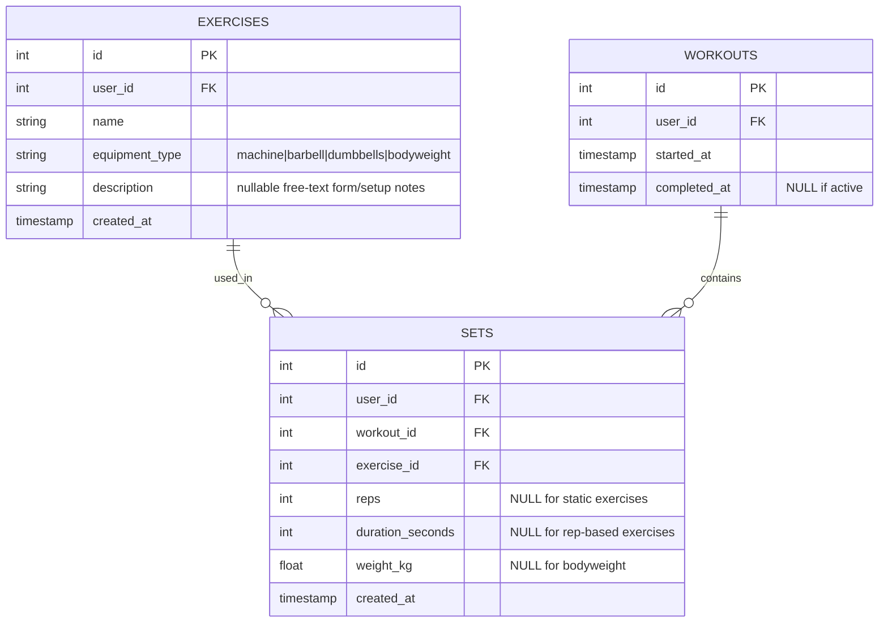
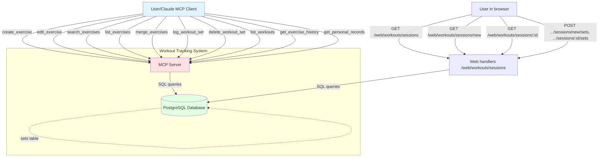

# Workout Tracking System - Complete Specification

## Overview

System for tracking workout exercises, sets, and training history with MCP (Model Context Protocol) interface. Supports different equipment types (machine, barbell, dumbbells, bodyweight) and tracks both rep-based and time-based exercises.

A web dashboard sits on top of this same data, built on the shared `action/webui` design system (see `webui-spec.md`), the same way `action/progress`'s browse view is:

- **Personal records** (`GET /web/workouts`, `GET /web/workouts/:id`) — read-only review of personal records and per-exercise trends.
- **Sessions** (`/web/workouts/sessions/...`) — log sets from the browser (e.g. from the phone mid-workout) without going through the agent: a history of the last 10 workouts, a "New workout" button, and a workout screen with a set-adding form. Editing/deleting sets and exercises stays MCP-only.

## Architecture Diagrams

### Entity Relation Diagram



### C4 Context Diagram



## Database Schema

### SQL DDL

```sql
-- Exercises table
CREATE TABLE IF NOT EXISTS exercises (
    id SERIAL PRIMARY KEY,
    user_id BIGINT NOT NULL,
    name VARCHAR(255) NOT NULL,
    equipment_type VARCHAR(20) NOT NULL CHECK (equipment_type IN ('machine', 'barbell', 'dumbbells', 'bodyweight')),
    created_at TIMESTAMP NOT NULL DEFAULT CURRENT_TIMESTAMP
);

CREATE INDEX IF NOT EXISTS idx_exercises_user_id ON exercises(user_id);

ALTER TABLE exercises ADD COLUMN IF NOT EXISTS description TEXT;

-- Workouts table
CREATE TABLE IF NOT EXISTS workouts (
    id SERIAL PRIMARY KEY,
    user_id BIGINT NOT NULL,
    started_at TIMESTAMPTZ NOT NULL,
    completed_at TIMESTAMPTZ NULL
);

CREATE INDEX IF NOT EXISTS idx_workouts_user_started ON workouts(user_id, started_at DESC);

-- Sets table
CREATE TABLE IF NOT EXISTS sets (
    id SERIAL PRIMARY KEY,
    user_id BIGINT NOT NULL,
    workout_id BIGINT NOT NULL REFERENCES workouts(id),
    exercise_id BIGINT NOT NULL REFERENCES exercises(id),
    reps BIGINT NULL,
    duration_seconds BIGINT NULL,
    weight_kg DECIMAL(5, 2) NULL,
    created_at TIMESTAMPTZ NOT NULL
);

CREATE INDEX IF NOT EXISTS idx_sets_user_created ON sets(user_id, created_at DESC);
CREATE INDEX IF NOT EXISTS idx_sets_exercise_user ON sets(exercise_id, user_id);
```

## Go Code Structure

### Domain Models

```go
package workout

import (
	"time"
)

// EquipmentType represents the type of equipment used for an exercise
type EquipmentType string

const (
	EquipmentMachine    EquipmentType = "machine"
	EquipmentBarbell    EquipmentType = "barbell"
	EquipmentDumbbells  EquipmentType = "dumbbells"
	EquipmentBodyweight EquipmentType = "bodyweight"
)

// Exercise represents a workout exercise
type Exercise struct {
	ID            int64           `json:"id"`
	UserID        int64           `json:"user_id"`
	Name          string        `json:"name"`
	EquipmentType EquipmentType `json:"equipment_type"`
	Description   string        `json:"description,omitempty"` // Free-text form/setup notes; "" if unset
	CreatedAt     time.Time     `json:"created_at"`
	LastUsedAt    *time.Time    `json:"last_used_at,omitempty"` // Computed from sets
}

// Workout represents a training session
type Workout struct {
	ID          int64        `json:"id"`
	UserID      int64        `json:"user_id"`
	StartedAt   time.Time  `json:"started_at"`
	CompletedAt *time.Time `json:"completed_at"` // NULL means active
}

// Set represents a single set within a workout
type Set struct {
	ID              int64       `json:"id"`
	UserID          int64       `json:"user_id"`
	WorkoutID       int64       `json:"workout_id"`
	ExerciseID      int64       `json:"exercise_id"`
	Reps            *int64      `json:"reps"`             // NULL for static exercises
	DurationSeconds *int64      `json:"duration_seconds"` // NULL for rep-based exercises
	WeightKg        *float64  `json:"weight_kg"`        // NULL for bodyweight
	CreatedAt       time.Time `json:"created_at"`
}

type WorkoutSet struct {
	Workout
	Set
}

type ExerciseSearch struct {
	UserID  int64
	IDS     []int64
	Limit   int64
}

type WorkoutSearch struct {
	UserID  int64
	IDS     []int64
}

// ExercisePersonalRecords pairs an exercise with how many sets have ever
// been logged for it and its personal records. Used only by the web
// dashboard's list view (sorted by SetCount).
type ExercisePersonalRecords struct {
	Exercise Exercise
	SetCount int64
	Records  PersonalRecords
}

type SetSearch struct {
	UserID  int64
	From    time.Time
	To      time.Time
}

```

### Repository Interface

```go
// gateways/workout_repository.go
type WorkoutRepository interface {
	// Exercise operations
	CreateExercise(ctx context.Context, exercise Exercise) (int64, error)
	ListExercises(ctx context.Context, params ExerciseSearch) ([]Exercise, error)
	SearchExercises(ctx context.Context, userID int64, query string) ([]Exercise, error)
	UpdateExercise(ctx context.Context, exercise *Exercise) error
	GetExercise(ctx context.Context, exerciseID int64, userID int64) (*Exercise, error)
	MoveSetsBetweenExercises(ctx context.Context, sourceID, targetID, userID int64) (int64, error)
	DeleteExercise(ctx context.Context, exerciseID int64, userID int64) error

	// Workout operations
	CreateWorkout(ctx context.Context, workout Workout) (int64, error)
	CloseWorkout(ctx context.Context, workoutID int64) error
	ListWorkouts(ctx context.Context, params WorkoutSearch) ([]Workout, error)
	GetWorkoutsByIDs(ctx context.Context, userID int64, workoutIDs []int64) ([]Workout, error)

	// Set operations
	CreateSet(ctx context.Context, set *Set) error
	ListSets(ctx context.Context, params SetSearch) ([]Set, error)
	GetLastSet(ctx context.Context, userID int64) (WorkoutSet, error)
	GetSetByID(ctx context.Context, setID int64, userID int64) (*SetWithExercise, error)
	DeleteSet(ctx context.Context, setID int64, userID int64) error
	GetExerciseHistory(ctx context.Context, userID int64, exerciseID int64, limit int, offset int) ([]Workout, error)
	ListSetsByExerciseAndWorkouts(ctx context.Context, userID int64, exerciseID int64, workoutIDs []int64) ([]Set, error)
	GetPersonalRecords(ctx context.Context, userID int64, exerciseID int64) (*PersonalRecords, error)
	// ListPersonalRecords returns every exercise the user has ever logged a
	// set for, paired with its total set count and personal records, sorted
	// by set count descending. Powers the web dashboard's list view.
	ListPersonalRecords(ctx context.Context, userID int64) ([]ExercisePersonalRecords, error)
	// ListExercisesByUsage returns every exercise of the user, sorted by
	// set count DESC, then name ASC; never-used exercises come last.
	// Powers the web workout screen's exercise selector.
	ListExercisesByUsage(ctx context.Context, userID int64) ([]Exercise, error)
	// ListExerciseSets returns the sets of one exercise from the user's
	// workoutLimit newest workouts containing it, ordered by created_at ASC.
	// Powers the web exercise drill-down (chart + set history table).
	ListExerciseSets(ctx context.Context, userID int64, exerciseID int64, workoutLimit int) ([]Set, error)
}

// SetWithExercise is a set joined with its exercise name, used by delete_workout_set
type SetWithExercise struct {
	Set
	ExerciseName string `json:"exercise_name"`
}

// PersonalRecords holds best-ever results for an exercise
type PersonalRecords struct {
	MaxWeight *SetRecord
	MaxReps   *SetRecord
	MaxVolume *VolumeRecord
}

type SetRecord struct {
	WeightKg  float64
	Reps      int64
	CreatedAt time.Time
}

type VolumeRecord struct {
	Volume    float64
	StartedAt time.Time
}
```

## MCP Tools

### create_exercise
Creates a new exercise with name, equipment_type (machine/barbell/dumbbells/bodyweight), and an optional description (free-text form/setup notes, e.g. machine seat height, grip width, movement variant). Validates equipment_type against allowed values.

### edit_exercise
Updates name, equipment_type, and/or description of an existing exercise. At least one field required; unspecified fields keep their current value. `description` is a pointer field: omit it to leave unchanged, pass `""` to clear it.

### search_exercises
Searches ALL exercises (not just the 20 most recent) by 1-5 name variants, case-insensitive ILIKE match. Ranks results by match_count (variants matched) DESC, then exercise_id ASC — same pattern as `resolve_food_id_by_name`. Each match includes the exercise's description, so form/setup notes surface before creating a possible duplicate.

### list_exercises
Returns the 20 most recently used exercises, sorted by last_used_at DESC NULLS LAST (unused exercises appear last, by name). Each entry includes its description.

### merge_exercises
Moves all sets from a source exercise to a target exercise, then deletes the source. Used to clean up duplicate exercises without losing set history.

### log_workout_set
Logs a set (reps and/or duration_seconds, optional weight_kg) for an exercise. Reuses the active workout if one exists and its last set was logged within 2 hours, otherwise creates a new workout. Supports backdating via an optional `date` field.

### delete_workout_set
Deletes a single set by ID, returning the deleted set's exercise name, weight, and reps for confirmation.

### list_workouts
Returns the last 30 days of workouts (default limit 10), each with its sets grouped by exercise, sorted by started_at DESC. Each exercise entry includes its description alongside name and equipment_type.

### get_exercise_history
Returns all workout sessions containing a given exercise, newest first, paginated via limit/offset. Lets the assistant answer "how much was last time on X?" without scanning all workouts.

### get_personal_records
Returns best-ever results for an exercise: max_weight, max_reps, max_volume (single-workout total), and estimated_1rm (Epley formula: weight × (1 + reps/30)). Only sets with reps > 0 and weight_kg > 0 count.

## HTTP Handlers

### GET /web/workouts
Read-only list view: the "Personal records · Sessions" cross-links line, then an exercise achievement tile grid, then every exercise the user has ever logged a set for, sorted by times performed (set count) descending. Columns: Name, Equipment, Description, Times performed, Max weight, Max reps, Est. 1RM (same Epley formula as `get_personal_records`). Each row links to `/web/workouts/{exercise_id}`. Built via `webui.RenderAchievementTiles` + `webui.RenderTable` on the shared design system shell (see `webui-spec.md`), behind the same `WebMiddleware` session auth as every other `/web/*` dashboard.

### GET /web/workouts/:id
Drill-down for a single exercise: title subtitle shows the exercise's description (if any, HTML-escaped, via `DetailViewData.Description`), then stat tiles (max weight, max reps, est. 1RM, times performed) plus one dual-axis chart — weight (left Y axis, kg) and reps (right Y axis), one point per workout, its first set (see "One dual-axis chart, one point per workout — its first set" above) — built from the exercise's sets in its latest 100 workouts (one `ListExerciseSets` query, oldest-to-newest). Below the chart: the full set history table (Date, Set), newest workout first, sets inside a workout in logging order, every row linking to its workout screen — same 100-workout window, no pagination (see "Drill-down page: stat tiles, chart, then the set history" above). 404s if the exercise doesn't exist or doesn't belong to the current user.

### GET /web/workouts/sessions
History: "Personal records · Sessions" cross-links, a "New workout" button (link to `/web/workouts/sessions/new`), then the last 10 workouts, newest first. Each workout shows its date (links to `/web/workouts/sessions/{id}`) and, per exercise in order of first set, the exercise name and its first set (e.g. "80 kg × 8"). Empty state: "No workouts yet".

### GET /web/workouts/sessions/new
Empty workout screen: the set-adding form (exercise selector sorted by usage, each option labelled "name — first set of the previous workout with it", e.g. "Bench press — 80 kg × 8"; weight kg, reps) posting to `/web/workouts/sessions/new/sets`. Creates nothing in the DB.

### POST /web/workouts/sessions/new/sets
Logs the first set of a new workout: validates the form, closes any still-open workout, creates the workout and the set, redirects to `/web/workouts/sessions/{workout_id}`. On a validation error re-renders the `new` screen with an inline error and creates nothing.

### GET /web/workouts/sessions/:id
Workout screen for an existing workout: header with the workout date, the set-adding form posting to `/web/workouts/sessions/{id}/sets` (prefilled with this workout's last set: exercise, weight, reps; selector options labelled with the first set of the previous workout, this workout excluded), then this workout's sets in logging order. 404s if the workout doesn't exist or doesn't belong to the current user.

### POST /web/workouts/sessions/:id/sets
Adds a set to the given workout (created_at = now), redirects back to its workout screen. Validation errors re-render the workout screen with an inline error; 404 for a missing/foreign workout.

## E2E Tests

In `tests/workout_dashboard_web_test.go`:

- `TestExerciseDetail_Chart_FirstSetPerWorkoutOnly`: two workouts, the older with 60×10 then 60×8, the newer with 80×8 then 80×6 → chart data holds exactly two points, 60/10 and 80/8, oldest first; 60×8 and 80×6 are not in the chart but are in the history table. Existing `TestExerciseDetail_ShowsStatTilesAndTrendCharts` / `TestExerciseDetail_SetWithoutWeight_GapInWeightLine` are adjusted to the one-point-per-workout rule
- `TestWorkoutsDashboard_ExerciseDetail_SetHistory`: exercise logged in 101 workouts, the newest with sets 80×8 then 80×6, plus a bodyweight set (12 reps) → the page lists the sets of the newest 100 workouts and not the oldest one's; newest workout's rows come first and in logging order (80 kg × 8 before 80 kg × 6); each row links to `/web/workouts/sessions/{workout_id}`; another exercise's and another user's sets are absent; an exercise with no sets renders no history table
- `TestPersonalRecordsList_*`: sorted by times performed; excludes never performed exercises; shows records and estimated 1 RM; rows link to drill down
- `TestExerciseDetail_*`: unknown or foreign exercise, 404s; no sets yet, renders without error

In `tests/workout_sessions_web_test.go`:

- `TestWorkoutSessions_History`: 11 workouts with sets → page shows only the newest 10, newest first; each workout shows its exercises with the first set of each (not later sets); "New workout" link present; empty state when no workouts
- `TestWorkoutSessions_NewScreen_CreatesNothing`: GET `/new` renders the form, workout count in DB unchanged
- `TestWorkoutSessions_NewScreen_ExercisesSortedByUsage`: exercises with 3, 1, 0 sets appear in the selector in that order
- `TestWorkoutSessions_Selector_ShowsPreviousWorkoutFirstSet`: exercise A logged in an older workout (60×10) and a newer one (80×8, then 80×6), exercise B bodyweight (12 reps), exercise C never logged, exercise D logged only in a workout older than the last 10 → on `/new` options read "A — 80 kg × 8", "B — 12 reps", "C", "D"; on the newer workout's own screen A's option reads "A — 60 kg × 10" (current workout excluded); another user's sets never show up
- `TestWorkoutSessions_FirstSet_CreatesWorkoutAndRedirects`: POST `/new/sets` → one new workout with one set (weight, reps), 302 to `/web/workouts/sessions/{id}`; a still-open older workout gets closed
- `TestWorkoutSessions_AddSet_ToExistingWorkout`: POST `/{id}/sets` → set added to that workout, no new workout, redirect back
- `TestWorkoutSessions_Validation`: missing exercise / missing reps → 200 with inline error, nothing created
- `TestWorkoutSessions_WorkoutScreen`: shows this workout's sets only; form prefilled with the last set's exercise, weight and reps
- `TestWorkoutSessions_UnknownOrForeignWorkout_404s`: GET and POST for a missing or another user's workout → 404
- `TestWorkoutSessions_*`: history, empty; cross links

In `tests/workout_create_exercise_test.go`:

- `TestCreateExercise_*`: success; with description; invalid equipment type

In `tests/workout_delete_set_test.go`:

- `TestDeleteWorkoutSet_*`: successfully; not found; other users set

In `tests/workout_edit_exercise_test.go`:

- `TestEditExercise_*`: updates name; updates equipment type; updates both fields; updates description; not found; validation no fields; validation invalid equipment type

In `tests/workout_exercise_history_test.go`:

- `TestGetExerciseHistory_*`: returns multiple workouts; pagination; no history

In `tests/workout_list_exercises_test.go`:

- `TestListExercises_*`: sorted by last used

In `tests/workout_list_workouts_test.go`:

- `TestListWorkouts_*`: with sets

In `tests/workout_log_set_test.go`:

- `TestLogWorkoutSet_*`: with reps creates active workout; with duration; reuses active workout; closes old workout and creates new; validation; with date creates backdated workout; with date reuses existing workout

In `tests/workout_merge_exercises_test.go`:

- `TestMergeExercises_*`: merges sets and deletes source; works with zero sets; error when source not found; error when same ids

In `tests/workout_personal_records_test.go`:

- `TestGetPersonalRecords_*`: returns correct records; bodyweight exercise, max reps with null weight; no sets; estimated 1 RM epley

In `tests/workout_search_exercises_test.go`:

- `TestSearchExercises_*`: returns matching exercises; multiple variants increase match count; case insensitive; returns empty when no matches; returns last used at; validation error for empty variants

## Changelog

- **03-10-26** — migrated to the new spec template: removed Best Practices Applied and the sequence diagrams together with every reference to them; E2E Tests extended with the MCP tests and the remaining web tests; added Changelog (Architecture Diagrams, E2E Tests, Changelog)
- **03-10-26** — new-workout exercise selector shows the previous workout's first set; exercise page shows set history (Go Code Structure, HTTP Handlers, E2E Tests)
- **02-10-26** — added web sessions pages: workout history, new workout, logging sets (Overview, Architecture Diagrams, Go Code Structure, HTTP Handlers, E2E Tests)
- **26-09-26** — goals references renamed to achievements (HTTP Handlers)
- **26-09-26** — exercise page shows weight and reps on one dual-axis chart (HTTP Handlers, E2E Tests)
- **21-09-26** — added `description` field to exercises (Architecture Diagrams, Database Schema, Go Code Structure, MCP Tools, HTTP Handlers)
- **17-09-26** — table indexes reworked to match query patterns (Database Schema)
- **02-09-26** — list view embeds exercise goal tiles (HTTP Handlers)
- **22-08-26** — added the web dashboard: exercise list and exercise drill-down (Overview, Go Code Structure, MCP Tools, HTTP Handlers)
- **19-08-26** — MCP tool descriptions merged in from per-action docs (`docs/actions/`) (Architecture Diagrams, Go Code Structure, MCP Tools)
- **04-10-25** — domain models and repository interface reworked across several drafts (Go Code Structure)
- **03-10-25** — initial version
