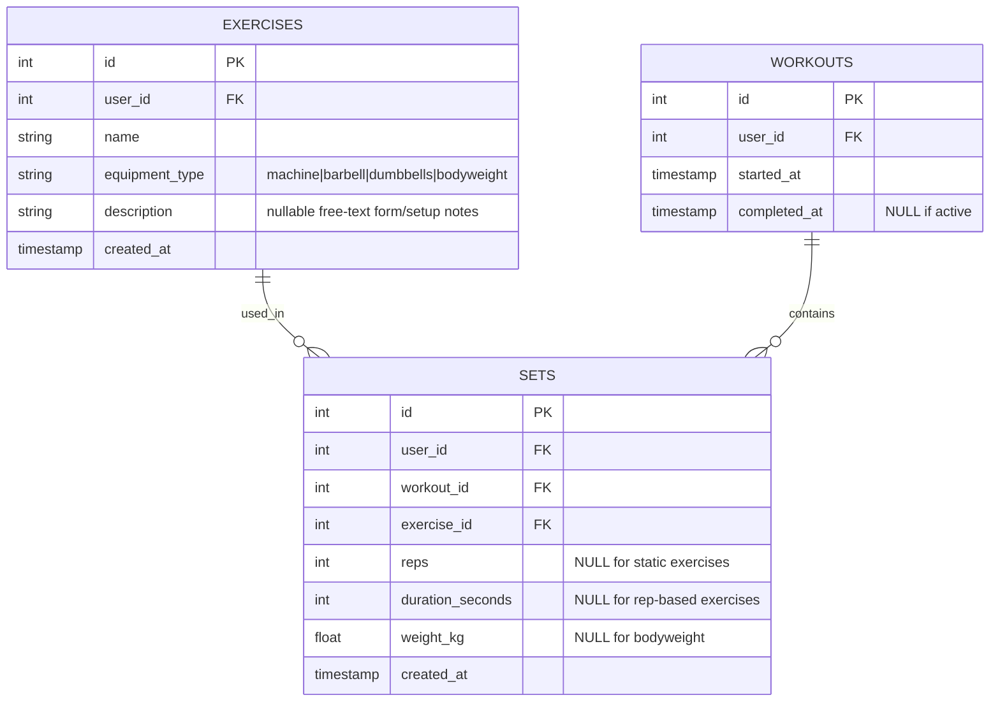
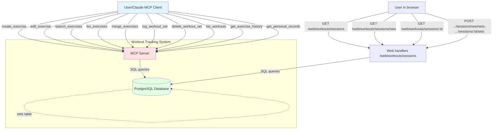
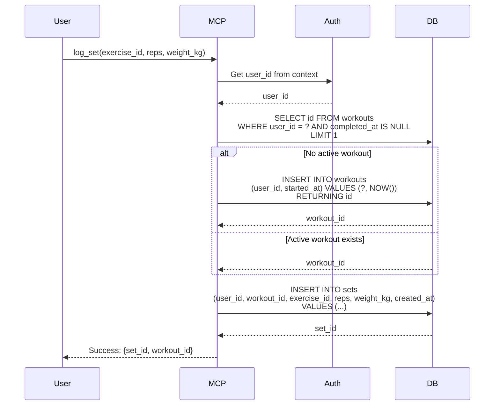
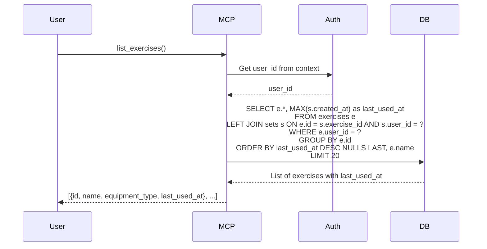
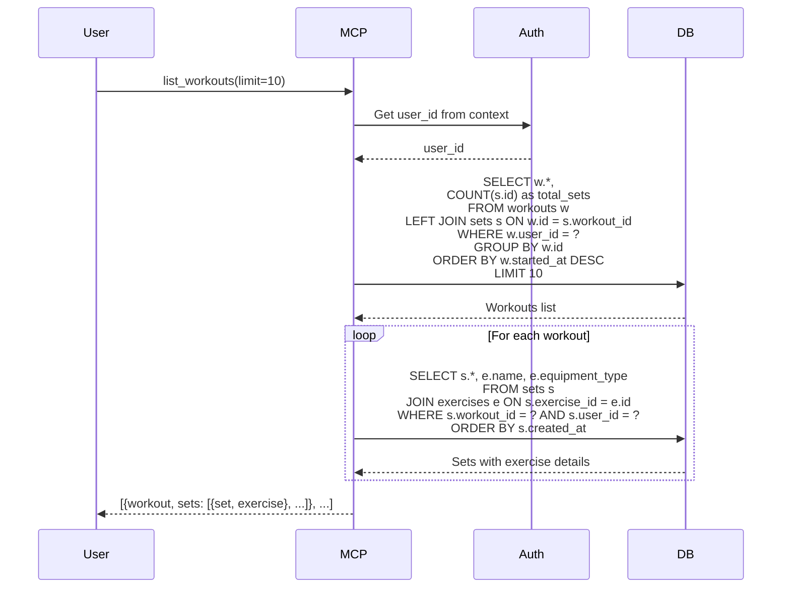
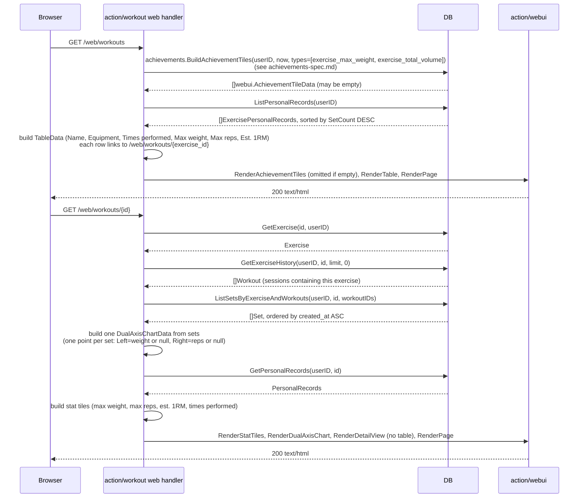
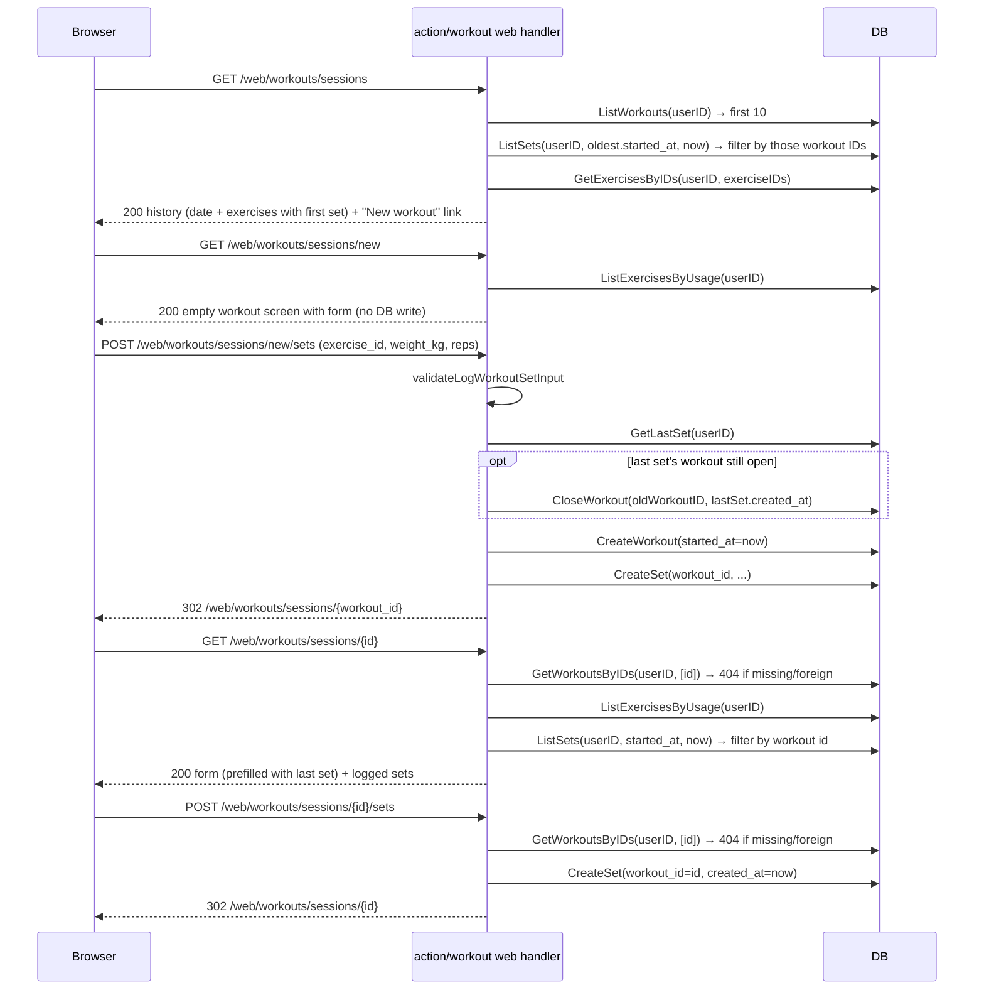

# Workout Tracking System - Complete Specification

## Overview

System for tracking workout exercises, sets, and training history with MCP (Model Context Protocol) interface. Supports different equipment types (machine, barbell, dumbbells, bodyweight) and tracks both rep-based and time-based exercises.

A web dashboard sits on top of this same data, built on the shared `action/webui` design system (see `webui-spec.md`), the same way `action/progress`'s browse view is:

- **Personal records** (`GET /web/workouts`, `GET /web/workouts/:id`) — read-only review of personal records and per-exercise trends.
- **Sessions** (`/web/workouts/sessions/...`) — log sets from the browser (e.g. from the phone mid-workout) without going through the agent: a history of the last 10 workouts, a "New workout" button, and a workout screen with a set-adding form. Editing/deleting sets and exercises stays MCP-only.

## Best Practices Applied

- **Multi-user Support**: All tables have user_id for data isolation
- **Single Active Workout Pattern**: Only one workout per user can be active at a time (completed_at IS NULL)
- **Auto-workout Creation**: First log_set call automatically creates active workout if none exists
- **Flexible Metrics**: Support both reps (dynamic) and duration (static/isometric exercises)
- **Denormalized Reads**: Calculate last_used_at via JOIN instead of storing redundantly
- **Progress Tracking**: Weight and time metrics for monitoring improvements
- **Nullable Fields**: reps, duration_seconds, weight_kg are nullable but at least one must be set
- **User Context**: user_id extracted from authentication context (JWT/session), not passed explicitly
- **Web dashboard reuses existing repository methods**: the drill-down page's trend charts are built from `GetExerciseHistory` + `ListSetsByExerciseAndWorkouts`, the exact same two calls `get_exercise_history_mcp.go` already makes — no new query needed for chart data, only for the list view's per-exercise usage count
- **"Times performed" counts sets, not workout sessions**: each logged set is one performance of the lift, so the list view's `ListPersonalRecords` sorts by `COUNT(sets)` per exercise, not `COUNT(DISTINCT workout_id)`
- **List view reuses `GetPersonalRecords` per row**: `ListPersonalRecords` first ranks exercises by set count, then calls the existing single-exercise `GetPersonalRecords` for each — N+1 queries, acceptable for a single-user personal tool with a handful of exercises (same trade-off `BrowseDetailWebHandler` already makes calling `GetTrendStats` three times)
- **Est. 1RM computed in the handler, not stored**: same Epley formula (`weight × (1 + reps/30)`) `get_personal_records_mcp.go` already computes from `MaxWeight`, kept out of `domain.PersonalRecords` so the DB layer stays formula-agnostic
- **Drill-down page has no table, only charts**: unlike the Progress browse drill-down (which pairs a chart with a paginated point-history table), the exercise drill-down is stat tiles + one dual-axis chart only — `webui.RenderDetailView` is adjusted to skip rendering the table section when `DetailViewData.Table.Columns` is empty (mirrors its existing "skip stat tiles when `Stats` is empty" behavior), instead of showing an empty table box
- **List view embeds its own achievement tiles, built elsewhere**: `GET /web/workouts` shows an `exercise_max_weight`/`exercise_total_volume` tile grid above the exercise table, via `achievements.BuildAchievementTiles(ctx, db, userID, now, types)` + `webui.RenderAchievementTiles` (see `achievements-spec.md`) — `action/workout` owns no achievement logic, it just calls the helper and drops the fragment in. The section disappears entirely when the user has no exercise achievements (empty `EmptyMessage`, see `webui-spec.md`)
- **One dual-axis chart, one point per set**: the drill-down shows weight (left Y axis, kg) and reps (right Y axis) as two lines on one `webui.DualAxisChartData` chart instead of two separate line charts, so a set's weight and reps sit at the same X position. Every set with weight or reps becomes one point (X label = set date, oldest-to-newest); a missing value (`WeightKg = 0`, e.g. bodyweight, or `Reps = 0`, e.g. a duration-only set) becomes `null` — a gap in that line only, the other line still shows the set. Sets with neither are skipped
- **Sessions pages live under `/web/workouts/sessions`, records stay at `/web/workouts`**: existing URLs don't move; both pages carry the same cross-links line ("Personal records · Sessions"), same pattern as `progress`'s `browseCrossLinks`. Gin matches the static `sessions` segment before the `:id` param, so `/web/workouts/:id` keeps working
- **Lazy workout creation on the web**: "New workout" is a plain link to `GET /web/workouts/sessions/new` — it creates nothing. The workout row is created only by the first `POST /web/workouts/sessions/new/sets`, which then redirects to `/web/workouts/sessions/{real_id}`. An abandoned `new` screen leaves no empty workout behind
- **Explicit "New workout" always starts a new workout**: unlike `log_workout_set`'s 2-hour reuse rule, the first set from the `new` screen always creates a new workout, closing any still-open one at its last set's time (same `CloseWorkout` call `logCurrent` makes) — the user explicitly asked for a new workout. Sets posted to `/web/workouts/sessions/{id}/sets` go straight into that workout, no 2-hour rule
- **One validation for MCP and web**: the web form reuses `validateLogWorkoutSetInput` from `log_workout_set_mcp.go`, so the two entry points can't drift apart (same approach as `progress`'s `createProgressPoint`)
- **Web form is reps + weight only**: exercise selector, weight/difficulty (kg, optional — for machines the stack level goes here) and reps (required). Duration-based sets (planks) stay MCP-only
- **Exercise selector sorted by usage**: every exercise of the user, most-logged first (set count DESC, then name), never-used exercises at the bottom — via a new `ListExercisesByUsage` (LEFT JOIN, unlike `ListPersonalRecords` which drops unused exercises and runs N+1 record queries the selector doesn't need). After a set is logged, the form is prefilled with the workout's last set — exercise, weight and reps — so a series like 80×6, 80×4, 80×2 is one edit + submit per set. Taken from the DB, not from redirect params, so it survives a page reload
- **History page reuses `list_workouts`' calls**: `ListWorkouts` (first 10) + `ListSets` from the oldest of them to now, filtered by workout ID + `GetExercisesByIDs` — no new query. Per workout: date, and per exercise (in order of first set) its name and the first set logged for it
- **Workout screen shows what's already logged**: below the form, the sets of this workout in logging order (exercise, weight, reps), so the user sees each submit landed — same `ListSets` + filter, no new query
- **Exercise `description` is free-text, nullable at the column level but always read back as `""`**: every read query wraps it in `COALESCE(description, '')` so `domain.Exercise.Description` is a plain `string`, never a pointer — existing rows predating the column get `''` instead of `NULL` on first read. `edit_exercise` takes `description` as `*string` specifically so "omitted" (keep current value) is distinguishable from "explicit empty string" (clear it), unlike `name`/`equipment_type` which use the zero-value-means-omitted convention

## Architecture Diagrams

### Entity Relation Diagram



### C4 Context Diagram



### Sequence Diagram: Log Set



### Sequence Diagram: List Exercises



### Sequence Diagram: List Workouts



### Sequence Diagram: Web Dashboard — List + Drill-down



### Sequence Diagram: Web Sessions — History, New Workout, Log Sets



## Database Schema

### SQL DDL

```sql
-- Exercises table
CREATE TABLE IF NOT EXISTS exercises (
    id SERIAL PRIMARY KEY,
    user_id BIGINT NOT NULL,
    name VARCHAR(255) NOT NULL,
    equipment_type VARCHAR(20) NOT NULL CHECK (equipment_type IN ('machine', 'barbell', 'dumbbells', 'bodyweight')),
    created_at TIMESTAMP NOT NULL DEFAULT CURRENT_TIMESTAMP
);

CREATE INDEX IF NOT EXISTS idx_exercises_user_id ON exercises(user_id);

ALTER TABLE exercises ADD COLUMN IF NOT EXISTS description TEXT;

-- Workouts table
CREATE TABLE IF NOT EXISTS workouts (
    id SERIAL PRIMARY KEY,
    user_id BIGINT NOT NULL,
    started_at TIMESTAMPTZ NOT NULL,
    completed_at TIMESTAMPTZ NULL
);

CREATE INDEX IF NOT EXISTS idx_workouts_user_started ON workouts(user_id, started_at DESC);

-- Sets table
CREATE TABLE IF NOT EXISTS sets (
    id SERIAL PRIMARY KEY,
    user_id BIGINT NOT NULL,
    workout_id BIGINT NOT NULL REFERENCES workouts(id),
    exercise_id BIGINT NOT NULL REFERENCES exercises(id),
    reps BIGINT NULL,
    duration_seconds BIGINT NULL,
    weight_kg DECIMAL(5, 2) NULL,
    created_at TIMESTAMPTZ NOT NULL
);

CREATE INDEX IF NOT EXISTS idx_sets_user_created ON sets(user_id, created_at DESC);
CREATE INDEX IF NOT EXISTS idx_sets_exercise_user ON sets(exercise_id, user_id);
```

## Go Code Structure

### Domain Models

```go
package workout

import (
	"time"
)

// EquipmentType represents the type of equipment used for an exercise
type EquipmentType string

const (
	EquipmentMachine    EquipmentType = "machine"
	EquipmentBarbell    EquipmentType = "barbell"
	EquipmentDumbbells  EquipmentType = "dumbbells"
	EquipmentBodyweight EquipmentType = "bodyweight"
)

// Exercise represents a workout exercise
type Exercise struct {
	ID            int64           `json:"id"`
	UserID        int64           `json:"user_id"`
	Name          string        `json:"name"`
	EquipmentType EquipmentType `json:"equipment_type"`
	Description   string        `json:"description,omitempty"` // Free-text form/setup notes; "" if unset
	CreatedAt     time.Time     `json:"created_at"`
	LastUsedAt    *time.Time    `json:"last_used_at,omitempty"` // Computed from sets
}

// Workout represents a training session
type Workout struct {
	ID          int64        `json:"id"`
	UserID      int64        `json:"user_id"`
	StartedAt   time.Time  `json:"started_at"`
	CompletedAt *time.Time `json:"completed_at"` // NULL means active
}

// Set represents a single set within a workout
type Set struct {
	ID              int64       `json:"id"`
	UserID          int64       `json:"user_id"`
	WorkoutID       int64       `json:"workout_id"`
	ExerciseID      int64       `json:"exercise_id"`
	Reps            *int64      `json:"reps"`             // NULL for static exercises
	DurationSeconds *int64      `json:"duration_seconds"` // NULL for rep-based exercises
	WeightKg        *float64  `json:"weight_kg"`        // NULL for bodyweight
	CreatedAt       time.Time `json:"created_at"`
}

type WorkoutSet struct {
	Workout
	Set
}

type ExerciseSearch struct {
	UserID  int64
	IDS     []int64
	Limit   int64
}

type WorkoutSearch struct {
	UserID  int64
	IDS     []int64
}

// ExercisePersonalRecords pairs an exercise with how many sets have ever
// been logged for it and its personal records. Used only by the web
// dashboard's list view (sorted by SetCount).
type ExercisePersonalRecords struct {
	Exercise Exercise
	SetCount int64
	Records  PersonalRecords
}

type SetSearch struct {
	UserID  int64
	From    time.Time
	To      time.Time
}

```

### Repository Interface

```go
// gateways/workout_repository.go
type WorkoutRepository interface {
	// Exercise operations
	CreateExercise(ctx context.Context, exercise Exercise) (int64, error)
	ListExercises(ctx context.Context, params ExerciseSearch) ([]Exercise, error)
	SearchExercises(ctx context.Context, userID int64, query string) ([]Exercise, error)
	UpdateExercise(ctx context.Context, exercise *Exercise) error
	GetExercise(ctx context.Context, exerciseID int64, userID int64) (*Exercise, error)
	MoveSetsBetweenExercises(ctx context.Context, sourceID, targetID, userID int64) (int64, error)
	DeleteExercise(ctx context.Context, exerciseID int64, userID int64) error

	// Workout operations
	CreateWorkout(ctx context.Context, workout Workout) (int64, error)
	CloseWorkout(ctx context.Context, workoutID int64) error
	ListWorkouts(ctx context.Context, params WorkoutSearch) ([]Workout, error)
	GetWorkoutsByIDs(ctx context.Context, userID int64, workoutIDs []int64) ([]Workout, error)

	// Set operations
	CreateSet(ctx context.Context, set *Set) error
	ListSets(ctx context.Context, params SetSearch) ([]Set, error)
	GetLastSet(ctx context.Context, userID int64) (WorkoutSet, error)
	GetSetByID(ctx context.Context, setID int64, userID int64) (*SetWithExercise, error)
	DeleteSet(ctx context.Context, setID int64, userID int64) error
	GetExerciseHistory(ctx context.Context, userID int64, exerciseID int64, limit int, offset int) ([]Workout, error)
	ListSetsByExerciseAndWorkouts(ctx context.Context, userID int64, exerciseID int64, workoutIDs []int64) ([]Set, error)
	GetPersonalRecords(ctx context.Context, userID int64, exerciseID int64) (*PersonalRecords, error)
	// ListPersonalRecords returns every exercise the user has ever logged a
	// set for, paired with its total set count and personal records, sorted
	// by set count descending. Powers the web dashboard's list view.
	ListPersonalRecords(ctx context.Context, userID int64) ([]ExercisePersonalRecords, error)
	// ListExercisesByUsage returns every exercise of the user, sorted by
	// set count DESC, then name ASC; never-used exercises come last.
	// Powers the web workout screen's exercise selector.
	ListExercisesByUsage(ctx context.Context, userID int64) ([]Exercise, error)
}

// SetWithExercise is a set joined with its exercise name, used by delete_workout_set
type SetWithExercise struct {
	Set
	ExerciseName string `json:"exercise_name"`
}

// PersonalRecords holds best-ever results for an exercise
type PersonalRecords struct {
	MaxWeight *SetRecord
	MaxReps   *SetRecord
	MaxVolume *VolumeRecord
}

type SetRecord struct {
	WeightKg  float64
	Reps      int64
	CreatedAt time.Time
}

type VolumeRecord struct {
	Volume    float64
	StartedAt time.Time
}
```

## MCP Tools

### create_exercise
Creates a new exercise with name, equipment_type (machine/barbell/dumbbells/bodyweight), and an optional description (free-text form/setup notes, e.g. machine seat height, grip width, movement variant). Validates equipment_type against allowed values.

### edit_exercise
Updates name, equipment_type, and/or description of an existing exercise. At least one field required; unspecified fields keep their current value. `description` is a pointer field: omit it to leave unchanged, pass `""` to clear it.

### search_exercises
Searches ALL exercises (not just the 20 most recent) by 1-5 name variants, case-insensitive ILIKE match. Ranks results by match_count (variants matched) DESC, then exercise_id ASC — same pattern as `resolve_food_id_by_name`. Each match includes the exercise's description, so form/setup notes surface before creating a possible duplicate.

### list_exercises
Returns the 20 most recently used exercises, sorted by last_used_at DESC NULLS LAST (unused exercises appear last, by name). Each entry includes its description.

### merge_exercises
Moves all sets from a source exercise to a target exercise, then deletes the source. Used to clean up duplicate exercises without losing set history.

### log_workout_set
Logs a set (reps and/or duration_seconds, optional weight_kg) for an exercise. Reuses the active workout if one exists and its last set was logged within 2 hours, otherwise creates a new workout. Supports backdating via an optional `date` field.

### delete_workout_set
Deletes a single set by ID, returning the deleted set's exercise name, weight, and reps for confirmation.

### list_workouts
Returns the last 30 days of workouts (default limit 10), each with its sets grouped by exercise, sorted by started_at DESC. Each exercise entry includes its description alongside name and equipment_type.

### get_exercise_history
Returns all workout sessions containing a given exercise, newest first, paginated via limit/offset. Lets the assistant answer "how much was last time on X?" without scanning all workouts.

### get_personal_records
Returns best-ever results for an exercise: max_weight, max_reps, max_volume (single-workout total), and estimated_1rm (Epley formula: weight × (1 + reps/30)). Only sets with reps > 0 and weight_kg > 0 count.

## HTTP Handlers

### GET /web/workouts
Read-only list view: the "Personal records · Sessions" cross-links line, then an exercise achievement tile grid (see Best Practices), then every exercise the user has ever logged a set for, sorted by times performed (set count) descending. Columns: Name, Equipment, Description, Times performed, Max weight, Max reps, Est. 1RM (same Epley formula as `get_personal_records`). Each row links to `/web/workouts/{exercise_id}`. Built via `webui.RenderAchievementTiles` + `webui.RenderTable` on the shared design system shell (see `webui-spec.md`), behind the same `WebMiddleware` session auth as every other `/web/*` dashboard.

### GET /web/workouts/:id
Drill-down for a single exercise: title subtitle shows the exercise's description (if any, HTML-escaped, via `DetailViewData.Description`), then stat tiles (max weight, max reps, est. 1RM, times performed) plus one dual-axis chart — weight (left Y axis, kg) and reps (right Y axis), one point per set (see "One dual-axis chart, one point per set" above) — built from every set ever logged for the exercise (via `GetExerciseHistory` + `ListSetsByExerciseAndWorkouts`, oldest-to-newest). No history table (see "Drill-down page has no table, only charts" above). 404s if the exercise doesn't exist or doesn't belong to the current user.

### GET /web/workouts/sessions
History: "Personal records · Sessions" cross-links, a "New workout" button (link to `/web/workouts/sessions/new`), then the last 10 workouts, newest first. Each workout shows its date (links to `/web/workouts/sessions/{id}`) and, per exercise in order of first set, the exercise name and its first set (e.g. "80 kg × 8"). Empty state: "No workouts yet".

### GET /web/workouts/sessions/new
Empty workout screen: the set-adding form (exercise selector sorted by usage, weight kg, reps) posting to `/web/workouts/sessions/new/sets`. Creates nothing in the DB.

### POST /web/workouts/sessions/new/sets
Logs the first set of a new workout: validates the form, closes any still-open workout, creates the workout and the set, redirects to `/web/workouts/sessions/{workout_id}`. On a validation error re-renders the `new` screen with an inline error and creates nothing.

### GET /web/workouts/sessions/:id
Workout screen for an existing workout: header with the workout date, the set-adding form posting to `/web/workouts/sessions/{id}/sets` (prefilled with this workout's last set: exercise, weight, reps), then this workout's sets in logging order. 404s if the workout doesn't exist or doesn't belong to the current user.

### POST /web/workouts/sessions/:id/sets
Adds a set to the given workout (created_at = now), redirects back to its workout screen. Validation errors re-render the workout screen with an inline error; 404 for a missing/foreign workout.

## E2E Tests

New file `tests/workout_sessions_web_test.go`:

- `TestWorkoutSessions_History`: 11 workouts with sets → page shows only the newest 10, newest first; each workout shows its exercises with the first set of each (not later sets); "New workout" link present; empty state when no workouts
- `TestWorkoutSessions_NewScreen_CreatesNothing`: GET `/new` renders the form, workout count in DB unchanged
- `TestWorkoutSessions_NewScreen_ExercisesSortedByUsage`: exercises with 3, 1, 0 sets appear in the selector in that order
- `TestWorkoutSessions_FirstSet_CreatesWorkoutAndRedirects`: POST `/new/sets` → one new workout with one set (weight, reps), 302 to `/web/workouts/sessions/{id}`; a still-open older workout gets closed
- `TestWorkoutSessions_AddSet_ToExistingWorkout`: POST `/{id}/sets` → set added to that workout, no new workout, redirect back
- `TestWorkoutSessions_Validation`: missing exercise / missing reps → 200 with inline error, nothing created
- `TestWorkoutSessions_WorkoutScreen`: shows this workout's sets only; form prefilled with the last set's exercise, weight and reps
- `TestWorkoutSessions_UnknownOrForeignWorkout_404s`: GET and POST for a missing or another user's workout → 404
