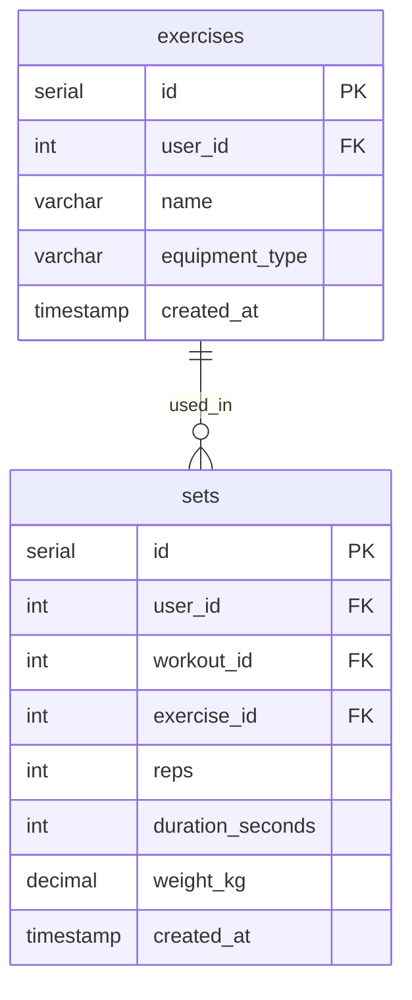

# List Exercises Action

## Requirements

### Domain Entities

**Exercise (Упражнение)**
- ID
- User ID (владелец упражнения)
- Name (название)
- Equipment Type (тип оборудования): machine (тренажер), barbell (штанга), dumbbells (гантели), bodyweight (собственный вес)
- Created timestamp
- Last used timestamp (вычисляется через MAX(sets.created_at), может быть NULL)

### MCP Tool

**list_exercises** - вывод 20 упражнений с сортировкой по last_used_timestamp (DESC NULLS LAST)

### User Story

Пользователь запрашивает список упражнений. Получает последние использованные первыми, но новые упражнения без истории использования тоже включены в список в конце.

## E2E Tests

### Test: List exercises sorted by last_used
```go
// Create 3 exercises via WorkoutRepository.CreateExercise
// Create active workout via WorkoutRepository.GetOrCreateActiveWorkout
// Create set for exercise 2 via WorkoutRepository.CreateSet (will have older timestamp)
// Create set for exercise 1 via WorkoutRepository.CreateSet (will have newer timestamp)
// Call MCP tool list_exercises
// Verify order: exercise 1 (most recent), exercise 2, exercise 3 (unused, by name)
```

## Implementation

### Domain structure

```go
// domain/exercise.go
type Exercise struct {
    ID            int64         `json:"id"`
    UserID        int64         `json:"user_id"`
    Name          string        `json:"name"`
    EquipmentType EquipmentType `json:"equipment_type"`
    CreatedAt     time.Time     `json:"created_at"`
    LastUsedAt    *time.Time    `json:"last_used_at,omitempty"` // Computed from sets
}

type ExerciseSearch struct {
    UserID int64
    IDS    []int64
    Limit  int64
}

type EquipmentType string

const (
    EquipmentMachine    EquipmentType = "machine"
    EquipmentBarbell    EquipmentType = "barbell"
    EquipmentDumbbells  EquipmentType = "dumbbells"
    EquipmentBodyweight EquipmentType = "bodyweight"
)
```

### Database

```go
// gateways/workout_repository.go
type WorkoutRepository interface {
    ListExercises(ctx context.Context, params ExerciseSearch) ([]Exercise, error)
}
```



### MCP Tool

#### list_exercises

**Input:**
```go
{} // no parameters
```

**Output:**
```go
{
    "exercises": [
        {
            "id": int64,
            "name": string,
            "type": string,
            "created_at": string (ISO8601),
            "last_used_at": string (ISO8601) | null
        }
    ]
}
```

**Logic:**
- Use default user_id (single-user mode)
- Create ExerciseSearch params with user_id and limit=20
- Call WorkoutRepository.ListExercises(params)
- Repository query: SELECT e.*, MAX(s.created_at) as last_used_at FROM exercises e LEFT JOIN sets s ON e.id = s.exercise_id AND s.user_id = ? WHERE e.user_id = ? GROUP BY e.id ORDER BY last_used_at DESC NULLS LAST, e.name LIMIT 20
- Return exercises array as JSON
