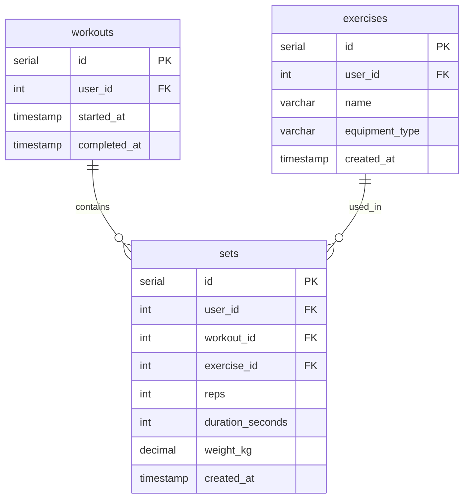

# List Workouts Action

## Requirements

### Domain Entities

**Workout (Тренировка)**
- ID
- User ID (владелец тренировки)
- Started at timestamp
- Completed at timestamp (NULL если тренировка активна)
- Total sets count (вычисляется через COUNT)

**Set (Подход)**
- ID
- User ID
- Workout ID
- Exercise ID
- Reps (количество повторений)
- Duration seconds (длительность в секундах)
- Weight kg (вес в кг)
- Created at timestamp

**Exercise (Упражнение)**
- ID
- Name (название)
- Equipment Type (тип оборудования)

### MCP Tool

**list_workouts** - вывод последних N тренировок с их подходами

### User Story

Пользователь запрашивает список своих тренировок. Получает список тренировок (последние первыми) с информацией о каждом подходе и упражнении в тренировке.

## E2E Tests

### Test: List workouts with sets
```go
// Arrange
// Create 2 exercises via WorkoutRepository.CreateExercise
// Create workout 1 via WorkoutRepository.CreateWorkout with started_at=now-2h, completed_at=now-1h
// Create 3 sets for workout 1, exercise 1 via WorkoutRepository.CreateSet
// Create workout 2 via WorkoutRepository.CreateWorkout with started_at=now-1h, completed_at=NULL (active)
// Create 2 sets for workout 2, exercise 2 via WorkoutRepository.CreateSet

// Act
// Call MCP tool list_workouts

// Assert
// Verify 2 workouts returned, sorted by started_at DESC (workout 2 first, workout 1 second)
// Verify workout 1: 3 sets total, all sets have exercise 1 details (name, equipment_type)
// Verify workout 2: 2 sets total, all sets have exercise 2 details (name, equipment_type), completed_at=null
```

## Implementation

### Domain structure

```go
// domain/workout.go
type Workout struct {
    ID          int64      `json:"id"`
    UserID      int64      `json:"user_id"`
    StartedAt   time.Time  `json:"started_at"`
    CompletedAt *time.Time `json:"completed_at"` // NULL means active
}

// domain/set.go
type Set struct {
    ID              int64      `json:"id"`
    UserID          int64      `json:"user_id"`
    WorkoutID       int64      `json:"workout_id"`
    ExerciseID      int64      `json:"exercise_id"`
    Reps            *int64     `json:"reps"`             // NULL for static exercises
    DurationSeconds *int64     `json:"duration_seconds"` // NULL for rep-based exercises
    WeightKg        *float64   `json:"weight_kg"`        // NULL for bodyweight
    CreatedAt       time.Time  `json:"created_at"`
}

// domain/exercise.go (partial)
type Exercise struct {
    ID            int64         `json:"id"`
    Name          string        `json:"name"`
    EquipmentType EquipmentType `json:"equipment_type"`
}

type ExerciseSearch struct {
    UserID int
    Limit  int
}
```

### Database

```go
// gateways/workout_repository.go
type WorkoutRepository interface {
    ListWorkouts(ctx context.Context, params ExerciseSearch) ([]Workout, error)
    ListSets(ctx context.Context, workoutID int64) ([]Set, error)
}
```



### MCP Tool

#### list_workouts

**Input:**
```go
{
    "limit": int  // optional, default 10
}
```

**Output:**
```go
{
    "workouts": [
        {
            "id": int64,
            "user_id": int64,
            "started_at": string (ISO8601),
            "completed_at": string (ISO8601) | null,
            "exercises": [
                {
                    "exercise_id": int64,
                    "exercise_name": string,
                    "equipment_type": string,
                    "sets": [
                        {
                            "id": int64,
                            "reps": int | null,
                            "duration_seconds": int | null,
                            "weight_kg": float | null,
                            "created_at": string (ISO8601)
                        }
                    ]
                }
            ]
        }
    ]
}
```

**Logic:**
- Use default user_id (single-user mode)
- Create ExerciseSearch params with user_id and limit (default 10)
- Call WorkoutRepository.ListWorkouts(params) - returns workouts sorted by started_at DESC
- For each workout:
  - Call WorkoutRepository.ListSets(workout_id) - returns sets for that workout
  - Group sets by exercise_id
  - For each unique exercise, create exercise object with name, equipment_type, and its sets
- Return workouts with grouped exercises and sets as JSON
