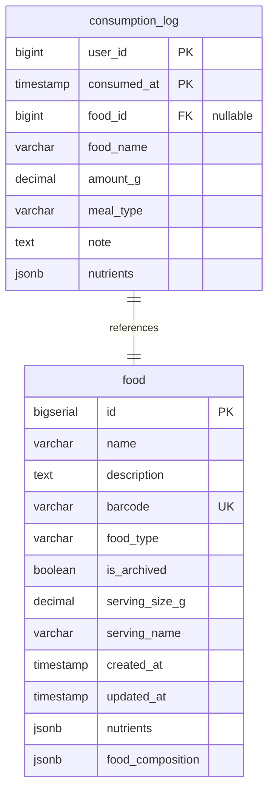

# Log Food

## Requirements

1. **Interface**: MCP tool для пакетной записи потребленной еды в consumption_log
2. **Input data**: JSON список потребленных продуктов, каждый элемент может содержать food_id или name для поиска
3. **External API**: Только PostgreSQL база данных
4. **Data format**: JSON для входных и выходных данных
5. **Search logic**: Поиск продуктов по ID или по названию в таблице food
6. **Response format**: Разделение на успешно добавленные и не найденные элементы

**Core functionality:**
- Пакетная обработка списка потребленной еды
- Поддержка 4 сценариев добавления еды:
  1. **С известным ID** - поиск по food_id, нутриенты рассчитываются из базы
  2. **С поиском по названию** - поиск по name, нутриенты рассчитываются из найденного продукта
  3. **С поиском по баркоду** - поиск по barcode, нутриенты рассчитываются из найденного продукта
  4. **Без привязки к БД** - прямое указание макронутриентов, название в заметки
- Возврат списка не найденных продуктов для дальнейшего уточнения AI
- Валидация обязательных полей и данных

## Implementation

### Domain structure

```go
type ConsumptionLog struct {
    UserID      int64      `json:"user_id" db:"user_id"`
    ConsumedAt  time.Time  `json:"consumed_at" db:"consumed_at"`
    FoodID      *int64     `json:"food_id,omitempty" db:"food_id"`        // Nullable для сценария 4
    FoodName    string     `json:"food_name" db:"food_name"`              // Название продукта
    AmountG     float64    `json:"amount_g" db:"amount_g"`
    MealType    *string    `json:"meal_type,omitempty" db:"meal_type"`
    Note        *string    `json:"note,omitempty" db:"note"`
    Nutrients   *Nutrients `json:"nutrients,omitempty" db:"nutrients"`
}

type ConsumedFoodItem struct {
    // Сценарий 1: добавление с известным ID
    FoodID     *int64     `json:"food_id,omitempty"`      // ID продукта в БД

    // Сценарий 2: добавление с поиском по названию
    Name       *string    `json:"name,omitempty"`         // Название для поиска

    // Сценарий 3: добавление с поиском по баркоду
    Barcode    *string    `json:"barcode,omitempty"`      // Баркод для поиска

    // Сценарий 4: добавление без привязки к БД (прямое указание нутриентов)
    DirectNutrients *DirectNutrients `json:"direct_nutrients,omitempty"` // Макронутриенты напрямую

    // Общие поля для всех сценариев
    AmountG         float64    `json:"amount_g"`                    // Количество в граммах
    ServingCount    *float64   `json:"serving_count,omitempty"`     // Количество порций (альтернатива граммам)
    MealType        *string    `json:"meal_type,omitempty"`         // Тип приема пищи
    ConsumedAt      *time.Time `json:"consumed_at,omitempty"`       // Время потребления
    Note            *string    `json:"note,omitempty"`              // Заметка
}

type DirectNutrients struct {
    // Макронутриенты (обязательные для сценария 3)
    Calories       float64  `json:"calories"`               // ккал на указанное количество
    ProteinG       float64  `json:"protein_g"`              // белки в граммах
    TotalFatG      float64  `json:"total_fat_g"`            // жиры в граммах
    CarbohydratesG float64  `json:"carbohydrates_g"`        // углеводы в граммах

    // Специальные вещества (опциональные)
    CaffeineMg     *float64 `json:"caffeine_mg,omitempty"`   // кофеин в мг
    EthylAlcoholG  *float64 `json:"ethyl_alcohol_g,omitempty"` // алкоголь в граммах

    // Название продукта (записывается в note)
    ProductName    string   `json:"product_name"`            // Название неизвестного продукта
}

type AddedConsumptionItem struct {
    UserID     int64      `json:"user_id"`
    ConsumedAt time.Time  `json:"consumed_at"`
    FoodID     *int64     `json:"food_id,omitempty"`      // Nullable для сценария 4
    FoodName   string     `json:"food_name"`              // Название продукта
    Food       *Food      `json:"food,omitempty"`         // Найденный продукт (только для сценариев 1-3)
    AmountG    float64    `json:"amount_g"`
    MealType   *string    `json:"meal_type,omitempty"`
    Note       *string    `json:"note,omitempty"`
    Nutrients  *Nutrients `json:"nutrients"`              // Пересчитанные нутриенты
}

type NotFoundFoodItem struct {
    FoodID        *int64      `json:"food_id,omitempty"`
    Name          *string     `json:"name,omitempty"`
    Barcode       *string     `json:"barcode,omitempty"`
    AmountG       float64     `json:"amount_g"`
    Reason        string      `json:"reason"`                        // Причина: "id_not_found", "name_not_found", "barcode_not_found", "multiple_matches"
    Suggestions   []FoodMatch `json:"suggestions,omitempty"`         // Список предложений для "multiple_matches"
}

type FoodMatch struct {
    ID   int64  `json:"id"`
    Name string `json:"name"`
}
```

### Database

```go
// Repository interface methods
type DB interface {
    // Existing methods
    AddFood(ctx context.Context, food *domain.Food) (int64, error)
    GetFood(ctx context.Context, id int64) (*domain.Food, error)

    // New methods for consumption logging
    AddConsumptionLog(ctx context.Context, log *domain.ConsumptionLog) error
    SearchFoodByName(ctx context.Context, name string) ([]*domain.Food, error)
    SearchFoodByBarcode(ctx context.Context, barcode string) (*domain.Food, error)
    GetFoodsByIDs(ctx context.Context, ids []int64) (map[int64]*domain.Food, error)

    // Methods for testing verification
    GetConsumptionLog(ctx context.Context, userID int64, consumedAt time.Time) (*domain.ConsumptionLog, error)
    GetConsumptionLogsByUser(ctx context.Context, userID int64) ([]*domain.ConsumptionLog, error)
    DeleteConsumptionLog(ctx context.Context, userID int64, consumedAt time.Time) error
}
```



### External API

Только PostgreSQL база данных

### MCP tool handler

**Input:**
```go
type LogFoolInput struct {
    ConsumedItems []ConsumedFoodItem `json:"consumed_items" jsonschema:"required,description=List of consumed food items"`
    // UserID берется из константы в коде (не передается в запросе)
}
```

**Output:**
```go
type LogFoolOutput struct {
    AddedItems    []AddedConsumptionItem `json:"added_items" jsonschema:"description=Successfully logged consumption items"`
    NotFoundItems []NotFoundFoodItem     `json:"not_found_items" jsonschema:"description=Food items that could not be found"`
    Message       string                 `json:"message" jsonschema:"description=Summary message"`
}
```

**Internal logic:**
1. Валидация входных данных:
   - Проверка что у каждого элемента есть один из: food_id, name, barcode, или direct_nutrients
   - Проверка что amount_g > 0 или serving_count > 0
   - UserID устанавливается из константы DEFAULT_USER_ID = 1
2. **Сценарий 1 - Обработка элементов с food_id:**
   - Batch запрос GetFoodsByIDs для получения продуктов
   - Расчет нутриентов: (base_nutrients * amount_g) / 100 или (base_nutrients * serving_count * serving_size_g) / 100
   - Разделение на найденные/не найденные по ID
3. **Сценарий 2 - Обработка элементов с name:**
   - Для каждого названия вызов SearchFoodByName
   - Если найден точно один продукт - расчет нутриентов как в сценарии 1
   - Если найдено несколько - добавить в not_found с reason "multiple_matches" и списком 2х верхних вариантов (отсортированных по алфавиту)
   - Если не найдено - добавить в not_found с reason "name_not_found"
4. **Сценарий 3 - Обработка элементов с barcode:**
   - Для каждого баркода вызов SearchFoodByBarcode
   - Если найден продукт - расчет нутриентов как в сценарии 1
   - Если не найдено - добавить в not_found с reason "barcode_not_found"
   - Баркод уникальный (UNIQUE constraint), поэтому множественных совпадений не будет
5. **Сценарий 4 - Обработка элементов с direct_nutrients:**
   - Использование переданных макронутриентов как есть (они уже на указанное количество)
   - FoodName = ProductName из direct_nutrients
   - FoodID = null (нет привязки к БД)
   - Дополнительные заметки в поле note (если есть)
6. Для всех успешно обработанных элементов:
   - Создание ConsumptionLog записей
   - Batch запись в базу через AddConsumptionLog
7. Формирование ответа с разделением на added_items и not_found_items

**Search Strategy:**
- По ID: точное совпадение через GetFood(ctx, food_id)
- По названию: ILIKE '%name%' поиск, case-insensitive
  - Если найдено > 1 продукта по названию:
    - Сортировка результатов по алфавиту (ORDER BY name ASC)
    - Возврат в not_found с reason "multiple_matches"
    - В поле suggestions - первые 2 варианта с ID и названием
- По баркоду: точное совпадение через SearchFoodByBarcode(ctx, barcode)
  - Баркод уникальный, поэтому всегда 0 или 1 результат

**Nutrient Calculation:**
- Для каждого найденного продукта пересчитывать все нутриенты пропорционально:
- `consumed_nutrient = (product_nutrient_per_100g * amount_g) / 100`
- Сохранять пересчитанные нутриенты в consumption_log

**Default Values:**
- `consumed_at`: текущее время если не указано
- `meal_type`: null если не указано
- `note`: null если не указано

## E2E Tests

**Test Structure:**
- Использовать существующий `IntegrationTestSuite` с PostgreSQL testcontainer
- Создать `log_fool_test.go` в пакете tests
- Pre-populate база с несколькими продуктами для тестирования поиска

**Test Cases:**

### Test_LogFool_Scenario1_WithIDs
- **Setup:** Создать 2-3 продукта в базе с нутриентами и serving_size_g
- **Input:** Список потребленной еды с валидными food_id, некоторые с amount_g, другие с serving_count
- **Actions:** MCP tool call → GetFoodsByIDs → расчет нутриентов (для serving_count: amount_g = serving_count * serving_size_g) → AddConsumptionLog
- **Expected:** Все элементы в added_items, нутриенты пропорциональны итоговому amount_g, not_found_items пустой

### Test_LogFool_Scenario2_WithNames
- **Setup:** Создать продукты с известными названиями
- **Input:** Список потребленной еды с названиями продуктов
- **Actions:** MCP tool call → SearchFoodByName → расчет нутриентов → AddConsumptionLog
- **Expected:** Найденные продукты в added_items, правильно пересчитанные нутриенты

### Test_LogFool_Scenario3_WithBarcodes
- **Setup:** Создать продукты с уникальными баркодами
- **Input:** Список потребленной еды с баркодами продуктов
- **Actions:** MCP tool call → SearchFoodByBarcode → расчет нутриентов → AddConsumptionLog
- **Expected:** Найденные продукты в added_items, не найденные в not_found_items с reason "barcode_not_found"

### Test_LogFool_Scenario4_DirectNutrients
- **Setup:** Пустая база продуктов
- **Input:** Список с direct_nutrients (макронутриенты + ProductName)
- **Actions:** MCP tool call → прямое сохранение нутриентов → AddConsumptionLog
- **Expected:** Элементы в added_items с food_id=null, food_name=ProductName, нутриенты как переданы

### Test_LogFool_Mixed_AllScenarios
- **Setup:** Создать несколько продуктов
- **Input:** Смешанный список: food_id, name, barcode, direct_nutrients, невалидные данные
- **Actions:** MCP tool call с обработкой всех 4 сценариев
- **Expected:** Корректная обработка каждого сценария, правильное разделение на added/not_found


### Test_LogFool_AmbiguousNameSearch
- **Setup:** Создать продукты с похожими названиями ("Apple Juice", "Apple Pie", "Apple")
- **Input:** Название "apple" которое совпадает с несколькими продуктами
- **Actions:** SearchFoodByName возвращает > 1 результата, сортировка по алфавиту
- **Expected:** Элемент в not_found_items с reason "multiple_matches" и suggestions с первыми 2 вариантами

### Test_LogFool_ValidationErrors
- **Input:** Некорректные данные (пустой список, отрицательный amount_g, отсутствие food_id, name, barcode и direct_nutrients)
- **Actions:** Валидация входных данных
- **Expected:** Ошибки валидации, никаких записей в БД

**Test Dependencies:**
```go
// TODO: Call MCP log_fool tool handler
// TODO: Call repository.SearchFoodByName() for name-based search
// TODO: Call repository.SearchFoodByBarcode() for barcode-based search
// TODO: Call repository.GetFoodsByIDs() for ID-based search
// TODO: Call repository.AddConsumptionLog() to save consumption records
// TODO: Verify nutrient calculations are proportional to amount_g
```