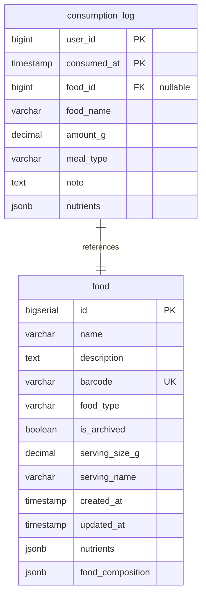

# Log Food

## Requirements

1. **Interface**: 4 separate MCP tools for logging food consumption, replacing the complex single tool
2. **Input data**: JSON with specific fields per scenario
3. **External API**: Только PostgreSQL база данных
4. **Data format**: JSON для входных и выходных данных
5. **Search logic**: Different per tool - by ID, name, barcode, or direct nutrients
6. **Response format**: Simple success/error response per tool

**Core functionality:**
- 4 specialized MCP tools instead of one complex tool:
  1. **log_food_by_id** - Log consumption by known food ID
  2. **log_food_by_name** - Search by name and log consumption
  3. **log_food_by_barcode** - Find by barcode and log consumption
  4. **log_custom_food** - Log with direct nutrient specification
- Each tool handles one scenario with simple validation
- AI can choose appropriate tool based on available data

## Implementation

### Domain structure

```go
// Shared domain structures
type ConsumptionLog struct {
    UserID      int64      `json:"user_id" db:"user_id"`
    ConsumedAt  time.Time  `json:"consumed_at" db:"consumed_at"`
    FoodID      int64      `json:"food_id" db:"food_id"`              // 0 for custom food
    FoodName    string     `json:"food_name" db:"food_name"`
    AmountG     float64    `json:"amount_g" db:"amount_g"`
    MealType    string     `json:"meal_type" db:"meal_type"`          // empty string if not specified
    Note        string     `json:"note" db:"note"`                    // empty string if not specified
    Nutrients   Nutrients  `json:"nutrients" db:"nutrients"`
}

// Tool 1: log_food_by_id
type LogFoodByIdInput struct {
    FoodID       int64     `json:"food_id" jsonschema:"required"`
    AmountG      float64   `json:"amount_g"`                          // 0 means use serving_count
    ServingCount float64   `json:"serving_count"`                     // 0 means use amount_g
    MealType     string    `json:"meal_type"`                         // empty string for no meal type
    ConsumedAt   time.Time `json:"consumed_at"`                       // zero time means current time
    Note         string    `json:"note"`                              // empty string for no note
}

// Tool 2: log_food_by_name
type LogFoodByNameInput struct {
    Name         string    `json:"name" jsonschema:"required"`
    AmountG      float64   `json:"amount_g"`                          // 0 means use serving_count
    ServingCount float64   `json:"serving_count"`                     // 0 means use amount_g
    MealType     string    `json:"meal_type"`                         // empty string for no meal type
    ConsumedAt   time.Time `json:"consumed_at"`                       // zero time means current time
    Note         string    `json:"note"`                              // empty string for no note
}

type LogFoodByNameOutput struct {
    Error       string      `json:"error,omitempty"`                 // if error occurred
    Suggestions []FoodMatch `json:"suggestions,omitempty"`           // if multiple matches found
    Message     string      `json:"message,omitempty"`               // success message
}

// Tool 3: log_food_by_barcode
type LogFoodByBarcodeInput struct {
    Barcode      string    `json:"barcode" jsonschema:"required"`
    AmountG      float64   `json:"amount_g"`                          // 0 means use serving_count
    ServingCount float64   `json:"serving_count"`                     // 0 means use amount_g
    MealType     string    `json:"meal_type"`                         // empty string for no meal type
    ConsumedAt   time.Time `json:"consumed_at"`                       // zero time means current time
    Note         string    `json:"note"`                              // empty string for no note
}

// Tool 4: log_custom_food
type LogCustomFoodInput struct {
    ProductName      string    `json:"product_name" jsonschema:"required"`
    AmountG          float64   `json:"amount_g" jsonschema:"required"`
    Calories         float64   `json:"calories" jsonschema:"required"`         // total for consumed amount
    ProteinG         float64   `json:"protein_g" jsonschema:"required"`        // total for consumed amount
    TotalFatG        float64   `json:"total_fat_g" jsonschema:"required"`      // total for consumed amount
    CarbohydratesG   float64   `json:"carbohydrates_g" jsonschema:"required"`  // total for consumed amount
    CaffeineMg       float64   `json:"caffeine_mg"`                            // total for consumed amount, 0 for no caffeine
    EthylAlcoholG    float64   `json:"ethyl_alcohol_g"`                        // total for consumed amount, 0 for no alcohol
    MealType         string    `json:"meal_type"`                              // empty string for no meal type
    ConsumedAt       time.Time `json:"consumed_at"`                            // zero time means current time
    Note             string    `json:"note"`                                   // empty string for no note
}

// Shared response structures
type FoodMatch struct {
    ID   int64  `json:"id"`
    Name string `json:"name"`
}

// Standard tool response format (for tools 1, 3, 4)
type ToolResponse struct {
    Error   string `json:"error,omitempty"`
    Message string `json:"message,omitempty"`
}
```

### Database

Repository interface methods for the 4 tools (using existing methods):

```go
type DB interface {
    // Existing methods that will be used:
    AddFood(ctx context.Context, food *domain.Food) (int64, error)
    GetFood(ctx context.Context, id int64) (*domain.Food, error)
    SearchFood(ctx context.Context, filter domain.FoodFilter) ([]*domain.Food, error)

    // New method for consumption logging
    AddConsumptionLog(ctx context.Context, log *domain.ConsumptionLog) error

    // Methods for testing verification
    GetConsumptionLog(ctx context.Context, userID int64, consumedAt time.Time) (*domain.ConsumptionLog, error)
    GetConsumptionLogsByUser(ctx context.Context, userID int64) ([]*domain.ConsumptionLog, error)
    DeleteConsumptionLog(ctx context.Context, userID int64, consumedAt time.Time) error
}

// FoodFilter struct (existing)
type FoodFilter struct {
    IDs     []int64 `json:"ids,omitempty"`        // for log_food_by_id (batch lookup)
    Name    *string `json:"name,omitempty"`       // for log_food_by_name
    Barcode *string `json:"barcode,omitempty"`    // for log_food_by_barcode
}
```



### External API

Только PostgreSQL база данных

### MCP Tool Handlers

#### Tool 1: log_food_by_id

**Internal logic:**
1. Validate input:
   - food_id > 0
   - either amount_g > 0 OR serving_count > 0
2. Get food from database using GetFood(ctx, food_id)
3. Calculate final amount_g: if amount_g == 0, use serving_count * serving_size_g
4. Calculate nutrients proportionally: (base_nutrients * amount_g) / 100
5. Save consumption log with calculated nutrients
6. Return success with logged item or error

#### Tool 2: log_food_by_name

**Internal logic:**
1. Validate input:
   - name is not empty
   - either amount_g > 0 OR serving_count > 0
2. Search foods using SearchFood(ctx, FoodFilter{Name: &name})
3. If exactly 1 match: proceed like log_food_by_id
4. If multiple matches: return error with first 2 suggestions (sorted alphabetically)
5. If no matches: return error "food not found"

#### Tool 3: log_food_by_barcode

**Internal logic:**
1. Validate input:
   - barcode is not empty
   - either amount_g > 0 OR serving_count > 0
2. Search food using SearchFood(ctx, FoodFilter{Barcode: &barcode})
3. If found: proceed like log_food_by_id
4. If not found: return error "barcode not found"

#### Tool 4: log_custom_food

**Internal logic:**
1. Validate input:
   - product_name is not empty
   - amount_g > 0
   - all required nutrients >= 0
2. Use provided nutrients as-is (total amounts for consumed portion, not per 100g)
3. Save consumption log with food_id = 0, food_name = product_name
4. Return success with logged item

**Shared Logic:**
- UserID is always set to constant DEFAULT_USER_ID = 1
- consumed_at: use current time if zero value provided
- meal_type: use empty string if not specified
- note: use empty string if not specified

**Nutrient Calculation (Tools 1-3):**
- `consumed_nutrient = (product_nutrient_per_100g * final_amount_g) / 100`
- Save calculated nutrients in consumption_log

## E2E Tests

**Test Structure:**
- Use existing `IntegrationTestSuite` with PostgreSQL testcontainer
- Create separate test files for each tool in tests package
- Pre-populate database with test foods for search scenarios

**Test Cases:**

### Test_LogFoodById_Success
- **Setup:** Create 2-3 foods with nutrients and serving_size_g
- **Input:** Valid food_id with amount_g and serving_count variations
- **Actions:** Call log_food_by_id MCP tool → GetFood → calculate nutrients → AddConsumptionLog
- **Expected:** Success response with proportional nutrients

### Test_LogFoodById_NotFound
- **Setup:** Empty database
- **Input:** Non-existent food_id
- **Expected:** Error response "food not found"

### Test_LogFoodByName_Success
- **Setup:** Create foods with known names
- **Input:** Exact food name match
- **Actions:** Call log_food_by_name MCP tool → SearchFood(FoodFilter{Name}) → calculate nutrients → AddConsumptionLog
- **Expected:** Success response with correct food and nutrients

### Test_LogFoodByName_MultipleMatches
- **Setup:** Create foods with similar names ("Apple Juice", "Apple Pie", "Apple")
- **Input:** Partial name "apple"
- **Actions:** SearchFood(FoodFilter{Name}) returns > 1 result
- **Expected:** Error response with first 2 suggestions (alphabetically sorted)

### Test_LogFoodByName_NotFound
- **Setup:** Database with different food names
- **Input:** Non-matching food name
- **Expected:** Error response "food not found"

### Test_LogFoodByBarcode_Success
- **Setup:** Create foods with unique barcodes
- **Input:** Valid barcode
- **Actions:** Call log_food_by_barcode MCP tool → SearchFood(FoodFilter{Barcode}) → AddConsumptionLog
- **Expected:** Success response with found food

### Test_LogFoodByBarcode_NotFound
- **Setup:** Database with different barcodes
- **Input:** Non-matching barcode
- **Expected:** Error response "barcode not found"

### Test_LogCustomFood_Success
- **Setup:** Empty database
- **Input:** Complete custom food with nutrients and product name
- **Actions:** Call log_custom_food MCP tool → AddConsumptionLog with food_id=0
- **Expected:** Success response with custom food logged

### Test_ValidationErrors
- **Input:** Invalid data for each tool (empty names, zero amounts, negative nutrients)
- **Actions:** Input validation
- **Expected:** Validation errors, no database records

**Test Dependencies:**
- Call MCP tool handlers for each of the 4 tools
- Call repository.GetFood() for ID-based lookup
- Call repository.SearchFood(FoodFilter{Name}) for name-based search
- Call repository.SearchFood(FoodFilter{Barcode}) for barcode-based search
- Call repository.AddConsumptionLog() to save consumption records
- Verify nutrient calculations are proportional to amount_g