```mermaid
erDiagram
    exercises {
        serial id PK
        int user_id FK
        varchar name
        varchar equipment_type
        timestamp created_at
    }

    workouts {
        serial id PK
        int user_id FK
        timestamp started_at
        timestamp completed_at
    }

    sets {
        serial id PK
        int user_id FK
        int workout_id FK
        int exercise_id FK
        int reps
        int duration_seconds
        decimal weight_kg
        timestamp created_at
    }

    workouts ||--o{ sets : "contains"
    exercises ||--o{ sets : "used_in"
```

# Log Workout Set Action

## Requirements

### Domain Entities

**Workout (Тренировка)**
- ID
- User ID (владелец тренировки)
- Started at timestamp
- Completed at timestamp (NULL если тренировка активна)

**Set (Подход)**
- ID
- User ID (владелец подхода)
- Workout ID (связь с тренировкой)
- Exercise ID (связь с упражнением)
- Reps (количество повторений) - опционально для обычных упражнений
- Duration seconds (длительность в секундах) - опционально для статичных упражнений
- Weight kg (вес в кг) - опционально для упражнений с весом
- Created at timestamp (когда выполнен подход)

### MCP Tool

**log_workout_set** - запись подхода к упражнению

### User Story

Пользователь логирует подход указывая упражнение и параметры (повторения/время, вес). Если у пользователя нет активной тренировки (completed_at IS NULL), то автоматически создается новая. Подход добавляется в активную тренировку.

## E2E Tests

### Test: Log workout set with reps creates active workout
```go
// Create exercise via WorkoutRepository.CreateExercise
// Call MCP tool log_workout_set with exercise_id, reps, weight_kg
// Verify response with set_id, workout_id, is_new_workout=true
// Call WorkoutRepository.GetLastSet to verify set exists with correct data and active workout
```

### Test: Log workout set with duration
```go
// Create exercise via WorkoutRepository.CreateExercise
// Call MCP tool log_workout_set with exercise_id, duration_seconds
// Verify response contains set_id
// Call WorkoutRepository.GetLastSet to verify set has duration_seconds and reps=null
```

### Test: Log workout set reuses active workout if last set in active workout was created less than 2 hours ago
```go
// Create exercise via WorkoutRepository.CreateExercise
// Create active workout via WorkoutRepository.CreateWorkout
// Call MCP tool log_workout_set
// Verify response has is_new_workout=false and same workout_id
// Call WorkoutRepository.GetLastSet to verify set added to existing workout
```

### Test: Log workout set closes active workout and creates new if last set in active workout was created more than 2 hours ago
```go
// Create exercise via WorkoutRepository.CreateExercise
// Create active workout via WorkoutRepository.CreateWorkout with started_at=now-3h
// Create set via WorkoutRepository.CreateSet with created_at=now-3h
// Call MCP tool log_workout_set with exercise_id, reps
// Verify response has is_new_workout=true with new workout_id
// Call WorkoutRepository.GetLastSet to verify new set in new workout
// Call WorkoutRepository.ListWorkouts to verify old workout has completed_at set
```

### Test: Log workout set validation
```go
// Create exercise via WorkoutRepository.CreateExercise
// Call MCP tool log_workout_set without reps and duration_seconds
// Verify error returned (at least one required)
```

## Implementation

### Domain structure

```go
// domain/workout.go
type Workout struct {
    ID          int64      `json:"id"`
    UserID      int64      `json:"user_id"`
    StartedAt   time.Time  `json:"started_at"`
    CompletedAt *time.Time `json:"completed_at"` // NULL means active
}

// domain/set.go
type Set struct {
    ID              int64      `json:"id"`
    UserID          int64      `json:"user_id"`
    WorkoutID       int64      `json:"workout_id"`
    ExerciseID      int64      `json:"exercise_id"`
    Reps            *int64     `json:"reps"`             // NULL for static exercises
    DurationSeconds *int64     `json:"duration_seconds"` // NULL for rep-based exercises
    WeightKg        *float64   `json:"weight_kg"`        // NULL for bodyweight
    CreatedAt       time.Time  `json:"created_at"`
}

type WorkoutSet struct {
    Workout
    Set
}
```

### Database

```go
// gateways/workout_repository.go
type WorkoutRepository interface {
    CreateWorkout(ctx context.Context, workout Workout) (int64, error)
    CloseWorkout(ctx context.Context, workoutID int64) error
    CreateSet(ctx context.Context, set *Set) error
    GetLastSet(ctx context.Context, userID int64) (WorkoutSet, error)
}
```



### MCP Tool

#### log_workout_set

**Input:**
```go
{
    "exercise_id": int64,
    "reps": int | null,              // optional
    "duration_seconds": int | null,  // optional
    "weight_kg": float | null        // optional
}
```

**Output:**
```go
{
    "set_id": int64,
    "workout_id": int64,
    "is_new_workout": bool
}
```

**Logic:**
- Use default user_id (single-user mode)
- Validate at least one of reps or duration_seconds provided
- Call WorkoutRepository.GetLastSet(user_id) to get last set with workout info
- If no active workout (completed_at != NULL) or error or last set created_at > 2 hours ago:
  - If active workout exists and last set > 2 hours ago:
    - Call WorkoutRepository.CloseWorkout(workout_id) to set completed_at=last_set.created_at
  - Create new Workout with user_id, started_at=NOW(), completed_at=NULL
  - Call WorkoutRepository.CreateWorkout(workout) - returns workout_id
  - Set is_new_workout=true
- Else use existing workout_id, set is_new_workout=false
- Create Set with user_id, workout_id, exercise_id, and provided parameters
- Call WorkoutRepository.CreateSet(set)
- Return set_id, workout_id, is_new_workout as JSON
