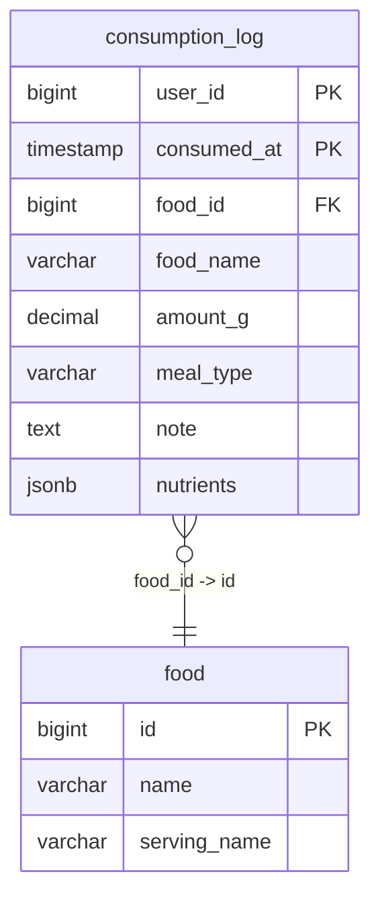

# Top Products Action

## Requirements

1. **Interface**: MCP tool для получения 30 самых часто логируемых продуктов
2. **Input data**: Нет параметров (используется DEFAULT_USER_ID = 1)
3. **External API**: Только PostgreSQL база данных
4. **Data format**: JSON для выходных данных
5. **Relations**: Работает с существующей таблицей consumption_log

**Core functionality:**
- Возвращает список из 30 продуктов, которые пользователь логировал чаще всего за последние 3 месяца
- Временное окно: точное время (now - 3 месяца до now), используя time.Now()
- Группировка: по food_id (все записи с одинаковым food_id считаются одним продуктом)
- Сортировка: по количеству логов (убывание), при равном количестве - по food_id (возрастание)
- Для каждого продукта возвращается:
  - food_id - ID продукта (всегда NOT NULL)
  - food_name - название из таблицы food по food_id
  - serving_name - название порции из таблицы food по food_id (пустая строка если NULL, omitempty в JSON)
  - log_count - количество раз когда продукт был залогирован
- Учитываются только записи в consumption_log за последние 3 месяца где food_id IS NOT NULL
- Записи с direct nutrients (food_id = NULL) игнорируются
- Ограничение: максимум 30 записей в результате

## E2E Tests

### TestGetTopProducts_Success
- **Setup:**
  - Сгенерировать random количество записей (100-200) за последние 2 месяца
  - Использовать 40 разных food_id с разной частотой (например: id=1 встречается 50 раз, id=2 - 45 раз, ..., id=40 - 1 раз)
  - Для генерации использовать публичные переиспользуемые функции из nutrition_stats_test (сделать их публичными если нужно)
  - Записи распределены случайным образом по времени
  - Для каждой записи: random время внутри временного окна, random nutrients и amount_g
  - Сохранить expected результат: топ 30 продуктов с их log_count
- **Input:** MCP tool call без параметров
- **Expected:**
  - Возвращается ровно 30 продуктов
  - Первый продукт имеет наибольший log_count
  - Список отсортирован по log_count DESC, food_id ASC
  - Каждый продукт в результате совпадает с expected (food_id, food_name, log_count)

## Implementation

### Domain structure

```go
type FoodStats struct {
    FoodID      int64   `json:"food_id" jsonschema:"ID of the food item"`
    FoodName    string  `json:"food_name" jsonschema:"Name of the food item"`
    ServingName string `json:"serving_name, omitempty" jsonschema:"Name of the serving (e.g., 'cookie', 'slice'). Can be null"`
    LogCount    int     `json:"log_count" jsonschema:"Number of times this product was logged"`
}

type GetTopProductsOutput struct {
    Products []FoodStats `json:"products" jsonschema:"List of top 30 most frequently logged products in the last 3 months, sorted by log count (descending)"`
}
```

### Database

Repository interface methods:

```go
type DB interface {
    // Existing methods...

    // GetTopProducts returns the top N most frequently logged products for a user within a time range
    // Products are grouped by (food_id, food_name) and sorted by log count descending
    // Returns up to limit products
    GetTopProducts(ctx context.Context, userID int64, from time.Time, to time.Time, limit int) ([]domain.FoodStats, error)
}
```

**SQL Implementation Details:**

`GetTopProducts`:
- SELECT cl.food_id, f.name as food_name, COALESCE(f.serving_name, '') as serving_name, COUNT(*) as log_count
- FROM consumption_log cl
- JOIN food f ON cl.food_id = f.id
- WHERE cl.user_id = $1 AND cl.consumed_at >= $2 AND cl.consumed_at <= $3 AND cl.food_id IS NOT NULL
- GROUP BY cl.food_id, f.name, f.serving_name
- ORDER BY log_count DESC, cl.food_id ASC
- LIMIT $4
- Note: COALESCE конвертирует NULL в пустую строку для serving_name



### External API

Только PostgreSQL база данных

### MCP Tool Handler

#### get_top_products

**Input:**
```go
// Нет параметров
```

**Output:**
```go
type GetTopProductsOutput struct {
    Products []FoodStats `json:"products"`
}
```

**Internal logic:**

1. Получить текущее время (time.Now())
2. Вычислить временное окно:
   - to = текущее время
   - from = текущее время - 3 месяца (используя time.AddDate(0, -3, 0))
3. Вызвать repository.GetTopProducts(ctx, DEFAULT_USER_ID, from, to, 30)
4. Вернуть GetTopProductsOutput{Products: результат из repository}

